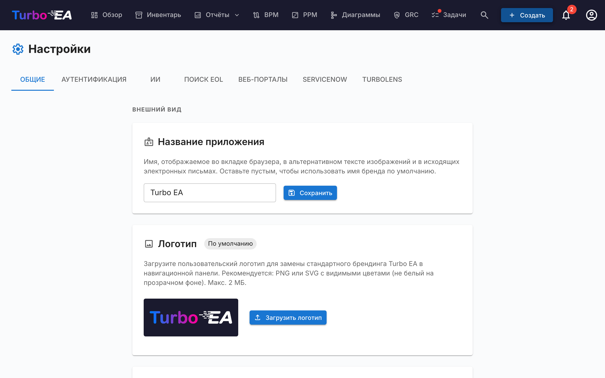

# Настройки

Страница **Настройки** в **Администрирование → Настройки** (`/admin/settings`) — это центральный хаб конфигурации. Она организована в виде вкладок — выберите подходящую вкладку из таблицы ниже для углублённого описания:

| Вкладка | URL | Что управляет | Полное руководство |
|---------|-----|---------------|--------------------|
| **Общие** | `/admin/settings?tab=general` | Внешний вид (логотип, favicon, валюта, формат даты, включённые языки, финансовый год), e-mail SMTP, **переключатели модулей** (BPM, PPM, GRC, TurboLens, Sponsor button) | Эта страница |
| **Аутентификация** | `/admin/settings?tab=authentication` | Провайдеры SSO, регистрация, политика паролей | [Аутентификация и SSO](sso.md) |
| **ИИ** | `/admin/settings?tab=ai` | Провайдер LLM, модель, бэкенд веб-поиска, переключатели ИИ-подсказок по типу карточки | [Возможности ИИ](ai.md) |
| **EOL** | `/admin/settings?tab=eol` | Массовая привязка продуктов к записям endoflife.date | [Окончание жизненного цикла (EOL)](eol.md) |
| **Веб-порталы** | `/admin/settings?tab=web-portals` | Slug-и публичных порталов только для чтения, фильтры видимости | [Веб-порталы](web-portals.md) |
| **ServiceNow** | `/admin/settings?tab=servicenow` | Соединение ServiceNow, конфигурация синхронизации, сопоставление личности | [Интеграция с ServiceNow](servicenow.md) |
| **TurboLens** | `/admin/settings?tab=turbolens` | Специфичные для TurboLens переключатели, включённые регламенты, опрос анализов | См. раздел [Настройки TurboLens](#turbolens) ниже |

Остальная часть этой страницы посвящена вкладке **Общие**.

## Внешний вид

### Логотип

Загрузите пользовательский логотип, который отображается в верхней панели навигации. Поддерживаемые форматы: PNG, JPEG, SVG, WebP, GIF. Нажмите **Сбросить**, чтобы вернуть логотип Turbo EA по умолчанию.

### Фавикон

Загрузите пользовательскую иконку браузера (фавикон). Изменение вступит в силу при следующей загрузке страницы. Нажмите **Сбросить**, чтобы вернуть иконку по умолчанию.

### Валюта

Выберите валюту, используемую для полей стоимости на всей платформе. Это влияет на форматирование стоимостных значений на страницах карточек, в отчётах и экспорте. Поддерживается более 40 валют, включая USD, EUR, GBP, JPY, CNY, CHF, INR, BRL, IDR и другие.

### Формат даты

Выберите способ отображения дат во всём приложении. Выбранный формат применяется к датам жизненного цикла карточек, сетке инвентаря, подписям ADR и SoAW, реестру рисков, отчётам и задачам PPM, версиям процессов BPM, комментариям, истории, ленте активности дашборда, уведомлениям и страницам администрирования. Предлагаются пять форматов с предварительным просмотром в реальном времени:

- `MM/DD/YYYY` — стиль США (напр. `04/29/2026`)
- `DD/MM/YYYY` — европейский стиль (напр. `29/04/2026`)
- `YYYY-MM-DD` — ISO 8601 (напр. `2026-04-29`)
- `DD MMM YYYY` — по умолчанию (напр. `29 апр 2026`)
- `MMM DD, YYYY` (напр. `апр 29, 2026`)

Изменения применяются ко всем пользователям мгновенно — перезагрузка не требуется.

### Доступные языки

Включайте или отключайте языки, доступные пользователям в селекторе языка. Все восемь поддерживаемых локалей могут быть включены или отключены индивидуально:

- English, Deutsch, Français, Español, Italiano, Português, 中文, Русский

Как минимум один язык должен оставаться включённым.

### Начало финансового года

Выберите месяц начала финансового года вашей организации (с января по декабрь). Этот параметр влияет на группировку **бюджетных строк** в модуле PPM по финансовому году. Например, если финансовый год начинается в апреле, бюджетная строка за июнь 2026 относится к ФГ 2026–2027.

Значение по умолчанию — **январь** (календарный год = финансовый год).

## Управление данными

Управляйте тем, как долго **архивные карточки** хранятся до безвозвратного удаления.

При архивировании карточка скрывается из реестра, отчётов и связей, но сохраняет всю историю и может быть восстановлена в любой момент до очистки.

| Поле | Описание |
|------|----------|
| **Срок хранения (дни)** | Количество дней, в течение которых архивная карточка хранится до безвозвратного удаления. Значение по умолчанию — **30**. |
| **Хранить архивные карточки бессрочно** | При включении (срок хранения установлен в **0**) архивные карточки никогда не удаляются автоматически и хранятся — вместе с историей — бессрочно. |

Очистка выполняется ежечасно и перечитывает эту настройку при каждом запуске, поэтому изменения вступают в силу без перезапуска приложения. Баннеры архивирования и диалоги подтверждения автоматически отражают настроенный срок.

## Электронная почта (SMTP)

Настройте доставку электронной почты для приглашений, уведомлений об опросах и других системных сообщений.

| Поле | Описание |
|------|----------|
| **SMTP-хост** | Имя хоста вашего почтового сервера (например, `smtp.gmail.com`) |
| **SMTP-порт** | Порт сервера (обычно 587 для TLS) |
| **SMTP-пользователь** | Имя пользователя для аутентификации |
| **SMTP-пароль** | Пароль для аутентификации (хранится в зашифрованном виде) |
| **Использовать TLS** | Включить шифрование TLS (рекомендуется) |
| **Адрес отправителя** | Адрес электронной почты отправителя для исходящих сообщений |
| **Базовый URL приложения** | Публичный URL вашего экземпляра Turbo EA (используется в ссылках в письмах) |

После настройки нажмите **Отправить тестовое письмо**, чтобы убедиться в корректности параметров.

!!! note
    Электронная почта необязательна. Если SMTP не настроен, функции, отправляющие письма (приглашения, уведомления об опросах), будут корректно пропускать отправку.

## Модуль BPM

Включите или отключите модуль **Управление бизнес-процессами** (BPM). При отключении:

- Пункт **BPM** скрывается из навигации для всех пользователей
- Карточки бизнес-процессов остаются в базе данных, но BPM-специфичные функции (редактор потоков процессов, панель BPM, отчёты BPM) недоступны

Это полезно для организаций, которые не используют BPM и хотят более простую навигацию.

## Модуль PPM

Включите или отключите модуль **Управление портфелем проектов** (PPM). При отключении:

- Пункт **PPM** скрывается из навигации для всех пользователей
- Карточки инициатив остаются в базе данных, но PPM-специфичные функции (отчёты о статусе, отслеживание бюджета и затрат, реестр рисков, доска задач, диаграмма Ганта) недоступны

При включении карточки инициатив получают вкладку **PPM** в своей детальной странице, а панель портфеля PPM становится доступной в основной навигации. См. [Управление портфелем проектов](../guide/ppm.md) для полного руководства по функциям.

## Модуль GRC

Включите или отключите модуль **Управление, Риск и Соответствие** (GRC). При отключении:

- Пункт **GRC** скрывается из навигации для всех пользователей
- Рабочее пространство `/grc` (принципы Управления и ADR, реестр рисков, находки по соответствию) становится недоступным, а пользователи, переходящие по прямой ссылке, видят стандартный заполнитель «модуль отключён»
- Вкладки **Риски** и **Соответствие** в деталях карточки скрываются, чтобы отдельные карточки тоже больше не показывали данные GRC
- Риски и находки по соответствию остаются в базе данных — лежащие в основе разрешения `risks.*` и `compliance.*` не меняются, поэтому данные сохраняются и появляются без изменений, если модуль снова включить

См. [руководство по GRC](../guide/grc.md) для полного описания функций.

## Кнопка «Поддержать»

Показывайте или скрывайте кнопку **«Поддержать»** в меню пользователя (аватар). Когда она скрыта, пользователи больше не видят кнопку «Поддержать» в своём меню профиля. Кнопка «Поддержать» — и диалог, объясняющий, как поддержать Turbo EA — всегда доступна на этой панели настроек, поэтому администраторы могут открыть её даже когда она скрыта из меню.

Если ваша компания спонсирует Turbo EA и хотела бы разместить свой логотип на turbo-ea.org, напишите на [sponsorship@turbo-ea.org](mailto:sponsorship@turbo-ea.org).

## Настройки TurboLens

Вкладка **TurboLens** собирает переключатели, управляющие поверхностью ИИ-анализа. В отличие от попумодульных переключателей выше, TurboLens **не** является бинарным вкл/выкл — он «готов», когда и провайдер ИИ настроен (на вкладке **ИИ**), и данные анализа синхронизированы хотя бы один раз. Страница также экспонирует:

- **Включённые регламенты** — отметьте, какие из шести встроенных фреймворков (EU AI Act, GDPR, NIS2, DORA, SOC 2, ISO 27001) участвуют в [сканировании Соответствия](../guide/compliance.md). Пользовательские регламенты, определённые в разделе **Метамодель → Регламенты**, также можно включить здесь.
- **Каденс опроса анализа** — как часто UI повторно опрашивает длительные TurboLens-анализы на прогресс. Более высокий каденс = меньшая ощущаемая задержка, больше нагрузка API.
- **TTL кэша результатов** — как долго кэшируются результаты завершённых анализов до того, как кнопка **Запустить анализ** снова станет активной.

См. [Интеллект TurboLens на базе ИИ](../guide/turbolens.md) для полной функциональной поверхности и [Соответствие](../guide/compliance.md) для рабочего процесса сканирования.
