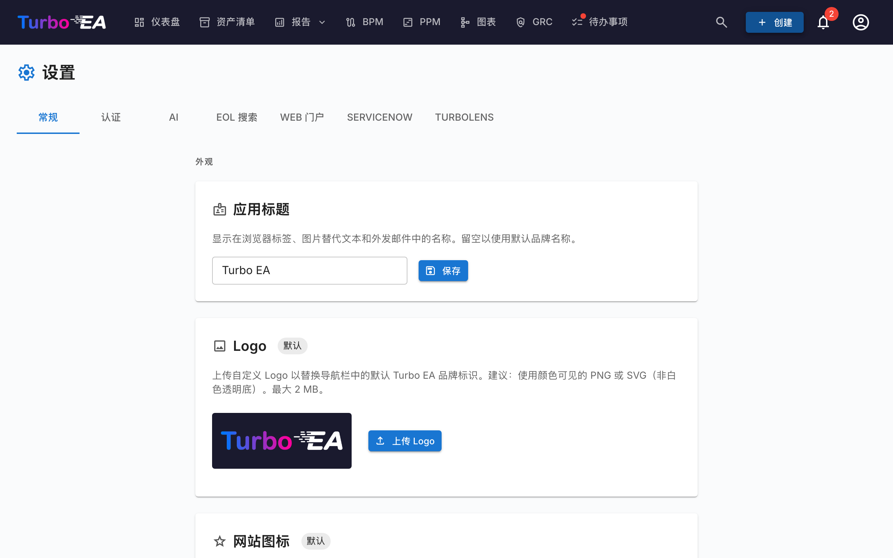

# 设置

**设置**页面位于 **管理 → 设置**（`/admin/settings`），是中心配置枢纽。它按标签页组织 —— 请从下表中选择合适的标签查看专项详解：

| 标签页 | URL | 控制内容 | 完整指南 |
|--------|-----|----------|----------|
| **常规** | `/admin/settings?tab=general` | 外观（Logo、favicon、货币、日期格式、已启用语言、财年）、电子邮件发送、**模块开关**（BPM、PPM、GRC、TurboLens、赞助按钮） | 本页 |
| **认证** | `/admin/settings?tab=authentication` | SSO 提供商、注册、密码策略 | [认证与 SSO](sso.md) |
| **AI** | `/admin/settings?tab=ai` | LLM 提供商、模型、网络搜索后端、按卡片类型的 AI 建议开关 | [AI 功能](ai.md) |
| **EOL** | `/admin/settings?tab=eol` | 将产品批量链接到 endoflife.date 条目 | [生命周期结束 (EOL)](eol.md) |
| **Web 门户** | `/admin/settings?tab=web-portals` | 公共只读门户的 slug、可见性过滤器 | [Web 门户](web-portals.md) |
| **ServiceNow** | `/admin/settings?tab=servicenow` | ServiceNow 连接、同步配置、身份映射 | [ServiceNow 集成](servicenow.md) |
| **TurboLens** | `/admin/settings?tab=turbolens` | TurboLens 特定开关、已启用的法规、分析轮询 | 见下方[TurboLens 设置](#turbolens-1) |

本页的其余部分介绍 **常规** 标签页。

## 外观

### Logo

上传自定义 logo，显示在顶部导航栏中。支持的格式：PNG、JPEG、SVG、WebP、GIF。点击**重置**可恢复默认的 Turbo EA logo。

### 导航栏样式

选择顶部导航栏的背景色和文字颜色。所选样式适用于实例的**所有用户**，包括桌面端和移动端（含移动端侧边菜单）。可从七种精选预设中选择——藏青（默认）、浅色、炭黑、石板灰、蓝色、森林绿或紫红——也可选择**自定义**，通过取色器自由设置背景色和文字颜色。保存前，实时预览会展示导航栏的效果；当文字与背景的对比度过低（低于 WCAG AA）时会显示警告。点击**恢复默认**可恢复默认样式。

### 网站图标

上传自定义浏览器图标（favicon）。更改在下次页面加载时生效。点击**重置**可恢复默认图标。

### 货币

选择平台中成本字段使用的货币。这影响卡片详情页面、报告和导出中成本值的格式化方式。支持超过 40 种货币，包括 USD、EUR、GBP、JPY、CNY、CHF、INR、BRL、IDR 等。

### 日期格式

选择整个应用程序中日期的显示方式。所选格式适用于卡片生命周期日期、清单网格、ADR 和 SoAW 签署日期、风险登记册、PPM 报告与任务、BPM 流程版本、评论、历史记录、仪表盘活动流、通知以及管理页面。提供五种格式并实时预览：

- `MM/DD/YYYY` — 美式（例如 `04/29/2026`）
- `DD/MM/YYYY` — 欧式（例如 `29/04/2026`）
- `YYYY-MM-DD` — ISO 8601（例如 `2026-04-29`）
- `DD MMM YYYY` — 默认（例如 `29 4月 2026`）
- `MMM DD, YYYY`（例如 `4月 29, 2026`）

更改将立即对所有用户生效，无需重新加载页面。

### 启用的语言

切换用户在语言选择器中可用的语言。所有八种支持的语言可以单独启用或禁用：

- English、Deutsch、Français、Español、Italiano、Português、中文、Русский

必须始终保持至少一种语言启用。

### 财年起始月份

选择您组织财年开始的月份（一月到十二月）。此设置影响 PPM 模块中**预算行**按财年分组的方式。例如，如果财年从四月开始，2026 年六月的预算行属于 2026–2027 财年。

默认值为**一月**（日历年 = 财年）。

## 数据管理

控制**已归档卡片**在被永久删除之前的保留时长。

卡片归档后，会从清单、报表和关系中隐藏，但会保留其完整历史记录，并可在清除之前随时恢复。

| 字段 | 说明 |
|------|------|
| **保留期限（天）** | 已归档卡片在被永久删除之前保留的天数。默认值为 **30**。 |
| **无限期保留已归档卡片** | 启用后（保留期限设为 **0**），已归档卡片永远不会被自动删除，并将连同其历史记录一起无限期保留。 |

清除任务每小时运行一次，并在每次运行时重新读取此设置，因此更改无需重启应用程序即可生效。归档横幅和确认对话框会自动反映所配置的期限。

## 电子邮件

Turbo EA 会发送邀请邮件、调查通知、密码重置以及其他系统消息。请选择与您的邮件平台相匹配的**发送方式**。

!!! warning "基本 SMTP 身份验证正在被淘汰"
    Microsoft 365 正在禁用基本 SMTP 身份验证（新租户不可用，现有租户将在 2026–2027 年间移除），Google Workspace 已于 2025 年 3 月将其禁用。对于这些平台，请使用下面的某种 OAuth 方式，而不是邮箱密码。

### 发送方式

| 方式 | 适用场景 |
|------|----------|
| **SMTP（用户名和密码）** | 适用于仍接受基本身份验证的服务器的传统 SMTP。默认方式。 |
| **带 OAuth 2.0 的 SMTP（XOAUTH2）** | 使用短期 OAuth 令牌进行身份验证的 SMTP — Microsoft 365（仅应用）或 Google Workspace（服务账号）。 |
| **Microsoft Graph API** | 仅应用的 Microsoft Graph `sendMail`。推荐的 Microsoft 365 选项 — 无需 SMTP，不存储密码。 |

### 通用字段

| 字段 | 说明 |
|------|------|
| **发件人地址** | 发出邮件的发件人地址 |
| **应用基础 URL** | 您实例的公开 URL（用于邮件中的链接） |

### SMTP（用户名和密码）

| 字段 | 说明 |
|------|------|
| **SMTP 主机** | 您邮件服务器的主机名（例如 `smtp.gmail.com`） |
| **SMTP 端口** | 服务器端口（STARTTLS 为 587，隐式 TLS/SSL 为 465） |
| **SMTP 用户** | 身份验证用户名 |
| **SMTP 密码** | 身份验证密码（加密存储） |
| **使用 TLS** | 启用 STARTTLS 加密（推荐）。端口 465 会忽略此设置，始终使用隐式 TLS/SSL |

### Microsoft Graph API（推荐用于 Microsoft 365）

1. 在 **Microsoft Entra ID → 应用注册**中，创建一个专用的应用注册。
2. 在 **API 权限**下，添加 **Mail.Send** **应用程序**权限并授予**管理员同意**。
3. 在**证书和密码**下创建一个**客户端密码**。
4. 在 Turbo EA 中，选择 **Microsoft Graph API**，并输入**租户 ID**、**客户端 ID**、**客户端密钥**以及**发件邮箱**（发送邮件所用的用户主体名称）。

不会存储任何邮箱密码；Turbo EA 会为每次发送请求一个短期令牌。

使用 Graph 时，**发件人地址**是可选的：保留默认值即以发件邮箱身份发送。设置不同的地址需要为该地址在发件邮箱上授予 **Send As**（以此身份发送）权限。

### 带 OAuth 2.0 的 SMTP

- **Microsoft 365：** 输入应用注册的**租户 ID**、**客户端 ID** 和**客户端密钥**，以及**发件邮箱**。该邮箱必须启用 SMTP AUTH。
- **Google Workspace：** 选择 **Google**，粘贴已为发件邮箱启用全域委派的**服务账号密钥（JSON）**，并设置要模拟的**发件邮箱**。

**作用域**和**令牌端点**字段为可选覆盖项 — 除非您的租户需要自定义值，否则请留空。

配置任意方式后，点击**发送测试邮件**以验证其是否正常工作。

!!! note
    电子邮件为可选项。如果未配置任何方式，发送邮件的功能将正常跳过投递。

## BPM 模块

开启或关闭**业务流程管理**模块。禁用后：

- **BPM** 导航项对所有用户隐藏
- 业务流程卡片保留在数据库中，但 BPM 特定功能（流程编辑器、BPM 仪表盘、BPM 报告）不可访问

这对于不使用 BPM 且希望获得更简洁导航体验的组织非常有用。

## PPM 模块

开启或关闭**项目组合管理**（PPM）模块。禁用后：

- **PPM** 导航项对所有用户隐藏
- 倡议卡片保留在数据库中，但 PPM 特定功能（状态报告、预算和成本跟踪、风险登记、任务板、甘特图）不可访问

启用后，倡议卡片在其详情视图中获得 **PPM** 标签页，PPM 项目组合仪表盘在主导航中可用。请参阅[项目组合管理](../guide/ppm.md)获取完整功能指南。

## GRC 模块

开启或关闭**治理、风险与合规**（GRC）模块。禁用后：

- **GRC** 导航项对所有用户隐藏
- `/grc` 工作区（治理原则与 ADR、风险登记册、合规发现）不可访问，通过直接链接进入的用户会看到标准的「模块已禁用」占位页
- 卡片详情中的**风险**与**合规**标签页被隐藏，因此单个卡片也不会再显示 GRC 数据
- 风险与合规发现仍保留在数据库中——底层的 `risks.*` 和 `compliance.*` 权限保持不变，因此数据得以保留；模块重新启用后，数据将原样再次出现

请参阅 [GRC 指南](../guide/grc.md) 获取完整功能参考。

## 赞助按钮

在用户（头像）菜单中显示或隐藏 **赞助** 按钮。隐藏后，用户的个人菜单中将不再显示赞助按钮。赞助按钮以及说明如何支持 Turbo EA 的对话框始终可在此设置面板中使用，因此即使在菜单中隐藏，管理员仍可访问它。

如果贵公司赞助 Turbo EA 并希望在 turbo-ea.org 上展示公司徽标，请联系 [sponsorship@turbo-ea.org](mailto:sponsorship@turbo-ea.org)。

## TurboLens 设置

**TurboLens** 标签页汇集了管理 AI 分析界面的开关。与上面的按模块开关不同，TurboLens **不是**二元开/关 —— 当 AI 提供商已配置（在 **AI** 标签页下）并且分析数据至少同步过一次时，它才"就绪"。该页还提供：

- **已启用的法规** —— 勾选六大内建框架（EU AI Act、GDPR、NIS2、DORA、SOC 2、ISO 27001）中哪些参与[合规扫描](../guide/compliance.md)。在 **元模型 → 法规** 下定义的自定义法规也可在此启用。
- **分析轮询节奏** —— UI 重新轮询长时间运行的 TurboLens 分析以获取进度的频率。节奏越高 = 感知延迟越低，API 负载越大。
- **结果缓存 TTL** —— 完成的分析结果被缓存多久才让 **运行分析** 按钮重新启用。

请参阅 [TurboLens AI 智能](../guide/turbolens.md) 了解完整功能面，并参阅 [合规](../guide/compliance.md) 了解扫描工作流。
