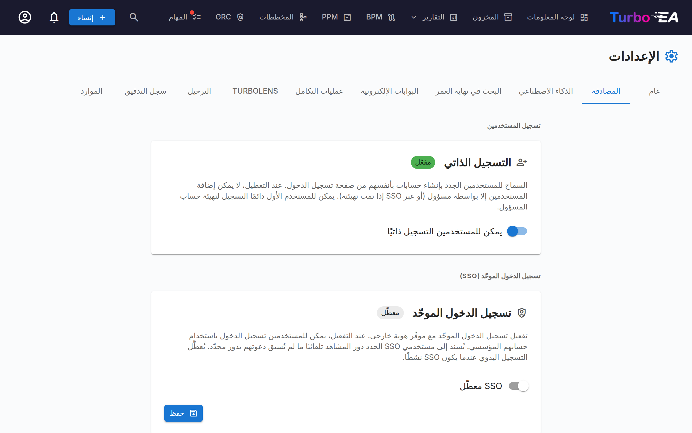

# المصادقة والدخول الموحّد



يتيح تبويب **Authentication** في الإعدادات للمسؤولين تهيئة كيفية تسجيل المستخدمين دخولهم إلى المنصة.

#### التسجيل الذاتي

- **Allow self-registration**: عند التمكين، يمكن للمستخدمين الجدد إنشاء حسابات بالنقر على «Sign Up» في صفحة تسجيل الدخول. عند التعطيل، يمكن للمسؤولين فقط إنشاء الحسابات عبر تدفّق دعوة المستخدم.

#### تهيئة الدخول الموحّد (SSO)

يتيح SSO للمستخدمين تسجيل الدخول باستخدام مزوّد الهوية المؤسسي بدلًا من كلمة مرور محلية. يدعم Turbo EA أربعة مزوّدي SSO:

| المزوّد | الوصف |
|----------|-------------|
| **Microsoft Entra ID** | للمؤسسات التي تستخدم Microsoft 365 / Azure AD |
| **Google Workspace** | للمؤسسات التي تستخدم Google Workspace |
| **Okta** | للمؤسسات التي تستخدم Okta كمنصّة هوية لديها |
| **Generic OIDC** | لأي مزوّد متوافق مع OpenID Connect (مثل Authentik، Keycloak، Auth0) |

**خطوات تهيئة SSO:**

1. انتقل إلى **Admin > Settings > Authentication**
2. بدّل **Enable SSO** إلى وضع التشغيل
3. اختر **SSO Provider** من القائمة المنسدلة
4. أدخل بيانات الاعتماد المطلوبة من مزوّد الهوية لديك:
   - **Client ID**: معرّف التطبيق/العميل من مزوّد الهوية لديك
   - **Client Secret**: سرّ التطبيق (يُخزَّن مشفّرًا في قاعدة البيانات)
   - حقول خاصة بالمزوّد:
     - **Microsoft**: Tenant ID (مثل `your-tenant-id` أو `common` لتعدّد المستأجرين)
     - **Google**: Hosted Domain (اختياري، يقيّد تسجيل الدخول بنطاق Google Workspace محدّد)
     - **Okta**: Okta Domain (مثل `your-org.okta.com`)
     - **Generic OIDC**: Issuer URL (مثل `https://auth.example.com/application/o/my-app/`). بالنسبة إلى Generic OIDC، يحاول النظام الاكتشاف التلقائي عبر نقطة الطرف `.well-known/openid-configuration`
5. انقر **Save**

**نقاط طرف OIDC اليدوية (متقدّم):**

إذا تعذّر على الواجهة الخلفية الوصول إلى مستند اكتشاف مزوّد الهوية لديك (مثلًا بسبب شبكة Docker أو الشهادات الموقّعة ذاتيًا)، فيمكنك تحديد نقاط طرف OIDC يدويًا:

- **Authorization Endpoint**: عنوان URL الذي يُعاد توجيه المستخدمين إليه للمصادقة
- **Token Endpoint**: عنوان URL المستخدم لمبادلة رمز التفويض بالرموز
- **JWKS URI**: عنوان URL لمجموعة مفاتيح الويب JSON المستخدمة للتحقّق من توقيعات الرموز

هذه الحقول اختيارية. إذا تُرِكت فارغة، يستخدم النظام الاكتشاف التلقائي. وعند ملئها، تتجاوز القيم المُكتشَفة تلقائيًا.

**اختبار SSO:**

بعد الحفظ، افتح تبويب متصفّح جديدًا (أو نافذة خفيّة) وتحقّق من ظهور زر تسجيل الدخول عبر SSO في صفحة تسجيل الدخول وأن المصادقة تعمل من البداية إلى النهاية.

**ملاحظات مهمّة:**
- يُخزَّن **Client Secret** مشفّرًا في قاعدة البيانات ولا يُكشَف أبدًا في استجابات API
- عند تمكين SSO، يبقى تسجيل الدخول بكلمة مرور محلية متاحًا كخيار احتياطي
- يمكنك تهيئة عنوان URI لإعادة التوجيه في مزوّد الهوية لديك على النحو التالي: `https://your-turbo-ea-domain/auth/callback`

#### المصادقة عبر الوكيل العكسي

إذا كان Turbo EA يعمل خلف وكيل يتولّى بالفعل تسجيل دخول مستخدميك — المصادقة المدمجة في Azure App Service («EasyAuth»)، أو oauth2-proxy، أو Authelia، أو Cloudflare Access — فيمكنه قبول تلك الهوية مباشرةً بدلًا من تشغيل SSO خاص به فوقها. لا حاجة إلى عميل OIDC، ولا تسجيل تطبيق، ولا سرّ عميل. يصل المستخدمون إلى Turbo EA وهم مسجّلو الدخول بالفعل.

تُهيَّأ هذه الميزة بالكامل عبر متغيّرات البيئة وهي **معطّلة افتراضيًا**.

**قبل أي شيء آخر، عيّن مسؤول التمهيد (bootstrap).** يُغلق التسجيل الذاتي أثناء تفعيل المصادقة عبر الوكيل، لذا هذه هي الطريقة التي يدخل بها أول مسؤول — يُمنح هذا البريد الإلكتروني دور المسؤول عند أول تسجيل دخول:

```
TURBO_EA_PROXY_AUTH_BOOTSTRAP_ADMIN_EMAIL=you@yourcompany.com
```

**Azure App Service (EasyAuth) — الإعداد الموصى به.** يتحقّق Turbo EA من رمز الهوية الموقّع الذي يمرّره Azure مع كل طلب (يتطلّب ذلك مخزن الرموز في App Service، وهو مفعّل افتراضيًا). `AUDIENCE` هو معرّف العميل لتسجيل تطبيق EasyAuth لديك؛ استبدل `TENANT` بمعرّف الدليل (المستأجر) لديك:

```
TURBO_EA_PROXY_AUTH_ENABLED=true
TURBO_EA_PROXY_AUTH_TRUST_PLATFORM_HEADERS=true
TURBO_EA_PROXY_AUTH_VERIFY_ID_TOKEN=true
TURBO_EA_PROXY_AUTH_ISSUER=https://login.microsoftonline.com/TENANT/v2.0
TURBO_EA_PROXY_AUTH_AUDIENCE=your-easyauth-app-client-id
TURBO_EA_PROXY_AUTH_JWKS_URI=https://login.microsoftonline.com/TENANT/discovery/v2.0/keys
TURBO_EA_PROXY_AUTH_ALLOWED_DOMAINS=yourcompany.com
TURBO_EA_PROXY_AUTH_LOGOUT_URL=/.auth/logout
```

!!! warning "`TRUST_PLATFORM_HEADERS` مطلوب على App Service"
    لا يستطيع App Service حقن ترويسة سرّية مخصّصة، ولذا يحلّ
    `TURBO_EA_PROXY_AUTH_TRUST_PLATFORM_HEADERS=true` محل
    `TURBO_EA_PROXY_AUTH_SHARED_SECRET` — وهو إقرار صريح بأنكم تعتمدون على قيام
    Azure بإزالة ترويسات الهوية الواردة قبل وصولها إلى تطبيقكم. ويجري هذا الفحص
    **قبل** تحليل رمز الهوية أصلًا، ومن ثمّ فإن التحقق من الرمز لا يغني عنه. وإذا
    غاب هذا الإعداد والسرّ المشترك معًا، فشل كل تسجيل دخول برسالة *Proxy
    authentication is enabled but not secured*، حتى مع
    `VERIFY_ID_TOKEN=true`.

إذا كان مخزن الرموز لديكم معطّلًا، فاضبطوا إضافةً إلى ذلك `TURBO_EA_PROXY_AUTH_VERIFY_ID_TOKEN=false` واعتمدوا على تنقية الترويسات وحدها. وبدون رمز متحقَّق منه **لا تُنشأ حسابات جديدة تلقائيًا** — ادعُوا المستخدمين أولًا، أو استخدموا بريد مسؤول التمهيد.

**وكيل عام (oauth2-proxy، Authelia، Traefik forwardAuth، …).** هيّئ الوكيل بحيث يحقن ترويسة سرّ مشترك في كل طلب، بحيث لا يمكن أبدًا الخلط بين طلب لم يمرّ عبر الوكيل وطلب مرّ عبره. ولّد القيمة باستخدام `openssl rand -hex 32`:

```
TURBO_EA_PROXY_AUTH_ENABLED=true
TURBO_EA_PROXY_AUTH_MODE=header
TURBO_EA_PROXY_AUTH_SHARED_SECRET=<generated value, also set on the proxy>
TURBO_EA_PROXY_AUTH_EMAIL_HEADER=X-Forwarded-Email
TURBO_EA_PROXY_AUTH_ALLOWED_DOMAINS=yourcompany.com
TURBO_EA_PROXY_AUTH_LOGOUT_URL=/oauth2/sign_out
```

**ملاحظات أمنية:**

- السرّ المشترك (أو، على Azure، رمز الهوية المتحقَّق منه) هو ما يجعل الهوية جديرة بالثقة — فالترويسة وحدها يمكن لأي شخص كتابتها. قائمة النطاقات المسموح بها إلزامية؛ لا تضبط `TURBO_EA_PROXY_AUTH_ALLOW_ANY_DOMAIN=true` إلا إذا كنت تقبل فعلًا أي نطاق بريد إلكتروني.
- الهوية التي لم يجرِ التحقّق منها تشفيريًا يمكنها تسجيل دخول المستخدمين الحاليين لكنها لا تُنشئ حسابًا جديدًا أبدًا، والدعوات المعلّقة لا تمنح دورها عبر هذا المسار.
- `TURBO_EA_PROXY_AUTH_LOGOUT_URL` هو المكان الذي يرسل إليه Turbo EA المتصفّح بعد **تسجيل الخروج** حتى تنتهي جلسة الوكيل أيضًا. بدونه يظل الوكيل يعتبر المستخدم مسجّل الدخول — فيعود إلى صفحة تسجيل الدخول ويمكنه الدخول مجددًا بنقرة واحدة.

**جميع المتغيّرات:**

| المتغيّر | الافتراضي | الغرض |
|----------|---------|---------|
| `TURBO_EA_PROXY_AUTH_ENABLED` | `false` | المفتاح الرئيسي |
| `TURBO_EA_PROXY_AUTH_MODE` | `azure_easyauth` | `azure_easyauth` أو `header` |
| `TURBO_EA_PROXY_AUTH_SHARED_SECRET` | — | مطلوب في وضع `header`؛ يحقنه الوكيل |
| `TURBO_EA_PROXY_AUTH_SECRET_HEADER` | `X-Turbo-EA-Proxy-Secret` | الترويسة الحاملة للسرّ المشترك |
| `TURBO_EA_PROXY_AUTH_VERIFY_ID_TOKEN` | `false` | التحقّق من رمز الهوية المُمرَّر (وضع Azure) |
| `TURBO_EA_PROXY_AUTH_ISSUER` / `_AUDIENCE` / `_JWKS_URI` | — | إعدادات التحقّق من الرمز |
| `TURBO_EA_PROXY_AUTH_TRUST_PLATFORM_HEADERS` | `false` | لـ Azure فقط: الاعتماد على تنقية المنصّة للترويسات بدلًا من سرّ، ومطلوب على App Service |
| `TURBO_EA_PROXY_AUTH_EMAIL_HEADER` | `X-Forwarded-Email` | وضع `header`: ترويسة البريد الإلكتروني |
| `TURBO_EA_PROXY_AUTH_NAME_HEADER` | `X-Forwarded-User` | وضع `header`: ترويسة الاسم المعروض |
| `TURBO_EA_PROXY_AUTH_SUBJECT_HEADER` | `X-Forwarded-Subject` | وضع `header`: ترويسة معرّف الكيان الثابت |
| `TURBO_EA_PROXY_AUTH_ALLOWED_DOMAINS` | — | نطاقات البريد الإلكتروني المسموح بها مفصولة بفواصل (إلزامي) |
| `TURBO_EA_PROXY_AUTH_ALLOW_ANY_DOMAIN` | `false` | قبول أي نطاق بريد إلكتروني صراحةً |
| `TURBO_EA_PROXY_AUTH_BOOTSTRAP_ADMIN_EMAIL` | — | يُمنح دور المسؤول عند أول تسجيل دخول |
| `TURBO_EA_PROXY_AUTH_LOGOUT_URL` | — | الوجهة التي يُرسَل إليها المتصفّح عند تسجيل الخروج |

**القيود:** يتطلّب تدفّق OAuth الخاص بخادم MCP تهيئة SSO العادي؛ المصادقة عبر الوكيل وحدها لا تغطّيه.
