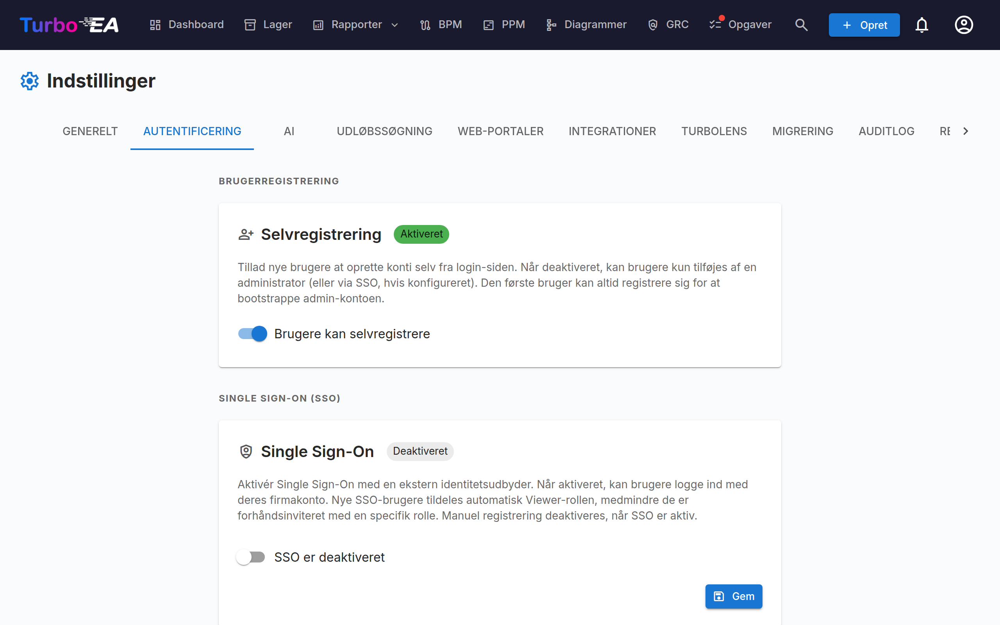

# Godkendelse og SSO



Fanen **Godkendelse** i Indstillinger giver administratorer mulighed for at konfigurere, hvordan brugere logger på platformen.

#### Selvregistrering

- **Tillad selvregistrering**: Når aktiveret, kan nye brugere oprette konti ved at klikke på "Tilmeld dig" på loginsiden. Når deaktiveret, kan kun administratorer oprette konti via Inviter bruger-flowet.

#### SSO (Single Sign-On)-konfiguration

SSO giver brugere mulighed for at logge på ved hjælp af deres virksomheds identitetsudbyder i stedet for en lokal adgangskode. Turbo EA understøtter fire SSO-udbydere:

| Udbyder | Beskrivelse |
|---------|-------------|
| **Microsoft Entra ID** | For organisationer, der bruger Microsoft 365 / Azure AD |
| **Google Workspace** | For organisationer, der bruger Google Workspace |
| **Okta** | For organisationer, der bruger Okta som deres identitetsplatform |
| **Generic OIDC** | For enhver OpenID Connect-kompatibel udbyder (f.eks. Authentik, Keycloak, Auth0) |

**Trin for at konfigurere SSO:**

1. Gå til **Admin > Indstillinger > Godkendelse**
2. Slå **Aktivér SSO** til
3. Vælg din **SSO-udbyder** fra dropdownen
4. Indtast de påkrævede legitimationsoplysninger fra din identitetsudbyder:
   - **Klient-ID**: Applikations-/klient-ID'et fra din identitetsudbyder
   - **Klienthemmelighed**: Applikationshemmeligheden (gemt krypteret i databasen)
   - Udbyder-specifikke felter:
     - **Microsoft**: Tenant-ID (f.eks. `your-tenant-id` eller `common` for multi-tenant)
     - **Google**: Hosted Domain (valgfri, begrænser login til et specifikt Google Workspace-domæne)
     - **Okta**: Okta-domæne (f.eks. `your-org.okta.com`)
     - **Generic OIDC**: Issuer-URL (f.eks. `https://auth.example.com/application/o/my-app/`). For Generic OIDC forsøger systemet auto-discovery via `.well-known/openid-configuration`-endpointet
5. Klik på **Gem**

**Manuelle OIDC-endpoints (avanceret):**

Hvis backenden ikke kan nå din identitetsudbyders discovery-dokument (f.eks. på grund af Docker-netværk eller selvsignerede certifikater), kan du manuelt specificere OIDC-endpointsne:

- **Authorization Endpoint**: URL'en, hvor brugere omdirigeres til at godkende
- **Token Endpoint**: URL'en, der bruges til at udveksle autorisationskoden for tokens
- **JWKS URI**: URL'en for JSON Web Key Set, der bruges til at verificere tokensignaturer

Disse felter er valgfrie. Hvis de efterlades tomme, bruger systemet auto-discovery. Når de er udfyldt, tilsidesætter de de auto-discovered værdier.

**Test af SSO:**

Efter at have gemt, åbn en ny browser-fane (eller inkognito-vindue), og verificér, at SSO-loginknappen vises på loginsiden, og at godkendelse fungerer end-to-end.

**Vigtige bemærkninger:**
- **Klienthemmeligheden** gemmes krypteret i databasen og eksponeres aldrig i API-responser
- Når SSO er aktiveret, forbliver lokalt adgangskodelogin tilgængeligt som fallback
- Du kan konfigurere redirect-URI'en i din identitetsudbyder som: `https://your-turbo-ea-domain/auth/callback`

#### Godkendelse via reverse proxy

Hvis Turbo EA kører bag en proxy, der allerede logger dine brugere på — Azure App Services indbyggede godkendelse ("EasyAuth"), oauth2-proxy, Authelia, Cloudflare Access — kan den acceptere den identitet direkte i stedet for at køre sin egen SSO ovenpå. Ingen OIDC-klient, ingen app-registrering, ingen klienthemmelighed. Brugerne lander i Turbo EA allerede logget på.

Denne funktion konfigureres udelukkende via miljøvariabler og er **slået fra som standard**.

**Før alt andet skal du angive bootstrap-administratoren.** Selvregistrering er lukket, mens proxy-godkendelse er slået til, så det er sådan, den første administrator kommer ind — den e-mailadresse tildeles admin-rollen ved første login:

```
TURBO_EA_PROXY_AUTH_BOOTSTRAP_ADMIN_EMAIL=you@yourcompany.com
```

**Azure App Service (EasyAuth) — anbefalet opsætning.** Turbo EA verificerer det signerede identitetstoken, som Azure videresender med hver forespørgsel (dette kræver App Services token store, som er slået til som standard). `AUDIENCE` er client ID'et for din EasyAuth-app-registrering; erstat `TENANT` med dit directory-ID (tenant-ID):

```
TURBO_EA_PROXY_AUTH_ENABLED=true
TURBO_EA_PROXY_AUTH_TRUST_PLATFORM_HEADERS=true
TURBO_EA_PROXY_AUTH_VERIFY_ID_TOKEN=true
TURBO_EA_PROXY_AUTH_ISSUER=https://login.microsoftonline.com/TENANT/v2.0
TURBO_EA_PROXY_AUTH_AUDIENCE=your-easyauth-app-client-id
TURBO_EA_PROXY_AUTH_JWKS_URI=https://login.microsoftonline.com/TENANT/discovery/v2.0/keys
TURBO_EA_PROXY_AUTH_ALLOWED_DOMAINS=yourcompany.com
TURBO_EA_PROXY_AUTH_LOGOUT_URL=/.auth/logout
```

!!! warning "`TRUST_PLATFORM_HEADERS` er påkrævet på App Service"
    App Service kan ikke indsætte en egen hemmelig header, så
    `TURBO_EA_PROXY_AUTH_TRUST_PLATFORM_HEADERS=true` træder i stedet for
    `TURBO_EA_PROXY_AUTH_SHARED_SECRET` — det er en udtrykkelig anerkendelse af,
    at I forlader jer på, at Azure fjerner indgående identitetsheadere, før de
    når jeres app. Kontrollen sker **før** identitetstokenet overhovedet
    fortolkes, så tokenverifikation træder ikke i stedet for den. Mangler både
    denne indstilling og en delt hemmelighed, fejler hvert eneste login med
    *Proxy authentication is enabled but not secured* — også med
    `VERIFY_ID_TOKEN=true`.

Hvis dit token store er deaktiveret, skal du desuden sætte `TURBO_EA_PROXY_AUTH_VERIFY_ID_TOKEN=false` og forlade dig alene på header-saneringen. Uden et verificeret token **oprettes nye konti ikke automatisk** — invitér brugerne først, eller brug bootstrap-administratorens e-mail.

**Generisk proxy (oauth2-proxy, Authelia, Traefik forwardAuth, …).** Konfigurér proxyen til at injicere en header med en delt hemmelighed på hver forespørgsel, så en forespørgsel, der ikke kom gennem proxyen, aldrig kan forveksles med en, der gjorde. Generér værdien med `openssl rand -hex 32`:

```
TURBO_EA_PROXY_AUTH_ENABLED=true
TURBO_EA_PROXY_AUTH_MODE=header
TURBO_EA_PROXY_AUTH_SHARED_SECRET=<genereret værdi, sættes også på proxyen>
TURBO_EA_PROXY_AUTH_EMAIL_HEADER=X-Forwarded-Email
TURBO_EA_PROXY_AUTH_ALLOWED_DOMAINS=yourcompany.com
TURBO_EA_PROXY_AUTH_LOGOUT_URL=/oauth2/sign_out
```

**Sikkerhedsbemærkninger:**

- Den delte hemmelighed (eller, på Azure, det verificerede identitetstoken) er det, der gør identiteten troværdig — en header alene kan skrives af hvem som helst. Domæne-allowlisten er påkrævet; sæt kun `TURBO_EA_PROXY_AUTH_ALLOW_ANY_DOMAIN=true`, hvis du reelt accepterer ethvert e-maildomæne.
- En identitet, der ikke er kryptografisk verificeret, kan logge eksisterende brugere på, men opretter aldrig en ny konto, og afventende invitationer tildeler ikke deres rolle ad denne vej.
- `TURBO_EA_PROXY_AUTH_LOGOUT_URL` er der, hvor Turbo EA sender browseren hen efter **Log ud**, så proxy-sessionen også afsluttes. Uden den betragter proxyen stadig brugeren som logget på — de lander tilbage på loginsiden og kan komme ind igen med ét klik.

**Alle variabler:**

| Variabel | Standard | Formål |
|----------|---------|---------|
| `TURBO_EA_PROXY_AUTH_ENABLED` | `false` | Hovedafbryder |
| `TURBO_EA_PROXY_AUTH_MODE` | `azure_easyauth` | `azure_easyauth` eller `header` |
| `TURBO_EA_PROXY_AUTH_SHARED_SECRET` | — | Påkrævet i `header`-tilstand; proxyen injicerer den |
| `TURBO_EA_PROXY_AUTH_SECRET_HEADER` | `X-Turbo-EA-Proxy-Secret` | Header, der bærer den delte hemmelighed |
| `TURBO_EA_PROXY_AUTH_VERIFY_ID_TOKEN` | `false` | Verificér det videresendte identitetstoken (Azure-tilstand) |
| `TURBO_EA_PROXY_AUTH_ISSUER` / `_AUDIENCE` / `_JWKS_URI` | — | Indstillinger for tokenverifikation |
| `TURBO_EA_PROXY_AUTH_TRUST_PLATFORM_HEADERS` | `false` | Kun Azure: stol på platformens header-sanering i stedet for en hemmelighed. Påkrævet på App Service |
| `TURBO_EA_PROXY_AUTH_EMAIL_HEADER` | `X-Forwarded-Email` | `header`-tilstand: e-mail-header |
| `TURBO_EA_PROXY_AUTH_NAME_HEADER` | `X-Forwarded-User` | `header`-tilstand: header med visningsnavn |
| `TURBO_EA_PROXY_AUTH_SUBJECT_HEADER` | `X-Forwarded-Subject` | `header`-tilstand: header med stabilt subjekt-id |
| `TURBO_EA_PROXY_AUTH_ALLOWED_DOMAINS` | — | Kommaseparerede tilladte e-maildomæner (påkrævet) |
| `TURBO_EA_PROXY_AUTH_ALLOW_ANY_DOMAIN` | `false` | Acceptér eksplicit ethvert e-maildomæne |
| `TURBO_EA_PROXY_AUTH_BOOTSTRAP_ADMIN_EMAIL` | — | Tildeles admin-rollen ved første login |
| `TURBO_EA_PROXY_AUTH_LOGOUT_URL` | — | Hvor Log ud sender browseren hen |

**Begrænsninger:** MCP-serverens OAuth-flow kræver, at almindelig SSO er konfigureret; proxy-godkendelse alene dækker det ikke.
