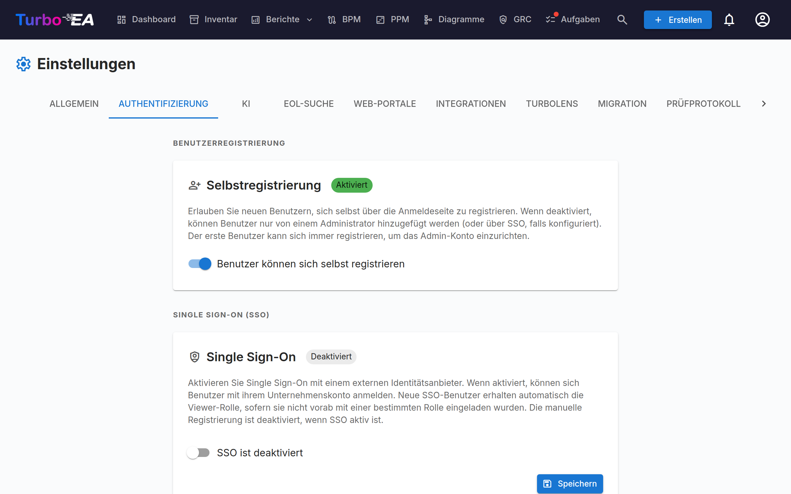

# Authentifizierung & SSO



Der Tab **Authentifizierung** in den Einstellungen ermöglicht Administratoren die Konfiguration der Benutzeranmeldung an der Plattform.

#### Selbstregistrierung

- **Selbstregistrierung erlauben**: Wenn aktiviert, können neue Benutzer Konten erstellen, indem sie auf der Anmeldeseite auf «Registrieren» klicken. Wenn deaktiviert, können nur Administratoren Konten über den Einladungsablauf erstellen.

#### SSO (Single Sign-On) Konfiguration

SSO ermöglicht es Benutzern, sich mit ihrem Unternehmens-Identitätsanbieter statt mit einem lokalen Passwort anzumelden. Turbo EA unterstützt vier SSO-Anbieter:

| Anbieter | Beschreibung |
|----------|-------------|
| **Microsoft Entra ID** | Für Organisationen, die Microsoft 365 / Azure AD nutzen |
| **Google Workspace** | Für Organisationen, die Google Workspace nutzen |
| **Okta** | Für Organisationen, die Okta als Identitätsplattform nutzen |
| **Generisches OIDC** | Für jeden OpenID-Connect-kompatiblen Anbieter (z.B. Authentik, Keycloak, Auth0) |

**Schritte zur SSO-Konfiguration:**

1. Gehen Sie zu **Admin > Einstellungen > Authentifizierung**
2. Schalten Sie **SSO aktivieren** ein
3. Wählen Sie Ihren **SSO-Anbieter** aus dem Dropdown
4. Geben Sie die erforderlichen Anmeldedaten Ihres Identitätsanbieters ein:
   - **Client-ID**: Die Anwendungs-/Client-ID von Ihrem Identitätsanbieter
   - **Client-Secret**: Das Anwendungsgeheimnis (verschlüsselt in der Datenbank gespeichert)
   - Anbieterspezifische Felder:
     - **Microsoft**: Mandanten-ID (z.B. `ihre-mandanten-id` oder `common` für Multi-Mandanten)
     - **Google**: Gehostete Domain (optional, beschränkt die Anmeldung auf eine bestimmte Google-Workspace-Domain)
     - **Okta**: Okta-Domain (z.B. `ihre-org.okta.com`)
     - **Generisches OIDC**: Aussteller-URL (z.B. `https://auth.example.com/application/o/my-app/`). Für generisches OIDC versucht das System eine automatische Erkennung über den `.well-known/openid-configuration`-Endpunkt
5. Klicken Sie auf **Speichern**

**Manuelle OIDC-Endpunkte (Fortgeschritten):**

Wenn das Backend das Discovery-Dokument Ihres Identitätsanbieters nicht erreichen kann (z.B. aufgrund von Docker-Netzwerkkonfiguration oder selbstsignierten Zertifikaten), können Sie die OIDC-Endpunkte manuell angeben:

- **Autorisierungsendpunkt**: Die URL, zu der Benutzer zur Authentifizierung weitergeleitet werden
- **Token-Endpunkt**: Die URL, die zum Austausch des Autorisierungscodes gegen Tokens verwendet wird
- **JWKS-URI**: Die URL für den JSON Web Key Set zur Überprüfung von Token-Signaturen

Diese Felder sind optional. Wenn sie leer gelassen werden, verwendet das System die automatische Erkennung. Wenn sie ausgefüllt sind, überschreiben sie die automatisch erkannten Werte.

**SSO testen:**

Öffnen Sie nach dem Speichern einen neuen Browser-Tab (oder ein Inkognito-Fenster) und überprüfen Sie, dass die SSO-Anmeldeschaltfläche auf der Anmeldeseite erscheint und die Authentifizierung durchgängig funktioniert.

**Wichtige Hinweise:**
- Das **Client-Secret** wird verschlüsselt in der Datenbank gespeichert und nie in API-Antworten offengelegt
- Wenn SSO aktiviert ist, bleibt die lokale Passwortanmeldung als Fallback verfügbar
- Sie können die Redirect-URI in Ihrem Identitätsanbieter konfigurieren als: `https://ihre-turbo-ea-domain/auth/callback`

#### Reverse-Proxy-Authentifizierung

Wenn Turbo EA hinter einem Proxy läuft, der Ihre Benutzer bereits anmeldet — die integrierte Authentifizierung von Azure App Service («EasyAuth»), oauth2-proxy, Authelia, Cloudflare Access — kann es diese Identität direkt übernehmen, statt darüber ein eigenes SSO zu betreiben. Kein OIDC-Client, keine App-Registrierung, kein Client-Secret. Benutzer landen bereits angemeldet in Turbo EA.

Diese Funktion wird ausschließlich über Umgebungsvariablen konfiguriert und ist **standardmäßig deaktiviert**.

**Legen Sie zuallererst den Bootstrap-Administrator fest.** Die Selbstregistrierung ist geschlossen, solange die Proxy-Authentifizierung aktiv ist — auf diesem Weg gelangt also der erste Administrator hinein: Diese E-Mail-Adresse erhält bei der ersten Anmeldung die Admin-Rolle:

```
TURBO_EA_PROXY_AUTH_BOOTSTRAP_ADMIN_EMAIL=sie@ihrunternehmen.com
```

**Azure App Service (EasyAuth) — empfohlene Einrichtung.** Turbo EA überprüft das signierte Identitätstoken, das Azure mit jeder Anfrage weiterleitet (dies erfordert den App-Service-Token-Store, der standardmäßig aktiviert ist). `AUDIENCE` ist die Client-ID Ihrer EasyAuth-App-Registrierung; ersetzen Sie `TENANT` durch Ihre Verzeichnis-ID (Mandanten-ID):

```
TURBO_EA_PROXY_AUTH_ENABLED=true
TURBO_EA_PROXY_AUTH_VERIFY_ID_TOKEN=true
TURBO_EA_PROXY_AUTH_ISSUER=https://login.microsoftonline.com/TENANT/v2.0
TURBO_EA_PROXY_AUTH_AUDIENCE=your-easyauth-app-client-id
TURBO_EA_PROXY_AUTH_JWKS_URI=https://login.microsoftonline.com/TENANT/discovery/v2.0/keys
TURBO_EA_PROXY_AUTH_ALLOWED_DOMAINS=ihrunternehmen.com
TURBO_EA_PROXY_AUTH_LOGOUT_URL=/.auth/logout
```

Wenn Ihr Token-Store deaktiviert ist, setzen Sie stattdessen `TURBO_EA_PROXY_AUTH_VERIFY_ID_TOKEN=false` und `TURBO_EA_PROXY_AUTH_TRUST_PLATFORM_HEADERS=true`. Dies verlässt sich ausdrücklich darauf, dass Azure eingehende Identitäts-Header entfernt, bevor sie Ihre Anwendung erreichen, und ohne ein verifiziertes Token **werden neue Konten nicht automatisch erstellt** — laden Sie Benutzer zuerst ein oder verwenden Sie die Bootstrap-Admin-E-Mail.

**Generischer Proxy (oauth2-proxy, Authelia, Traefik forwardAuth, …).** Konfigurieren Sie den Proxy so, dass er bei jeder Anfrage einen Header mit einem gemeinsamen Geheimnis einfügt, damit eine Anfrage, die nicht über den Proxy kam, niemals mit einer verwechselt werden kann, die es tat. Generieren Sie den Wert mit `openssl rand -hex 32`:

```
TURBO_EA_PROXY_AUTH_ENABLED=true
TURBO_EA_PROXY_AUTH_MODE=header
TURBO_EA_PROXY_AUTH_SHARED_SECRET=<generierter Wert, auch auf dem Proxy gesetzt>
TURBO_EA_PROXY_AUTH_EMAIL_HEADER=X-Forwarded-Email
TURBO_EA_PROXY_AUTH_ALLOWED_DOMAINS=ihrunternehmen.com
TURBO_EA_PROXY_AUTH_LOGOUT_URL=/oauth2/sign_out
```

**Sicherheitshinweise:**

- Das gemeinsame Geheimnis (bzw. auf Azure das verifizierte Identitätstoken) ist es, was die Identität vertrauenswürdig macht — ein Header für sich allein kann von jedem geschrieben werden. Die Domain-Allowlist ist erforderlich; setzen Sie `TURBO_EA_PROXY_AUTH_ALLOW_ANY_DOMAIN=true` nur, wenn Sie wirklich jede E-Mail-Domain akzeptieren.
- Eine Identität, die nicht kryptografisch verifiziert wurde, kann bestehende Benutzer anmelden, erstellt aber niemals ein neues Konto, und ausstehende Einladungen übertragen auf diesem Weg nicht ihre Rolle.
- `TURBO_EA_PROXY_AUTH_LOGOUT_URL` ist die Adresse, an die Turbo EA den Browser nach **Abmelden** weiterleitet, damit auch die Proxy-Sitzung beendet wird. Ohne sie betrachtet der Proxy den Benutzer weiterhin als angemeldet — er landet wieder auf der Anmeldeseite und kann sich mit einem Klick erneut anmelden.

**Alle Variablen:**

| Variable | Standard | Zweck |
|----------|---------|---------|
| `TURBO_EA_PROXY_AUTH_ENABLED` | `false` | Hauptschalter |
| `TURBO_EA_PROXY_AUTH_MODE` | `azure_easyauth` | `azure_easyauth` oder `header` |
| `TURBO_EA_PROXY_AUTH_SHARED_SECRET` | — | Erforderlich im `header`-Modus; der Proxy fügt es ein |
| `TURBO_EA_PROXY_AUTH_SECRET_HEADER` | `X-Turbo-EA-Proxy-Secret` | Header, der das gemeinsame Geheimnis trägt |
| `TURBO_EA_PROXY_AUTH_VERIFY_ID_TOKEN` | `false` | Das weitergeleitete Identitätstoken verifizieren (Azure-Modus) |
| `TURBO_EA_PROXY_AUTH_ISSUER` / `_AUDIENCE` / `_JWKS_URI` | — | Einstellungen für die Token-Verifizierung |
| `TURBO_EA_PROXY_AUTH_TRUST_PLATFORM_HEADERS` | `false` | Nur Azure: die Header-Bereinigung der Plattform statt eines Geheimnisses akzeptieren |
| `TURBO_EA_PROXY_AUTH_EMAIL_HEADER` | `X-Forwarded-Email` | `header`-Modus: E-Mail-Header |
| `TURBO_EA_PROXY_AUTH_NAME_HEADER` | `X-Forwarded-User` | `header`-Modus: Header für den Anzeigenamen |
| `TURBO_EA_PROXY_AUTH_SUBJECT_HEADER` | `X-Forwarded-Subject` | `header`-Modus: Header für die stabile Subjekt-ID |
| `TURBO_EA_PROXY_AUTH_ALLOWED_DOMAINS` | — | Kommagetrennte erlaubte E-Mail-Domains (erforderlich) |
| `TURBO_EA_PROXY_AUTH_ALLOW_ANY_DOMAIN` | `false` | Ausdrücklich jede E-Mail-Domain akzeptieren |
| `TURBO_EA_PROXY_AUTH_BOOTSTRAP_ADMIN_EMAIL` | — | Erhält bei der ersten Anmeldung die Admin-Rolle |
| `TURBO_EA_PROXY_AUTH_LOGOUT_URL` | — | Wohin Abmelden den Browser weiterleitet |

**Einschränkungen:** Der OAuth-Ablauf des MCP-Servers erfordert, dass reguläres SSO konfiguriert ist; die Proxy-Authentifizierung allein deckt ihn nicht ab.
