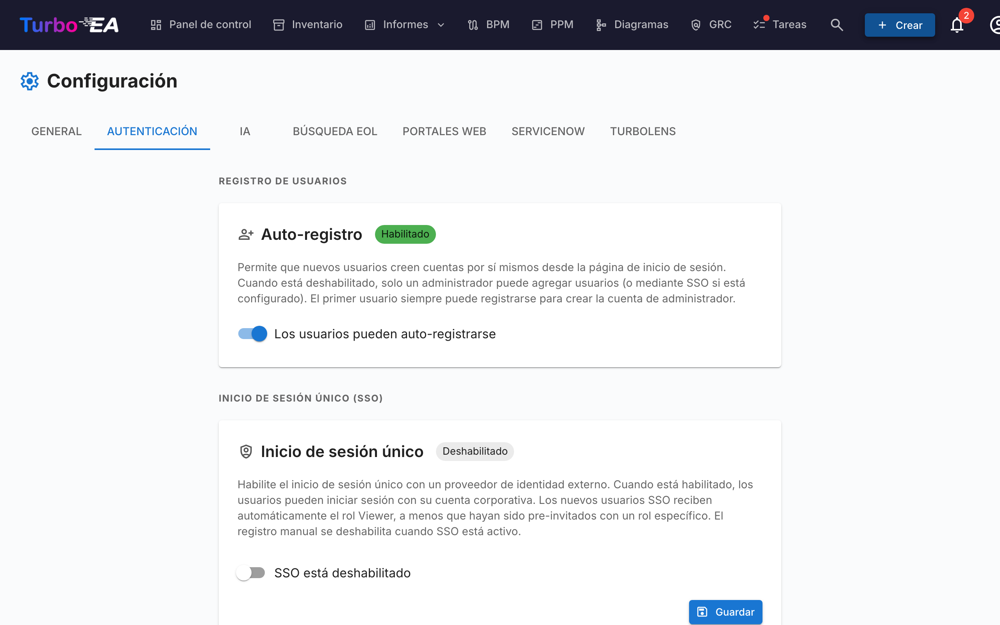

# Autenticación y SSO

La pestaña **Autenticación** en Configuración permite a los administradores configurar cómo los usuarios inician sesión en la plataforma.

#### Auto-registro

- **Permitir auto-registro**: Cuando está habilitado, los nuevos usuarios pueden crear cuentas haciendo clic en «Registrarse» en la página de inicio de sesión. Cuando está deshabilitado, solo los administradores pueden crear cuentas a través del flujo de Invitar usuario.

#### Configuración de SSO (Single Sign-On)

SSO permite a los usuarios iniciar sesión utilizando su proveedor de identidad corporativo en lugar de una contraseña local. Turbo EA soporta cuatro proveedores de SSO:

| Proveedor | Descripción |
|-----------|-------------|
| **Microsoft Entra ID** | Para organizaciones que utilizan Microsoft 365 / Azure AD |
| **Google Workspace** | Para organizaciones que utilizan Google Workspace |
| **Okta** | Para organizaciones que utilizan Okta como plataforma de identidad |
| **OIDC Genérico** | Para cualquier proveedor compatible con OpenID Connect (por ejemplo, Authentik, Keycloak, Auth0) |

**Pasos para configurar SSO:**

1. Vaya a **Admin > Configuración > Autenticación**
2. Active **Habilitar SSO**
3. Seleccione su **Proveedor SSO** en el desplegable
4. Ingrese las credenciales requeridas de su proveedor de identidad:
   - **Client ID**: El ID de aplicación/cliente de su proveedor de identidad
   - **Client Secret**: El secreto de la aplicación (almacenado cifrado en la base de datos)
   - Campos específicos del proveedor:
     - **Microsoft**: Tenant ID (por ejemplo, `su-tenant-id` o `common` para multi-tenant)
     - **Google**: Dominio alojado (opcional, restringe el inicio de sesión a un dominio específico de Google Workspace)
     - **Okta**: Dominio de Okta (por ejemplo, `su-org.okta.com`)
     - **OIDC Genérico**: URL del emisor (por ejemplo, `https://auth.ejemplo.com/application/o/mi-app/`). Para OIDC genérico, el sistema intenta el descubrimiento automático a través del endpoint `.well-known/openid-configuration`
5. Haga clic en **Guardar**

**Endpoints OIDC manuales (Avanzado):**

Si el backend no puede acceder al documento de descubrimiento de su proveedor de identidad (por ejemplo, debido a la red de Docker o certificados autofirmados), puede especificar manualmente los endpoints OIDC:

- **Authorization Endpoint**: La URL donde los usuarios son redirigidos para autenticarse
- **Token Endpoint**: La URL utilizada para intercambiar el código de autorización por tokens
- **JWKS URI**: La URL del JSON Web Key Set utilizado para verificar las firmas de los tokens

Estos campos son opcionales. Si se dejan en blanco, el sistema utiliza el descubrimiento automático. Cuando se completan, anulan los valores descubiertos automáticamente.

**Probar SSO:**

Después de guardar, abra una nueva pestaña del navegador (o ventana de incógnito) y verifique que el botón de inicio de sesión con SSO aparece en la página de inicio de sesión y que la autenticación funciona de extremo a extremo.

**Notas importantes:**
- El **Client Secret** se almacena cifrado en la base de datos y nunca se expone en las respuestas de la API
- Cuando SSO está habilitado, el inicio de sesión con contraseña local permanece disponible como respaldo
- Puede configurar la URI de redirección en su proveedor de identidad como: `https://su-dominio-turbo-ea/auth/callback`
