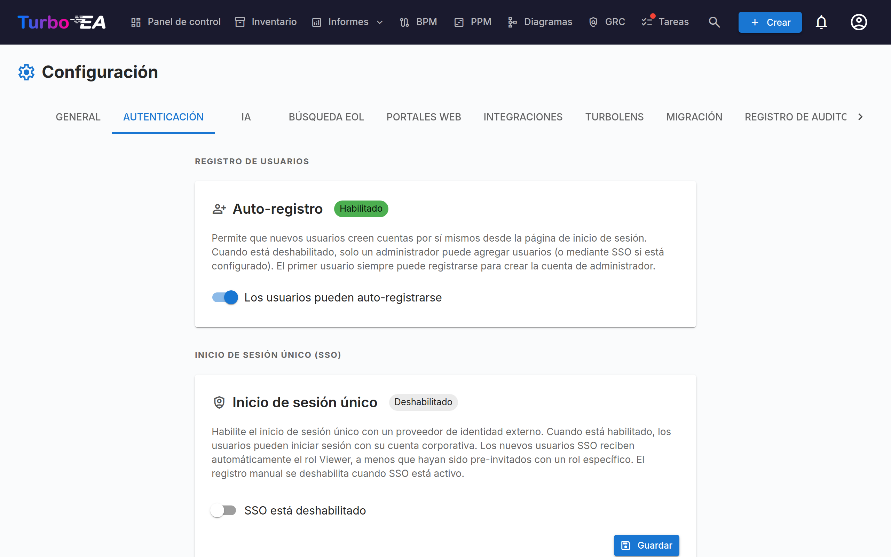

# Autenticación y SSO



La pestaña **Autenticación** en Configuración permite a los administradores configurar cómo los usuarios inician sesión en la plataforma.

#### Auto-registro

- **Permitir auto-registro**: Cuando está habilitado, los nuevos usuarios pueden crear cuentas haciendo clic en «Registrarse» en la página de inicio de sesión. Cuando está deshabilitado, solo los administradores pueden crear cuentas a través del flujo de Invitar usuario.

#### Configuración de SSO (Single Sign-On)

SSO permite a los usuarios iniciar sesión utilizando su proveedor de identidad corporativo en lugar de una contraseña local. Turbo EA soporta cuatro proveedores de SSO:

| Proveedor | Descripción |
|-----------|-------------|
| **Microsoft Entra ID** | Para organizaciones que utilizan Microsoft 365 / Azure AD |
| **Google Workspace** | Para organizaciones que utilizan Google Workspace |
| **Okta** | Para organizaciones que utilizan Okta como plataforma de identidad |
| **OIDC Genérico** | Para cualquier proveedor compatible con OpenID Connect (por ejemplo, Authentik, Keycloak, Auth0) |

**Pasos para configurar SSO:**

1. Vaya a **Admin > Configuración > Autenticación**
2. Active **Habilitar SSO**
3. Seleccione su **Proveedor SSO** en el desplegable
4. Ingrese las credenciales requeridas de su proveedor de identidad:
   - **Client ID**: El ID de aplicación/cliente de su proveedor de identidad
   - **Client Secret**: El secreto de la aplicación (almacenado cifrado en la base de datos)
   - Campos específicos del proveedor:
     - **Microsoft**: Tenant ID (por ejemplo, `su-tenant-id` o `common` para multi-tenant)
     - **Google**: Dominio alojado (opcional, restringe el inicio de sesión a un dominio específico de Google Workspace)
     - **Okta**: Dominio de Okta (por ejemplo, `su-org.okta.com`)
     - **OIDC Genérico**: URL del emisor (por ejemplo, `https://auth.ejemplo.com/application/o/mi-app/`). Para OIDC genérico, el sistema intenta el descubrimiento automático a través del endpoint `.well-known/openid-configuration`
5. Haga clic en **Guardar**

**Endpoints OIDC manuales (Avanzado):**

Si el backend no puede acceder al documento de descubrimiento de su proveedor de identidad (por ejemplo, debido a la red de Docker o certificados autofirmados), puede especificar manualmente los endpoints OIDC:

- **Authorization Endpoint**: La URL donde los usuarios son redirigidos para autenticarse
- **Token Endpoint**: La URL utilizada para intercambiar el código de autorización por tokens
- **JWKS URI**: La URL del JSON Web Key Set utilizado para verificar las firmas de los tokens

Estos campos son opcionales. Si se dejan en blanco, el sistema utiliza el descubrimiento automático. Cuando se completan, anulan los valores descubiertos automáticamente.

**Probar SSO:**

Después de guardar, abra una nueva pestaña del navegador (o ventana de incógnito) y verifique que el botón de inicio de sesión con SSO aparece en la página de inicio de sesión y que la autenticación funciona de extremo a extremo.

**Notas importantes:**
- El **Client Secret** se almacena cifrado en la base de datos y nunca se expone en las respuestas de la API
- Cuando SSO está habilitado, el inicio de sesión con contraseña local permanece disponible como respaldo
- Puede configurar la URI de redirección en su proveedor de identidad como: `https://su-dominio-turbo-ea/auth/callback`

#### Autenticación mediante proxy inverso

Si Turbo EA se ejecuta detrás de un proxy que ya autentica a sus usuarios — la autenticación integrada de Azure App Service («EasyAuth»), oauth2-proxy, Authelia, Cloudflare Access — puede aceptar esa identidad directamente en lugar de ejecutar su propio SSO encima. Sin cliente OIDC, sin registro de aplicación, sin Client Secret. Los usuarios llegan a Turbo EA con la sesión ya iniciada.

Esta funcionalidad se configura completamente mediante variables de entorno y está **deshabilitada por defecto**.

**Antes que nada, establezca el administrador de arranque.** El auto-registro está cerrado mientras la autenticación por proxy está activa, así que esta es la forma en que entra el primer administrador — a ese correo electrónico se le concede el rol de admin en el primer inicio de sesión:

```
TURBO_EA_PROXY_AUTH_BOOTSTRAP_ADMIN_EMAIL=usted@suempresa.com
```

**Azure App Service (EasyAuth) — configuración recomendada.** Turbo EA verifica el token de identidad firmado que Azure reenvía con cada solicitud (esto requiere el almacén de tokens de App Service, que está activado por defecto). `AUDIENCE` es el Client ID del registro de aplicación de su EasyAuth; reemplace `TENANT` por el ID de su directorio (Tenant ID):

```
TURBO_EA_PROXY_AUTH_ENABLED=true
TURBO_EA_PROXY_AUTH_TRUST_PLATFORM_HEADERS=true
TURBO_EA_PROXY_AUTH_VERIFY_ID_TOKEN=true
TURBO_EA_PROXY_AUTH_ISSUER=https://login.microsoftonline.com/TENANT/v2.0
TURBO_EA_PROXY_AUTH_AUDIENCE=your-easyauth-app-client-id
TURBO_EA_PROXY_AUTH_JWKS_URI=https://login.microsoftonline.com/TENANT/discovery/v2.0/keys
TURBO_EA_PROXY_AUTH_ALLOWED_DOMAINS=suempresa.com
TURBO_EA_PROXY_AUTH_LOGOUT_URL=/.auth/logout
```

!!! warning "`TRUST_PLATFORM_HEADERS` es obligatorio en App Service"
    App Service no puede inyectar una cabecera secreta propia, por lo que
    `TURBO_EA_PROXY_AUTH_TRUST_PLATFORM_HEADERS=true` ocupa el lugar de
    `TURBO_EA_PROXY_AUTH_SHARED_SECRET`: es un reconocimiento explícito de que
    usted depende de que Azure elimine las cabeceras de identidad entrantes antes
    de que lleguen a su aplicación. La comprobación se realiza **antes** incluso
    de analizar el token de identidad, de modo que verificar el token no la
    sustituye. Si faltan tanto este ajuste como un secreto compartido, cada
    inicio de sesión falla con *Proxy authentication is enabled but not secured*,
    incluso con `VERIFY_ID_TOKEN=true`.

Si su almacén de tokens está deshabilitado, establezca además `TURBO_EA_PROXY_AUTH_VERIFY_ID_TOKEN=false` y confíe únicamente en el saneamiento de cabeceras. Sin un token verificado **las cuentas nuevas no se crean automáticamente**: invite primero a los usuarios, o utilice el correo del administrador de arranque.

**Proxy genérico (oauth2-proxy, Authelia, Traefik forwardAuth, …).** Configure el proxy para que inyecte una cabecera con un secreto compartido en cada solicitud, de modo que una solicitud que no pasó por el proxy nunca pueda confundirse con una que sí lo hizo. Genere el valor con `openssl rand -hex 32`:

```
TURBO_EA_PROXY_AUTH_ENABLED=true
TURBO_EA_PROXY_AUTH_MODE=header
TURBO_EA_PROXY_AUTH_SHARED_SECRET=<valor generado, establecido también en el proxy>
TURBO_EA_PROXY_AUTH_EMAIL_HEADER=X-Forwarded-Email
TURBO_EA_PROXY_AUTH_ALLOWED_DOMAINS=suempresa.com
TURBO_EA_PROXY_AUTH_LOGOUT_URL=/oauth2/sign_out
```

**Notas de seguridad:**

- El secreto compartido (o, en Azure, el token de identidad verificado) es lo que hace que la identidad sea confiable — una cabecera por sí sola puede ser escrita por cualquiera. La lista de dominios permitidos es obligatoria; establezca `TURBO_EA_PROXY_AUTH_ALLOW_ANY_DOMAIN=true` solo si realmente acepta cualquier dominio de correo electrónico.
- Una identidad que no fue verificada criptográficamente puede iniciar sesión con usuarios existentes, pero nunca crea una cuenta nueva, y las invitaciones pendientes no confieren su rol por esta vía.
- `TURBO_EA_PROXY_AUTH_LOGOUT_URL` es adonde Turbo EA envía el navegador después de **Cerrar sesión**, para que la sesión del proxy también termine. Sin ella, el proxy sigue considerando que el usuario tiene la sesión iniciada — vuelve a la página de inicio de sesión y puede reingresar con un clic.

**Asignación de roles (opcional).** De forma predeterminada todos aterrizan en el rol predeterminado configurado y un administrador los promociona desde ahí. Si su proveedor de identidad ya conoce la respuesta — un registro de aplicación de Entra que declara sus propios roles de aplicación, un oauth2-proxy que reenvía la pertenencia a grupos — Turbo EA puede leerla y asignar el rol por sí mismo:

```
TURBO_EA_PROXY_AUTH_ROLE_CLAIM=roles
TURBO_EA_PROXY_AUTH_ROLE_MAP=ADMIN:admin,MANAGER:member,READ-ONLY:viewer
```

Cada par se escribe `VALOR_DIRECTORIO:clave-de-rol-turbo-ea`. Cuando un usuario tiene varios roles de directorio, **gana la primera entrada de la asignación** — el orden de la asignación, no el orden en que el proveedor los haya enviado, porque los dos formatos de identidad de Azure no coinciden en eso. La coincidencia ignora mayúsculas y minúsculas en el lado del directorio. En modo de proxy genérico, la misma asignación lee una cabecera separada por comas en lugar de una reclamación: `TURBO_EA_PROXY_AUTH_ROLE_HEADER=X-Forwarded-Groups`.

!!! warning "La asignación es autoritativa en cada inicio de sesión"
    No solo al crear la cuenta. Un rol concedido a mano en **Administración → Usuarios** se revierte la próxima vez que esa persona inicia sesión — que es precisamente el objetivo, ya que retirar el rol de directorio de alguien tiene que surtir efecto. Deje `TURBO_EA_PROXY_AUTH_ROLE_MAP` sin definir y nada cambia: los roles siguen siendo totalmente manuales.

Los casos límite, todos elegidos para que un error de configuración no pueda dejarle fuera:

- **`TURBO_EA_PROXY_AUTH_BOOTSTRAP_ADMIN_EMAIL` siempre gana** frente a la asignación. Si ambos discrepan, esa dirección es administradora.
- **Un valor que no coincide con nada de la asignación** — o que nombra un rol de Turbo EA que no existe o está archivado — recae en el rol predeterminado.
- **Una reclamación completamente ausente** deja intacto el rol actual del usuario. Esto es deliberadamente distinto del caso anterior: un `ROLE_CLAIM` mal escrito, o un almacén de tokens que deja de reenviar, degradaría de lo contrario a todos los usuarios de la instancia de una sola vez.
- **La identidad debe merecer que se le confíen permisos.** La asignación de roles se aplica cuando el token de identidad se ha verificado (`TURBO_EA_PROXY_AUTH_VERIFY_ID_TOKEN=true`) o hay un secreto compartido configurado. En App Service con el almacén de tokens deshabilitado y sin secreto, la asignación se ignora y se escribe una línea en el registro indicándolo — el mismo razonamiento que impide que una cabecera no verificada cree una cuenta.

**Todas las variables:**

| Variable | Por defecto | Propósito |
|----------|---------|---------|
| `TURBO_EA_PROXY_AUTH_ENABLED` | `false` | Interruptor principal |
| `TURBO_EA_PROXY_AUTH_MODE` | `azure_easyauth` | `azure_easyauth` o `header` |
| `TURBO_EA_PROXY_AUTH_SHARED_SECRET` | — | Obligatorio en modo `header`; el proxy lo inyecta |
| `TURBO_EA_PROXY_AUTH_SECRET_HEADER` | `X-Turbo-EA-Proxy-Secret` | Cabecera que transporta el secreto compartido |
| `TURBO_EA_PROXY_AUTH_VERIFY_ID_TOKEN` | `false` | Verificar el token de identidad reenviado (modo Azure) |
| `TURBO_EA_PROXY_AUTH_ISSUER` / `_AUDIENCE` / `_JWKS_URI` | — | Ajustes de verificación del token |
| `TURBO_EA_PROXY_AUTH_TRUST_PLATFORM_HEADERS` | `false` | Solo Azure: aceptar el saneamiento de cabeceras de la plataforma en lugar de un secreto. Obligatorio en App Service |
| `TURBO_EA_PROXY_AUTH_EMAIL_HEADER` | `X-Forwarded-Email` | Modo `header`: cabecera del correo electrónico |
| `TURBO_EA_PROXY_AUTH_NAME_HEADER` | `X-Forwarded-User` | Modo `header`: cabecera del nombre para mostrar |
| `TURBO_EA_PROXY_AUTH_SUBJECT_HEADER` | `X-Forwarded-Subject` | Modo `header`: cabecera del identificador de sujeto estable |
| `TURBO_EA_PROXY_AUTH_ALLOWED_DOMAINS` | — | Dominios de correo permitidos, separados por comas (obligatorio) |
| `TURBO_EA_PROXY_AUTH_ALLOW_ANY_DOMAIN` | `false` | Aceptar explícitamente cualquier dominio de correo electrónico |
| `TURBO_EA_PROXY_AUTH_BOOTSTRAP_ADMIN_EMAIL` | — | Recibe el rol de admin en el primer inicio de sesión |
| `TURBO_EA_PROXY_AUTH_ROLE_MAP` | — | `VALOR_DIRECTORIO:clave-de-rol,…` — vacío significa que los roles siguen siendo manuales |
| `TURBO_EA_PROXY_AUTH_ROLE_CLAIM` | `roles` | Reclamación que porta el rol del directorio (modo Azure) |
| `TURBO_EA_PROXY_AUTH_ROLE_HEADER` | `X-Forwarded-Groups` | Modo `header`: cabecera de roles separados por comas |
| `TURBO_EA_PROXY_AUTH_LOGOUT_URL` | — | Adonde Cerrar sesión envía el navegador |

**Limitaciones:** el flujo OAuth del servidor MCP requiere que el SSO normal esté configurado; la autenticación por proxy por sí sola no lo cubre.
