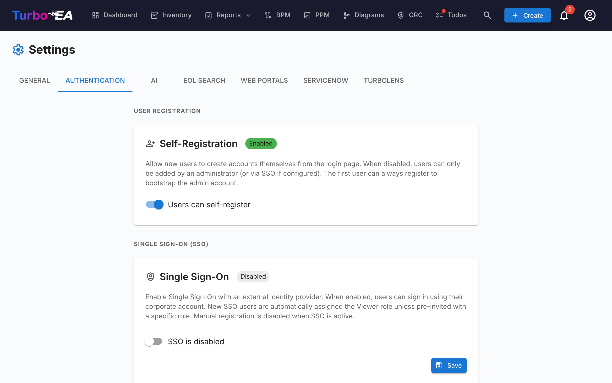

# Authentification et SSO

L'onglet **Authentification** dans les Paramètres permet aux administrateurs de configurer la manière dont les utilisateurs se connectent à la plateforme.

#### Auto-inscription

- **Autoriser l'auto-inscription** : Lorsque cette option est activée, les nouveaux utilisateurs peuvent créer des comptes en cliquant sur « S'inscrire » sur la page de connexion. Lorsqu'elle est désactivée, seuls les administrateurs peuvent créer des comptes via le flux d'invitation.

#### Configuration SSO (Single Sign-On)

Le SSO permet aux utilisateurs de se connecter en utilisant leur fournisseur d'identité d'entreprise au lieu d'un mot de passe local. Turbo EA prend en charge quatre fournisseurs SSO :

| Fournisseur | Description |
|-------------|-------------|
| **Microsoft Entra ID** | Pour les organisations utilisant Microsoft 365 / Azure AD |
| **Google Workspace** | Pour les organisations utilisant Google Workspace |
| **Okta** | Pour les organisations utilisant Okta comme plateforme d'identité |
| **OIDC generique** | Pour tout fournisseur compatible OpenID Connect (par ex. Authentik, Keycloak, Auth0) |

**Étapes pour configurer le SSO :**

1. Allez dans **Admin > Paramètres > Authentification**
2. Activez **Activer le SSO**
3. Sélectionnez votre **Fournisseur SSO** dans la liste déroulante
4. Entrez les identifiants requis de votre fournisseur d'identité :
   - **Client ID** : L'identifiant d'application/client de votre fournisseur d'identité
   - **Client Secret** : Le secret de l'application (stocke chiffre dans la base de données)
   - Champs spécifiques au fournisseur :
     - **Microsoft** : Tenant ID (par ex. `votre-tenant-id` ou `common` pour multi-tenant)
     - **Google** : Domaine hébergé (optionnel, restreint la connexion à un domaine Google Workspace spécifique)
     - **Okta** : Domaine Okta (par ex. `votre-org.okta.com`)
     - **OIDC generique** : URL de l'emetteur (par ex. `https://auth.example.com/application/o/my-app/`). Pour l'OIDC generique, le système tente la découverte automatique via le point de terminaison `.well-known/openid-configuration`
5. Cliquez sur **Sauvegarder**

**Points de terminaison OIDC manuels (avancé) :**

Si le backend ne peut pas atteindre le document de découverte de votre fournisseur d'identité (par ex. en raison du réseau Docker ou de certificats auto-signes), vous pouvez specifier manuellement les points de terminaison OIDC :

- **Point de terminaison d'autorisation** : L'URL ou les utilisateurs sont redirigés pour s'authentifier
- **Point de terminaison de jeton** : L'URL utilisee pour echanger le code d'autorisation contre des jetons
- **URI JWKS** : L'URL du jeu de clés web JSON utilise pour verifier les signatures des jetons

Ces champs sont optionnels. S'ils sont laisses vides, le système utilise la découverte automatique. Lorsqu'ils sont remplis, ils remplacent les valeurs découvertes automatiquement.

**Tester le SSO :**

Après avoir sauvegarde, ouvrez un nouvel onglet de navigateur (ou une fenêtre de navigation privée) et vérifiez que le bouton de connexion SSO apparaît sur la page de connexion et que l'authentification fonctionne de bout en bout.

**Notes importantes :**
- Le **Client Secret** est stocke chiffre dans la base de données et n'est jamais exposé dans les réponses API
- Lorsque le SSO est active, la connexion par mot de passe local reste disponible comme solution de secours
- Vous pouvez configurer l'URI de redirection dans votre fournisseur d'identité comme suit : `https://votre-domaine-turbo-ea/auth/callback`
