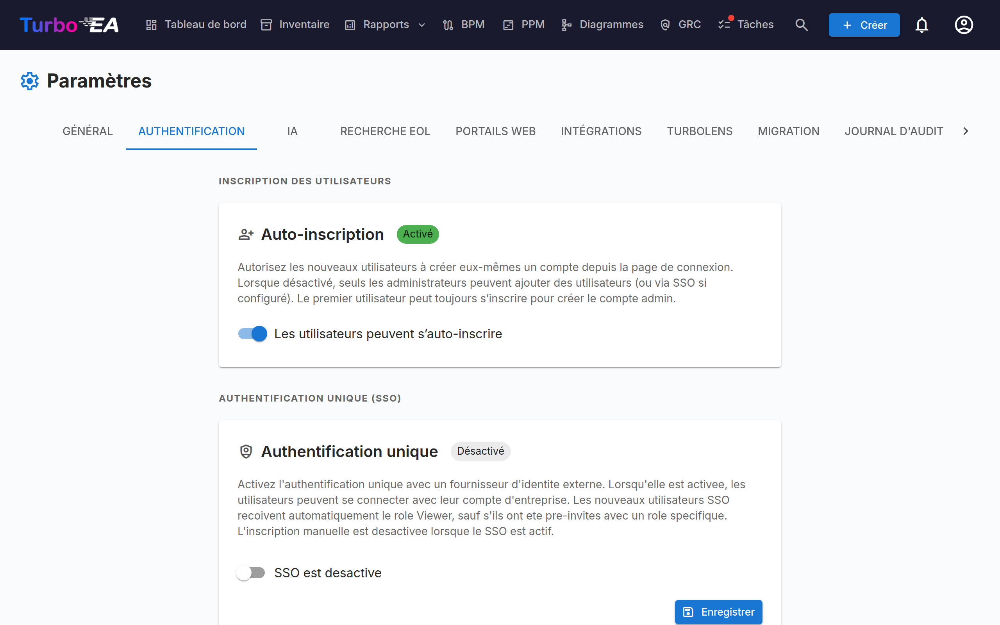

# Authentification et SSO



L'onglet **Authentification** dans les Paramètres permet aux administrateurs de configurer la manière dont les utilisateurs se connectent à la plateforme.

#### Auto-inscription

- **Autoriser l'auto-inscription** : Lorsque cette option est activée, les nouveaux utilisateurs peuvent créer des comptes en cliquant sur « S'inscrire » sur la page de connexion. Lorsqu'elle est désactivée, seuls les administrateurs peuvent créer des comptes via le flux d'invitation.

#### Configuration SSO (Single Sign-On)

Le SSO permet aux utilisateurs de se connecter en utilisant leur fournisseur d'identité d'entreprise au lieu d'un mot de passe local. Turbo EA prend en charge quatre fournisseurs SSO :

| Fournisseur | Description |
|-------------|-------------|
| **Microsoft Entra ID** | Pour les organisations utilisant Microsoft 365 / Azure AD |
| **Google Workspace** | Pour les organisations utilisant Google Workspace |
| **Okta** | Pour les organisations utilisant Okta comme plateforme d'identité |
| **OIDC générique** | Pour tout fournisseur compatible OpenID Connect (par ex. Authentik, Keycloak, Auth0) |

**Étapes pour configurer le SSO :**

1. Allez dans **Admin > Paramètres > Authentification**
2. Activez **Activer le SSO**
3. Sélectionnez votre **Fournisseur SSO** dans la liste déroulante
4. Entrez les identifiants requis de votre fournisseur d'identité :
   - **Client ID** : L'identifiant d'application/client de votre fournisseur d'identité
   - **Client Secret** : Le secret de l'application (stocké chiffré dans la base de données)
   - Champs spécifiques au fournisseur :
     - **Microsoft** : Tenant ID (par ex. `votre-tenant-id` ou `common` pour multi-tenant)
     - **Google** : Domaine hébergé (optionnel, restreint la connexion à un domaine Google Workspace spécifique)
     - **Okta** : Domaine Okta (par ex. `votre-org.okta.com`)
     - **OIDC générique** : URL de l'émetteur (par ex. `https://auth.example.com/application/o/my-app/`). Pour l'OIDC générique, le système tente la découverte automatique via le point de terminaison `.well-known/openid-configuration`
5. Cliquez sur **Sauvegarder**

**Points de terminaison OIDC manuels (avancé) :**

Si le backend ne peut pas atteindre le document de découverte de votre fournisseur d'identité (par ex. en raison du réseau Docker ou de certificats auto-signés), vous pouvez spécifier manuellement les points de terminaison OIDC :

- **Point de terminaison d'autorisation** : L'URL où les utilisateurs sont redirigés pour s'authentifier
- **Point de terminaison de jeton** : L'URL utilisée pour échanger le code d'autorisation contre des jetons
- **URI JWKS** : L'URL du jeu de clés web JSON utilisé pour vérifier les signatures des jetons

Ces champs sont optionnels. S'ils sont laissés vides, le système utilise la découverte automatique. Lorsqu'ils sont remplis, ils remplacent les valeurs découvertes automatiquement.

**Tester le SSO :**

Après avoir sauvegardé, ouvrez un nouvel onglet de navigateur (ou une fenêtre de navigation privée) et vérifiez que le bouton de connexion SSO apparaît sur la page de connexion et que l'authentification fonctionne de bout en bout.

**Notes importantes :**
- Le **Client Secret** est stocké chiffré dans la base de données et n'est jamais exposé dans les réponses API
- Lorsque le SSO est activé, la connexion par mot de passe local reste disponible comme solution de secours
- Vous pouvez configurer l'URI de redirection dans votre fournisseur d'identité comme suit : `https://votre-domaine-turbo-ea/auth/callback`

#### Authentification par proxy inverse

Si Turbo EA fonctionne derrière un proxy qui connecte déjà vos utilisateurs — l'authentification intégrée d'Azure App Service (« EasyAuth »), oauth2-proxy, Authelia, Cloudflare Access — il peut accepter cette identité directement au lieu d'exécuter son propre SSO par-dessus. Pas de client OIDC, pas d'enregistrement d'application, pas de Client Secret. Les utilisateurs arrivent dans Turbo EA déjà connectés.

Cette fonctionnalité se configure entièrement via des variables d'environnement et est **désactivée par défaut**.

**Avant toute chose, définissez l'administrateur d'amorçage.** L'auto-inscription est fermée lorsque l'authentification par proxy est activée ; c'est donc ainsi que le premier administrateur accède à la plateforme — cette adresse e-mail reçoit le rôle admin lors de la première connexion :

```
TURBO_EA_PROXY_AUTH_BOOTSTRAP_ADMIN_EMAIL=vous@votreentreprise.com
```

**Azure App Service (EasyAuth) — configuration recommandée.** Turbo EA vérifie le jeton d'identité signé qu'Azure transmet avec chaque requête (cela nécessite le magasin de jetons App Service, activé par défaut). `AUDIENCE` est le Client ID de votre enregistrement d'application EasyAuth ; remplacez `TENANT` par l'identifiant de votre annuaire (Tenant ID) :

```
TURBO_EA_PROXY_AUTH_ENABLED=true
TURBO_EA_PROXY_AUTH_VERIFY_ID_TOKEN=true
TURBO_EA_PROXY_AUTH_ISSUER=https://login.microsoftonline.com/TENANT/v2.0
TURBO_EA_PROXY_AUTH_AUDIENCE=your-easyauth-app-client-id
TURBO_EA_PROXY_AUTH_JWKS_URI=https://login.microsoftonline.com/TENANT/discovery/v2.0/keys
TURBO_EA_PROXY_AUTH_ALLOWED_DOMAINS=votreentreprise.com
TURBO_EA_PROXY_AUTH_LOGOUT_URL=/.auth/logout
```

Si votre magasin de jetons est désactivé, définissez plutôt `TURBO_EA_PROXY_AUTH_VERIFY_ID_TOKEN=false` et `TURBO_EA_PROXY_AUTH_TRUST_PLATFORM_HEADERS=true`. Cela repose explicitement sur le fait qu'Azure supprime les en-têtes d'identité entrants avant qu'ils n'atteignent votre application, et sans jeton vérifié, **les nouveaux comptes ne sont pas créés automatiquement** — invitez d'abord les utilisateurs, ou utilisez l'e-mail de l'administrateur d'amorçage.

**Proxy générique (oauth2-proxy, Authelia, Traefik forwardAuth, …).** Configurez le proxy pour qu'il injecte un en-tête contenant un secret partagé sur chaque requête, afin qu'une requête qui n'est pas passée par le proxy ne puisse jamais être confondue avec une requête qui l'a fait. Générez la valeur avec `openssl rand -hex 32` :

```
TURBO_EA_PROXY_AUTH_ENABLED=true
TURBO_EA_PROXY_AUTH_MODE=header
TURBO_EA_PROXY_AUTH_SHARED_SECRET=<valeur générée, également définie sur le proxy>
TURBO_EA_PROXY_AUTH_EMAIL_HEADER=X-Forwarded-Email
TURBO_EA_PROXY_AUTH_ALLOWED_DOMAINS=votreentreprise.com
TURBO_EA_PROXY_AUTH_LOGOUT_URL=/oauth2/sign_out
```

**Notes de sécurité :**

- Le secret partagé (ou, sur Azure, le jeton d'identité vérifié) est ce qui rend l'identité digne de confiance — un en-tête seul peut être écrit par n'importe qui. La liste d'autorisation de domaines est obligatoire ; ne définissez `TURBO_EA_PROXY_AUTH_ALLOW_ANY_DOMAIN=true` que si vous acceptez réellement n'importe quel domaine d'e-mail.
- Une identité qui n'a pas été vérifiée cryptographiquement peut connecter des utilisateurs existants mais ne crée jamais de nouveau compte, et les invitations en attente ne confèrent pas leur rôle par ce chemin.
- `TURBO_EA_PROXY_AUTH_LOGOUT_URL` est l'adresse vers laquelle Turbo EA envoie le navigateur après **Se déconnecter**, afin que la session du proxy se termine aussi. Sans elle, le proxy considère toujours l'utilisateur comme connecté — il retombe sur la page de connexion et peut se reconnecter en un clic.

**Toutes les variables :**

| Variable | Défaut | Rôle |
|----------|---------|---------|
| `TURBO_EA_PROXY_AUTH_ENABLED` | `false` | Interrupteur principal |
| `TURBO_EA_PROXY_AUTH_MODE` | `azure_easyauth` | `azure_easyauth` ou `header` |
| `TURBO_EA_PROXY_AUTH_SHARED_SECRET` | — | Obligatoire en mode `header` ; le proxy l'injecte |
| `TURBO_EA_PROXY_AUTH_SECRET_HEADER` | `X-Turbo-EA-Proxy-Secret` | En-tête transportant le secret partagé |
| `TURBO_EA_PROXY_AUTH_VERIFY_ID_TOKEN` | `false` | Vérifier le jeton d'identité transmis (mode Azure) |
| `TURBO_EA_PROXY_AUTH_ISSUER` / `_AUDIENCE` / `_JWKS_URI` | — | Paramètres de vérification du jeton |
| `TURBO_EA_PROXY_AUTH_TRUST_PLATFORM_HEADERS` | `false` | Azure uniquement : accepter l'assainissement des en-têtes par la plateforme au lieu d'un secret |
| `TURBO_EA_PROXY_AUTH_EMAIL_HEADER` | `X-Forwarded-Email` | Mode `header` : en-tête de l'e-mail |
| `TURBO_EA_PROXY_AUTH_NAME_HEADER` | `X-Forwarded-User` | Mode `header` : en-tête du nom d'affichage |
| `TURBO_EA_PROXY_AUTH_SUBJECT_HEADER` | `X-Forwarded-Subject` | Mode `header` : en-tête de l'identifiant de sujet stable |
| `TURBO_EA_PROXY_AUTH_ALLOWED_DOMAINS` | — | Domaines d'e-mail autorisés, séparés par des virgules (obligatoire) |
| `TURBO_EA_PROXY_AUTH_ALLOW_ANY_DOMAIN` | `false` | Accepter explicitement n'importe quel domaine d'e-mail |
| `TURBO_EA_PROXY_AUTH_BOOTSTRAP_ADMIN_EMAIL` | — | Reçoit le rôle admin lors de la première connexion |
| `TURBO_EA_PROXY_AUTH_LOGOUT_URL` | — | Où Se déconnecter envoie le navigateur |

**Limitations :** le flux OAuth du serveur MCP nécessite qu'un SSO classique soit configuré ; l'authentification par proxy seule ne le couvre pas.
