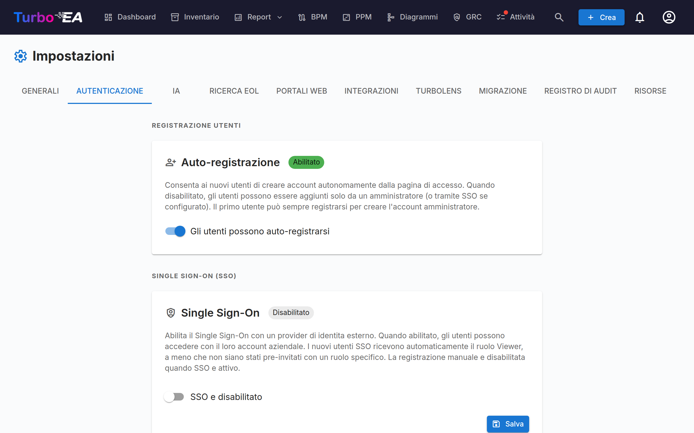

# Autenticazione e SSO



La scheda **Autenticazione** nelle Impostazioni consente agli amministratori di configurare come gli utenti accedono alla piattaforma.

#### Auto-registrazione

- **Consenti auto-registrazione**: Quando abilitata, i nuovi utenti possono creare account cliccando su "Registrati" nella pagina di login. Quando disabilitata, solo gli amministratori possono creare account tramite il flusso Invita utente.

#### Configurazione SSO (Single Sign-On)

SSO consente agli utenti di accedere utilizzando il proprio identity provider aziendale invece di una password locale. Turbo EA supporta quattro provider SSO:

| Provider | Descrizione |
|----------|-------------|
| **Microsoft Entra ID** | Per organizzazioni che utilizzano Microsoft 365 / Azure AD |
| **Google Workspace** | Per organizzazioni che utilizzano Google Workspace |
| **Okta** | Per organizzazioni che utilizzano Okta come piattaforma di identità |
| **OIDC generico** | Per qualsiasi provider compatibile con OpenID Connect (es. Authentik, Keycloak, Auth0) |

**Passaggi per configurare SSO:**

1. Andate su **Admin > Impostazioni > Autenticazione**
2. Attivate **Abilita SSO**
3. Selezionate il vostro **Provider SSO** dal menu a tendina
4. Inserite le credenziali richieste dal vostro identity provider:
   - **Client ID**: L'ID applicazione/client dal vostro identity provider
   - **Client Secret**: Il segreto dell'applicazione (memorizzato crittografato nel database)
   - Campi specifici per provider:
     - **Microsoft**: Tenant ID (es. `your-tenant-id` o `common` per multi-tenant)
     - **Google**: Hosted Domain (opzionale, limita il login a un dominio Google Workspace specifico)
     - **Okta**: Dominio Okta (es. `your-org.okta.com`)
     - **OIDC generico**: URL Issuer (es. `https://auth.example.com/application/o/my-app/`). Per OIDC generico, il sistema tenta l'auto-discovery tramite l'endpoint `.well-known/openid-configuration`
5. Cliccate su **Salva**

**Endpoint OIDC manuali (Avanzato):**

Se il backend non riesce a raggiungere il documento di discovery del vostro identity provider (es. a causa della rete Docker o certificati auto-firmati), potete specificare manualmente gli endpoint OIDC:

- **Authorization Endpoint**: L'URL dove gli utenti vengono reindirizzati per autenticarsi
- **Token Endpoint**: L'URL utilizzato per scambiare il codice di autorizzazione con i token
- **JWKS URI**: L'URL per il JSON Web Key Set utilizzato per verificare le firme dei token

Questi campi sono opzionali. Se lasciati vuoti, il sistema utilizza l'auto-discovery. Quando compilati, sovrascrivono i valori scoperti automaticamente.

**Test SSO:**

Dopo il salvataggio, aprite una nuova scheda del browser (o finestra in incognito) e verificate che il pulsante di login SSO appaia nella pagina di login e che l'autenticazione funzioni dall'inizio alla fine.

**Note importanti:**
- Il **Client Secret** è memorizzato crittografato nel database e non viene mai esposto nelle risposte API
- Quando SSO è abilitato, il login con password locale rimane disponibile come fallback
- Potete configurare l'URI di redirect nel vostro identity provider come: `https://your-turbo-ea-domain/auth/callback`

#### Autenticazione tramite reverse proxy

Se Turbo EA è in esecuzione dietro un proxy che autentica già i vostri utenti — l'autenticazione integrata di Azure App Service ("EasyAuth"), oauth2-proxy, Authelia, Cloudflare Access — può accettare direttamente quell'identità invece di eseguire un proprio SSO aggiuntivo. Nessun client OIDC, nessuna registrazione di app, nessun client secret. Gli utenti arrivano in Turbo EA già autenticati.

Questa funzionalità si configura interamente tramite variabili d'ambiente ed è **disattivata per impostazione predefinita**.

**Prima di ogni altra cosa, impostate l'amministratore di bootstrap.** L'auto-registrazione è chiusa quando l'autenticazione tramite proxy è attiva, quindi questo è il modo in cui il primo amministratore entra — a quell'email viene assegnato il ruolo admin al primo accesso:

```
TURBO_EA_PROXY_AUTH_BOOTSTRAP_ADMIN_EMAIL=you@yourcompany.com
```

**Azure App Service (EasyAuth) — configurazione consigliata.** Turbo EA verifica il token di identità firmato che Azure inoltra con ogni richiesta (ciò richiede il token store di App Service, attivo per impostazione predefinita). `AUDIENCE` è il client ID della registrazione app di EasyAuth; sostituite `TENANT` con l'ID della vostra directory (tenant):

```
TURBO_EA_PROXY_AUTH_ENABLED=true
TURBO_EA_PROXY_AUTH_TRUST_PLATFORM_HEADERS=true
TURBO_EA_PROXY_AUTH_VERIFY_ID_TOKEN=true
TURBO_EA_PROXY_AUTH_ISSUER=https://login.microsoftonline.com/TENANT/v2.0
TURBO_EA_PROXY_AUTH_AUDIENCE=your-easyauth-app-client-id
TURBO_EA_PROXY_AUTH_JWKS_URI=https://login.microsoftonline.com/TENANT/discovery/v2.0/keys
TURBO_EA_PROXY_AUTH_ALLOWED_DOMAINS=yourcompany.com
TURBO_EA_PROXY_AUTH_LOGOUT_URL=/.auth/logout
```

!!! warning "`TRUST_PLATFORM_HEADERS` è obbligatorio su App Service"
    App Service non può iniettare un header segreto personalizzato, quindi
    `TURBO_EA_PROXY_AUTH_TRUST_PLATFORM_HEADERS=true` prende il posto di
    `TURBO_EA_PROXY_AUTH_SHARED_SECRET`: è un riconoscimento esplicito del fatto
    che vi affidate ad Azure per rimuovere gli header di identità in ingresso
    prima che raggiungano la vostra app. Il controllo avviene **prima** ancora
    che il token di identità venga analizzato, perciò verificare il token non lo
    sostituisce. Se mancano sia questa impostazione sia un segreto condiviso,
    ogni accesso fallisce con *Proxy authentication is enabled but not secured*,
    anche con `VERIFY_ID_TOKEN=true`.

Se il vostro token store è disabilitato, impostate inoltre `TURBO_EA_PROXY_AUTH_VERIFY_ID_TOKEN=false` e affidatevi alla sola sanificazione degli header. Senza un token verificato **i nuovi account non vengono creati automaticamente**: invitate prima gli utenti, oppure usate l'email dell'amministratore di bootstrap.

**Proxy generico (oauth2-proxy, Authelia, Traefik forwardAuth, …).** Configurate il proxy in modo che inietti un header con un segreto condiviso su ogni richiesta, così una richiesta che non è passata dal proxy non potrà mai essere scambiata per una che lo ha fatto. Generate il valore con `openssl rand -hex 32`:

```
TURBO_EA_PROXY_AUTH_ENABLED=true
TURBO_EA_PROXY_AUTH_MODE=header
TURBO_EA_PROXY_AUTH_SHARED_SECRET=<valore generato, impostato anche sul proxy>
TURBO_EA_PROXY_AUTH_EMAIL_HEADER=X-Forwarded-Email
TURBO_EA_PROXY_AUTH_ALLOWED_DOMAINS=yourcompany.com
TURBO_EA_PROXY_AUTH_LOGOUT_URL=/oauth2/sign_out
```

**Note di sicurezza:**

- Il segreto condiviso (o, su Azure, il token di identità verificato) è ciò che rende affidabile l'identità — un header da solo può essere scritto da chiunque. La allowlist dei domini è obbligatoria; impostate `TURBO_EA_PROXY_AUTH_ALLOW_ANY_DOMAIN=true` solo se accettate davvero qualsiasi dominio email.
- Un'identità che non è stata verificata crittograficamente può far accedere gli utenti esistenti ma non crea mai un nuovo account, e gli inviti in sospeso non conferiscono il proprio ruolo su questo percorso.
- `TURBO_EA_PROXY_AUTH_LOGOUT_URL` è l'indirizzo a cui Turbo EA reindirizza il browser dopo **Esci**, in modo che termini anche la sessione del proxy. Senza di esso, il proxy considera ancora l'utente autenticato — l'utente torna alla pagina di login e può rientrare con un clic.

**Mappatura dei ruoli (opzionale).** Per impostazione predefinita tutti atterrano sul ruolo predefinito configurato e un amministratore li promuove da lì. Se il vostro provider di identità conosce già la risposta — una registrazione applicazione Entra che dichiara i propri ruoli applicativi, un oauth2-proxy che inoltra l'appartenenza ai gruppi — Turbo EA può leggerla e assegnare il ruolo da sé:

```
TURBO_EA_PROXY_AUTH_ROLE_CLAIM=roles
TURBO_EA_PROXY_AUTH_ROLE_MAP=ADMIN:admin,MANAGER:member,READ-ONLY:viewer
```

Ogni coppia si scrive `VALORE_DIRECTORY:chiave-ruolo-turbo-ea`. Quando un utente possiede più ruoli di directory, **vince la prima voce della mappatura** — l'ordine della mappatura, non quello in cui il provider li ha inviati, perché i due formati di identità Azure non concordano su questo. La corrispondenza ignora maiuscole e minuscole sul lato directory. In modalità proxy generica la stessa mappatura legge un'intestazione separata da virgole anziché un claim: `TURBO_EA_PROXY_AUTH_ROLE_HEADER=X-Forwarded-Groups`.

!!! warning "La mappatura è autorevole a ogni accesso"
    Non solo alla creazione dell'account. Un ruolo assegnato a mano in **Amministrazione → Utenti** viene annullato al successivo accesso di quella persona — ed è proprio questo il punto, perché la rimozione del ruolo di directory di qualcuno deve avere effetto. Lasciate `TURBO_EA_PROXY_AUTH_ROLE_MAP` non impostata e nulla cambia: i ruoli restano interamente manuali.

I casi limite, scelti tutti perché un errore di configurazione non possa lasciarvi fuori:

- **`TURBO_EA_PROXY_AUTH_BOOTSTRAP_ADMIN_EMAIL` vince sempre** sulla mappatura. Se i due sono in disaccordo, quell'indirizzo è amministratore.
- **Un valore che non corrisponde a nulla nella mappatura** — o che indica un ruolo Turbo EA inesistente o archiviato — ricade sul ruolo predefinito.
- **Un claim del tutto assente** lascia intatto il ruolo attuale dell'utente. È deliberatamente diverso dal caso precedente: un `ROLE_CLAIM` digitato male, o un archivio token che smette di inoltrare, retrocederebbe altrimenti tutti gli utenti dell'istanza in un colpo solo.
- **L'identità deve meritare che le si affidino permessi.** La mappatura dei ruoli si applica quando il token di identità è stato verificato (`TURBO_EA_PROXY_AUTH_VERIFY_ID_TOKEN=true`) o è configurato un segreto condiviso. Su App Service con l'archivio token disabilitato e senza segreto la mappatura viene ignorata e una riga nel log lo segnala — lo stesso ragionamento che impedisce a un'intestazione non verificata di creare un account.

**Tutte le variabili:**

| Variabile | Predefinito | Scopo |
|----------|---------|---------|
| `TURBO_EA_PROXY_AUTH_ENABLED` | `false` | Interruttore principale |
| `TURBO_EA_PROXY_AUTH_MODE` | `azure_easyauth` | `azure_easyauth` o `header` |
| `TURBO_EA_PROXY_AUTH_SHARED_SECRET` | — | Obbligatorio in modalità `header`; il proxy lo inietta |
| `TURBO_EA_PROXY_AUTH_SECRET_HEADER` | `X-Turbo-EA-Proxy-Secret` | Header che trasporta il segreto condiviso |
| `TURBO_EA_PROXY_AUTH_VERIFY_ID_TOKEN` | `false` | Verifica il token di identità inoltrato (modalità Azure) |
| `TURBO_EA_PROXY_AUTH_ISSUER` / `_AUDIENCE` / `_JWKS_URI` | — | Impostazioni di verifica del token |
| `TURBO_EA_PROXY_AUTH_TRUST_PLATFORM_HEADERS` | `false` | Solo Azure: affidarsi alla sanificazione degli header della piattaforma invece che a un segreto. Obbligatorio su App Service |
| `TURBO_EA_PROXY_AUTH_EMAIL_HEADER` | `X-Forwarded-Email` | Modalità `header`: header dell'email |
| `TURBO_EA_PROXY_AUTH_NAME_HEADER` | `X-Forwarded-User` | Modalità `header`: header del nome visualizzato |
| `TURBO_EA_PROXY_AUTH_SUBJECT_HEADER` | `X-Forwarded-Subject` | Modalità `header`: header dell'identificativo stabile del soggetto |
| `TURBO_EA_PROXY_AUTH_ALLOWED_DOMAINS` | — | Domini email consentiti, separati da virgola (obbligatorio) |
| `TURBO_EA_PROXY_AUTH_ALLOW_ANY_DOMAIN` | `false` | Accetta esplicitamente qualsiasi dominio email |
| `TURBO_EA_PROXY_AUTH_BOOTSTRAP_ADMIN_EMAIL` | — | Riceve il ruolo admin al primo accesso |
| `TURBO_EA_PROXY_AUTH_ROLE_MAP` | — | `VALORE_DIRECTORY:chiave-ruolo,…` — vuoto significa che i ruoli restano manuali |
| `TURBO_EA_PROXY_AUTH_ROLE_CLAIM` | `roles` | Claim che porta il ruolo di directory (modalità Azure) |
| `TURBO_EA_PROXY_AUTH_ROLE_HEADER` | `X-Forwarded-Groups` | Modalità `header`: intestazione dei ruoli separati da virgole |
| `TURBO_EA_PROXY_AUTH_LOGOUT_URL` | — | Dove Esci reindirizza il browser |

**Limitazioni:** il flusso OAuth del server MCP richiede che il normale SSO sia configurato; l'autenticazione tramite proxy da sola non lo copre.
