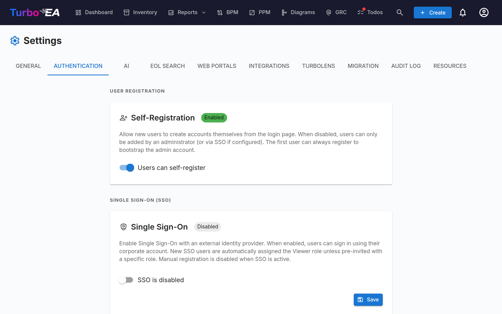

# Authentication & SSO



The **Authentication** tab in Settings allows administrators to configure how users sign in to the platform.

#### Self-Registration

- **Allow self-registration**: When enabled, new users can create accounts by clicking "Sign Up" on the login page. When disabled, only administrators can create accounts via the Invite User flow.

#### SSO (Single Sign-On) Configuration

SSO allows users to sign in using their corporate identity provider instead of a local password. Turbo EA supports four SSO providers:

| Provider | Description |
|----------|-------------|
| **Microsoft Entra ID** | For organizations using Microsoft 365 / Azure AD |
| **Google Workspace** | For organizations using Google Workspace |
| **Okta** | For organizations using Okta as their identity platform |
| **Generic OIDC** | For any OpenID Connect-compatible provider (e.g., Authentik, Keycloak, Auth0) |

**Steps to configure SSO:**

1. Go to **Admin > Settings > Authentication**
2. Toggle **Enable SSO** to on
3. Select your **SSO Provider** from the dropdown
4. Enter the required credentials from your identity provider:
   - **Client ID**: The application/client ID from your identity provider
   - **Client Secret**: The application secret (stored encrypted in the database)
   - Provider-specific fields:
     - **Microsoft**: Tenant ID (e.g., `your-tenant-id` or `common` for multi-tenant)
     - **Google**: Hosted Domain (optional, restricts login to a specific Google Workspace domain)
     - **Okta**: Okta Domain (e.g., `your-org.okta.com`)
     - **Generic OIDC**: Issuer URL (e.g., `https://auth.example.com/application/o/my-app/`). For Generic OIDC, the system attempts auto-discovery via the `.well-known/openid-configuration` endpoint
5. Click **Save**

**Manual OIDC Endpoints (Advanced):**

If the backend cannot reach your identity provider's discovery document (e.g., due to Docker networking or self-signed certificates), you can manually specify the OIDC endpoints:

- **Authorization Endpoint**: The URL where users are redirected to authenticate
- **Token Endpoint**: The URL used to exchange the authorization code for tokens
- **JWKS URI**: The URL for the JSON Web Key Set used to verify token signatures

These fields are optional. If left blank, the system uses auto-discovery. When filled in, they override the auto-discovered values.

**Testing SSO:**

After saving, open a new browser tab (or incognito window) and verify that the SSO login button appears on the login page and that authentication works end-to-end.

**Important notes:**
- The **Client Secret** is stored encrypted in the database and never exposed in API responses
- When SSO is enabled, local password login remains available as a fallback
- You can configure the redirect URI in your identity provider as: `https://your-turbo-ea-domain/auth/callback`

#### Reverse proxy authentication

If Turbo EA runs behind a proxy that already signs your users in — Azure App Service's built-in authentication ("EasyAuth"), oauth2-proxy, Authelia, Cloudflare Access — it can accept that identity directly instead of running its own SSO on top. No OIDC client, no app registration, no client secret. Users land in Turbo EA already signed in.

This feature is configured entirely through environment variables and is **off by default**.

**Before anything else, set the bootstrap administrator.** Self-registration is closed while proxy authentication is on, so this is how the first administrator gets in — that email is granted the admin role on first sign-in:

```
TURBO_EA_PROXY_AUTH_BOOTSTRAP_ADMIN_EMAIL=you@yourcompany.com
```

**Azure App Service (EasyAuth) — recommended setup.** Turbo EA verifies the signed identity token Azure forwards with each request (this requires the App Service token store, which is on by default). `AUDIENCE` is your EasyAuth app registration's client ID; replace `TENANT` with your directory (tenant) ID:

```
TURBO_EA_PROXY_AUTH_ENABLED=true
TURBO_EA_PROXY_AUTH_VERIFY_ID_TOKEN=true
TURBO_EA_PROXY_AUTH_ISSUER=https://login.microsoftonline.com/TENANT/v2.0
TURBO_EA_PROXY_AUTH_AUDIENCE=your-easyauth-app-client-id
TURBO_EA_PROXY_AUTH_JWKS_URI=https://login.microsoftonline.com/TENANT/discovery/v2.0/keys
TURBO_EA_PROXY_AUTH_ALLOWED_DOMAINS=yourcompany.com
TURBO_EA_PROXY_AUTH_LOGOUT_URL=/.auth/logout
```

If your token store is disabled, set `TURBO_EA_PROXY_AUTH_VERIFY_ID_TOKEN=false` and `TURBO_EA_PROXY_AUTH_TRUST_PLATFORM_HEADERS=true` instead. This explicitly relies on Azure stripping inbound identity headers before they reach your app, and without a verified token **new accounts are not created automatically** — invite users first, or use the bootstrap admin email.

**Generic proxy (oauth2-proxy, Authelia, Traefik forwardAuth, …).** Configure the proxy to inject a shared secret header on every request, so a request that did not come through the proxy can never be mistaken for one that did. Generate the value with `openssl rand -hex 32`:

```
TURBO_EA_PROXY_AUTH_ENABLED=true
TURBO_EA_PROXY_AUTH_MODE=header
TURBO_EA_PROXY_AUTH_SHARED_SECRET=<generated value, also set on the proxy>
TURBO_EA_PROXY_AUTH_EMAIL_HEADER=X-Forwarded-Email
TURBO_EA_PROXY_AUTH_ALLOWED_DOMAINS=yourcompany.com
TURBO_EA_PROXY_AUTH_LOGOUT_URL=/oauth2/sign_out
```

**Security notes:**

- The shared secret (or, on Azure, the verified identity token) is what makes the identity trustworthy — a header on its own can be written by anyone. The domain allowlist is required; set `TURBO_EA_PROXY_AUTH_ALLOW_ANY_DOMAIN=true` only if you genuinely accept any email domain.
- An identity that was not cryptographically verified can sign in existing users but never creates a new account, and pending invitations do not confer their role on this path.
- `TURBO_EA_PROXY_AUTH_LOGOUT_URL` is where Turbo EA sends the browser after **Sign out** so the proxy session ends too. Without it, the proxy still considers the user signed in — they land back on the login page and can re-enter with one click.

**All variables:**

| Variable | Default | Purpose |
|----------|---------|---------|
| `TURBO_EA_PROXY_AUTH_ENABLED` | `false` | Master switch |
| `TURBO_EA_PROXY_AUTH_MODE` | `azure_easyauth` | `azure_easyauth` or `header` |
| `TURBO_EA_PROXY_AUTH_SHARED_SECRET` | — | Required in `header` mode; the proxy injects it |
| `TURBO_EA_PROXY_AUTH_SECRET_HEADER` | `X-Turbo-EA-Proxy-Secret` | Header carrying the shared secret |
| `TURBO_EA_PROXY_AUTH_VERIFY_ID_TOKEN` | `false` | Verify the forwarded identity token (Azure mode) |
| `TURBO_EA_PROXY_AUTH_ISSUER` / `_AUDIENCE` / `_JWKS_URI` | — | Token verification settings |
| `TURBO_EA_PROXY_AUTH_TRUST_PLATFORM_HEADERS` | `false` | Azure only: accept the platform's header sanitisation instead of a secret |
| `TURBO_EA_PROXY_AUTH_EMAIL_HEADER` | `X-Forwarded-Email` | `header` mode: email header |
| `TURBO_EA_PROXY_AUTH_NAME_HEADER` | `X-Forwarded-User` | `header` mode: display-name header |
| `TURBO_EA_PROXY_AUTH_SUBJECT_HEADER` | `X-Forwarded-Subject` | `header` mode: stable subject id header |
| `TURBO_EA_PROXY_AUTH_ALLOWED_DOMAINS` | — | Comma-separated allowed email domains (required) |
| `TURBO_EA_PROXY_AUTH_ALLOW_ANY_DOMAIN` | `false` | Explicitly accept any email domain |
| `TURBO_EA_PROXY_AUTH_BOOTSTRAP_ADMIN_EMAIL` | — | Granted admin on first sign-in |
| `TURBO_EA_PROXY_AUTH_LOGOUT_URL` | — | Where Sign out sends the browser |

**Limitations:** the MCP server's OAuth flow requires regular SSO to be configured; proxy authentication alone does not cover it.
