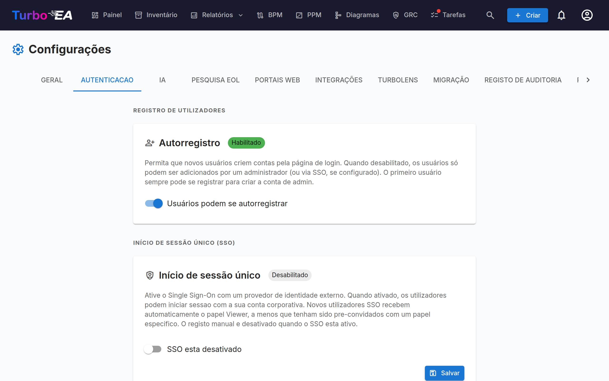

# Autenticação e SSO



A aba de **Autenticação** em Configurações permite que administradores configurem como os usuários fazem login na plataforma.

#### Auto-registro

- **Permitir auto-registro**: Quando habilitado, novos usuários podem criar contas clicando em "Cadastrar-se" na página de login. Quando desabilitado, apenas administradores podem criar contas pelo fluxo de Convidar Usuário.

#### Configuração de SSO (Single Sign-On)

SSO permite que usuários façam login usando seu provedor de identidade corporativo em vez de uma senha local. O Turbo EA suporta quatro provedores SSO:

| Provedor | Descrição |
|----------|-----------|
| **Microsoft Entra ID** | Para organizações que usam Microsoft 365 / Azure AD |
| **Google Workspace** | Para organizações que usam Google Workspace |
| **Okta** | Para organizações que usam Okta como plataforma de identidade |
| **OIDC Genérico** | Para qualquer provedor compatível com OpenID Connect (ex.: Authentik, Keycloak, Auth0) |

**Passos para configurar SSO:**

1. Vá para **Admin > Configurações > Autenticação**
2. Alterne **Habilitar SSO** para ligado
3. Selecione seu **Provedor SSO** no dropdown
4. Insira as credenciais necessárias do seu provedor de identidade:
   - **Client ID**: O ID de aplicação/cliente do seu provedor de identidade
   - **Client Secret**: O segredo da aplicação (armazenado criptografado no banco de dados)
   - Campos específicos do provedor:
     - **Microsoft**: Tenant ID (ex.: `your-tenant-id` ou `common` para multi-tenant)
     - **Google**: Hosted Domain (opcional, restringe o login a um domínio específico do Google Workspace)
     - **Okta**: Okta Domain (ex.: `your-org.okta.com`)
     - **OIDC Genérico**: Issuer URL (ex.: `https://auth.example.com/application/o/my-app/`). Para OIDC Genérico, o sistema tenta auto-descoberta via o endpoint `.well-known/openid-configuration`
5. Clique em **Salvar**

**Endpoints OIDC Manuais (Avançado):**

Se o backend não conseguir acessar o documento de descoberta do seu provedor de identidade (ex.: devido à rede Docker ou certificados autoassinados), você pode especificar manualmente os endpoints OIDC:

- **Authorization Endpoint**: A URL para onde os usuários são redirecionados para autenticar
- **Token Endpoint**: A URL usada para trocar o código de autorização por tokens
- **JWKS URI**: A URL para o JSON Web Key Set usado para verificar assinaturas de tokens

Esses campos são opcionais. Se deixados em branco, o sistema usa auto-descoberta. Quando preenchidos, eles sobrescrevem os valores auto-descobertos.

**Testando SSO:**

Após salvar, abra uma nova aba do navegador (ou janela anônima) e verifique se o botão de login SSO aparece na página de login e se a autenticação funciona de ponta a ponta.

**Notas importantes:**
- O **Client Secret** é armazenado criptografado no banco de dados e nunca exposto em respostas da API
- Quando SSO está habilitado, o login com senha local permanece disponível como alternativa
- Você pode configurar a URI de redirecionamento no seu provedor de identidade como: `https://your-turbo-ea-domain/auth/callback`

#### Autenticação por proxy reverso

Se o Turbo EA roda atrás de um proxy que já autentica seus usuários — a autenticação integrada do Azure App Service ("EasyAuth"), oauth2-proxy, Authelia, Cloudflare Access — ele pode aceitar essa identidade diretamente em vez de executar seu próprio SSO por cima. Sem cliente OIDC, sem registro de aplicação, sem client secret. Os usuários chegam ao Turbo EA já autenticados.

Este recurso é configurado inteiramente por variáveis de ambiente e está **desativado por padrão**.

**Antes de qualquer outra coisa, defina o administrador de bootstrap.** O auto-registro fica fechado enquanto a autenticação por proxy está ativa, então é assim que o primeiro administrador entra — esse e-mail recebe o papel de admin no primeiro login:

```
TURBO_EA_PROXY_AUTH_BOOTSTRAP_ADMIN_EMAIL=you@yourcompany.com
```

**Azure App Service (EasyAuth) — configuração recomendada.** O Turbo EA verifica o token de identidade assinado que o Azure encaminha com cada requisição (isso requer o token store do App Service, que vem ativado por padrão). `AUDIENCE` é o client ID do registro de aplicação do seu EasyAuth; substitua `TENANT` pelo ID do seu diretório (tenant):

```
TURBO_EA_PROXY_AUTH_ENABLED=true
TURBO_EA_PROXY_AUTH_TRUST_PLATFORM_HEADERS=true
TURBO_EA_PROXY_AUTH_VERIFY_ID_TOKEN=true
TURBO_EA_PROXY_AUTH_ISSUER=https://login.microsoftonline.com/TENANT/v2.0
TURBO_EA_PROXY_AUTH_AUDIENCE=your-easyauth-app-client-id
TURBO_EA_PROXY_AUTH_JWKS_URI=https://login.microsoftonline.com/TENANT/discovery/v2.0/keys
TURBO_EA_PROXY_AUTH_ALLOWED_DOMAINS=yourcompany.com
TURBO_EA_PROXY_AUTH_LOGOUT_URL=/.auth/logout
```

!!! warning "`TRUST_PLATFORM_HEADERS` é obrigatório no App Service"
    O App Service não consegue injetar um cabeçalho secreto próprio, por isso
    `TURBO_EA_PROXY_AUTH_TRUST_PLATFORM_HEADERS=true` ocupa o lugar de
    `TURBO_EA_PROXY_AUTH_SHARED_SECRET` — é um reconhecimento explícito de que
    você depende de o Azure remover os cabeçalhos de identidade de entrada antes
    que cheguem à sua aplicação. A verificação ocorre **antes** mesmo de o token
    de identidade ser analisado, portanto verificar o token não a substitui. Se
    faltarem tanto esta definição como um segredo partilhado, cada início de
    sessão falha com *Proxy authentication is enabled but not secured*, mesmo com
    `VERIFY_ID_TOKEN=true`.

Se o seu token store estiver desativado, defina adicionalmente `TURBO_EA_PROXY_AUTH_VERIFY_ID_TOKEN=false` e confie apenas na sanitização dos cabeçalhos. Sem um token verificado **novas contas não são criadas automaticamente** — convide os usuários primeiro, ou use o e-mail do administrador de bootstrap.

**Proxy genérico (oauth2-proxy, Authelia, Traefik forwardAuth, …).** Configure o proxy para injetar um cabeçalho com um segredo compartilhado em cada requisição, de modo que uma requisição que não passou pelo proxy nunca possa ser confundida com uma que passou. Gere o valor com `openssl rand -hex 32`:

```
TURBO_EA_PROXY_AUTH_ENABLED=true
TURBO_EA_PROXY_AUTH_MODE=header
TURBO_EA_PROXY_AUTH_SHARED_SECRET=<valor gerado, também definido no proxy>
TURBO_EA_PROXY_AUTH_EMAIL_HEADER=X-Forwarded-Email
TURBO_EA_PROXY_AUTH_ALLOWED_DOMAINS=yourcompany.com
TURBO_EA_PROXY_AUTH_LOGOUT_URL=/oauth2/sign_out
```

**Notas de segurança:**

- O segredo compartilhado (ou, no Azure, o token de identidade verificado) é o que torna a identidade confiável — um cabeçalho sozinho pode ser escrito por qualquer um. A lista de domínios permitidos é obrigatória; defina `TURBO_EA_PROXY_AUTH_ALLOW_ANY_DOMAIN=true` apenas se você realmente aceitar qualquer domínio de e-mail.
- Uma identidade que não foi verificada criptograficamente pode autenticar usuários existentes, mas nunca cria uma nova conta, e convites pendentes não conferem seu papel por esse caminho.
- `TURBO_EA_PROXY_AUTH_LOGOUT_URL` é para onde o Turbo EA envia o navegador após **Sair**, para que a sessão do proxy também seja encerrada. Sem ele, o proxy ainda considera o usuário autenticado — ele volta para a página de login e pode entrar de novo com um clique.

**Mapeamento de funções (opcional).** Por predefinição, todos aterram na função predefinida configurada e um administrador promove a partir daí. Se o seu fornecedor de identidade já sabe a resposta — um registo de aplicação Entra que declara as suas próprias funções de aplicação, um oauth2-proxy que reencaminha a pertença a grupos — o Turbo EA pode lê-la e atribuir a função por si:

```
TURBO_EA_PROXY_AUTH_ROLE_CLAIM=roles
TURBO_EA_PROXY_AUTH_ROLE_MAP=ADMIN:admin,MANAGER:member,READ-ONLY:viewer
```

Cada par escreve-se `VALOR_DIRETÓRIO:chave-de-função-turbo-ea`. Quando um utilizador detém várias funções de diretório, **ganha a primeira entrada do mapeamento** — a ordem do mapeamento, e não a ordem pela qual o fornecedor as enviou, porque os dois formatos de identidade do Azure não concordam nisso. A correspondência ignora maiúsculas e minúsculas do lado do diretório. No modo de proxy genérico, o mesmo mapeamento lê um cabeçalho separado por vírgulas em vez de uma reivindicação: `TURBO_EA_PROXY_AUTH_ROLE_HEADER=X-Forwarded-Groups`.

!!! warning "O mapeamento é autoritativo em cada início de sessão"
    Não apenas na criação da conta. Uma função concedida à mão em **Administração → Utilizadores** é revertida no próximo início de sessão dessa pessoa — que é justamente o objetivo, já que retirar a função de diretório de alguém tem de produzir efeito. Deixe `TURBO_EA_PROXY_AUTH_ROLE_MAP` por definir e nada muda: as funções continuam inteiramente manuais.

Os casos limite, todos escolhidos para que um erro de configuração não o possa deixar de fora:

- **`TURBO_EA_PROXY_AUTH_BOOTSTRAP_ADMIN_EMAIL` ganha sempre** ao mapeamento. Se os dois discordarem, esse endereço é administrador.
- **Um valor que não corresponde a nada no mapeamento** — ou que nomeia uma função Turbo EA inexistente ou arquivada — recai na função predefinida.
- **Uma reivindicação totalmente ausente** deixa intacta a função atual do utilizador. Isto é deliberadamente diferente do caso anterior: um `ROLE_CLAIM` mal escrito, ou um arquivo de tokens que deixa de reencaminhar, despromoveria de outro modo todos os utilizadores da instância de uma só vez.
- **A identidade tem de merecer que lhe sejam confiadas permissões.** O mapeamento de funções aplica-se quando o token de identidade foi verificado (`TURBO_EA_PROXY_AUTH_VERIFY_ID_TOKEN=true`) ou existe um segredo partilhado configurado. No App Service com o arquivo de tokens desativado e sem segredo, o mapeamento é ignorado e é escrita uma linha no registo a dizê-lo — o mesmo raciocínio que impede um cabeçalho não verificado de criar uma conta.

**Todas as variáveis:**

| Variável | Padrão | Finalidade |
|----------|---------|---------|
| `TURBO_EA_PROXY_AUTH_ENABLED` | `false` | Chave mestra |
| `TURBO_EA_PROXY_AUTH_MODE` | `azure_easyauth` | `azure_easyauth` ou `header` |
| `TURBO_EA_PROXY_AUTH_SHARED_SECRET` | — | Obrigatório no modo `header`; o proxy o injeta |
| `TURBO_EA_PROXY_AUTH_SECRET_HEADER` | `X-Turbo-EA-Proxy-Secret` | Cabeçalho que carrega o segredo compartilhado |
| `TURBO_EA_PROXY_AUTH_VERIFY_ID_TOKEN` | `false` | Verifica o token de identidade encaminhado (modo Azure) |
| `TURBO_EA_PROXY_AUTH_ISSUER` / `_AUDIENCE` / `_JWKS_URI` | — | Configurações de verificação do token |
| `TURBO_EA_PROXY_AUTH_TRUST_PLATFORM_HEADERS` | `false` | Somente Azure: confiar na sanitização de cabeçalhos da plataforma em vez de um segredo. Obrigatório no App Service |
| `TURBO_EA_PROXY_AUTH_EMAIL_HEADER` | `X-Forwarded-Email` | Modo `header`: cabeçalho do e-mail |
| `TURBO_EA_PROXY_AUTH_NAME_HEADER` | `X-Forwarded-User` | Modo `header`: cabeçalho do nome de exibição |
| `TURBO_EA_PROXY_AUTH_SUBJECT_HEADER` | `X-Forwarded-Subject` | Modo `header`: cabeçalho do identificador estável do sujeito |
| `TURBO_EA_PROXY_AUTH_ALLOWED_DOMAINS` | — | Domínios de e-mail permitidos, separados por vírgula (obrigatório) |
| `TURBO_EA_PROXY_AUTH_ALLOW_ANY_DOMAIN` | `false` | Aceita explicitamente qualquer domínio de e-mail |
| `TURBO_EA_PROXY_AUTH_BOOTSTRAP_ADMIN_EMAIL` | — | Recebe o papel de admin no primeiro login |
| `TURBO_EA_PROXY_AUTH_ROLE_MAP` | — | `VALOR_DIRETÓRIO:chave-de-função,…` — vazio significa que as funções continuam manuais |
| `TURBO_EA_PROXY_AUTH_ROLE_CLAIM` | `roles` | Reivindicação que transporta a função do diretório (modo Azure) |
| `TURBO_EA_PROXY_AUTH_ROLE_HEADER` | `X-Forwarded-Groups` | Modo `header`: cabeçalho de funções separadas por vírgulas |
| `TURBO_EA_PROXY_AUTH_LOGOUT_URL` | — | Para onde Sair envia o navegador |

**Limitações:** o fluxo OAuth do servidor MCP requer que o SSO regular esteja configurado; a autenticação por proxy sozinha não o cobre.
