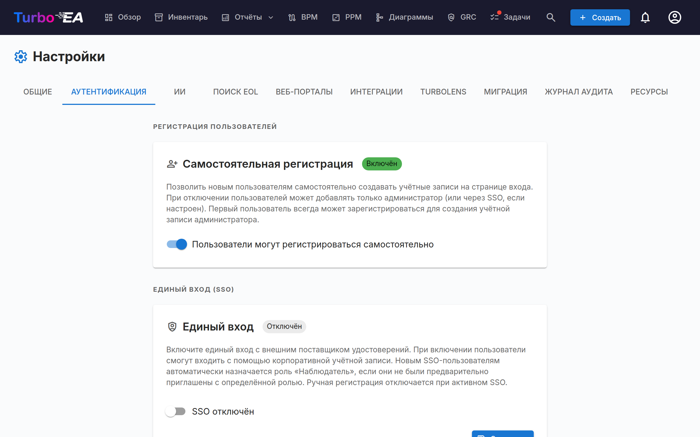

# Аутентификация и SSO



Вкладка **Аутентификация** в настройках позволяет администраторам настроить способ входа пользователей на платформу.

#### Самостоятельная регистрация

- **Разрешить самостоятельную регистрацию**: Когда включено, новые пользователи могут создавать учётные записи, нажав «Зарегистрироваться» на странице входа. Когда отключено, только администраторы могут создавать учётные записи через процесс приглашения.

#### Настройка SSO (Единый вход)

SSO позволяет пользователям входить в систему, используя корпоративную учётную запись вместо локального пароля. Turbo EA поддерживает четырёх провайдеров SSO:

| Провайдер | Описание |
|-----------|----------|
| **Microsoft Entra ID** | Для организаций, использующих Microsoft 365 / Azure AD |
| **Google Workspace** | Для организаций, использующих Google Workspace |
| **Okta** | Для организаций, использующих Okta в качестве платформы идентификации |
| **Универсальный OIDC** | Для любого провайдера, совместимого с OpenID Connect (например, Authentik, Keycloak, Auth0) |

**Шаги по настройке SSO:**

1. Перейдите в **Администрирование > Настройки > Аутентификация**
2. Переключите **Включить SSO** в положение «вкл»
3. Выберите вашего **провайдера SSO** из выпадающего списка
4. Введите необходимые учётные данные от вашего провайдера идентификации:
   - **Идентификатор клиента (Client ID)**: Идентификатор приложения/клиента от вашего провайдера идентификации
   - **Секрет клиента (Client Secret)**: Секрет приложения (хранится в зашифрованном виде в базе данных)
   - Поля, зависящие от провайдера:
     - **Microsoft**: Идентификатор арендатора (Tenant ID) (например, `your-tenant-id` или `common` для мультитенантной конфигурации)
     - **Google**: Размещённый домен (Hosted Domain) (необязательно, ограничивает вход определённым доменом Google Workspace)
     - **Okta**: Домен Okta (например, `your-org.okta.com`)
     - **Универсальный OIDC**: URL издателя (Issuer URL) (например, `https://auth.example.com/application/o/my-app/`). Для универсального OIDC система выполняет автоматическое обнаружение через эндпоинт `.well-known/openid-configuration`
5. Нажмите **Сохранить**

**Ручная настройка эндпоинтов OIDC (продвинутая):**

Если бэкенд не может получить доступ к документу обнаружения вашего провайдера идентификации (например, из-за сетевых ограничений Docker или самоподписанных сертификатов), вы можете вручную указать эндпоинты OIDC:

- **Эндпоинт авторизации**: URL, на который перенаправляются пользователи для аутентификации
- **Эндпоинт токена**: URL для обмена кода авторизации на токены
- **URI JWKS**: URL набора веб-ключей JSON, используемого для проверки подписей токенов

Эти поля необязательны. Если оставить пустыми, система использует автоматическое обнаружение. При заполнении они переопределяют автоматически обнаруженные значения.

**Тестирование SSO:**

После сохранения откройте новую вкладку браузера (или окно в режиме инкогнито) и убедитесь, что кнопка входа через SSO появляется на странице входа и аутентификация работает от начала до конца.

**Важные замечания:**
- **Секрет клиента** хранится в зашифрованном виде в базе данных и никогда не показывается в ответах API
- Когда SSO включён, локальный вход по паролю остаётся доступным как резервный вариант
- Вы можете настроить URI перенаправления в вашем провайдере идентификации как: `https://your-turbo-ea-domain/auth/callback`

#### Аутентификация через обратный прокси

Если Turbo EA работает за прокси, который уже выполняет вход ваших пользователей — встроенная аутентификация Azure App Service («EasyAuth»), oauth2-proxy, Authelia, Cloudflare Access — платформа может принимать эту идентичность напрямую, вместо того чтобы запускать поверх неё собственный SSO. Не нужен ни OIDC-клиент, ни регистрация приложения, ни секрет клиента. Пользователи попадают в Turbo EA уже вошедшими в систему.

Эта функция настраивается исключительно через переменные окружения и **по умолчанию выключена**.

**Прежде всего задайте bootstrap-администратора.** Пока включена аутентификация через прокси, самостоятельная регистрация закрыта, поэтому именно так первый администратор получает доступ — этому адресу электронной почты при первом входе присваивается роль администратора:

```
TURBO_EA_PROXY_AUTH_BOOTSTRAP_ADMIN_EMAIL=you@yourcompany.com
```

**Azure App Service (EasyAuth) — рекомендуемая настройка.** Turbo EA проверяет подписанный токен идентификации, который Azure пересылает с каждым запросом (для этого требуется хранилище токенов App Service, включённое по умолчанию). `AUDIENCE` — это идентификатор клиента вашей регистрации приложения EasyAuth; замените `TENANT` на идентификатор вашего каталога (арендатора):

```
TURBO_EA_PROXY_AUTH_ENABLED=true
TURBO_EA_PROXY_AUTH_TRUST_PLATFORM_HEADERS=true
TURBO_EA_PROXY_AUTH_VERIFY_ID_TOKEN=true
TURBO_EA_PROXY_AUTH_ISSUER=https://login.microsoftonline.com/TENANT/v2.0
TURBO_EA_PROXY_AUTH_AUDIENCE=your-easyauth-app-client-id
TURBO_EA_PROXY_AUTH_JWKS_URI=https://login.microsoftonline.com/TENANT/discovery/v2.0/keys
TURBO_EA_PROXY_AUTH_ALLOWED_DOMAINS=yourcompany.com
TURBO_EA_PROXY_AUTH_LOGOUT_URL=/.auth/logout
```

!!! warning "`TRUST_PLATFORM_HEADERS` обязателен на App Service"
    App Service не может внедрить собственный секретный заголовок, поэтому
    `TURBO_EA_PROXY_AUTH_TRUST_PLATFORM_HEADERS=true` занимает место
    `TURBO_EA_PROXY_AUTH_SHARED_SECRET` — это явное подтверждение того, что вы
    полагаетесь на удаление Azure входящих заголовков идентификации до того, как
    они достигнут вашего приложения. Проверка выполняется **до** разбора токена
    идентификации, поэтому проверка токена её не заменяет. Если отсутствуют и эта
    настройка, и общий секрет, каждый вход завершается ошибкой *Proxy
    authentication is enabled but not secured* — даже при
    `VERIFY_ID_TOKEN=true`.

Если ваше хранилище токенов отключено, дополнительно задайте `TURBO_EA_PROXY_AUTH_VERIFY_ID_TOKEN=false` и положитесь только на очистку заголовков. Без проверенного токена **новые учётные записи не создаются автоматически** — сначала пригласите пользователей или используйте адрес bootstrap-администратора.

**Универсальный прокси (oauth2-proxy, Authelia, Traefik forwardAuth, …).** Настройте прокси так, чтобы он добавлял заголовок с общим секретом к каждому запросу — тогда запрос, не прошедший через прокси, никогда не будет принят за прошедший. Сгенерируйте значение командой `openssl rand -hex 32`:

```
TURBO_EA_PROXY_AUTH_ENABLED=true
TURBO_EA_PROXY_AUTH_MODE=header
TURBO_EA_PROXY_AUTH_SHARED_SECRET=<сгенерированное значение, также задайте его на прокси>
TURBO_EA_PROXY_AUTH_EMAIL_HEADER=X-Forwarded-Email
TURBO_EA_PROXY_AUTH_ALLOWED_DOMAINS=yourcompany.com
TURBO_EA_PROXY_AUTH_LOGOUT_URL=/oauth2/sign_out
```

**Замечания по безопасности:**

- Именно общий секрет (или, в случае Azure, проверенный токен идентификации) делает идентичность заслуживающей доверия — заголовок сам по себе может записать кто угодно. Список разрешённых доменов обязателен; задавайте `TURBO_EA_PROXY_AUTH_ALLOW_ANY_DOMAIN=true` только если вы действительно готовы принимать любой домен электронной почты.
- Идентичность, не прошедшая криптографическую проверку, может выполнять вход существующих пользователей, но никогда не создаёт новую учётную запись, а ожидающие приглашения на этом пути не передают назначенную им роль.
- `TURBO_EA_PROXY_AUTH_LOGOUT_URL` — это адрес, куда Turbo EA отправляет браузер после нажатия **Выйти**, чтобы сессия прокси тоже завершилась. Без него прокси по-прежнему считает пользователя вошедшим — тот возвращается на страницу входа и может снова войти одним кликом.

**Сопоставление ролей (необязательно).** По умолчанию все попадают на настроенную роль по умолчанию, а администратор повышает их оттуда. Если ваш поставщик удостоверений уже знает ответ — регистрация приложения Entra, объявляющая собственные роли приложения, или oauth2-proxy, передающий членство в группах, — Turbo EA может прочитать его и назначить роль самостоятельно:

```
TURBO_EA_PROXY_AUTH_ROLE_CLAIM=roles
TURBO_EA_PROXY_AUTH_ROLE_MAP=ADMIN:admin,MANAGER:member,READ-ONLY:viewer
```

Каждая пара записывается как `ЗНАЧЕНИЕ_КАТАЛОГА:ключ-роли-turbo-ea`. Если у пользователя несколько ролей каталога, **побеждает первая запись сопоставления** — порядок сопоставления, а не тот порядок, в котором их прислал поставщик, поскольку два формата удостоверений Azure в этом расходятся. Регистр на стороне каталога при сопоставлении не учитывается. В режиме универсального прокси то же сопоставление читает заголовок со значениями через запятую вместо утверждения: `TURBO_EA_PROXY_AUTH_ROLE_HEADER=X-Forwarded-Groups`.

!!! warning "Сопоставление имеет силу при каждом входе"
    Не только при создании учётной записи. Роль, выданная вручную в разделе **Администрирование → Пользователи**, будет отменена при следующем входе этого человека — в этом и смысл, ведь снятие роли в каталоге должно вступать в силу. Оставьте `TURBO_EA_PROXY_AUTH_ROLE_MAP` незаданной, и ничего не изменится: роли останутся полностью ручными.

Пограничные случаи — все выбраны так, чтобы ошибка конфигурации не заблокировала вам доступ:

- **`TURBO_EA_PROXY_AUTH_BOOTSTRAP_ADMIN_EMAIL` всегда побеждает** сопоставление. Если они расходятся, этот адрес — администратор.
- **Значение, не совпадающее ни с чем в сопоставлении** — или указывающее на несуществующую либо архивированную роль Turbo EA — откатывается к роли по умолчанию.
- **Полностью отсутствующее утверждение** оставляет текущую роль пользователя нетронутой. Это намеренно отличается от случая выше: опечатка в `ROLE_CLAIM` или хранилище токенов, переставшее их передавать, иначе понизили бы всех пользователей экземпляра за один проход.
- **Удостоверению нужно доверять не только имя, но и права.** Сопоставление ролей применяется, когда токен удостоверения был проверен (`TURBO_EA_PROXY_AUTH_VERIFY_ID_TOKEN=true`) или настроен общий секрет. На App Service с отключённым хранилищем токенов и без секрета сопоставление игнорируется, о чём пишется строка в журнал, — то же рассуждение, которое не даёт непроверенному заголовку создать учётную запись.

**Все переменные:**

| Переменная | По умолчанию | Назначение |
|----------|---------|---------|
| `TURBO_EA_PROXY_AUTH_ENABLED` | `false` | Главный переключатель |
| `TURBO_EA_PROXY_AUTH_MODE` | `azure_easyauth` | `azure_easyauth` или `header` |
| `TURBO_EA_PROXY_AUTH_SHARED_SECRET` | — | Обязательна в режиме `header`; заголовок добавляет прокси |
| `TURBO_EA_PROXY_AUTH_SECRET_HEADER` | `X-Turbo-EA-Proxy-Secret` | Заголовок, несущий общий секрет |
| `TURBO_EA_PROXY_AUTH_VERIFY_ID_TOKEN` | `false` | Проверять пересылаемый токен идентификации (режим Azure) |
| `TURBO_EA_PROXY_AUTH_ISSUER` / `_AUDIENCE` / `_JWKS_URI` | — | Параметры проверки токена |
| `TURBO_EA_PROXY_AUTH_TRUST_PLATFORM_HEADERS` | `false` | Только для Azure: полагаться на очистку заголовков платформой вместо секрета. Обязателен на App Service |
| `TURBO_EA_PROXY_AUTH_EMAIL_HEADER` | `X-Forwarded-Email` | Режим `header`: заголовок с адресом электронной почты |
| `TURBO_EA_PROXY_AUTH_NAME_HEADER` | `X-Forwarded-User` | Режим `header`: заголовок с отображаемым именем |
| `TURBO_EA_PROXY_AUTH_SUBJECT_HEADER` | `X-Forwarded-Subject` | Режим `header`: заголовок со стабильным идентификатором субъекта |
| `TURBO_EA_PROXY_AUTH_ALLOWED_DOMAINS` | — | Разрешённые домены электронной почты через запятую (обязательно) |
| `TURBO_EA_PROXY_AUTH_ALLOW_ANY_DOMAIN` | `false` | Явно принимать любой домен электронной почты |
| `TURBO_EA_PROXY_AUTH_BOOTSTRAP_ADMIN_EMAIL` | — | Получает роль администратора при первом входе |
| `TURBO_EA_PROXY_AUTH_ROLE_MAP` | — | `ЗНАЧЕНИЕ_КАТАЛОГА:ключ-роли,…` — пусто означает, что роли остаются ручными |
| `TURBO_EA_PROXY_AUTH_ROLE_CLAIM` | `roles` | Утверждение с ролью каталога (режим Azure) |
| `TURBO_EA_PROXY_AUTH_ROLE_HEADER` | `X-Forwarded-Groups` | Режим `header`: заголовок с ролями через запятую |
| `TURBO_EA_PROXY_AUTH_LOGOUT_URL` | — | Куда «Выйти» отправляет браузер |

**Ограничения:** OAuth-поток сервера MCP требует настроенного обычного SSO; одной лишь аутентификации через прокси для него недостаточно.
