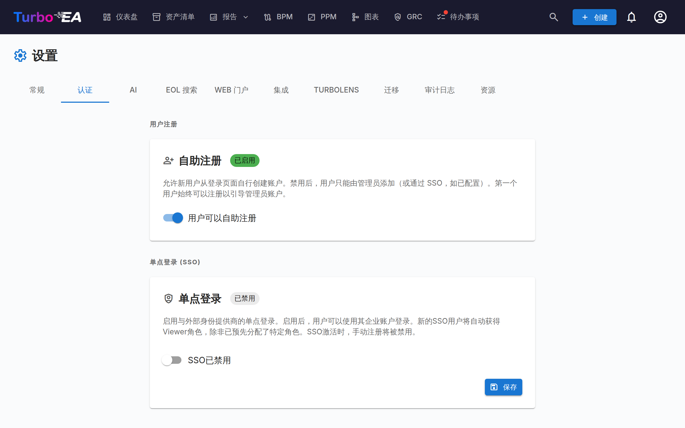

# 身份验证与 SSO



设置中的**身份验证**标签页允许管理员配置用户登录平台的方式。

#### 自助注册

- **允许自助注册**：启用后，新用户可以通过点击登录页面上的「注册」创建账户。禁用后，只有管理员可以通过邀请用户流程创建账户。

#### SSO（单点登录）配置

SSO 允许用户使用企业身份提供商登录，而不是本地密码。Turbo EA 支持四种 SSO 提供商：

| 提供商 | 描述 |
|--------|------|
| **Microsoft Entra ID** | 适用于使用 Microsoft 365 / Azure AD 的组织 |
| **Google Workspace** | 适用于使用 Google Workspace 的组织 |
| **Okta** | 适用于使用 Okta 作为身份平台的组织 |
| **通用 OIDC** | 适用于任何兼容 OpenID Connect 的提供商（例如 Authentik、Keycloak、Auth0） |

**配置 SSO 的步骤：**

1. 前往**管理 > 设置 > 身份验证**
2. 将**启用 SSO**切换为开启
3. 从下拉菜单中选择您的 **SSO 提供商**
4. 输入身份提供商提供的所需凭据：
   - **客户端 ID**：来自身份提供商的应用程序/客户端 ID
   - **客户端密钥**：应用程序密钥（在数据库中加密存储）
   - 特定于提供商的字段：
     - **Microsoft**：租户 ID（例如 `your-tenant-id` 或 `common` 用于多租户）
     - **Google**：托管域名（可选，限制登录到特定 Google Workspace 域名）
     - **Okta**：Okta 域名（例如 `your-org.okta.com`）
     - **通用 OIDC**：发行者 URL（例如 `https://auth.example.com/application/o/my-app/`）。对于通用 OIDC，系统会尝试通过 `.well-known/openid-configuration` 端点进行自动发现
5. 点击**保存**

**手动 OIDC 端点（高级）：**

如果后端无法访问身份提供商的发现文档（例如由于 Docker 网络或自签名证书），您可以手动指定 OIDC 端点：

- **授权端点**：用户被重定向进行身份验证的 URL
- **令牌端点**：用于交换授权码获取令牌的 URL
- **JWKS URI**：用于验证令牌签名的 JSON Web Key Set URL

这些字段是可选的。如果留空，系统使用自动发现。填写后，它们将覆盖自动发现的值。

**测试 SSO：**

保存后，打开新的浏览器标签页（或无痕窗口），验证 SSO 登录按钮是否出现在登录页面上，以及身份验证是否端到端正常工作。

**重要注意事项：**
- **客户端密钥**在数据库中加密存储，永远不会在 API 响应中暴露
- 启用 SSO 后，本地密码登录仍然可用作备用方案
- 您可以在身份提供商中将重定向 URI 配置为：`https://your-turbo-ea-domain/auth/callback`

#### 反向代理身份验证

如果 Turbo EA 运行在一个已经为用户完成登录的代理之后——Azure App Service 的内置身份验证（「EasyAuth」）、oauth2-proxy、Authelia、Cloudflare Access——它可以直接接受该身份，而无需在其之上再运行自己的 SSO。无需 OIDC 客户端、无需应用注册、无需客户端密钥。用户进入 Turbo EA 时即已处于登录状态。

此功能完全通过环境变量配置，且**默认关闭**。

**首先，请设置引导管理员。** 启用代理身份验证后自助注册将被关闭，因此这是第一位管理员进入系统的方式——该邮箱在首次登录时会被授予管理员角色：

```
TURBO_EA_PROXY_AUTH_BOOTSTRAP_ADMIN_EMAIL=you@yourcompany.com
```

**Azure App Service（EasyAuth）——推荐配置。** Turbo EA 会验证 Azure 随每个请求转发的已签名身份令牌（这需要 App Service 令牌存储，默认开启）。`AUDIENCE` 是您的 EasyAuth 应用注册的客户端 ID；请将 `TENANT` 替换为您的目录（租户）ID：

```
TURBO_EA_PROXY_AUTH_ENABLED=true
TURBO_EA_PROXY_AUTH_TRUST_PLATFORM_HEADERS=true
TURBO_EA_PROXY_AUTH_VERIFY_ID_TOKEN=true
TURBO_EA_PROXY_AUTH_ISSUER=https://login.microsoftonline.com/TENANT/v2.0
TURBO_EA_PROXY_AUTH_AUDIENCE=your-easyauth-app-client-id
TURBO_EA_PROXY_AUTH_JWKS_URI=https://login.microsoftonline.com/TENANT/discovery/v2.0/keys
TURBO_EA_PROXY_AUTH_ALLOWED_DOMAINS=yourcompany.com
TURBO_EA_PROXY_AUTH_LOGOUT_URL=/.auth/logout
```

!!! warning "在 App Service 上必须设置 `TRUST_PLATFORM_HEADERS`"
    App Service 无法注入自定义的密钥标头，因此
    `TURBO_EA_PROXY_AUTH_TRUST_PLATFORM_HEADERS=true` 取代了
    `TURBO_EA_PROXY_AUTH_SHARED_SECRET` 的位置——它是一种明确确认，表示您依赖
    Azure 在入站请求到达您的应用之前剥离身份标头。该检查发生在解析身份令牌
    **之前**，因此验证令牌并不能取代它。若这项设置与共享密钥都未提供，则每次登录
    都会以 *Proxy authentication is enabled but not secured* 失败，即便
    `VERIFY_ID_TOKEN=true` 也是如此。

如果您的令牌存储已禁用，请另外设置 `TURBO_EA_PROXY_AUTH_VERIFY_ID_TOKEN=false`，仅依赖标头清理机制。在没有已验证令牌的情况下**不会自动创建新账户**——请先邀请用户，或使用引导管理员邮箱。

**通用代理（oauth2-proxy、Authelia、Traefik forwardAuth 等）。** 请将代理配置为在每个请求上注入一个共享密钥标头，这样未经过代理的请求就永远不会被误认为是经过代理的请求。使用 `openssl rand -hex 32` 生成该值：

```
TURBO_EA_PROXY_AUTH_ENABLED=true
TURBO_EA_PROXY_AUTH_MODE=header
TURBO_EA_PROXY_AUTH_SHARED_SECRET=<生成的值，同时也要在代理上设置>
TURBO_EA_PROXY_AUTH_EMAIL_HEADER=X-Forwarded-Email
TURBO_EA_PROXY_AUTH_ALLOWED_DOMAINS=yourcompany.com
TURBO_EA_PROXY_AUTH_LOGOUT_URL=/oauth2/sign_out
```

**安全注意事项：**

- 共享密钥（在 Azure 上则是已验证的身份令牌）是身份可信的根本——单独的标头任何人都可以写入。域名允许列表是必需的；只有当您确实接受任何邮箱域名时，才设置 `TURBO_EA_PROXY_AUTH_ALLOW_ANY_DOMAIN=true`。
- 未经加密学验证的身份可以让现有用户登录，但永远不会创建新账户，且待处理的邀请在此路径上不会授予其预设角色。
- `TURBO_EA_PROXY_AUTH_LOGOUT_URL` 是用户点击**退出登录**后 Turbo EA 将浏览器重定向到的地址，以便同时结束代理会话。如果不设置，代理仍会认为用户处于登录状态——用户会回到登录页面，并且只需一次点击即可重新进入。

**全部变量：**

| 变量 | 默认值 | 用途 |
|----------|---------|---------|
| `TURBO_EA_PROXY_AUTH_ENABLED` | `false` | 总开关 |
| `TURBO_EA_PROXY_AUTH_MODE` | `azure_easyauth` | `azure_easyauth` 或 `header` |
| `TURBO_EA_PROXY_AUTH_SHARED_SECRET` | — | `header` 模式下必需；由代理注入 |
| `TURBO_EA_PROXY_AUTH_SECRET_HEADER` | `X-Turbo-EA-Proxy-Secret` | 携带共享密钥的标头 |
| `TURBO_EA_PROXY_AUTH_VERIFY_ID_TOKEN` | `false` | 验证转发的身份令牌（Azure 模式） |
| `TURBO_EA_PROXY_AUTH_ISSUER` / `_AUDIENCE` / `_JWKS_URI` | — | 令牌验证设置 |
| `TURBO_EA_PROXY_AUTH_TRUST_PLATFORM_HEADERS` | `false` | 仅限 Azure：信任平台对标头的清理机制，而非共享密钥，在 App Service 上为必填 |
| `TURBO_EA_PROXY_AUTH_EMAIL_HEADER` | `X-Forwarded-Email` | `header` 模式：邮箱标头 |
| `TURBO_EA_PROXY_AUTH_NAME_HEADER` | `X-Forwarded-User` | `header` 模式：显示名称标头 |
| `TURBO_EA_PROXY_AUTH_SUBJECT_HEADER` | `X-Forwarded-Subject` | `header` 模式：稳定主体 ID 标头 |
| `TURBO_EA_PROXY_AUTH_ALLOWED_DOMAINS` | — | 逗号分隔的允许邮箱域名列表（必需） |
| `TURBO_EA_PROXY_AUTH_ALLOW_ANY_DOMAIN` | `false` | 明确接受任何邮箱域名 |
| `TURBO_EA_PROXY_AUTH_BOOTSTRAP_ADMIN_EMAIL` | — | 首次登录时被授予管理员角色 |
| `TURBO_EA_PROXY_AUTH_LOGOUT_URL` | — | 退出登录后浏览器跳转的地址 |

**限制：** MCP 服务器的 OAuth 流程需要配置常规 SSO；仅有代理身份验证无法覆盖该场景。
