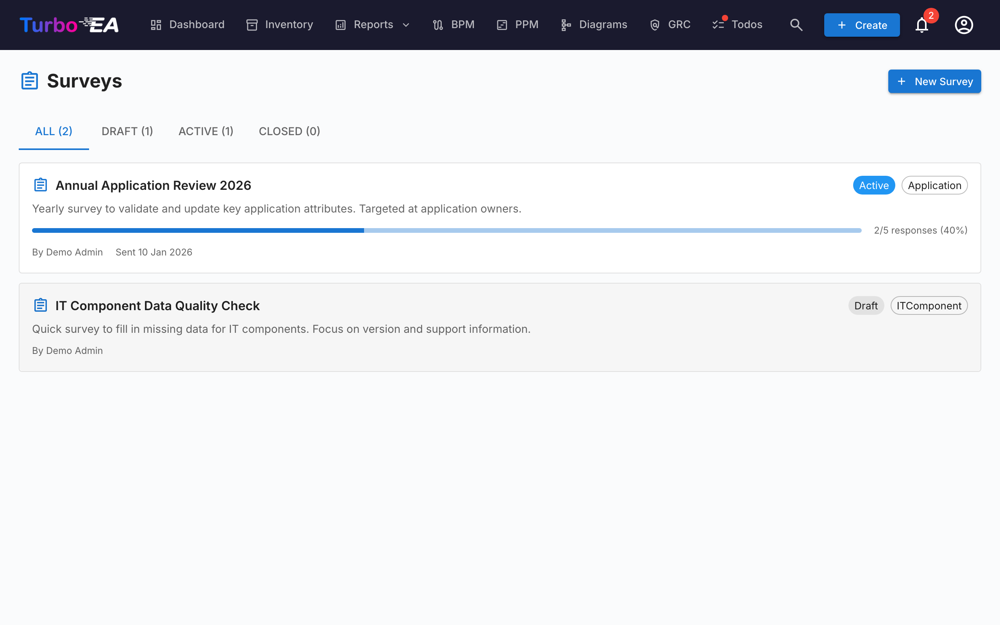

# Undersøgelser

Modulet **Undersøgelser** (**Admin > Undersøgelser**) gør det muligt for administratorer at oprette **datavedligeholdelses-undersøgelser**, der indsamler strukturerede oplysninger fra interessenter om specifikke kort.

## Anvendelsesscenarie

Undersøgelser hjælper med at holde dine arkitekturdata aktuelle ved at række ud til de mennesker, der er tættest på hver komponent. For eksempel:

- Bed applikationsejere om at bekræfte forretningskritikalitet og livscyklusdatoer årligt
- Indsaml tekniske egnethedsvurderinger fra IT-teams
- Saml omkostningsopdateringer fra budgetejere

## Undersøgelses-livscyklus

Hver undersøgelse skrider frem gennem tre tilstande:

| Status | Betydning |
|--------|---------|
| **Udkast** | Bliver designet, endnu ikke synlig for respondenter |
| **Aktiv** | Åben for svar, tildelte interessenter ser den i deres Todos |
| **Lukket** | Accepterer ikke længere svar |

## Oprettelse af en undersøgelse

1. Naviger til **Admin > Undersøgelser**
2. Klik på **+ Ny undersøgelse**
3. **Undersøgelsesbyggeren** åbner med følgende konfiguration:

### Måltype

Vælg, hvilken korttype undersøgelsen gælder for (f.eks. Application, IT Component). Undersøgelsen vil blive sendt for hvert kort af denne type, der matcher dine filtre.

### Filtre

Indsnæver eventuelt omfanget ved at filtrere kort. Tre filtertyper er tilgængelige og kan kombineres:

- **Specifikke kort** — Vælg et eller flere kort direkte (filtreret til den valgte måltype). Brug dette til at målrette et enkelt kort eller en håndplukket delmængde.
- **Kort relateret til** — Inkluder kun kort, der har en relation til et af de listede elementer (f.eks. alle Applications relateret til Sales-organisationen).
- **Tags** og **Egenskabsfiltre** — Match kort efter tag eller efter egenskabsbetingelser (f.eks. omkostninger større end 10.000, TIME-vurdering mangler).

### Spørgsmål

Design dine spørgsmål. Hvert spørgsmål kan være:

- **Fri tekst** — Åbent svar
- **Single select** — Vælg én mulighed fra en liste
- **Multiple select** — Vælg flere muligheder
- **Tal** — Numerisk input
- **Dato** — Datovælger
- **Boolean** — Ja/nej-omskifter

### Relationer

Ud over attributter kan en undersøgelse også bede respondenter om at holde et korts **relationer** opdaterede. I trinnet **Felter** viser afsnittet **Relationer** alle de relationer, måltypen for kortet kan have, i begge retninger (for eksempel for en Applikation: *understøtter → IT-komponent* og *bruges af ← Organisation*). For hver enkelt, du vælger, skal du vælge en handling:

- **Vedligehold** — Respondenten ser de aktuelt tilknyttede kort og kan tilføje eller fjerne tilknytninger via en søgevælger.
- **Bekræft** — Respondenten bekræfter blot, at de aktuelle tilknytninger er korrekte, eller slår kontakten fra for at foreslå ændringer.

Når du anvender et sådant svar, tilføjer Turbo EA de nye tilknytninger og fjerner dem, respondenten har fjernet. Ændringen registreres i kortets historik, ligesom en manuel relationsændring.

### Auto-handlinger

Konfigurer regler, der automatisk opdaterer kortegenskaber baseret på undersøgelsessvar. For eksempel, hvis en respondent vælger "Mission Critical" for forretningskritikalitet, kan kortets `businessCriticality`-felt opdateres automatisk.

## Afsendelse af en undersøgelse

Når din undersøgelse er i **Aktiv**-status:

1. Klik på **Send** for at distribuere undersøgelsen
2. Hvert målrettet kort genererer en todo for de tildelte interessenter
3. Interessenter ser undersøgelsen i deres **Mine undersøgelser**-faneblad på [Opgaver-siden](../guide/tasks.md)

## Visning af resultater

Naviger til **Admin > Undersøgelser > [Undersøgelsesnavn] > Resultater** for at se:

- Svarstatus pr. kort (besvaret, afventer)
- Individuelle svar med svar pr. spørgsmål
- En **Anvend**-handling til at committe auto-handlingsregler til kortegenskaber
