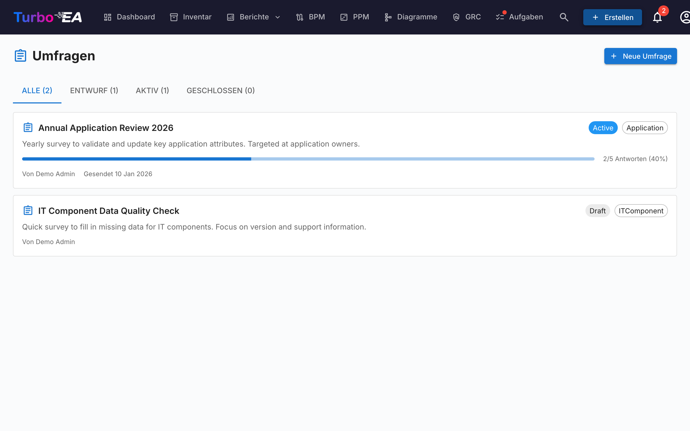

# Umfragen

Das **Umfragen**-Modul (**Admin > Umfragen**) ermöglicht Administratoren die Erstellung von **Datenpflege-Umfragen**, die strukturierte Informationen von Stakeholdern über bestimmte Karten sammeln.

## Anwendungsfall

Umfragen helfen dabei, Ihre Architekturdaten aktuell zu halten, indem Sie die Personen erreichen, die den einzelnen Komponenten am nächsten stehen. Zum Beispiel:

- Anwendungseigner jährlich bitten, Geschäftskritikalität und Lebenszyklus-Daten zu bestätigen
- Technische Eignungsbewertungen von IT-Teams einholen
- Kostenaktualisierungen von Budgetverantwortlichen sammeln

## Umfrage-Lebenszyklus

Jede Umfrage durchläuft drei Status:

| Status | Bedeutung |
|--------|-----------|
| **Entwurf** | Wird gestaltet, noch nicht für Befragte sichtbar |
| **Aktiv** | Offen für Antworten, zugewiesene Stakeholder sehen sie in ihren Aufgaben |
| **Geschlossen** | Nimmt keine Antworten mehr entgegen |

## Eine Umfrage erstellen

1. Navigieren Sie zu **Admin > Umfragen**
2. Klicken Sie auf **+ Neue Umfrage**
3. Der **Umfrage-Builder** öffnet sich mit folgender Konfiguration:

### Zieltyp

Wählen Sie aus, auf welchen Kartentyp sich die Umfrage bezieht (z.B. Anwendung, IT-Komponente). Die Umfrage wird für jede Karte dieses Typs gesendet, die Ihren Filtern entspricht.

### Filter

Schränken Sie den Umfang optional über Filter ein. Drei Filtertypen lassen sich beliebig kombinieren:

- **Bestimmte Karten** — Wählen Sie eine oder mehrere Karten direkt aus (eingeschränkt auf den gewählten Zieltyp). Geeignet, um eine einzelne oder eine handverlesene Auswahl von Karten anzusprechen.
- **Mit Karten verknüpft** — Nur Karten einbeziehen, die eine Beziehung zu einem der aufgeführten Elemente haben (z. B. alle Anwendungen, die mit der Organisation Vertrieb verknüpft sind).
- **Tags** und **Attributfilter** — Karten anhand von Tags oder Attributbedingungen treffen (z. B. Kosten größer als 10 000, TIME-Bewertung fehlt).

### Fragen

Gestalten Sie Ihre Fragen. Jede Frage kann sein:

- **Freitext** — Offene Antwort
- **Einfachauswahl** — Eine Option aus einer Liste wählen
- **Mehrfachauswahl** — Mehrere Optionen wählen
- **Zahl** — Numerische Eingabe
- **Datum** — Datumsauswahl
- **Boolean** — Ja/Nein-Umschalter

### Beziehungen

Über Attribute hinaus kann eine Umfrage die Befragten auch bitten, die **Beziehungen** einer Karte aktuell zu halten. Im Schritt **Felder** listet der Abschnitt **Beziehungen** jede Beziehung auf, die der Ziel-Kartentyp haben kann, in beiden Richtungen (zum Beispiel für eine Anwendung: *unterstützt → IT-Komponente* und *genutzt von ← Organisation*). Für jede ausgewählte Beziehung wählen Sie eine Aktion:

- **Pflegen** — Der Befragte sieht die aktuell verknüpften Karten und kann über eine Suchauswahl Verknüpfungen hinzufügen oder entfernen.
- **Bestätigen** — Der Befragte bestätigt lediglich, dass die aktuellen Verknüpfungen korrekt sind, oder schaltet den Schalter aus, um Änderungen vorzuschlagen.

Wenn Sie eine solche Antwort anwenden, fügt Turbo EA die neuen Verknüpfungen hinzu und entfernt die vom Befragten entfernten. Die Änderung wird im Verlauf der Karte festgehalten, genau wie eine manuelle Beziehungsänderung.

### Auto-Aktionen

Konfigurieren Sie Regeln, die Kartenattribute basierend auf Umfrageantworten automatisch aktualisieren. Zum Beispiel: Wenn ein Befragter «Mission Critical» für die Geschäftskritikalität auswählt, kann das `businessCriticality`-Feld der Karte automatisch aktualisiert werden.

## Eine Umfrage versenden

Sobald Ihre Umfrage im Status **Aktiv** ist:

1. Klicken Sie auf **Senden**, um die Umfrage zu verteilen
2. Für jede Zielkarte wird eine Aufgabe für die zugewiesenen Stakeholder generiert
3. Stakeholder sehen die Umfrage in ihrem Tab **Meine Umfragen** auf der [Aufgabenseite](../guide/tasks.md)

## Ergebnisse anzeigen

Navigieren Sie zu **Admin > Umfragen > [Umfragename] > Ergebnisse**, um zu sehen:

- Antwortstatus pro Karte (beantwortet, ausstehend)
- Einzelne Antworten mit Antworten pro Frage
- Eine **Anwenden**-Aktion, um Auto-Aktionsregeln auf Kartenattribute anzuwenden
