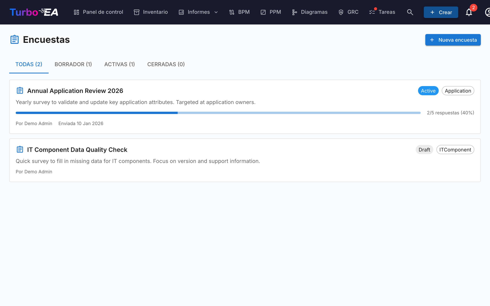

# Encuestas

El módulo de **Encuestas** (**Administrador > Encuestas**) permite a los administradores crear **encuestas de mantenimiento de datos** que recopilan información estructurada de las partes interesadas sobre fichas específicas.

## Caso de Uso

Las encuestas ayudan a mantener actualizados los datos de arquitectura contactando a las personas más cercanas a cada componente. Por ejemplo:

- Solicitar a los responsables de aplicaciones que confirmen la criticidad de negocio y las fechas de ciclo de vida anualmente
- Recopilar evaluaciones de idoneidad técnica de los equipos de TI
- Obtener actualizaciones de costos de los responsables de presupuesto

## Ciclo de Vida de la Encuesta

Cada encuesta progresa a través de tres estados:

| Estado | Significado |
|--------|-------------|
| **Borrador** | En diseño, aún no visible para los encuestados |
| **Activa** | Abierta para respuestas, las partes interesadas asignadas la ven en sus Tareas |
| **Cerrada** | Ya no acepta respuestas |

## Creación de una Encuesta

1. Navegue a **Administrador > Encuestas**
2. Haga clic en **+ Nueva Encuesta**
3. Se abre el **Constructor de Encuestas** con la siguiente configuración:

### Tipo de Ficha Objetivo

Seleccione a qué tipo de ficha se aplica la encuesta (por ejemplo, Aplicación, Componente TI). La encuesta se enviará para cada ficha de este tipo que coincida con sus filtros.

### Filtros

Limite opcionalmente el alcance mediante filtros. Hay tres tipos de filtros que pueden combinarse:

- **Fichas específicas** — Elija una o varias fichas directamente (restringidas al tipo objetivo). Útil para dirigirse a una sola ficha o a un subconjunto seleccionado manualmente.
- **Fichas relacionadas con** — Incluir solo fichas que tengan una relación con alguno de los elementos listados (por ejemplo, todas las aplicaciones relacionadas con la organización de Ventas).
- **Etiquetas** y **filtros de atributos** — Acotar las fichas por etiqueta o por condición de atributo (por ejemplo, coste superior a 10 000, calificación TIME ausente).

### Preguntas

Diseñe sus preguntas. Cada pregunta puede ser:

- **Texto libre** — Respuesta abierta
- **Selección única** — Elegir una opción de una lista
- **Selección múltiple** — Elegir varias opciones
- **Número** — Entrada numérica
- **Fecha** — Selector de fecha
- **Booleano** — Interruptor Sí/No

### Relaciones

Más allá de los atributos, una encuesta también puede pedir a los encuestados que mantengan actualizadas las **relaciones** de una tarjeta. En el paso **Campos**, la sección **Relaciones** enumera todas las relaciones que puede tener el tipo de tarjeta objetivo, en ambas direcciones (por ejemplo, para una Aplicación: *admite → Componente de TI* y *usada por ← Organización*). Para cada una que elija, seleccione una acción:

- **Mantener** — El encuestado ve las tarjetas vinculadas actualmente y puede agregar o quitar vínculos mediante un selector de búsqueda.
- **Confirmar** — El encuestado simplemente reconoce que los vínculos actuales son correctos, o desactiva el interruptor para proponer cambios.

Cuando aplica una respuesta de este tipo, Turbo EA agrega los nuevos vínculos y elimina los que el encuestado quitó. El cambio se registra en el historial de la tarjeta, igual que una edición manual de relación.

### Acciones Automáticas

Configure reglas que actualicen automáticamente los atributos de las fichas en función de las respuestas de la encuesta. Por ejemplo, si un encuestado selecciona «Misión Crítica» para la criticidad de negocio, el campo `businessCriticality` de la ficha puede actualizarse automáticamente.

## Envío de una Encuesta

Una vez que su encuesta está en estado **Activa**:

1. Haga clic en **Enviar** para distribuir la encuesta
2. Cada ficha objetivo genera una tarea para las partes interesadas asignadas
3. Las partes interesadas ven la encuesta en su pestaña **Mis Encuestas** en la [página de Tareas](../guide/tasks.es.md)

## Visualización de Resultados

Navegue a **Administrador > Encuestas > [Nombre de la Encuesta] > Resultados** para ver:

- Estado de respuesta por ficha (respondida, pendiente)
- Respuestas individuales con las respuestas por pregunta
- Una acción **Aplicar** para ejecutar las reglas de acción automática sobre los atributos de las fichas
