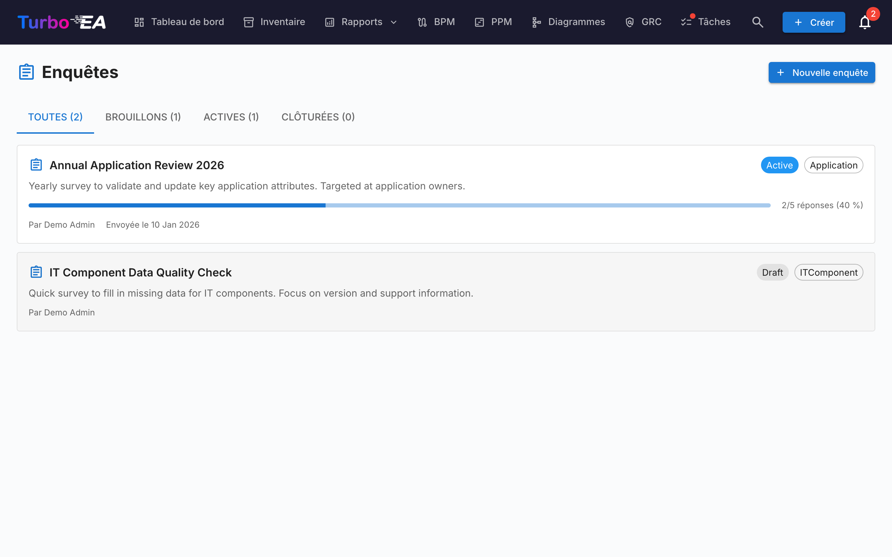

# Enquêtes

Le module **Enquêtes** (**Admin > Enquêtes**) permet aux administrateurs de créer des **enquêtes de maintenance de données** qui collectent des informations structurées auprès des parties prenantes sur des fiches spécifiques.

## Cas d'utilisation

Les enquêtes aident à maintenir vos données d'architecture à jour en contactant les personnes les plus proches de chaque composant. Par exemple :

- Demander aux responsables applicatifs de confirmer la criticité métier et les dates de cycle de vie annuellement
- Collecter des évaluations d'adéquation technique auprès des équipes IT
- Recueillir des mises à jour de coûts auprès des responsables de budget

## Cycle de vie des enquêtes

Chaque enquête progresse à travers trois états :

| Statut | Signification |
|--------|---------------|
| **Brouillon** | En cours de conception, pas encore visible par les répondants |
| **Active** | Ouverte aux réponses, les parties prenantes assignées la voient dans leurs Tâches |
| **Fermée** | N'accepte plus de réponses |

## Création d'une enquête

1. Naviguez vers **Admin > Enquêtes**
2. Cliquez sur **+ Nouvelle enquête**
3. Le **Constructeur d'enquête** s'ouvre avec la configuration suivante :

### Type cible

Sélectionnez le type de fiche auquel l'enquête s'applique (par ex. Application, Composant IT). L'enquête sera envoyée pour chaque fiche de ce type correspondant à vos filtres.

### Filtres

Réduisez éventuellement le périmètre à l'aide de filtres. Trois types de filtres sont disponibles et peuvent être combinés :

- **Fiches spécifiques** — Sélectionnez directement une ou plusieurs fiches (limitées au type cible). Utile pour cibler une fiche unique ou un sous-ensemble choisi à la main.
- **Fiches liées à** — Inclure uniquement les fiches qui ont une relation avec l'un des éléments listés (par ex. toutes les applications liées à l'organisation Ventes).
- **Tags** et **filtres d'attributs** — Faire correspondre les fiches par tag ou par condition d'attribut (par ex. coût supérieur à 10 000, note TIME manquante).

### Questions

Concevez vos questions. Chaque question peut être :

- **Texte libre** -- Réponse ouverte
- **Sélection unique** -- Choisir une option dans une liste
- **Sélection multiple** -- Choisir plusieurs options
- **Nombre** -- Saisie numérique
- **Date** -- Sélecteur de date
- **Booleen** -- Bascule Oui/Non

### Relations

Au-delà des attributs, une enquête peut également demander aux répondants de tenir à jour les **relations** d'une fiche. À l'étape **Champs**, la section **Relations** répertorie toutes les relations que le type de fiche cible peut avoir, dans les deux sens (par exemple, pour une Application : *prend en charge → Composant informatique* et *utilisée par ← Organisation*). Pour chacune que vous sélectionnez, choisissez une action :

- **Maintenir** — Le répondant voit les fiches actuellement liées et peut ajouter ou supprimer des liens à l'aide d'un sélecteur de recherche.
- **Confirmer** — Le répondant se contente de confirmer que les liens actuels sont corrects, ou désactive le bouton pour proposer des modifications.

Lorsque vous appliquez une telle réponse, Turbo EA ajoute les nouveaux liens et supprime ceux que le répondant a retirés. La modification est enregistrée dans l'historique de la fiche, tout comme une modification manuelle de relation.

### Actions automatiques

Configurez des règles qui mettent automatiquement à jour les attributs des fiches en fonction des réponses à l'enquête. Par exemple, si un répondant sélectionne « Mission critique » pour la criticité métier, le champ `businessCriticality` de la fiche peut être mis à jour automatiquement.

## Envoi d'une enquête

Une fois votre enquête en statut **Active** :

1. Cliquez sur **Envoyer** pour distribuer l'enquête
2. Chaque fiche ciblée génère une tâche pour les parties prenantes assignées
3. Les parties prenantes voient l'enquête dans leur onglet **Mes enquêtes** sur la [page Tâches](../guide/tasks.md)

## Consultation des résultats

Naviguez vers **Admin > Enquêtes > [Nom de l'enquête] > Résultats** pour voir :

- Statut des réponses par fiche (répondu, en attente)
- Réponses individuelles avec les réponses par question
- Une action **Appliquer** pour valider les règles d'action automatique sur les attributs des fiches
