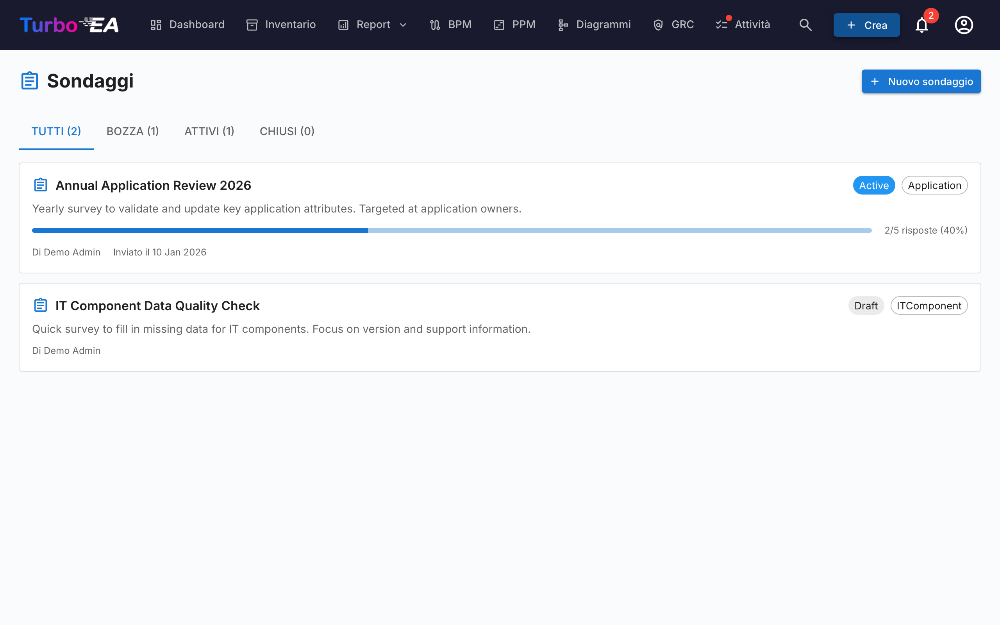

# Sondaggi

Il modulo **Sondaggi** (**Admin > Sondaggi**) consente agli amministratori di creare **sondaggi di manutenzione dati** che raccolgono informazioni strutturate dagli stakeholder su card specifiche.

## Caso d'uso

I sondaggi aiutano a mantenere aggiornati i dati architetturali contattando le persone più vicine a ciascun componente. Ad esempio:

- Chiedete ai proprietari delle applicazioni di confermare la criticità aziendale e le date del ciclo di vita annualmente
- Raccogliete valutazioni dell'idoneità tecnica dai team IT
- Raccogliete aggiornamenti sui costi dai responsabili del budget

## Ciclo di vita del sondaggio

Ogni sondaggio progredisce attraverso tre stati:

| Stato | Significato |
|-------|-------------|
| **Draft** | In fase di progettazione, non ancora visibile ai rispondenti |
| **Active** | Aperto alle risposte, gli stakeholder assegnati lo vedono nei loro Todo |
| **Closed** | Non accetta più risposte |

## Creazione di un sondaggio

1. Navigate su **Admin > Sondaggi**
2. Cliccate su **+ Nuovo sondaggio**
3. Si apre il **Costruttore di sondaggi** con la seguente configurazione:

### Tipo target

Selezionate a quale tipo di card si applica il sondaggio (es. Application, IT Component). Il sondaggio verrà inviato per ogni card di questo tipo che corrisponde ai vostri filtri.

### Filtri

Restringete opzionalmente l'ambito con i filtri. Sono disponibili tre tipi di filtro, combinabili tra loro:

- **Schede specifiche** — Selezionate direttamente una o più schede (limitate al tipo di destinazione). Utile per destinare una singola scheda o un sottoinsieme scelto manualmente.
- **Schede correlate a** — Include solo le schede che hanno una relazione con uno degli elementi elencati (es. tutte le applicazioni correlate all'organizzazione Vendite).
- **Tag** e **filtri di attributi** — Filtrate le schede per tag o per condizione di attributo (es. costo maggiore di 10 000, valutazione TIME mancante).

### Domande

Progettate le vostre domande. Ogni domanda può essere:

- **Testo libero** — Risposta aperta
- **Selezione singola** — Scegliete un'opzione da un elenco
- **Selezione multipla** — Scegliete più opzioni
- **Numero** — Input numerico
- **Data** — Selettore di data
- **Booleano** — Interruttore Sì/No

### Relazioni

Oltre agli attributi, un'indagine può anche chiedere ai rispondenti di mantenere aggiornate le **relazioni** di una scheda. Nel passaggio **Campi**, la sezione **Relazioni** elenca ogni relazione che il tipo di scheda di destinazione può avere, in entrambe le direzioni (ad esempio, per un'Applicazione: *supporta → Componente IT* e *utilizzata da ← Organizzazione*). Per ciascuna selezionata, scegli un'azione:

- **Mantieni** — Il rispondente vede le schede attualmente collegate e può aggiungere o rimuovere collegamenti tramite un selettore di ricerca.
- **Conferma** — Il rispondente si limita a confermare che i collegamenti attuali sono corretti, oppure disattiva l'interruttore per proporre modifiche.

Quando applichi una risposta di questo tipo, Turbo EA aggiunge i nuovi collegamenti e rimuove quelli rimossi dal rispondente. La modifica viene registrata nella cronologia della scheda, proprio come una modifica manuale di relazione.

### Auto-azioni

Configurate regole che aggiornano automaticamente gli attributi della card in base alle risposte del sondaggio. Ad esempio, se un rispondente seleziona "Mission Critical" per la criticità aziendale, il campo `businessCriticality` della card può essere aggiornato automaticamente.

## Invio di un sondaggio

Una volta che il vostro sondaggio è in stato **Active**:

1. Cliccate su **Invia** per distribuire il sondaggio
2. Ogni card target genera un todo per gli stakeholder assegnati
3. Gli stakeholder vedono il sondaggio nella scheda **I miei sondaggi** nella [pagina Attività](../guide/tasks.md)

## Visualizzazione dei risultati

Navigate su **Admin > Sondaggi > [Nome sondaggio] > Risultati** per vedere:

- Stato delle risposte per card (risposto, in attesa)
- Risposte individuali con risposte per ogni domanda
- Un'azione **Applica** per applicare le regole di auto-azione agli attributi della card
