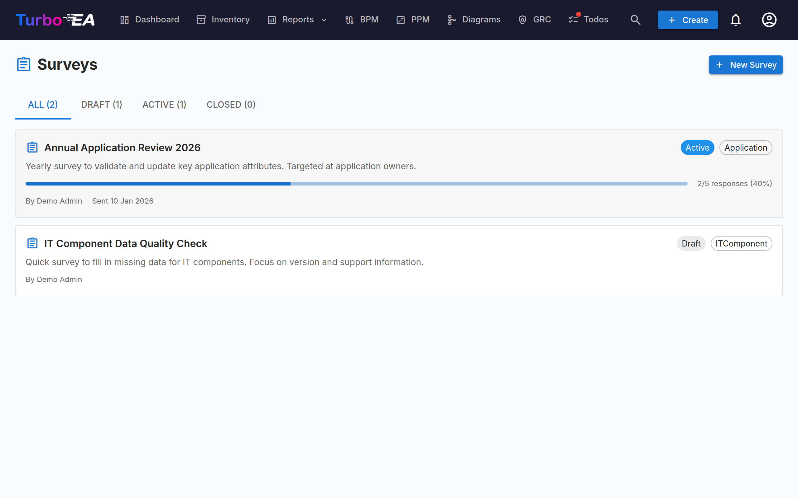

# Surveys

The **Surveys** module (**Admin > Surveys**) enables administrators to create **data-maintenance surveys** that collect structured information from stakeholders about specific cards.

## Use Case

Surveys help keep your architecture data current by reaching out to the people closest to each component. For example:

- Ask application owners to confirm business criticality and lifecycle dates annually
- Collect technical suitability assessments from IT teams
- Gather cost updates from budget owners

## Survey Lifecycle

Each survey progresses through three states:

| Status | Meaning |
|--------|---------|
| **Draft** | Being designed, not yet visible to respondents |
| **Active** | Open for responses, assigned stakeholders see it in their Todos |
| **Closed** | No longer accepting responses |

## Creating a Survey

1. Navigate to **Admin > Surveys**
2. Click **+ New Survey**
3. The **Survey Builder** opens with the following configuration:

### Target Type

Select which card type the survey applies to (e.g., Application, IT Component). The survey will be sent for each card of this type that matches your filters.

### Filters

Optionally narrow the scope by filtering cards. Four filter types are available and can be combined:

- **Specific cards** — Pick one or more cards directly (filtered to the selected target type). Use this to target a single card or a hand-picked subset.
- **Cards related to** — Only include cards that have a relation to one of the listed items (e.g., all Applications related to the Sales organization).
- **Tags** and **Attribute filters** — Match cards by tag or by attribute conditions (e.g., cost greater than 10 000, TIME rating is missing).
- **Last update** — Only include cards nobody has changed for a while: 30 days, 90 days, 6 months, 1 year, or a custom number of days or months. The builder shows the cutoff date it resolves to as you pick. The window is relative to when the survey is **sent**, not when you design it, so a draft parked for a while still finds the cards that are stale then. It measures the card's **Modified** date — the same one the inventory column and the card's History tab show.

### Questions

Design your questions. Each question can be:

- **Free text** — Open-ended response
- **Single select** — Choose one option from a list
- **Multiple select** — Choose multiple options
- **Number** — Numeric input
- **Date** — Date picker
- **Boolean** — Yes/No toggle

### Relationships

Beyond attributes, a survey can also ask respondents to keep a card's **relationships** current. In the **Fields** step, the **Relations** section lists every relationship the target card type can have, in both directions (for example, for an Application: *supports → IT Component* and *used by ← Organization*). For each one you pick, choose an action:

- **Maintain** — The respondent sees the currently linked cards and can add or remove links using a search picker.
- **Confirm** — The respondent simply acknowledges that the current links are correct, or turns the toggle off to propose changes.

When you apply such a response, Turbo EA adds the new links and removes the ones the respondent dropped. The change is recorded in the card's history just like a manual relationship edit.

### Auto-Actions

Configure rules that automatically update card attributes based on survey responses. For example, if a respondent selects "Mission Critical" for business criticality, the card's `businessCriticality` field can be updated automatically.

## Sending a Survey

Once your survey is in **Active** status:

1. Click **Send** to distribute the survey
2. Each targeted card generates a todo for the assigned stakeholders
3. Stakeholders see the survey in their **My Surveys** tab on the [Tasks page](../guide/tasks.md)

!!! note "A card needs someone to ask"

    A card is only surveyed if at least one person holds one of the **target stakeholder roles** on it. Cards that match your filters but have no such stakeholder are skipped, and the **Preview & send** step reports how many — with their names — so you can assign owners rather than wonder why the count is low.

## Viewing Results

Navigate to **Admin > Surveys > [Survey Name] > Results** to see:

- Response status per card (responded, pending)
- Individual responses with per-question answers
- An **Apply** action to commit auto-action rules to card attributes
