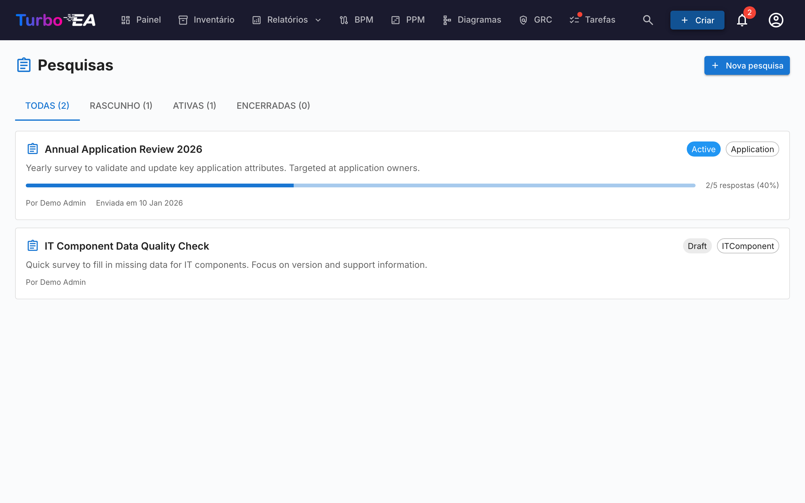

# Pesquisas

O módulo de **Pesquisas** (**Admin > Pesquisas**) permite que administradores criem **pesquisas de manutenção de dados** que coletam informações estruturadas de partes interessadas sobre cards específicos.

## Caso de Uso

Pesquisas ajudam a manter seus dados de arquitetura atualizados, alcançando as pessoas mais próximas de cada componente. Por exemplo:

- Pergunte aos proprietários de aplicações para confirmar a criticidade de negócio e datas do ciclo de vida anualmente
- Colete avaliações de adequação técnica das equipes de TI
- Obtenha atualizações de custos dos responsáveis pelo orçamento

## Ciclo de Vida da Pesquisa

Cada pesquisa progride por três estados:

| Status | Significado |
|--------|-------------|
| **Rascunho** | Sendo projetada, ainda não visível para respondentes |
| **Ativa** | Aberta para respostas, partes interessadas atribuídas a veem em suas Tarefas |
| **Encerrada** | Não aceita mais respostas |

## Criando uma Pesquisa

1. Navegue até **Admin > Pesquisas**
2. Clique em **+ Nova Pesquisa**
3. O **Construtor de Pesquisas** abre com a seguinte configuração:

### Tipo Alvo

Selecione a qual tipo de card a pesquisa se aplica (ex.: Aplicação, Componente de TI). A pesquisa será enviada para cada card deste tipo que corresponda aos seus filtros.

### Filtros

Restrinja opcionalmente o escopo com filtros. Há três tipos de filtro disponíveis, que podem ser combinados:

- **Cards específicos** — Escolha um ou mais cards diretamente (restritos ao tipo alvo). Útil para direcionar um único card ou um subconjunto selecionado manualmente.
- **Cards relacionados com** — Inclua apenas cards que tenham uma relação com um dos itens listados (ex.: todas as aplicações relacionadas à organização Vendas).
- **Tags** e **filtros de atributos** — Selecione cards por tag ou por condição de atributo (ex.: custo superior a 10 000, classificação TIME ausente).

### Perguntas

Desenhe suas perguntas. Cada pergunta pode ser:

- **Texto livre** — Resposta aberta
- **Seleção única** — Escolha uma opção de uma lista
- **Seleção múltipla** — Escolha múltiplas opções
- **Número** — Entrada numérica
- **Data** — Seletor de data
- **Booleano** — Alternância Sim/Não

### Relações

Além dos atributos, uma pesquisa também pode pedir aos respondentes que mantenham as **relações** de um cartão atualizadas. Na etapa **Campos**, a seção **Relações** lista todas as relações que o tipo de cartão de destino pode ter, em ambas as direções (por exemplo, para uma Aplicação: *suporta → Componente de TI* e *usada por ← Organização*). Para cada uma que você escolher, selecione uma ação:

- **Manter** — O respondente vê os cartões atualmente vinculados e pode adicionar ou remover vínculos usando um seletor de busca.
- **Confirmar** — O respondente apenas reconhece que os vínculos atuais estão corretos, ou desliga a alternância para propor alterações.

Ao aplicar uma resposta desse tipo, o Turbo EA adiciona os novos vínculos e remove os que o respondente retirou. A alteração é registrada no histórico do cartão, assim como uma edição manual de relação.

### Auto-ações

Configure regras que atualizam automaticamente atributos do card com base nas respostas da pesquisa. Por exemplo, se um respondente selecionar "Missão Crítica" para criticidade de negócio, o campo `businessCriticality` do card pode ser atualizado automaticamente.

## Enviando uma Pesquisa

Uma vez que sua pesquisa está no status **Ativa**:

1. Clique em **Enviar** para distribuir a pesquisa
2. Cada card alvo gera uma tarefa para as partes interessadas atribuídas
3. Partes interessadas veem a pesquisa na aba **Minhas Pesquisas** na [página de Tarefas](../guide/tasks.md)

## Visualizando Resultados

Navegue até **Admin > Pesquisas > [Nome da Pesquisa] > Resultados** para ver:

- Status de resposta por card (respondido, pendente)
- Respostas individuais com respostas por pergunta
- Uma ação **Aplicar** para executar regras de auto-ação nos atributos dos cards
