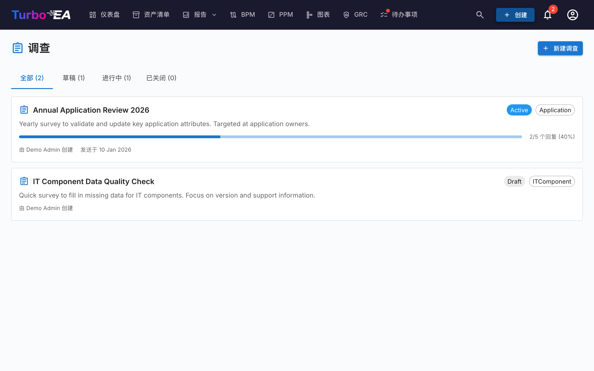

# 问卷

**问卷**模块（**管理 > 问卷**）使管理员能够创建**数据维护问卷**，从干系人那里收集有关特定卡片的结构化信息。

## 使用场景

问卷通过联系最了解每个组件的人来帮助保持架构数据的时效性。例如：

- 要求应用所有者每年确认业务关键性和生命周期日期
- 向 IT 团队收集技术适用性评估
- 从预算负责人处获取成本更新

## 问卷生命周期

每个问卷经历三个状态：

| 状态 | 含义 |
|------|------|
| **草稿** | 正在设计中，对回复者尚不可见 |
| **活跃** | 开放接受回复，分配的干系人在其待办中看到 |
| **已关闭** | 不再接受回复 |

## 创建问卷

1. 导航到**管理 > 问卷**
2. 点击 **+ 新建问卷**
3. **问卷构建器**打开并提供以下配置：

### 目标类型

选择问卷适用的卡片类型（例如应用程序、IT 组件）。问卷将为此类型中符合筛选条件的每张卡片发送。

### 筛选条件

可选通过筛选缩小范围。提供三类筛选，可任意组合使用：

- **特定卡片** — 直接挑选一张或多张卡片（限于所选目标类型）。适用于针对单张卡片或人工挑选的子集发送问卷。
- **关联卡片** — 仅包含与列出项之一存在关系的卡片（例如，所有与销售组织相关联的应用）。
- **标签** 与 **属性筛选** — 按标签或按属性条件匹配卡片（例如，成本大于 10 000、TIME 评级缺失）。

### 问题

设计您的问题。每个问题可以是：

- **自由文本** —— 开放式回复
- **单选** —— 从列表中选择一个选项
- **多选** —— 选择多个选项
- **数字** —— 数值输入
- **日期** —— 日期选择器
- **布尔值** —— 是/否切换

### 关系

除了属性之外，问卷还可以要求受访者保持卡片的**关系**为最新。在**字段**步骤中，**关系**部分列出目标卡片类型可以拥有的每种关系，包含两个方向（例如，对于应用程序：*支持 → IT 组件* 和 *被使用 ← 组织*）。对于您选择的每一项，选择一个操作：

- **维护** —— 受访者会看到当前关联的卡片，并可以使用搜索选择器添加或移除关联。
- **确认** —— 受访者仅确认当前的关联是否正确，或关闭开关以提出更改。

当您应用此类回复时，Turbo EA 会添加新的关联并移除受访者删除的关联。该更改会记录在卡片的历史记录中，就像手动编辑关系一样。

### 自动操作

配置根据问卷回复自动更新卡片属性的规则。例如，如果回复者为业务关键性选择了「任务关键」，则卡片的 `businessCriticality` 字段可以自动更新。

## 发送问卷

问卷处于**活跃**状态后：

1. 点击**发送**分发问卷
2. 每张目标卡片为分配的干系人生成一个待办
3. 干系人在[任务页面](../guide/tasks.md)的**我的问卷**标签页中看到问卷

## 查看结果

导航到**管理 > 问卷 > [问卷名称] > 结果**查看：

- 每张卡片的回复状态（已回复、待回复）
- 包含逐题答案的个人回复
- **应用**操作，将自动操作规则提交到卡片属性
