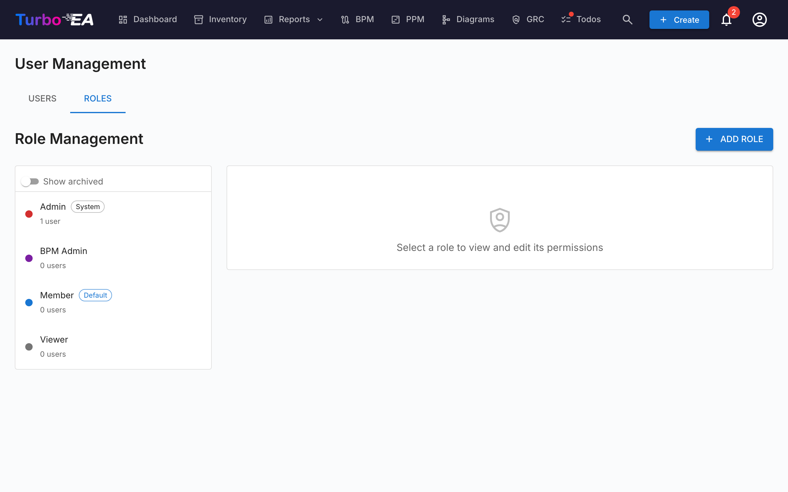

# Brugere og roller

Siden **Brugere og roller** har to faneblade: **Brugere** (administrer konti) og **Roller** (administrer tilladelser).

#### Brugertabel

Brugerlisten er et **AG Grid** (samme Quartz-layout som bruges på siden [Lager](../guide/inventory.md)) med en sidebar med ændringsbar bredde til venstre. De viste kolonner er:

| Kolonne | Beskrivelse |
|--------|-------------|
| **Navn** | Brugerens visningsnavn |
| **E-mail** | E-mailadresse (bruges til login) |
| **Rolle** | Tildelt rolle (kan vælges inline via dropdown) |
| **Auth** | Autentificeringsmetode: "Local", "SSO", "SSO + Password" eller "Pending Setup" |
| **Sidste login** | Dato og tidspunkt for brugerens seneste login. Viser "—", hvis brugeren aldrig har logget ind |
| **Status** | Aktiv eller Deaktiveret |
| **Handlinger** | Rediger, aktivér/deaktivér eller slet brugeren |

#### Filtersidebar

En to-faneblads-sidebar (**Filtre** og **Kolonner**) sidder til venstre for gittret:

- **Søg** — delstrengsmatch på tværs af navn og e-mail.
- **Rolle** — multi-select-chips med rollens farve, så du kan afgrænse til f.eks. "alle medlemmer + viewere".
- **Status** — Aktiv / Deaktiveret.
- **Auth-metode** — Local / SSO / SSO + Password / Pending Setup.
- **Kun afventende adgangskodeopsætning** — hurtig omskifter til at finde inviterede brugere, der endnu ikke har gennemført onboarding.
- Fanebladet **Kolonner** — vis/skjul individuelle kolonner.

Filtertilstand, synlige kolonner, sidebarens bredde og dens sammenklappede tilstand gemmes **pr. bruger** i `localStorage` under nøglen `turboea_usersAdmin` — de overlever logout og sidegenindlæsninger.

#### Oprettelse af en bruger

1. Klik på knappen **Opret bruger** (øverst til højre). At sende en invitationsmail er blot én mulighed i dialogen — den primære handling er at oprette kontoen.
2. Udfyld formularen:
   - **Visningsnavn** (påkrævet): Brugerens fulde navn
   - **E-mail** (påkrævet): E-mailadressen, de vil bruge til at logge ind
   - **Adgangskode** (valgfrit): Lad feltet være tomt, så brugeren selv vælger sin adgangskode ved første login. Hvis SSO er aktiveret, kan en bruger uden adgangskode i stedet logge ind via deres SSO-udbyder
   - **Rolle**: Vælg den rolle, der skal tildeles (Admin, Member, Viewer eller en hvilken som helst brugerdefineret rolle)
   - **Send invitationsmail**: Sæt flueben her for at sende en e-mailnotifikation til brugeren med login-instruktioner
3. Klik på **Opret bruger** for at oprette kontoen.

**Hvad der sker bag kulisserne:**
- En brugerkonto oprettes i systemet
- En SSO-invitationspost oprettes også, så hvis brugeren logger ind via SSO, modtager de automatisk den forhåndstildelte rolle
- Hvis der ikke er sat nogen adgangskode (en konto med «Pending Setup»), genereres et engangs-token til opsætning af adgangskode. Hvis du sætter flueben ved «Send invitationsmail», leveres det som et link til at angive adgangskoden; ellers angiver brugeren sin adgangskode ved første login via «Glemt adgangskode» på login-siden — hvilket virker, selvom de aldrig har haft en adgangskode

#### Redigering af en bruger

Klik på **redigeringsikonet** på enhver brugerrække for at åbne dialogen Rediger bruger. Du kan ændre:

- **Visningsnavn** og **E-mail**
- **Autentificeringsmetode** (synlig kun når SSO er aktiveret): Skift mellem "Local" og "SSO". Dette giver administratorer mulighed for at konvertere en eksisterende lokal konto til SSO eller omvendt. Når der skiftes til SSO, vil kontoen automatisk blive tilknyttet, når brugeren næste gang logger ind via deres SSO-udbyder
- **Adgangskode** (kun for lokale brugere): Indstil en ny adgangskode. Lad være tom for at beholde den nuværende adgangskode
- **Rolle**: Skift brugerens applikationsrolle

#### Tilknytning af en eksisterende lokal konto til SSO

Hvis en bruger allerede har en lokal konto, og din organisation aktiverer SSO, vil brugeren se fejlen "A local account with this email already exists", når de forsøger at logge ind via SSO. For at løse dette:

1. Gå til **Admin > Brugere**
2. Klik på **redigeringsikonet** ud for brugeren
3. Skift **Autentificeringsmetoden** fra "Local" til "SSO"
4. Klik på **Gem ændringer**
5. Brugeren kan nu logge ind via SSO. Deres konto vil automatisk blive tilknyttet ved første SSO-login

#### Bulk-handlinger

Brug række-checkboksene i brugergittret til at vælge flere brugere på én gang. En bulk-handlingsværktøjslinje vises over gittret med disse muligheder:

- **Skift rolle** — tildel en enkelt rolle til hver valgt bruger
- **Aktivér** / **Deaktivér** — vend `is_active` for udvælgelsen
- **Slet** — slet permanent de valgte brugere (kun deaktiverede brugere fjernes; aktive brugere i udvælgelsen springes over med en forklaring)

Vagten "sidste admin" gælder: bulk-rolleændringer, der ville efterlade nul aktive admins, afvises, og det samme gælder for deaktivering eller sletning af den sidste admin.

#### Import af brugere fra et regneark

1. Klik på knappen **Import** (øverst til højre). Guiden åbner med et træk-og-slip-område til `.xlsx`-filer.
2. Slip eller gennemse en Excel-fil. De forventede kolonner er:

   | Kolonne | Påkrævet | Beskrivelse |
   |--------|----------|-------------|
   | `email` | Ja | Bruges som brugerens identitet (uafhængig af store/små bogstaver). |
   | `display_name` | Ja | Brugerens fulde navn vist i hele appen. |
   | `role` | Nej | Rollenøgle (f.eks. `admin`, `member`, `viewer`). Standard er `viewer`, når den er tom. |
   | `password` | Nej | Kun lokale konti. Lad være tom, så inviterede brugere kan indstille deres egen adgangskode via invitationslinket. |
   | `locale` | Nej | UI-lokalitet (f.eks. `en`, `de`, `fr`). |
   | `is_active` | Nej | `TRUE` / `FALSE` — overstyrer det aktive flag på eksisterende brugere. |

3. Guiden validerer filen og viser en rapport: rækker, der skal oprettes, rækker, der skal opdateres (med en per-felt-diff), fejl, der blokerer importen, og advarsler, der ikke gør.
4. Hvis der er nye rækker, så slå **Send invitationsmails til nye brugere** til. Når den er slået til, modtager hver ny bruger en invitationsmail med et login- eller adgangskode-opsætningslink.
5. Klik på **Import** for at anvende. En statuslinje viser per-række-status; den endelige skærm viser oprettelser, opdateringer og fejl.

Den hurtigste måde at starte på er at klikke på **Eksport** først, redigere den resulterende `.xlsx` og genimportere den samme fil — guiden vil registrere eksisterende e-mails som opdateringer i stedet for oprettelser.

#### Eksport af brugerlisten

Klik på knappen **Eksport** (øverst til højre) for at downloade den aktuelt filtrerede brugerliste som en Excel-fil (`users_export_YYYY-MM-DD_HHMM.xlsx`). Eksporten respekterer alle filtre og søgetermer, der er angivet i sidebaren, så du kan afgrænse eksporten til en delmængde (f.eks. kun inviterede brugere eller kun én rolle).

#### Afventende invitationer

Under brugertabellen viser et afsnit **Afventende invitationer** alle invitationer, der endnu ikke er accepteret. Hver invitation viser e-mail, forhåndstildelt rolle og invitationsdato. Du kan tilbagekalde en invitation ved at klikke på sletteikonet.

#### Roller

Fanebladet **Roller** giver mulighed for at administrere applikationsroller. Hver rolle definerer et sæt tilladelser, der styrer, hvad brugere med den rolle kan gøre. Standardroller:

| Rolle | Beskrivelse |
|------|-------------|
| **Admin** | Fuld adgang til alle funktioner og administration |
| **BPM Admin** | Alle BPM-tilladelser plus lageradgang, ingen admin-indstillinger |
| **Member** | Opret, rediger og administrer kort, relationer og kommentarer. Ingen admin-adgang |
| **Viewer** | Skrivebeskyttet adgang på tværs af alle områder |

Brugerdefinerede roller kan oprettes med granulær tilladelseskontrol over lager, relationer, interessenter, kommentarer, dokumenter, diagrammer, BPM, rapporter og mere.

#### Deaktivering af en bruger

Klik på **omskifterikonet** i kolonnen Handlinger for at aktivere eller deaktivere en bruger. Deaktiverede brugere:

- Kan ikke logge ind
- Bevarer deres data (kort, kommentarer, historik) til revisionsformål
- Kan genaktiveres til enhver tid
