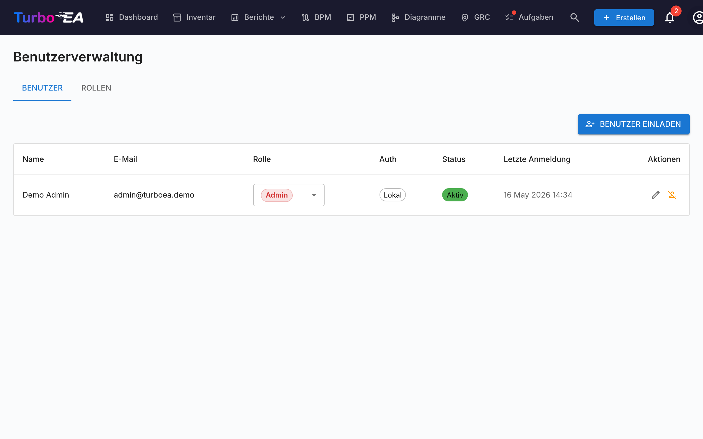
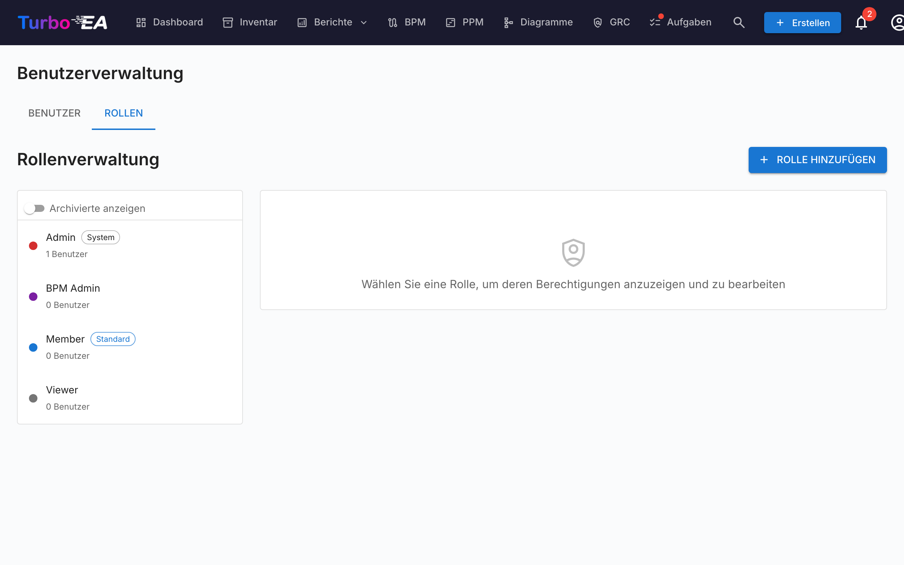

# Benutzer & Rollen

Die Seite **Benutzer & Rollen** hat zwei Tabs: **Benutzer** (Konten verwalten) und **Rollen** (Berechtigungen verwalten).

#### Benutzertabelle

Die Benutzerliste ist ein **AG Grid** (dasselbe Quartz-Layout wie auf der [Inventar](../guide/inventory.md)-Seite) mit einer in der Breite verstellbaren Filter-Seitenleiste auf der linken Seite. Die angezeigten Spalten sind:

| Spalte | Beschreibung |
|--------|-------------|
| **Name** | Anzeigename des Benutzers |
| **E-Mail** | E-Mail-Adresse (wird für die Anmeldung verwendet) |
| **Rolle** | Zugewiesene Rolle (inline per Dropdown auswählbar) |
| **Authentifizierung** | Authentifizierungsmethode: «Lokal», «SSO», «SSO + Passwort» oder «Einrichtung ausstehend» |
| **Letzte Anmeldung** | Datum und Uhrzeit der letzten Anmeldung des Benutzers. Zeigt «—» an, wenn sich der Benutzer noch nie angemeldet hat |
| **Status** | Aktiv oder Deaktiviert |
| **Aktionen** | Bearbeiten, Aktivieren/Deaktivieren oder Benutzer löschen |

#### Filter-Seitenleiste

Eine Seitenleiste mit zwei Reitern (**Filter** und **Spalten**) sitzt links neben dem Grid:

- **Suche** — Teilstring-Match über Name und E-Mail.
- **Rolle** — Multi-Select-Chips mit der Farbe der Rolle, sodass du z.B. auf «alle Mitglieder + Viewer» eingrenzen kannst.
- **Status** — Aktiv / Deaktiviert.
- **Authentifizierungsmethode** — Lokal / SSO / SSO + Passwort / Einrichtung ausstehend.
- **Nur ausstehende Passwort-Einrichtung** — schneller Schalter, um eingeladene Nutzer zu finden, die das Onboarding noch nicht abgeschlossen haben.
- Reiter **Spalten** — einzelne Spalten ein-/ausblenden.

Filterzustand, sichtbare Spalten, die Sidebar-Breite und ihr Eingeklappt-Zustand werden **pro Benutzer** im `localStorage` unter dem Schlüssel `turboea_usersAdmin` persistiert — sie überleben Abmeldungen und Seiten-Reloads.

#### Einen Benutzer erstellen

1. Klicken Sie auf die Schaltfläche **Benutzer erstellen** (oben rechts). Das Versenden einer Einladungs-E-Mail ist nur eine optionale Einstellung im Dialog — die eigentliche Aktion ist das Erstellen des Kontos.
2. Füllen Sie das Formular aus:
   - **Anzeigename** (erforderlich): Der vollständige Name des Benutzers
   - **E-Mail** (erforderlich): Die E-Mail-Adresse, mit der sich der Benutzer anmelden wird
   - **Passwort** (optional): Leer lassen, damit der Benutzer beim ersten Anmelden sein eigenes Passwort wählt. Wenn SSO aktiviert ist, kann sich ein Benutzer ohne Passwort stattdessen über seinen SSO-Anbieter anmelden
   - **Rolle**: Wählen Sie die zuzuweisende Rolle (Admin, Mitglied, Betrachter oder eine benutzerdefinierte Rolle)
   - **Einladungs-E-Mail senden**: Aktivieren Sie dies, um dem Benutzer eine E-Mail-Benachrichtigung mit Anmeldeinstruktionen zu senden
3. Klicken Sie auf **Benutzer erstellen**, um das Konto zu erstellen.

**Was im Hintergrund passiert:**
- Ein Benutzerkonto wird im System erstellt
- Ein SSO-Einladungsdatensatz wird ebenfalls erstellt, sodass der Benutzer bei SSO-Anmeldung automatisch die zugewiesene Rolle erhält
- Wenn kein Passwort gesetzt ist (ein Konto mit «Einrichtung ausstehend»), wird ein einmaliges Passwort-Einrichtungstoken generiert. Wenn Sie «Einladungs-E-Mail senden» aktivieren, wird es als Link zum Festlegen des Passworts zugestellt; andernfalls legt der Benutzer sein Passwort beim ersten Anmelden über die Option «Passwort vergessen» auf der Anmeldeseite fest – was auch funktioniert, obwohl er nie ein Passwort hatte

#### Einen Benutzer bearbeiten

Klicken Sie auf das **Bearbeitungssymbol** in einer beliebigen Benutzerzeile, um den Dialog «Benutzer bearbeiten» zu öffnen. Sie können ändern:

- **Anzeigename** und **E-Mail**
- **Authentifizierungsmethode** (nur sichtbar wenn SSO aktiviert ist): Wechsel zwischen «Lokal» und «SSO». Dies ermöglicht Administratoren, ein bestehendes lokales Konto auf SSO umzustellen oder umgekehrt. Beim Wechsel zu SSO wird das Konto automatisch verknüpft, wenn sich der Benutzer das nächste Mal über seinen SSO-Anbieter anmeldet
- **Passwort** (nur für lokale Benutzer): Ein neues Passwort setzen. Leer lassen, um das aktuelle Passwort beizubehalten
- **Rolle**: Die anwendungsweite Rolle des Benutzers ändern

#### Ein bestehendes lokales Konto mit SSO verknüpfen

Wenn ein Benutzer bereits ein lokales Konto hat und Ihre Organisation SSO aktiviert, sieht der Benutzer die Fehlermeldung «Ein lokales Konto mit dieser E-Mail existiert bereits», wenn er versucht, sich per SSO anzumelden. Um dies zu beheben:

1. Gehen Sie zu **Admin > Benutzer**
2. Klicken Sie auf das **Bearbeitungssymbol** neben dem Benutzer
3. Ändern Sie die **Authentifizierungsmethode** von «Lokal» auf «SSO»
4. Klicken Sie auf **Änderungen speichern**
5. Der Benutzer kann sich nun per SSO anmelden. Sein Konto wird bei der ersten SSO-Anmeldung automatisch verknüpft

#### Massenoperationen

Verwenden Sie die Zeilen-Kontrollkästchen in der Benutzertabelle, um mehrere Benutzer gleichzeitig auszuwählen. Über der Tabelle erscheint eine Werkzeugleiste mit folgenden Aktionen:

- **Rolle ändern** — eine einzige Rolle auf alle ausgewählten Benutzer anwenden
- **Aktivieren** / **Deaktivieren** — `is_active` für die Auswahl umschalten
- **Löschen** — ausgewählte Benutzer endgültig entfernen (nur deaktivierte Benutzer werden gelöscht; aktive Benutzer in der Auswahl werden mit einer Erklärung übersprungen)

Die «Letzter Administrator»-Sicherung gilt: Massen-Rollenänderungen, die keinen aktiven Administrator übrig lassen würden, werden abgelehnt. Das Gleiche gilt für das Deaktivieren oder Löschen des letzten Administrators.

#### Benutzer aus einer Tabelle importieren

1. Klicken Sie auf die Schaltfläche **Importieren** (oben rechts). Der Assistent öffnet sich mit einem Drag-and-Drop-Bereich für `.xlsx`-Dateien.
2. Ziehen Sie eine Excel-Datei oder wählen Sie sie aus. Die erwarteten Spalten sind:

   | Spalte | Erforderlich | Beschreibung |
   |--------|--------------|--------------|
   | `email` | Ja | Wird als Identität des Benutzers verwendet (Groß-/Kleinschreibung unerheblich). |
   | `display_name` | Ja | Der vollständige Name, der in der Anwendung angezeigt wird. |
   | `role` | Nein | Rollen-Schlüssel (z. B. `admin`, `member`, `viewer`). Standard ist `viewer`, wenn leer. |
   | `password` | Nein | Nur für lokale Konten. Leer lassen, damit Eingeladene ihr Passwort über den Einladungslink selbst festlegen. |
   | `locale` | Nein | UI-Sprache (z. B. `en`, `de`, `fr`). |
   | `is_active` | Nein | `TRUE` / `FALSE` — überschreibt das Aktiv-Kennzeichen vorhandener Benutzer. |

3. Der Assistent validiert die Datei und zeigt einen Bericht: zu erstellende Zeilen, zu aktualisierende Zeilen (mit Feldvergleich), Fehler, die den Import blockieren, und Warnungen, die ihn nicht blockieren.
4. Bei neuen Zeilen können Sie **Einladungs-E-Mails an neue Benutzer senden** aktivieren. Wenn aktiv, erhält jeder neue Benutzer eine Einladungs-E-Mail mit einem Anmelde- oder Passwort-Einrichtungslink.
5. Klicken Sie auf **Importieren**, um die Änderungen anzuwenden. Ein Fortschrittsbalken zeigt den Status pro Zeile; der Abschlussbildschirm listet Erstellungen, Aktualisierungen und Fehler auf.

Der schnellste Einstieg ist, zuerst **Exportieren** zu klicken, die resultierende `.xlsx` zu bearbeiten und dieselbe Datei erneut zu importieren — der Assistent erkennt vorhandene E-Mails als Aktualisierungen statt als Neuanlagen.

#### Benutzerliste exportieren

Klicken Sie auf die Schaltfläche **Exportieren** (oben rechts), um die aktuell gefilterte Benutzerliste als Excel-Datei (`users_export_YYYY-MM-DD_HHMM.xlsx`) herunterzuladen. Der Export berücksichtigt alle Filter und Suchbegriffe der Seitenleiste, sodass Sie den Export auf eine Teilmenge eingrenzen können (z. B. nur eingeladene Benutzer oder nur eine bestimmte Rolle).

#### Ausstehende Einladungen

Unterhalb der Benutzertabelle zeigt ein Abschnitt **Ausstehende Einladungen** alle Einladungen, die noch nicht angenommen wurden. Jede Einladung zeigt die E-Mail, die zugewiesene Rolle und das Einladungsdatum. Sie können eine Einladung durch Klicken auf das Löschsymbol widerrufen.

#### Rollen

Der **Rollen**-Tab ermöglicht die Verwaltung anwendungsweiter Rollen. Jede Rolle definiert eine Reihe von Berechtigungen, die steuern, was Benutzer mit dieser Rolle tun können. Standardrollen:

| Rolle | Beschreibung |
|-------|-------------|
| **Admin** | Vollständiger Zugriff auf alle Funktionen und Administration |
| **BPM-Admin** | Vollständige BPM-Berechtigungen plus Inventarzugriff, keine Administrationseinstellungen |
| **Mitglied** | Karten, Beziehungen und Kommentare erstellen, bearbeiten und verwalten. Kein Administratorzugriff |
| **Betrachter** | Schreibgeschützter Zugriff über alle Bereiche |

Benutzerdefinierte Rollen können mit granularer Berechtigungssteuerung über Inventar, Beziehungen, Stakeholder, Kommentare, Dokumente, Diagramme, BPM, Berichte und mehr erstellt werden.

#### Einen Benutzer deaktivieren

Klicken Sie auf das **Umschaltsymbol** in der Aktionen-Spalte, um einen Benutzer zu aktivieren oder zu deaktivieren. Deaktivierte Benutzer:

- Können sich nicht anmelden
- Behalten ihre Daten (Karten, Kommentare, Verlauf) zu Prüfungszwecken
- Können jederzeit reaktiviert werden
