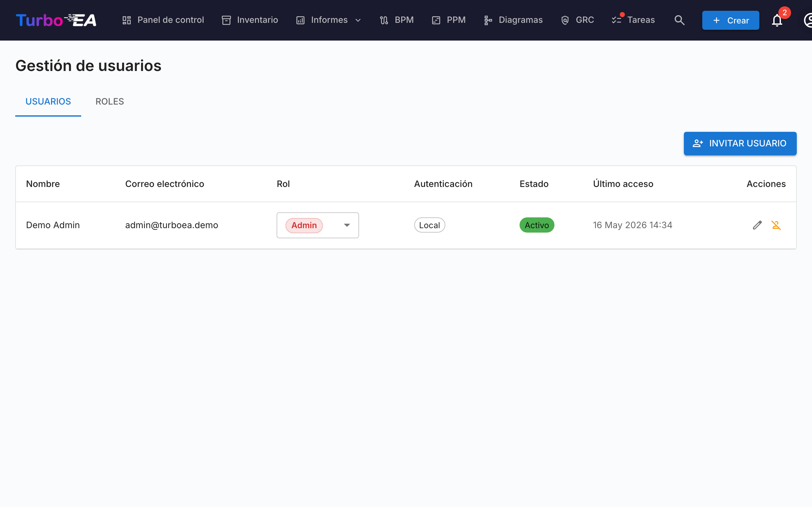
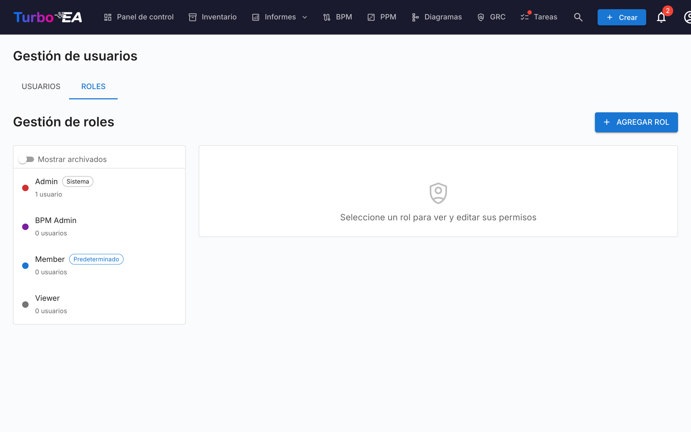

# Usuarios y Roles

La página **Usuarios y Roles** tiene dos pestañas: **Usuarios** (gestionar cuentas) y **Roles** (gestionar permisos).

#### Tabla de Usuarios

La lista de usuarios muestra todas las cuentas registradas con las siguientes columnas:

| Columna | Descripción |
|---------|-------------|
| **Nombre** | Nombre visible del usuario |
| **Correo** | Dirección de correo electrónico (utilizada para iniciar sesión) |
| **Rol** | Rol asignado (seleccionable directamente mediante un desplegable) |
| **Autenticación** | Método de autenticación: «Local», «SSO», «SSO + Contraseña» o «Configuración pendiente» |
| **Último acceso** | Fecha y hora del último inicio de sesión del usuario. Muestra «—» si el usuario nunca ha iniciado sesión |
| **Estado** | Activo o Desactivado |
| **Acciones** | Editar, activar/desactivar o eliminar el usuario |

#### Invitar a un Nuevo Usuario

1. Haga clic en el botón **Invitar usuario** (esquina superior derecha)
2. Complete el formulario:
   - **Nombre** (obligatorio): El nombre completo del usuario
   - **Correo electrónico** (obligatorio): La dirección de correo que utilizará para iniciar sesión
   - **Contraseña** (opcional): Si se deja en blanco y SSO está deshabilitado, el usuario recibe un correo con un enlace para configurar su contraseña. Si SSO está habilitado, el usuario puede iniciar sesión a través de su proveedor SSO sin contraseña
   - **Rol**: Seleccione el rol a asignar (Administrador, Miembro, Visor o cualquier rol personalizado)
   - **Enviar correo de invitación**: Marque esta opción para enviar un correo de notificación al usuario con instrucciones de acceso
3. Haga clic en **Invitar usuario** para crear la cuenta

**Lo que sucede internamente:**
- Se crea una cuenta de usuario en el sistema
- También se crea un registro de invitación SSO, de modo que si el usuario inicia sesión a través de SSO, recibirá automáticamente el rol preasignado
- Si no se establece una contraseña y SSO está deshabilitado, se genera un token de configuración de contraseña. El usuario puede configurar su contraseña siguiendo el enlace en el correo de invitación

#### Editar un Usuario

Haga clic en el **icono de edición** en cualquier fila de usuario para abrir el diálogo de edición. Puede cambiar:

- **Nombre** y **Correo electrónico**
- **Método de autenticación** (visible solo cuando SSO está habilitado): Cambiar entre «Local» y «SSO». Esto permite a los administradores convertir una cuenta local existente a SSO, o viceversa. Al cambiar a SSO, la cuenta se vinculará automáticamente cuando el usuario inicie sesión a través de su proveedor SSO
- **Contraseña** (solo para usuarios locales): Establecer una nueva contraseña. Dejar en blanco para mantener la contraseña actual
- **Rol**: Cambiar el rol del usuario a nivel de aplicación

#### Vincular una Cuenta Local Existente a SSO

Si un usuario ya tiene una cuenta local y su organización habilita SSO, el usuario verá el error «Ya existe una cuenta local con este correo electrónico» cuando intente iniciar sesión a través de SSO. Para resolver esto:

1. Vaya a **Admin > Usuarios**
2. Haga clic en el **icono de edición** junto al usuario
3. Cambie el **Método de autenticación** de «Local» a «SSO»
4. Haga clic en **Guardar cambios**
5. El usuario ahora puede iniciar sesión a través de SSO. Su cuenta se vinculará automáticamente en el primer inicio de sesión con SSO

#### Operaciones masivas

Use las casillas de las filas en la tabla de usuarios para seleccionar varios usuarios a la vez. Aparece una barra de acciones encima de la tabla con estas opciones:

- **Cambiar rol** — asignar un único rol a todos los usuarios seleccionados
- **Activar** / **Desactivar** — alternar `is_active` para la selección
- **Eliminar** — eliminar definitivamente los usuarios seleccionados (solo se eliminan los desactivados; los usuarios activos de la selección se omiten con una explicación)

La salvaguarda del «último administrador» se aplica: los cambios de rol masivos que dejarían sin ningún administrador activo se rechazan. Lo mismo ocurre al desactivar o eliminar al último administrador.

#### Importar usuarios desde una hoja de cálculo

1. Haga clic en el botón **Importar** (arriba a la derecha). El asistente se abre con un área de arrastrar y soltar para archivos `.xlsx`.
2. Suelte o seleccione un archivo de Excel. Las columnas esperadas son:

   | Columna | Obligatoria | Descripción |
   |---------|-------------|-------------|
   | `email` | Sí | Se usa como identidad del usuario (no distingue mayúsculas y minúsculas). |
   | `display_name` | Sí | Nombre completo que se muestra en la aplicación. |
   | `role` | No | Clave de rol (p. ej. `admin`, `member`, `viewer`). Por defecto `viewer` si está vacío. |
   | `password` | No | Solo cuentas locales. Deje en blanco para que los invitados establezcan su contraseña mediante el enlace de invitación. |
   | `locale` | No | Idioma de la interfaz (p. ej. `en`, `de`, `fr`). |
   | `is_active` | No | `TRUE` / `FALSE` — sobrescribe el estado activo de los usuarios existentes. |

3. El asistente valida el archivo y muestra un informe: filas por crear, filas por actualizar (con un diff por campo), errores que bloquean la importación y avisos que no lo hacen.
4. Si hay filas nuevas, active **Enviar correos de invitación a los nuevos usuarios**. Cuando está activo, cada nuevo usuario recibe un correo de invitación con un enlace para iniciar sesión o establecer la contraseña.
5. Haga clic en **Importar** para aplicar. Una barra de progreso muestra el estado por fila; la pantalla final lista creaciones, actualizaciones y errores.

La forma más rápida de empezar es pulsar primero **Exportar**, editar el `.xlsx` resultante y volver a importar el mismo archivo — el asistente detectará los correos existentes como actualizaciones en lugar de creaciones.

#### Exportar la lista de usuarios

Haga clic en el botón **Exportar** (arriba a la derecha) para descargar la lista de usuarios filtrada como un archivo de Excel (`users_export_YYYY-MM-DD_HHMM.xlsx`). La exportación respeta los filtros y términos de búsqueda de la barra lateral, por lo que puede limitar la exportación a un subconjunto (p. ej. solo los usuarios invitados o solo un rol).

#### Invitaciones Pendientes

Debajo de la tabla de usuarios, una sección de **Invitaciones pendientes** muestra todas las invitaciones que aún no han sido aceptadas. Cada invitación muestra el correo electrónico, el rol preasignado y la fecha de invitación. Puede revocar una invitación haciendo clic en el icono de eliminar.

#### Roles

La pestaña **Roles** permite gestionar los roles a nivel de aplicación. Cada rol define un conjunto de permisos que controlan lo que los usuarios con ese rol pueden hacer. Roles predeterminados:

| Rol | Descripción |
|-----|-------------|
| **Administrador** | Acceso total a todas las funciones y administración |
| **BPM Admin** | Permisos completos de BPM más acceso al inventario, sin configuración de administración |
| **Miembro** | Crear, editar y gestionar fichas, relaciones y comentarios. Sin acceso de administración |
| **Visor** | Acceso de solo lectura en todas las áreas |

Se pueden crear roles personalizados con control granular de permisos sobre inventario, relaciones, partes interesadas, comentarios, documentos, diagramas, BPM, informes y más.

#### Desactivar un Usuario

Haga clic en el **icono de alternancia** en la columna de Acciones para activar o desactivar un usuario. Los usuarios desactivados:

- No pueden iniciar sesión
- Conservan sus datos (fichas, comentarios, historial) para fines de auditoría
- Pueden ser reactivados en cualquier momento
