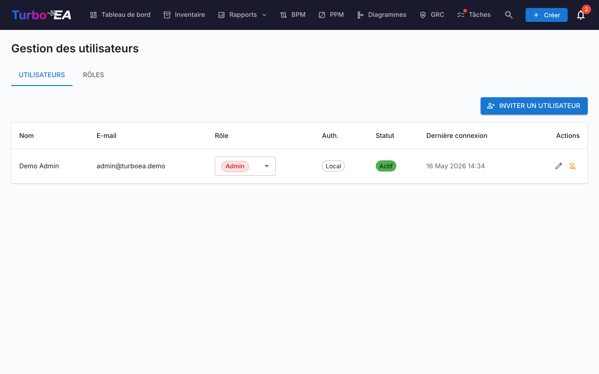
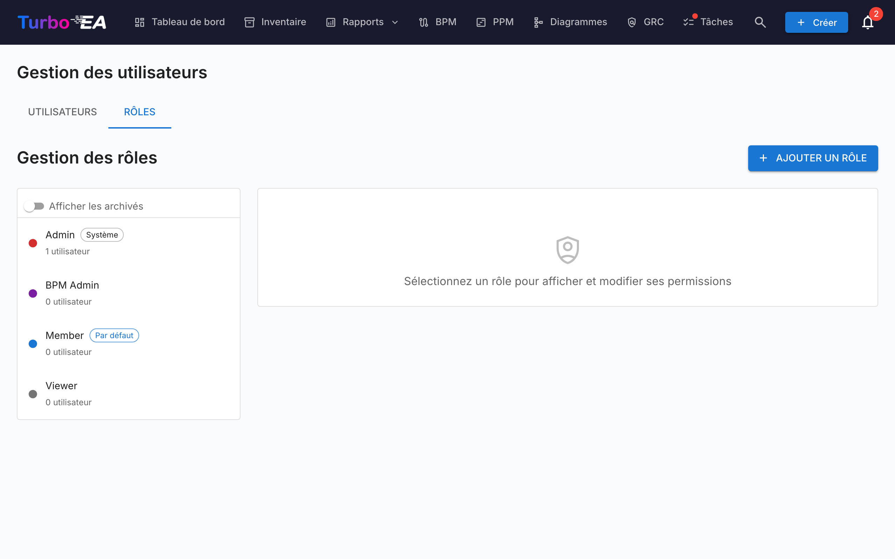

# Utilisateurs et rôles

La page **Utilisateurs et rôles** comporte deux onglets : **Utilisateurs** (gestion des comptes) et **Rôles** (gestion des permissions).

#### Tableau des utilisateurs

La liste des utilisateurs est un **AG Grid** (la même mise en page Quartz que sur la page [Inventaire](../guide/inventory.md)) avec une barre latérale de filtres redimensionnable sur la gauche. Les colonnes affichées sont :

| Colonne | Description |
|---------|-------------|
| **Nom** | Nom d'affichage de l'utilisateur |
| **E-mail** | Adresse e-mail (utilisée pour la connexion) |
| **Rôle** | Rôle attribué (sélectionnable en ligne via une liste déroulante) |
| **Auth** | Méthode d'authentification : « Local », « SSO », « SSO + Mot de passe » ou « Configuration en attente » |
| **Dernière connexion** | Date et heure de la dernière connexion de l'utilisateur. Affiche « — » si l'utilisateur ne s'est jamais connecté |
| **Statut** | Actif ou Désactivé |
| **Actions** | Modifier, activer/désactiver ou supprimer l'utilisateur |

#### Barre latérale de filtres

Une barre latérale à deux onglets (**Filtres** et **Colonnes**) se trouve à gauche de la grille :

- **Recherche** — correspondance partielle sur le nom et l'e-mail.
- **Rôle** — puces à sélection multiple avec la couleur du rôle, pour pouvoir cibler par exemple « tous les membres + visualiseurs ».
- **Statut** — Actif / Désactivé.
- **Méthode d'authentification** — Local / SSO / SSO + Mot de passe / Configuration en attente.
- **Configuration de mot de passe en attente uniquement** — bascule rapide pour trouver les utilisateurs invités qui n'ont pas encore terminé leur onboarding.
- Onglet **Colonnes** — afficher/masquer les colonnes individuelles.

L'état des filtres, les colonnes visibles, la largeur de la barre latérale et son état réduit sont persistés **par utilisateur** dans `localStorage` sous la clé `turboea_usersAdmin` — ils survivent aux déconnexions et aux rechargements de page.

#### Créer un utilisateur

1. Cliquez sur le bouton **Créer un utilisateur** (en haut à droite). L'envoi d'un e-mail d'invitation n'est qu'une option du dialogue — l'action principale est la création du compte.
2. Remplissez le formulaire :
   - **Nom d'affichage** (obligatoire) : Le nom complet de l'utilisateur
   - **E-mail** (obligatoire) : L'adresse e-mail qu'il utilisera pour se connecter
   - **Mot de passe** (optionnel) : Laissez vide pour que l'utilisateur choisisse son propre mot de passe à la première connexion. Si le SSO est activé, un utilisateur sans mot de passe peut se connecter via son fournisseur SSO à la place
   - **Rôle** : Sélectionnez le rôle à attribuer (Admin, Membre, Lecteur, ou tout rôle personnalisé)
   - **Envoyer un e-mail d'invitation** : Cochez cette case pour envoyer une notification par e-mail à l'utilisateur avec les instructions de connexion
3. Cliquez sur **Créer un utilisateur** pour créer le compte.

**Ce qui se passe en arrière-plan :**
- Un compte utilisateur est créé dans le système
- Un enregistrement d'invitation SSO est également créé, de sorte que si l'utilisateur se connecte via SSO, il reçoit automatiquement le rôle pré-attribué
- Si aucun mot de passe n'est défini (un compte « Configuration en attente »), un jeton de configuration à usage unique est généré. Si vous cochez « Envoyer un e-mail d'invitation », il est envoyé sous forme de lien de configuration du mot de passe ; sinon, l'utilisateur définit son mot de passe à la première connexion via l'option « Mot de passe oublié » de la page de connexion — ce qui fonctionne même s'il n'a jamais eu de mot de passe

#### Modifier un utilisateur

Cliquez sur l'**icône de modification** sur n'importe quelle ligne d'utilisateur pour ouvrir le dialogue de modification. Vous pouvez modifier :

- **Nom d'affichage** et **E-mail**
- **Méthode d'authentification** (visible uniquement lorsque le SSO est activé) : Basculer entre « Local » et « SSO ». Cela permet aux administrateurs de convertir un compte local existant en SSO, ou inversement. Lors du passage à SSO, le compte sera automatiquement lié lorsque l'utilisateur se connectera ensuite via son fournisseur SSO
- **Mot de passe** (uniquement pour les utilisateurs locaux) : Définir un nouveau mot de passe. Laissez vide pour conserver le mot de passe actuel
- **Rôle** : Modifier le rôle au niveau de l'application de l'utilisateur

#### Lier un compte local existant au SSO

Si un utilisateur possède déjà un compte local et que votre organisation active le SSO, l'utilisateur verra l'erreur « Un compte local avec cet e-mail existe déjà » lorsqu'il tentera de se connecter via SSO. Pour résoudre ce problème :

1. Allez dans **Admin > Utilisateurs**
2. Cliquez sur l'**icône de modification** à côté de l'utilisateur
3. Changez la **Méthode d'authentification** de « Local » à « SSO »
4. Cliquez sur **Sauvegarder les modifications**
5. L'utilisateur peut maintenant se connecter via SSO. Son compte sera automatiquement lié lors de la première connexion SSO

#### Opérations en masse

Cochez les cases en début de ligne pour sélectionner plusieurs utilisateurs. Une barre d'outils s'affiche au-dessus du tableau avec les actions suivantes :

- **Changer de rôle** — appliquer un rôle unique à tous les utilisateurs sélectionnés
- **Activer** / **Désactiver** — basculer `is_active` pour la sélection
- **Supprimer** — supprimer définitivement les utilisateurs sélectionnés (seuls les utilisateurs désactivés sont supprimés ; les utilisateurs actifs présents dans la sélection sont ignorés avec un message explicatif)

Le garde-fou « dernier administrateur » s'applique : un changement de rôle en masse qui laisserait zéro administrateur actif est refusé. Il en va de même pour la désactivation ou la suppression du dernier administrateur.

#### Importer des utilisateurs depuis un tableur

1. Cliquez sur le bouton **Importer** (en haut à droite). L'assistant s'ouvre avec une zone glisser-déposer pour les fichiers `.xlsx`.
2. Déposez ou choisissez un fichier Excel. Les colonnes attendues sont :

   | Colonne | Obligatoire | Description |
   |---------|-------------|-------------|
   | `email` | Oui | Sert d'identité de l'utilisateur (insensible à la casse). |
   | `display_name` | Oui | Le nom complet affiché dans l'application. |
   | `role` | Non | Clé de rôle (ex. `admin`, `member`, `viewer`). Par défaut `viewer` si vide. |
   | `password` | Non | Comptes locaux uniquement. Laissez vide pour permettre aux invités de définir leur mot de passe via le lien d'invitation. |
   | `locale` | Non | Langue de l'interface (ex. `en`, `de`, `fr`). |
   | `is_active` | Non | `TRUE` / `FALSE` — remplace l'indicateur actif pour les utilisateurs existants. |

3. L'assistant valide le fichier et affiche un rapport : lignes à créer, lignes à mettre à jour (avec un comparatif champ par champ), erreurs bloquant l'import et avertissements non bloquants.
4. Si de nouvelles lignes sont présentes, activez **Envoyer des e-mails d'invitation aux nouveaux utilisateurs**. Lorsqu'elle est activée, chaque nouvel utilisateur reçoit un e-mail d'invitation avec un lien de connexion ou de définition de mot de passe.
5. Cliquez sur **Importer** pour appliquer. Une barre de progression affiche le statut ligne par ligne ; l'écran final liste les créations, mises à jour et échecs.

La façon la plus rapide de démarrer est de cliquer d'abord sur **Exporter**, de modifier le fichier `.xlsx` obtenu, puis de réimporter le même fichier — l'assistant détectera les e-mails existants comme des mises à jour plutôt que des créations.

#### Exporter la liste des utilisateurs

Cliquez sur le bouton **Exporter** (en haut à droite) pour télécharger la liste filtrée des utilisateurs au format Excel (`users_export_YYYY-MM-DD_HHMM.xlsx`). L'export respecte les filtres et termes de recherche définis dans la barre latérale, ce qui permet de restreindre l'export à un sous-ensemble (par ex. uniquement les utilisateurs invités, ou un seul rôle).

#### Invitations en attente

Sous le tableau des utilisateurs, une section **Invitations en attente** affiche toutes les invitations qui n'ont pas encore été acceptées. Chaque invitation montre l'e-mail, le rôle pré-attribué et la date d'invitation. Vous pouvez revoquer une invitation en cliquant sur l'icône de suppression.

#### Rôles

L'onglet **Rôles** permet de gérer les rôles au niveau de l'application. Chaque rôle définit un ensemble de permissions qui contrôlent ce que les utilisateurs avec ce rôle peuvent faire. Rôles par défaut :

| Rôle | Description |
|------|-------------|
| **Admin** | Accès complet à toutes les fonctionnalités et à l'administration |
| **Admin BPM** | Toutes les permissions BPM plus l'accès à l'inventaire, sans paramètres d'administration |
| **Membre** | Créer, modifier et gérer les fiches, relations et commentaires. Pas d'accès administrateur |
| **Lecteur** | Accès en lecture seule dans tous les domaines |

Des rôles personnalisés peuvent être créés avec un contrôle granulaire des permissions sur l'inventaire, les relations, les parties prenantes, les commentaires, les documents, les diagrammes, le BPM, les rapports, et plus encore.

#### Désactiver un utilisateur

Cliquez sur l'**icône de bascule** dans la colonne Actions pour activer ou désactiver un utilisateur. Les utilisateurs désactivés :

- Ne peuvent pas se connecter
- Conservent leurs données (fiches, commentaires, historique) à des fins d'audit
- Peuvent être réactivés à tout moment
