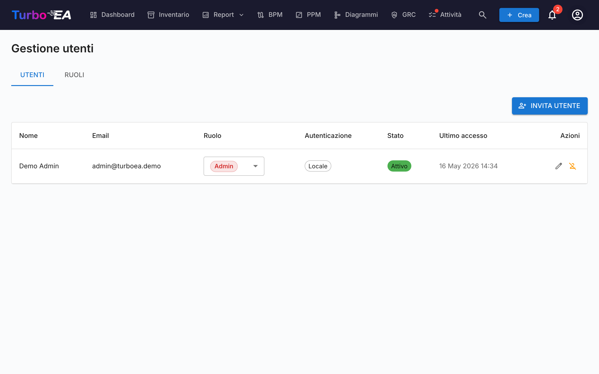
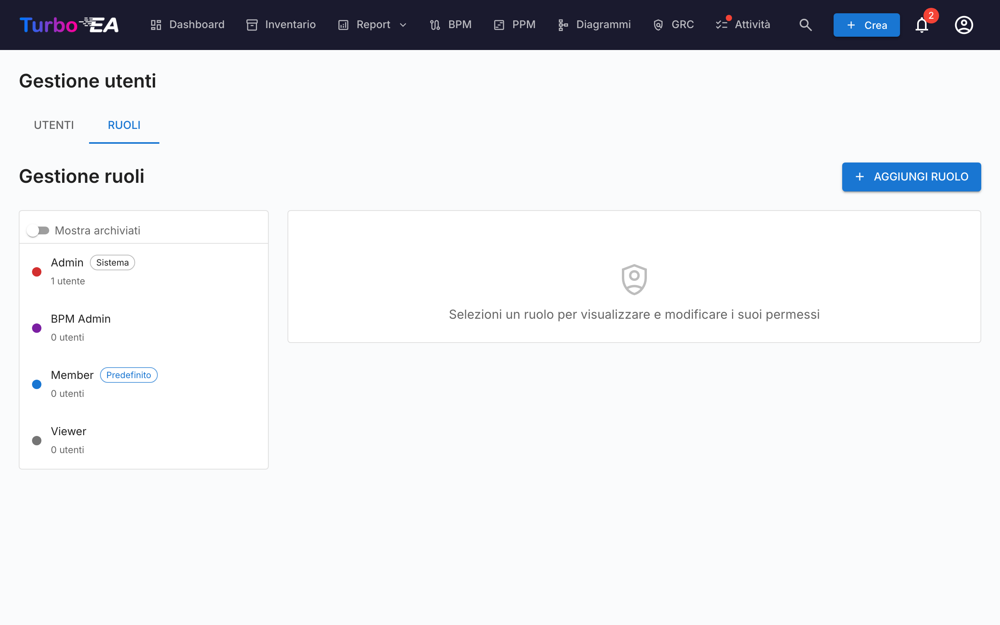

# Utenti e ruoli

La pagina **Utenti e ruoli** ha due schede: **Utenti** (gestione account) e **Ruoli** (gestione permessi).

#### Tabella utenti

L'elenco utenti è un **AG Grid** (lo stesso layout Quartz utilizzato nella pagina [Inventario](../guide/inventory.md)) con una barra laterale dei filtri ridimensionabile a sinistra. Le colonne mostrate sono:

| Colonna | Descrizione |
|---------|-------------|
| **Nome** | Nome visualizzato dell'utente |
| **Email** | Indirizzo email (utilizzato per il login) |
| **Ruolo** | Ruolo assegnato (selezionabile in linea tramite menu a tendina) |
| **Autenticazione** | Metodo di autenticazione: "Locale", "SSO", "SSO + Password" o "In attesa di configurazione" |
| **Ultimo accesso** | Data e ora dell'ultimo accesso dell'utente. Mostra "—" se l'utente non ha mai effettuato il login |
| **Stato** | Attivo o Disabilitato |
| **Azioni** | Modifica, attiva/disattiva o elimina l'utente |

#### Barra laterale dei filtri

Una barra laterale a due schede (**Filtri** e **Colonne**) si trova a sinistra della griglia:

- **Ricerca** — match di sottostringa su nome ed email.
- **Ruolo** — chip multi-select con il colore del ruolo, così puoi restringere ad es. a «tutti i membri + viewer».
- **Stato** — Attivo / Disabilitato.
- **Metodo di autenticazione** — Locale / SSO / SSO + Password / In attesa di configurazione.
- **Solo configurazione password in attesa** — switch rapido per trovare utenti invitati che non hanno ancora completato l'onboarding.
- Scheda **Colonne** — mostra/nascondi singole colonne.

Lo stato dei filtri, le colonne visibili, la larghezza della barra laterale e il suo stato compresso sono persistiti **per utente** in `localStorage` sotto la chiave `turboea_usersAdmin` — sopravvivono ai logout e ai ricaricamenti di pagina.

#### Creazione di un utente

1. Cliccate sul pulsante **Crea utente** (in alto a destra). L'invio dell'email di invito è solo un'opzione del dialogo — l'azione principale è la creazione dell'account.
2. Compilate il modulo:
   - **Nome visualizzato** (obbligatorio): Il nome completo dell'utente
   - **Email** (obbligatorio): L'indirizzo email che utilizzeranno per il login
   - **Password** (opzionale): Lasciala vuota per consentire all'utente di scegliere la propria password al primo accesso. Se SSO è abilitato, un utente senza password può accedere tramite il proprio provider SSO
   - **Ruolo**: Selezionate il ruolo da assegnare (Admin, Member, Viewer o qualsiasi ruolo personalizzato)
   - **Invia email di invito**: Spuntate per inviare una notifica email all'utente con le istruzioni per il login
3. Cliccate su **Crea utente** per creare l'account.

**Cosa succede dietro le quinte:**
- Viene creato un account utente nel sistema
- Viene creato anche un record di invito SSO, così se l'utente accede tramite SSO, riceve automaticamente il ruolo pre-assegnato
- Se non viene impostata una password (un account «In attesa di configurazione»), viene generato un token monouso per l'impostazione della password. Se selezioni «Invia email di invito», viene recapitato come link per impostare la password; altrimenti l'utente imposta la propria password al primo accesso tramite l'opzione «Password dimenticata» nella pagina di accesso, che funziona anche se non ha mai avuto una password

#### Modifica di un utente

Cliccate sull'**icona di modifica** su qualsiasi riga utente per aprire la finestra Modifica utente. Potete modificare:

- **Nome visualizzato** e **Email**
- **Metodo di autenticazione** (visibile solo quando SSO è abilitato): Alternate tra "Locale" e "SSO". Questo consente agli amministratori di convertire un account locale esistente in SSO, o viceversa. Quando si passa a SSO, l'account verrà automaticamente collegato quando l'utente accede la prossima volta tramite il proprio provider SSO
- **Password** (solo per utenti locali): Impostate una nuova password. Lasciate vuoto per mantenere la password corrente
- **Ruolo**: Cambiate il ruolo a livello di applicazione dell'utente

#### Collegamento di un account locale esistente a SSO

Se un utente ha già un account locale e la vostra organizzazione abilita SSO, l'utente vedrà l'errore "Un account locale con questa email esiste già" quando tenta di accedere tramite SSO. Per risolvere:

1. Andate su **Admin > Utenti**
2. Cliccate sull'**icona di modifica** accanto all'utente
3. Cambiate il **Metodo di autenticazione** da "Locale" a "SSO"
4. Cliccate su **Salva modifiche**
5. L'utente può ora accedere tramite SSO. Il suo account verrà automaticamente collegato al primo login SSO

#### Operazioni in blocco

Usa le caselle di selezione delle righe nella tabella utenti per selezionare più utenti contemporaneamente. Sopra la tabella appare una barra di azioni con le seguenti opzioni:

- **Cambia ruolo** — assegna un singolo ruolo a tutti gli utenti selezionati
- **Attiva** / **Disattiva** — inverti `is_active` per la selezione
- **Elimina** — elimina definitivamente gli utenti selezionati (vengono rimossi solo gli utenti disattivati; gli utenti attivi nella selezione vengono saltati con una spiegazione)

Si applica la protezione «ultimo amministratore»: le modifiche di ruolo in blocco che lascerebbero zero amministratori attivi vengono rifiutate. Lo stesso vale per la disattivazione o l'eliminazione dell'ultimo amministratore.

#### Importazione utenti da un foglio di calcolo

1. Fai clic sul pulsante **Importa** (in alto a destra). La procedura guidata si apre con un'area di trascinamento per file `.xlsx`.
2. Trascina o scegli un file Excel. Le colonne previste sono:

   | Colonna | Obbligatoria | Descrizione |
   |---------|--------------|-------------|
   | `email` | Sì | Usata come identità dell'utente (non distingue maiuscole/minuscole). |
   | `display_name` | Sì | Nome completo visualizzato nell'applicazione. |
   | `role` | No | Chiave del ruolo (es. `admin`, `member`, `viewer`). Predefinito `viewer` se vuoto. |
   | `password` | No | Solo per account locali. Lascia vuoto per consentire agli invitati di impostare la propria password tramite il link di invito. |
   | `locale` | No | Lingua dell'interfaccia (es. `en`, `de`, `fr`). |
   | `is_active` | No | `TRUE` / `FALSE` — sovrascrive l'indicatore attivo sugli utenti esistenti. |

3. La procedura guidata convalida il file e mostra un report: righe da creare, righe da aggiornare (con un confronto campo per campo), errori che bloccano l'importazione e avvisi che non la bloccano.
4. Se ci sono righe nuove, attiva **Invia e-mail di invito ai nuovi utenti**. Quando è attivo, ogni nuovo utente riceve un'e-mail di invito con un link di accesso o di impostazione della password.
5. Fai clic su **Importa** per applicare. Una barra di avanzamento mostra lo stato per riga; la schermata finale elenca creazioni, aggiornamenti ed errori.

Il modo più veloce per iniziare è fare clic prima su **Esporta**, modificare il `.xlsx` ottenuto e reimportare lo stesso file — la procedura guidata rileverà le e-mail esistenti come aggiornamenti anziché come creazioni.

#### Esportare l'elenco utenti

Fai clic sul pulsante **Esporta** (in alto a destra) per scaricare l'elenco utenti attualmente filtrato come file Excel (`users_export_YYYY-MM-DD_HHMM.xlsx`). L'esportazione rispetta i filtri e i termini di ricerca impostati nella barra laterale, quindi puoi limitare l'export a un sottoinsieme (ad es. solo gli utenti invitati o un solo ruolo).

#### Inviti in attesa

Sotto la tabella utenti, una sezione **Inviti in attesa** mostra tutti gli inviti che non sono ancora stati accettati. Ogni invito mostra l'email, il ruolo pre-assegnato e la data dell'invito. Potete revocare un invito cliccando sull'icona di eliminazione.

#### Ruoli

La scheda **Ruoli** consente di gestire i ruoli a livello di applicazione. Ogni ruolo definisce un insieme di permessi che controllano cosa possono fare gli utenti con quel ruolo. Ruoli predefiniti:

| Ruolo | Descrizione |
|-------|-------------|
| **Admin** | Accesso completo a tutte le funzionalità e all'amministrazione |
| **BPM Admin** | Permessi BPM completi più accesso all'inventario, nessuna impostazione admin |
| **Member** | Crea, modifica e gestisce card, relazioni e commenti. Nessun accesso admin |
| **Viewer** | Accesso di sola lettura in tutte le aree |

I ruoli personalizzati possono essere creati con controllo granulare dei permessi su inventario, relazioni, stakeholder, commenti, documenti, diagrammi, BPM, report e altro.

#### Disattivazione di un utente

Cliccate sull'**icona toggle** nella colonna Azioni per attivare o disattivare un utente. Gli utenti disattivati:

- Non possono effettuare il login
- Mantengono i propri dati (card, commenti, cronologia) per scopi di audit
- Possono essere riattivati in qualsiasi momento
