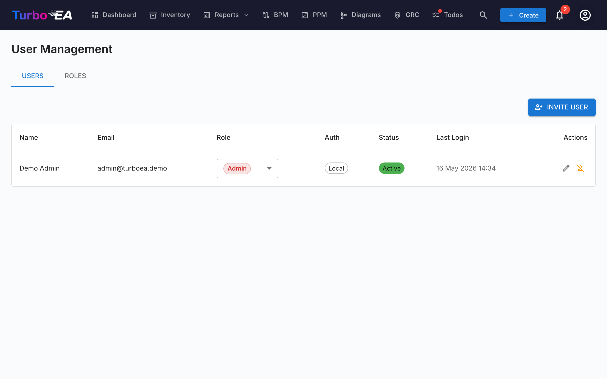

# Usuários e Papéis

A página de **Usuários e Papéis** possui duas abas: **Usuários** (gerenciar contas) e **Papéis** (gerenciar permissões).

#### Tabela de Usuários

A lista de usuários exibe todas as contas registradas com as seguintes colunas:

| Coluna | Descrição |
|--------|-----------|
| **Nome** | Nome de exibição do usuário |
| **E-mail** | Endereço de e-mail (usado para login) |
| **Papel** | Papel atribuído (selecionável inline via dropdown) |
| **Auth** | Método de autenticação: "Local", "SSO", "SSO + Senha" ou "Configuração Pendente" |
| **Último login** | Data e hora do último login do usuário. Mostra "—" se o usuário nunca fez login |
| **Status** | Ativo ou Desabilitado |
| **Ações** | Editar, ativar/desativar ou excluir o usuário |

#### Convidando um Novo Usuário

1. Clique no botão **Convidar Usuário** (canto superior direito)
2. Preencha o formulário:
   - **Nome de Exibição** (obrigatório): O nome completo do usuário
   - **E-mail** (obrigatório): O endereço de e-mail que eles usarão para fazer login
   - **Senha** (opcional): Se deixado em branco e o SSO estiver desabilitado, o usuário recebe um e-mail com um link de configuração de senha. Se o SSO estiver habilitado, o usuário pode entrar pelo provedor SSO sem senha
   - **Papel**: Selecione o papel a atribuir (Admin, Membro, Visualizador ou qualquer papel personalizado)
   - **Enviar e-mail de convite**: Marque para enviar uma notificação por e-mail ao usuário com instruções de login
3. Clique em **Convidar Usuário** para criar a conta

**O que acontece nos bastidores:**
- Uma conta de usuário é criada no sistema
- Um registro de convite SSO também é criado, então se o usuário fizer login via SSO, ele receberá automaticamente o papel pré-atribuído
- Se nenhuma senha for definida e o SSO estiver desabilitado, um token de configuração de senha é gerado. O usuário pode definir sua senha seguindo o link no e-mail de convite

#### Editando um Usuário

Clique no **ícone de edição** em qualquer linha de usuário para abrir o diálogo de Editar Usuário. Você pode alterar:

- **Nome de Exibição** e **E-mail**
- **Método de Autenticação** (visível apenas quando SSO está habilitado): Alternar entre "Local" e "SSO". Isso permite que administradores convertam uma conta local existente para SSO, ou vice-versa. Ao mudar para SSO, a conta será automaticamente vinculada quando o usuário fizer login via seu provedor SSO
- **Senha** (apenas para usuários Locais): Definir uma nova senha. Deixe em branco para manter a senha atual
- **Papel**: Alterar o papel em nível de aplicação do usuário

#### Vinculando uma Conta Local Existente ao SSO

Se um usuário já possui uma conta local e sua organização habilita SSO, o usuário verá o erro "Uma conta local com este e-mail já existe" quando tentar fazer login via SSO. Para resolver isso:

1. Vá para **Admin > Usuários**
2. Clique no **ícone de edição** ao lado do usuário
3. Altere o **Método de Autenticação** de "Local" para "SSO"
4. Clique em **Salvar Alterações**
5. O usuário agora pode fazer login via SSO. Sua conta será automaticamente vinculada no primeiro login SSO

#### Convites Pendentes

Abaixo da tabela de usuários, uma seção de **Convites Pendentes** mostra todos os convites que ainda não foram aceitos. Cada convite mostra o e-mail, papel pré-atribuído e data do convite. Você pode revogar um convite clicando no ícone de exclusão.

#### Papéis

A aba de **Papéis** permite gerenciar papéis em nível de aplicação. Cada papel define um conjunto de permissões que controlam o que usuários com esse papel podem fazer. Papéis padrão:

| Papel | Descrição |
|-------|-----------|
| **Admin** | Acesso total a todos os recursos e administração |
| **BPM Admin** | Permissões completas de BPM mais acesso ao inventário, sem configurações de admin |
| **Membro** | Criar, editar e gerenciar cards, relacionamentos e comentários. Sem acesso admin |
| **Visualizador** | Acesso somente leitura em todas as áreas |

Papéis personalizados podem ser criados com controle granular de permissões sobre inventário, relacionamentos, partes interessadas, comentários, documentos, diagramas, BPM, relatórios e mais.

#### Desativando um Usuário

Clique no **ícone de alternância** na coluna de Ações para ativar ou desativar um usuário. Usuários desativados:

- Não podem fazer login
- Mantêm seus dados (cards, comentários, histórico) para fins de auditoria
- Podem ser reativados a qualquer momento
