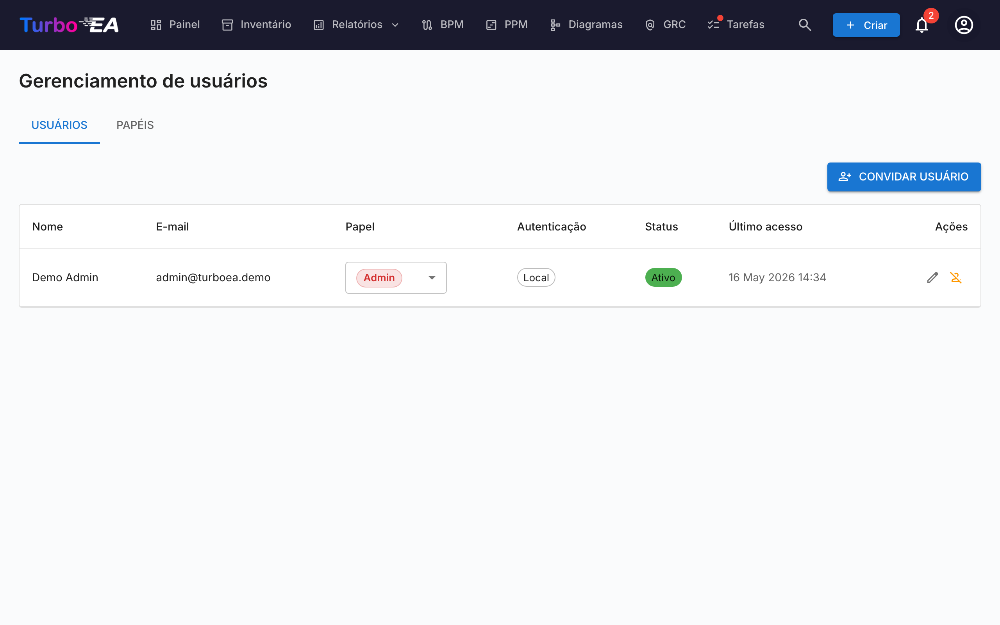
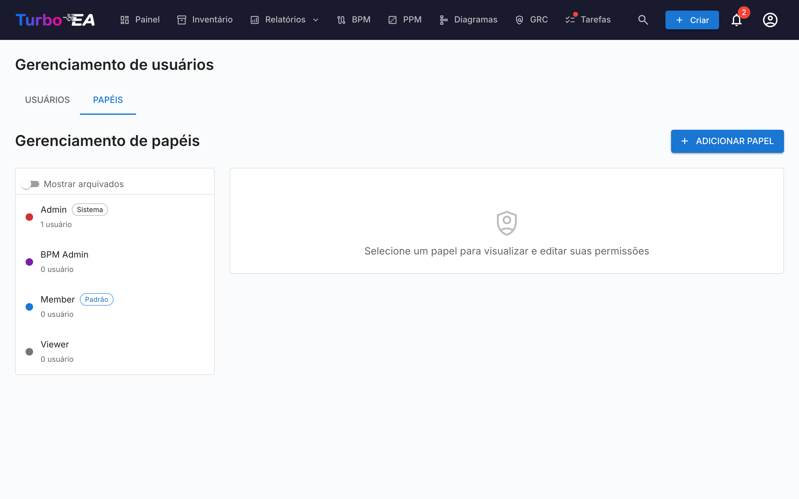

# Usuários e Papéis

A página de **Usuários e Papéis** possui duas abas: **Usuários** (gerenciar contas) e **Papéis** (gerenciar permissões).

#### Tabela de Usuários

A lista de usuários é um **AG Grid** (o mesmo layout Quartz usado na página de [Inventário](../guide/inventory.md)) com uma barra lateral de filtros redimensionável à esquerda. As colunas exibidas são:

| Coluna | Descrição |
|--------|-----------|
| **Nome** | Nome de exibição do usuário |
| **E-mail** | Endereço de e-mail (usado para login) |
| **Papel** | Papel atribuído (selecionável inline via dropdown) |
| **Auth** | Método de autenticação: "Local", "SSO", "SSO + Senha" ou "Configuração Pendente" |
| **Último login** | Data e hora do último login do usuário. Mostra "—" se o usuário nunca fez login |
| **Status** | Ativo ou Desabilitado |
| **Ações** | Editar, ativar/desativar ou excluir o usuário |

#### Barra Lateral de Filtros

Uma barra lateral de duas abas (**Filtros** e **Colunas**) fica à esquerda da grade:

- **Busca** — correspondência de substring sobre nome e e-mail.
- **Papel** — chips multi-seleção com a cor do papel, para que você possa restringir, por exemplo, a «todos os membros + visualizadores».
- **Status** — Ativo / Desabilitado.
- **Método de autenticação** — Local / SSO / SSO + Senha / Configuração Pendente.
- **Apenas configuração de senha pendente** — interruptor rápido para encontrar usuários convidados que ainda não concluíram o onboarding.
- Aba **Colunas** — mostrar/ocultar colunas individuais.

O estado do filtro, colunas visíveis, largura da barra lateral e seu estado recolhido são persistidos **por usuário** em `localStorage` sob a chave `turboea_usersAdmin` — sobrevivem a logouts e recargas de página.

#### Criando um Usuário

1. Clique no botão **Criar usuário** (canto superior direito). Enviar um e-mail de convite é apenas uma opção do diálogo — a ação principal é criar a conta.
2. Preencha o formulário:
   - **Nome de Exibição** (obrigatório): O nome completo do usuário
   - **E-mail** (obrigatório): O endereço de e-mail que eles usarão para fazer login
   - **Senha** (opcional): Deixe em branco para que o usuário escolha a própria senha no primeiro login. Se o SSO estiver habilitado, um usuário sem senha pode entrar pelo provedor SSO
   - **Papel**: Selecione o papel a atribuir (Admin, Membro, Visualizador ou qualquer papel personalizado)
   - **Enviar e-mail de convite**: Marque para enviar uma notificação por e-mail ao usuário com instruções de login
3. Clique em **Criar usuário** para criar a conta.

**O que acontece nos bastidores:**
- Uma conta de usuário é criada no sistema
- Um registro de convite SSO também é criado, então se o usuário fizer login via SSO, ele receberá automaticamente o papel pré-atribuído
- Se nenhuma senha for definida (uma conta «Configuração Pendente»), um token de uso único para configuração de senha é gerado. Se você marcar «Enviar e-mail de convite», ele é entregue como um link para definir a senha; caso contrário, o usuário define a senha no primeiro login pela opção «Esqueci minha senha» na página de login, que funciona mesmo que nunca tenha tido uma senha

#### Editando um Usuário

Clique no **ícone de edição** em qualquer linha de usuário para abrir o diálogo de Editar Usuário. Você pode alterar:

- **Nome de Exibição** e **E-mail**
- **Método de Autenticação** (visível apenas quando SSO está habilitado): Alternar entre "Local" e "SSO". Isso permite que administradores convertam uma conta local existente para SSO, ou vice-versa. Ao mudar para SSO, a conta será automaticamente vinculada quando o usuário fizer login via seu provedor SSO
- **Senha** (apenas para usuários Locais): Definir uma nova senha. Deixe em branco para manter a senha atual
- **Papel**: Alterar o papel em nível de aplicação do usuário

#### Vinculando uma Conta Local Existente ao SSO

Se um usuário já possui uma conta local e sua organização habilita SSO, o usuário verá o erro "Uma conta local com este e-mail já existe" quando tentar fazer login via SSO. Para resolver isso:

1. Vá para **Admin > Usuários**
2. Clique no **ícone de edição** ao lado do usuário
3. Altere o **Método de Autenticação** de "Local" para "SSO"
4. Clique em **Salvar Alterações**
5. O usuário agora pode fazer login via SSO. Sua conta será automaticamente vinculada no primeiro login SSO

#### Operações em massa

Use as caixas de seleção das linhas na tabela de usuários para selecionar vários usuários de uma vez. Acima da tabela aparece uma barra de ações com as seguintes opções:

- **Alterar função** — atribuir uma única função a todos os usuários selecionados
- **Ativar** / **Desativar** — alternar `is_active` para a seleção
- **Excluir** — excluir permanentemente os usuários selecionados (apenas usuários desativados são removidos; os usuários ativos na seleção são ignorados com uma explicação)

A salvaguarda do «último administrador» se aplica: alterações de função em massa que deixariam zero administradores ativos são recusadas. O mesmo vale para a desativação ou exclusão do último administrador.

#### Importar usuários a partir de uma planilha

1. Clique no botão **Importar** (no canto superior direito). O assistente abre com uma área de arrastar e soltar para arquivos `.xlsx`.
2. Solte ou selecione um arquivo do Excel. As colunas esperadas são:

   | Coluna | Obrigatória | Descrição |
   |--------|-------------|-----------|
   | `email` | Sim | Usado como identidade do usuário (não diferencia maiúsculas/minúsculas). |
   | `display_name` | Sim | Nome completo exibido na aplicação. |
   | `role` | Não | Chave da função (ex.: `admin`, `member`, `viewer`). Padrão `viewer` quando vazio. |
   | `password` | Não | Apenas contas locais. Deixe em branco para que os convidados definam sua senha pelo link do convite. |
   | `locale` | Não | Idioma da interface (ex.: `en`, `de`, `fr`). |
   | `is_active` | Não | `TRUE` / `FALSE` — substitui o indicador ativo em usuários existentes. |

3. O assistente valida o arquivo e mostra um relatório: linhas a criar, linhas a atualizar (com um diff por campo), erros que bloqueiam a importação e avisos que não a bloqueiam.
4. Se houver linhas novas, ative **Enviar e-mails de convite para novos usuários**. Quando ativado, cada novo usuário recebe um e-mail de convite com um link de entrada ou de definição de senha.
5. Clique em **Importar** para aplicar. Uma barra de progresso mostra o status por linha; a tela final lista criações, atualizações e falhas.

A forma mais rápida de começar é clicar primeiro em **Exportar**, editar o `.xlsx` resultante e reimportar o mesmo arquivo — o assistente detectará os e-mails existentes como atualizações em vez de criações.

#### Exportar a lista de usuários

Clique no botão **Exportar** (no canto superior direito) para baixar a lista de usuários atualmente filtrada como um arquivo do Excel (`users_export_YYYY-MM-DD_HHMM.xlsx`). A exportação respeita os filtros e termos de pesquisa definidos na barra lateral, então você pode limitar a exportação a um subconjunto (por exemplo, apenas os usuários convidados, ou apenas um único papel).

#### Convites Pendentes

Abaixo da tabela de usuários, uma seção de **Convites Pendentes** mostra todos os convites que ainda não foram aceitos. Cada convite mostra o e-mail, papel pré-atribuído e data do convite. Você pode revogar um convite clicando no ícone de exclusão.

#### Papéis

A aba de **Papéis** permite gerenciar papéis em nível de aplicação. Cada papel define um conjunto de permissões que controlam o que usuários com esse papel podem fazer. Papéis padrão:

| Papel | Descrição |
|-------|-----------|
| **Admin** | Acesso total a todos os recursos e administração |
| **BPM Admin** | Permissões completas de BPM mais acesso ao inventário, sem configurações de admin |
| **Membro** | Criar, editar e gerenciar cards, relacionamentos e comentários. Sem acesso admin |
| **Visualizador** | Acesso somente leitura em todas as áreas |

Papéis personalizados podem ser criados com controle granular de permissões sobre inventário, relacionamentos, partes interessadas, comentários, documentos, diagramas, BPM, relatórios e mais.

#### Desativando um Usuário

Clique no **ícone de alternância** na coluna de Ações para ativar ou desativar um usuário. Usuários desativados:

- Não podem fazer login
- Mantêm seus dados (cards, comentários, histórico) para fins de auditoria
- Podem ser reativados a qualquer momento
