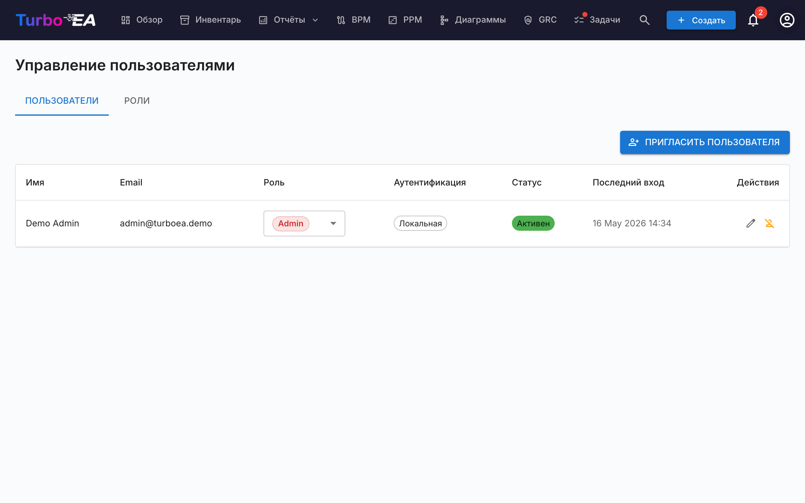
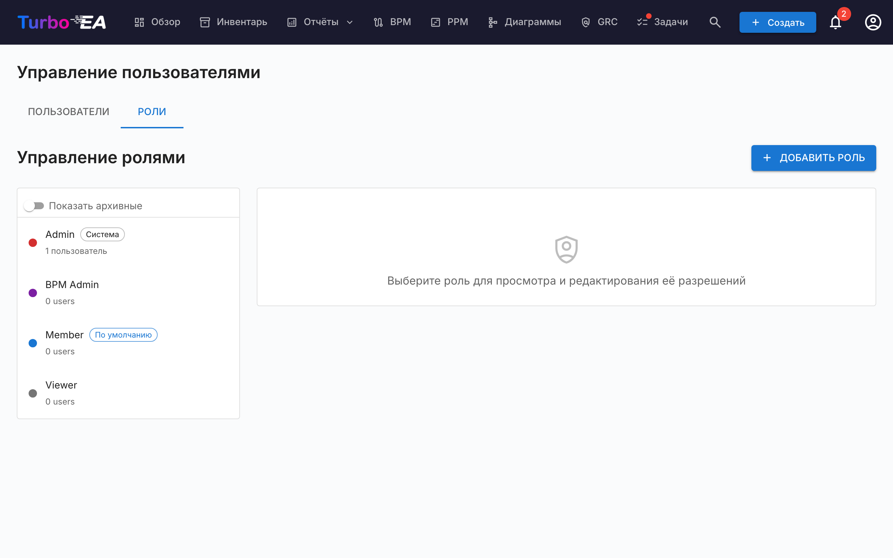

# Пользователи и роли

Страница **Пользователи и роли** содержит две вкладки: **Пользователи** (управление учётными записями) и **Роли** (управление разрешениями).

#### Таблица пользователей

Список пользователей — это **AG Grid** (та же раскладка Quartz, что и на странице [Инвентаризации](../guide/inventory.md)) с изменяемой по ширине боковой панелью фильтров слева. Отображаемые столбцы:

| Столбец | Описание |
|---------|----------|
| **Имя** | Отображаемое имя пользователя |
| **Электронная почта** | Адрес электронной почты (используется для входа) |
| **Роль** | Назначенная роль (выбирается прямо в строке через выпадающий список) |
| **Аутентификация** | Метод аутентификации: «Локальная», «SSO», «SSO + Пароль» или «Ожидание настройки» |
| **Последний вход** | Дата и время последнего входа пользователя. Показывает «—», если пользователь ни разу не входил в систему |
| **Статус** | Активен или Отключён |
| **Действия** | Редактировать, активировать/деактивировать или удалить пользователя |

#### Боковая панель фильтров

Слева от сетки расположена боковая панель с двумя вкладками (**Фильтры** и **Столбцы**):

- **Поиск** — подстроковое совпадение по имени и e-mail.
- **Роль** — чипы множественного выбора с цветом роли, чтобы можно было ограничить, например, «всеми участниками + просматривающими».
- **Статус** — Активен / Отключён.
- **Метод аутентификации** — Локальная / SSO / SSO + Пароль / Ожидание настройки.
- **Только ожидание настройки пароля** — быстрый переключатель для поиска приглашённых пользователей, ещё не завершивших onboarding.
- Вкладка **Столбцы** — показать/скрыть отдельные столбцы.

Состояние фильтра, видимые столбцы, ширина боковой панели и её свёрнутое состояние сохраняются **для каждого пользователя** в `localStorage` под ключом `turboea_usersAdmin` — они переживают выходы из системы и перезагрузки страниц.

#### Создание пользователя

1. Нажмите кнопку **Создать пользователя** (вверху справа). Отправка приглашения по электронной почте — это лишь один из параметров диалога; основное действие — создание учётной записи.
2. Заполните форму:
   - **Отображаемое имя** (обязательно): Полное имя пользователя
   - **Электронная почта** (обязательно): Адрес электронной почты, который будет использоваться для входа
   - **Пароль** (необязательно): Оставьте пустым, чтобы пользователь сам задал пароль при первом входе. Если SSO включён, пользователь без пароля может вместо этого войти через своего провайдера SSO
   - **Роль**: Выберите назначаемую роль (Администратор, Участник, Наблюдатель или любая пользовательская роль)
   - **Отправить приглашение по электронной почте**: Установите флажок, чтобы отправить пользователю уведомление с инструкциями по входу
3. Нажмите **Создать пользователя**, чтобы создать учётную запись.

**Что происходит за кулисами:**
- В системе создаётся учётная запись пользователя
- Также создаётся запись приглашения SSO, поэтому при входе пользователя через SSO ему автоматически назначается заранее определённая роль
- Если пароль не задан (учётная запись «Ожидание настройки»), генерируется одноразовый токен для установки пароля. Если вы установите флажок «Отправить письмо-приглашение», он доставляется в виде ссылки для установки пароля; иначе пользователь задаёт пароль при первом входе через пункт «Забыли пароль?» на странице входа — это работает, даже если у него никогда не было пароля

#### Редактирование пользователя

Нажмите **значок редактирования** в строке любого пользователя, чтобы открыть диалог «Редактирование пользователя». Вы можете изменить:

- **Отображаемое имя** и **Электронную почту**
- **Метод аутентификации** (отображается только при включённом SSO): Переключение между «Локальной» и «SSO». Это позволяет администраторам конвертировать существующую локальную учётную запись в SSO и наоборот. При переключении на SSO учётная запись будет автоматически связана при следующем входе пользователя через провайдера SSO
- **Пароль** (только для локальных пользователей): Установите новый пароль. Оставьте пустым, чтобы сохранить текущий
- **Роль**: Изменить роль пользователя на уровне приложения

#### Привязка существующей локальной учётной записи к SSO

Если у пользователя уже есть локальная учётная запись и ваша организация включает SSO, пользователь увидит ошибку «Локальная учётная запись с таким email уже существует» при попытке войти через SSO. Для решения:

1. Перейдите в **Администрирование > Пользователи**
2. Нажмите **значок редактирования** рядом с пользователем
3. Измените **Метод аутентификации** с «Локальная» на «SSO»
4. Нажмите **Сохранить изменения**
5. Теперь пользователь может входить через SSO. Его учётная запись будет автоматически связана при первом входе через SSO

#### Массовые операции

Используйте флажки в строках таблицы пользователей, чтобы выбрать сразу несколько учётных записей. Над таблицей появится панель действий со следующими возможностями:

- **Изменить роль** — назначить одну роль всем выбранным пользователям
- **Активировать** / **Деактивировать** — переключить `is_active` для выбранных
- **Удалить** — окончательно удалить выбранных пользователей (удаляются только деактивированные; активные пользователи в выборке пропускаются с пояснением)

Действует защита «последнего администратора»: массовая смена ролей, после которой не останется ни одного активного администратора, отклоняется. То же касается деактивации или удаления последнего администратора.

#### Импорт пользователей из таблицы

1. Нажмите кнопку **Импорт** (вверху справа). Мастер откроет область перетаскивания для файлов `.xlsx`.
2. Перетащите или выберите файл Excel. Ожидаемые столбцы:

   | Столбец | Обязательный | Описание |
   |---------|--------------|----------|
   | `email` | Да | Используется как идентификатор пользователя (регистр не учитывается). |
   | `display_name` | Да | Полное имя, отображаемое в приложении. |
   | `role` | Нет | Ключ роли (например, `admin`, `member`, `viewer`). По умолчанию `viewer`, если пусто. |
   | `password` | Нет | Только локальные учётные записи. Оставьте пустым, чтобы приглашённые задавали пароль по ссылке из приглашения. |
   | `locale` | Нет | Язык интерфейса (например, `en`, `de`, `fr`). |
   | `is_active` | Нет | `TRUE` / `FALSE` — переопределяет статус активности у существующих пользователей. |

3. Мастер проверит файл и покажет отчёт: строки на создание, строки на обновление (с пошаговым сравнением полей), ошибки, блокирующие импорт, и предупреждения, не блокирующие его.
4. Если есть новые строки, включите **Отправлять приглашения новым пользователям**. При включённой опции каждый новый пользователь получает письмо-приглашение со ссылкой для входа или установки пароля.
5. Нажмите **Импорт**, чтобы применить изменения. Шкала прогресса показывает статус по строкам; итоговое окно выводит счётчики создания, обновления и ошибок.

Самый быстрый способ начать — сначала нажать **Экспорт**, отредактировать полученный `.xlsx` и повторно импортировать тот же файл — мастер распознает существующие адреса как обновления, а не как создания.

#### Экспорт списка пользователей

Нажмите кнопку **Экспорт** (вверху справа), чтобы скачать текущий отфильтрованный список пользователей в виде Excel-файла (`users_export_YYYY-MM-DD_HHMM.xlsx`). Экспорт учитывает все фильтры и поисковые запросы в боковой панели, поэтому можно ограничить экспорт подмножеством (например, только приглашёнными пользователями или одной ролью).

#### Ожидающие приглашения

Под таблицей пользователей раздел **Ожидающие приглашения** показывает все приглашения, которые ещё не были приняты. Каждое приглашение отображает адрес электронной почты, заранее назначенную роль и дату приглашения. Вы можете отозвать приглашение, нажав на значок удаления.

#### Роли

Вкладка **Роли** позволяет управлять ролями на уровне приложения. Каждая роль определяет набор разрешений, контролирующих, что могут делать пользователи с этой ролью. Стандартные роли:

| Роль | Описание |
|------|----------|
| **Администратор** | Полный доступ ко всем функциям и администрированию |
| **Администратор BPM** | Полные права BPM плюс доступ к инвентарю, без доступа к настройкам администратора |
| **Участник** | Создание, редактирование и управление карточками, связями и комментариями. Нет доступа к администрированию |
| **Наблюдатель** | Доступ только для чтения ко всем областям |

Пользовательские роли могут быть созданы с детальным контролем разрешений для инвентаря, связей, заинтересованных сторон, комментариев, документов, диаграмм, BPM, отчётов и прочего.

#### Деактивация пользователя

Нажмите **значок переключателя** в столбце «Действия», чтобы активировать или деактивировать пользователя. Деактивированные пользователи:

- Не могут войти в систему
- Сохраняют свои данные (карточки, комментарии, историю) для целей аудита
- Могут быть повторно активированы в любое время
