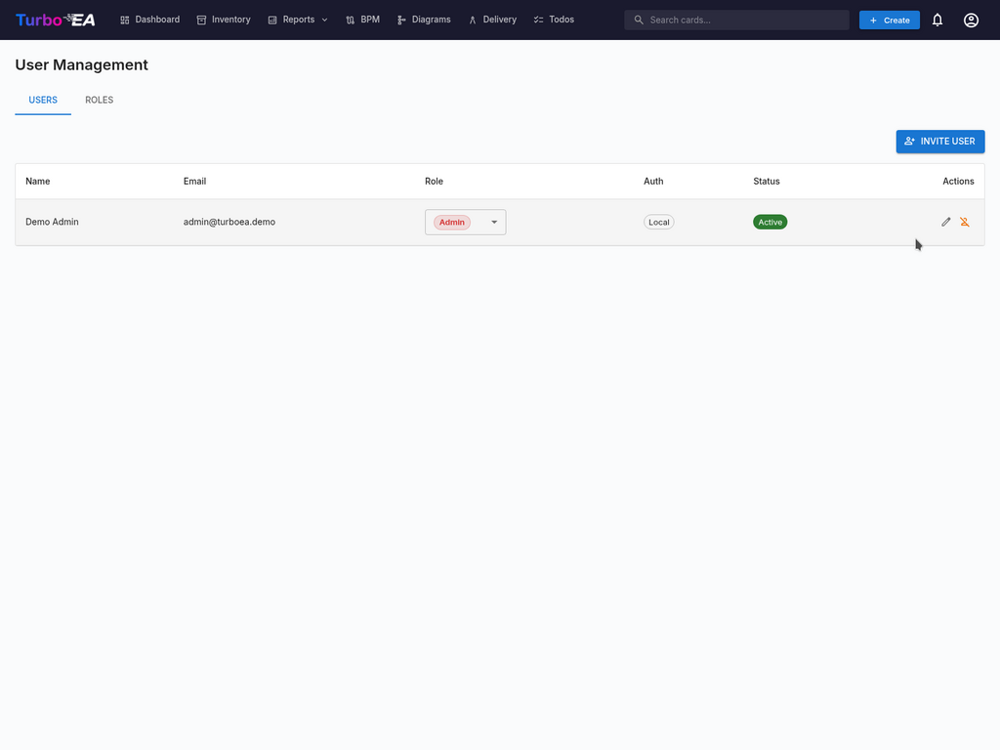

# Пользователи и роли

Страница **Пользователи и роли** содержит две вкладки: **Пользователи** (управление учётными записями) и **Роли** (управление разрешениями).

#### Таблица пользователей

Список пользователей отображает все зарегистрированные учётные записи со следующими столбцами:

| Столбец | Описание |
|---------|----------|
| **Имя** | Отображаемое имя пользователя |
| **Электронная почта** | Адрес электронной почты (используется для входа) |
| **Роль** | Назначенная роль (выбирается прямо в строке через выпадающий список) |
| **Аутентификация** | Метод аутентификации: «Локальная», «SSO», «SSO + Пароль» или «Ожидание настройки» |
| **Статус** | Активен или Отключён |
| **Действия** | Редактировать, активировать/деактивировать или удалить пользователя |

#### Приглашение нового пользователя

1. Нажмите кнопку **Пригласить пользователя** (вверху справа)
2. Заполните форму:
   - **Отображаемое имя** (обязательно): Полное имя пользователя
   - **Электронная почта** (обязательно): Адрес электронной почты, который будет использоваться для входа
   - **Пароль** (необязательно): Если оставить пустым и SSO отключён, пользователь получит письмо со ссылкой для установки пароля. Если SSO включён, пользователь может войти через своего провайдера SSO без пароля
   - **Роль**: Выберите назначаемую роль (Администратор, Участник, Наблюдатель или любая пользовательская роль)
   - **Отправить приглашение по электронной почте**: Установите флажок, чтобы отправить пользователю уведомление с инструкциями по входу
3. Нажмите **Пригласить пользователя**, чтобы создать учётную запись

**Что происходит за кулисами:**
- В системе создаётся учётная запись пользователя
- Также создаётся запись приглашения SSO, поэтому при входе пользователя через SSO ему автоматически назначается заранее определённая роль
- Если пароль не задан и SSO отключён, генерируется токен для установки пароля. Пользователь может установить пароль, перейдя по ссылке в письме-приглашении

#### Редактирование пользователя

Нажмите **значок редактирования** в строке любого пользователя, чтобы открыть диалог «Редактирование пользователя». Вы можете изменить:

- **Отображаемое имя** и **Электронную почту**
- **Метод аутентификации** (отображается только при включённом SSO): Переключение между «Локальной» и «SSO». Это позволяет администраторам конвертировать существующую локальную учётную запись в SSO и наоборот. При переключении на SSO учётная запись будет автоматически связана при следующем входе пользователя через провайдера SSO
- **Пароль** (только для локальных пользователей): Установите новый пароль. Оставьте пустым, чтобы сохранить текущий
- **Роль**: Изменить роль пользователя на уровне приложения

#### Привязка существующей локальной учётной записи к SSO

Если у пользователя уже есть локальная учётная запись и ваша организация включает SSO, пользователь увидит ошибку «Локальная учётная запись с таким email уже существует» при попытке войти через SSO. Для решения:

1. Перейдите в **Администрирование > Пользователи**
2. Нажмите **значок редактирования** рядом с пользователем
3. Измените **Метод аутентификации** с «Локальная» на «SSO»
4. Нажмите **Сохранить изменения**
5. Теперь пользователь может входить через SSO. Его учётная запись будет автоматически связана при первом входе через SSO

#### Ожидающие приглашения

Под таблицей пользователей раздел **Ожидающие приглашения** показывает все приглашения, которые ещё не были приняты. Каждое приглашение отображает адрес электронной почты, заранее назначенную роль и дату приглашения. Вы можете отозвать приглашение, нажав на значок удаления.

#### Роли

Вкладка **Роли** позволяет управлять ролями на уровне приложения. Каждая роль определяет набор разрешений, контролирующих, что могут делать пользователи с этой ролью. Стандартные роли:

| Роль | Описание |
|------|----------|
| **Администратор** | Полный доступ ко всем функциям и администрированию |
| **Администратор BPM** | Полные права BPM плюс доступ к инвентарю, без доступа к настройкам администратора |
| **Участник** | Создание, редактирование и управление карточками, связями и комментариями. Нет доступа к администрированию |
| **Наблюдатель** | Доступ только для чтения ко всем областям |

Пользовательские роли могут быть созданы с детальным контролем разрешений для инвентаря, связей, заинтересованных сторон, комментариев, документов, диаграмм, BPM, отчётов и прочего.

#### Деактивация пользователя

Нажмите **значок переключателя** в столбце «Действия», чтобы активировать или деактивировать пользователя. Деактивированные пользователи:

- Не могут войти в систему
- Сохраняют свои данные (карточки, комментарии, историю) для целей аудита
- Могут быть повторно активированы в любое время
