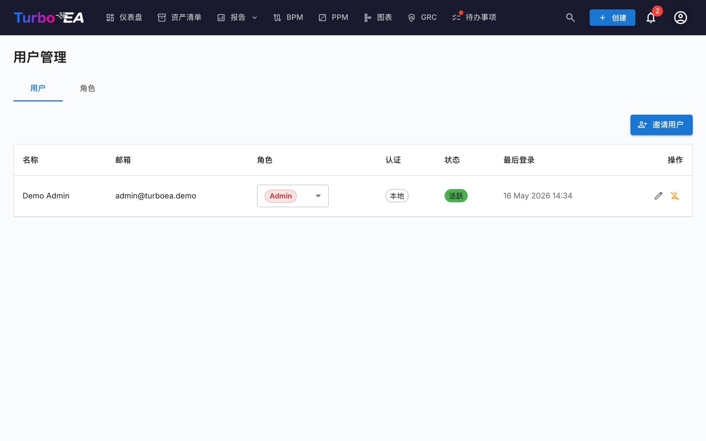
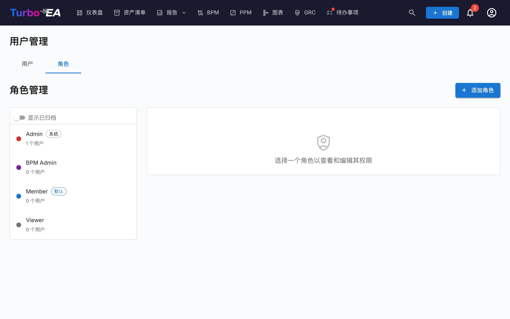

# 用户与角色

**用户与角色**页面有两个标签页：**用户**（管理账户）和**角色**（管理权限）。

#### 用户表格

用户列表是一个 **AG Grid**（与 [资产清单](../guide/inventory.md) 页面使用相同的 Quartz 布局），左侧带有可调宽度的过滤侧栏。显示的列包括：

| 列 | 描述 |
|----|------|
| **名称** | 用户的显示名称 |
| **电子邮箱** | 电子邮箱地址（用于登录） |
| **角色** | 分配的角色（可通过下拉菜单行内选择） |
| **认证** | 认证方式：「本地」、「SSO」、「SSO + 密码」或「待设置」 |
| **最后登录** | 用户最近一次登录的日期和时间。如果用户从未登录过，则显示「—」 |
| **状态** | 活跃或已禁用 |
| **操作** | 编辑、激活/停用或删除用户 |

#### 过滤侧栏

网格左侧有一个双标签侧栏（**过滤** 和 **列**）：

- **搜索** — 在姓名和邮箱上做子串匹配。
- **角色** — 带角色颜色的多选标签，便于将范围限定为例如「所有成员 + 查看者」。
- **状态** — 活跃 / 已禁用。
- **认证方式** — 本地 / SSO / SSO + 密码 / 待设置。
- **仅显示密码待设置** — 快速开关，用于查找尚未完成入职的受邀用户。
- **列** 标签 — 显示/隐藏单个列。

过滤状态、可见列、侧栏宽度和折叠状态会**按用户**持久化到 `localStorage` 的 `turboea_usersAdmin` 键 — 它们会在登出和页面重载后保留。

#### 创建用户

1. 点击**创建用户**按钮（右上角）。发送邀请邮件只是对话框中的一个选项 — 主要操作是创建账户。
2. 填写表单：
   - **显示名称**（必填）：用户的全名
   - **电子邮箱**（必填）：他们用于登录的电子邮箱地址
   - **密码**（可选）：留空以让用户在首次登录时自行设置密码。如果已启用 SSO，未设置密码的用户可改为通过其 SSO 提供商登录
   - **角色**：选择要分配的角色（管理员、成员、查看者或任何自定义角色）
   - **发送邀请邮件**：勾选此项可向用户发送包含登录说明的电子邮件通知
3. 点击**创建用户**创建账户。

**后台处理：**
- 在系统中创建用户账户
- 同时创建 SSO 邀请记录，因此如果用户通过 SSO 登录，将自动获得预分配的角色
- 如果未设置密码（即「待设置」账户），将生成一次性密码设置令牌。如果勾选「发送邀请邮件」，则以密码设置链接的形式发送；否则用户在首次登录时通过登录页面的「忘记密码」选项设置密码——即使从未设置过密码，此方式也有效

#### 编辑用户

点击任何用户行的**编辑图标**打开编辑用户对话框。您可以更改：

- **显示名称**和**电子邮箱**
- **认证方式**（仅在启用 SSO 时可见）：在「本地」和「SSO」之间切换。这允许管理员将现有本地账户转换为 SSO，反之亦然。切换到 SSO 时，账户将在用户下次通过 SSO 提供商登录时自动链接
- **密码**（仅限本地用户）：设置新密码。留空保持当前密码
- **角色**：更改用户的应用级角色

#### 将现有本地账户链接到 SSO

如果用户已有本地账户且您的组织启用了 SSO，当用户尝试通过 SSO 登录时将看到错误「此电子邮箱已存在本地账户」。要解决此问题：

1. 前往**管理 > 用户**
2. 点击用户旁边的**编辑图标**
3. 将**认证方式**从「本地」更改为「SSO」
4. 点击**保存更改**
5. 用户现在可以通过 SSO 登录。其账户将在首次 SSO 登录时自动链接

#### 批量操作

使用用户表格中行首的复选框可一次选择多个用户。表格上方会出现一个批量操作工具栏，提供以下功能：

- **更改角色** — 为所有选中的用户分配单一角色
- **启用** / **停用** — 切换所选用户的 `is_active`
- **删除** — 永久删除所选用户（仅删除已停用的用户；选择中的活跃用户会被跳过并附带说明）

「最后一名管理员」保护始终生效：会导致零名活跃管理员的批量角色变更会被拒绝；停用或删除最后一名管理员同样会被拒绝。

#### 通过电子表格导入用户

1. 点击右上角的**导入**按钮。向导会打开一个用于 `.xlsx` 文件的拖放区域。
2. 放入或选择一个 Excel 文件。期望的列如下：

   | 列 | 必填 | 说明 |
   |----|------|------|
   | `email` | 是 | 用作用户身份（不区分大小写）。 |
   | `display_name` | 是 | 在应用中显示的完整姓名。 |
   | `role` | 否 | 角色键（如 `admin`、`member`、`viewer`）。为空时默认为 `viewer`。 |
   | `password` | 否 | 仅限本地账户。留空时受邀者可通过邀请链接自行设置密码。 |
   | `locale` | 否 | 界面语言（如 `en`、`de`、`fr`）。 |
   | `is_active` | 否 | `TRUE` / `FALSE` — 覆盖现有用户的启用状态。 |

3. 向导会校验文件并显示报告：将要创建的行、将要更新的行（含每个字段的差异）、阻止导入的错误，以及不阻止的警告。
4. 如果存在新行，可勾选**向新用户发送邀请邮件**。开启后，每个新建用户都会收到一封含登录或密码设置链接的邀请邮件。
5. 点击**导入**应用。进度条会显示逐行状态；最终界面列出创建、更新与失败数量。

最快的开始方式是先点击**导出**，编辑生成的 `.xlsx`，然后重新导入相同的文件 —— 向导会将已存在的邮箱识别为更新，而不是创建。

#### 导出用户列表

点击右上角的**导出**按钮，可将当前筛选后的用户列表下载为 Excel 文件（`users_export_YYYY-MM-DD_HHMM.xlsx`）。导出会遵循侧边栏中设置的所有筛选和搜索条件，因此您可以将导出范围缩小到某个子集（例如只导出已邀请的用户或某个角色的用户）。

#### 待处理邀请

在用户表格下方，**待处理邀请**部分显示所有尚未接受的邀请。每个邀请显示电子邮箱、预分配角色和邀请日期。您可以点击删除图标撤销邀请。

#### 角色

**角色**标签页允许管理应用级角色。每个角色定义一组控制该角色用户可以做什么的权限。默认角色：

| 角色 | 描述 |
|------|------|
| **管理员** | 对所有功能和管理的完全访问权限 |
| **BPM 管理员** | 完整的 BPM 权限加清单访问，无管理设置权限 |
| **成员** | 创建、编辑和管理卡片、关系和评论。无管理访问权限 |
| **查看者** | 所有区域的只读访问权限 |

可以创建自定义角色，对清单、关系、干系人、评论、文档、图表、BPM、报告等进行精细权限控制。

#### 停用用户

点击操作列中的**切换图标**激活或停用用户。已停用的用户：

- 无法登录
- 保留其数据（卡片、评论、历史记录）用于审计目的
- 可以随时重新激活
