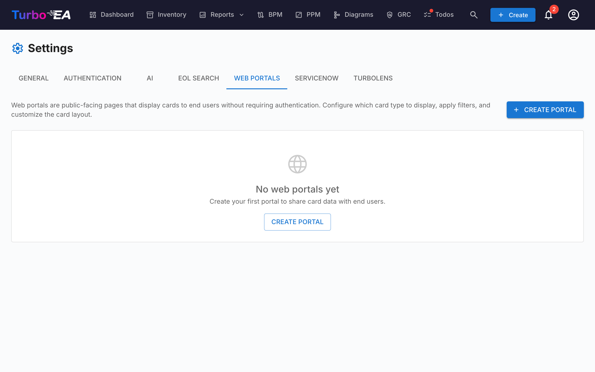

# البوابات الإلكترونية

تتيح لك ميزة **البوابات الإلكترونية** (**Admin > Settings > Web Portals**) إنشاء **عروض عامة للقراءة فقط** لبيانات بطاقات محدّدة — يمكن الوصول إليها دون مصادقة عبر عنوان URL فريد.



## حالة الاستخدام

تكون البوابات الإلكترونية مفيدة لمشاركة معلومات هندسة المؤسسة مع أصحاب المصلحة الذين لا يملكون حسابًا في Turbo EA:

- **كتالوج تقني** — شارك مشهد التطبيقات مع مستخدمي الأعمال
- **دليل الخدمات** — انشر خدمات تقنية المعلومات ومالكيها
- **خريطة القدرات** — وفّر عرضًا عامًا لقدرات الأعمال

## حماية الوصول

لكل بوابة **وضع وصول** يتحكم في من يمكنه فتحها:

| الوضع | السلوك |
|------|--------|
| **أي شخص لديه الرابط** | تصبح البوابة قابلة للقراءة للجميع بمجرد نشرها — يمكن لأي شخص يعرف الرابط عرضها. هذا هو الوضع الافتراضي والسلوك السابق. |
| **تسجيل الدخول عبر SSO** | يجب على الزوار المصادقة عبر موفّر الهوية الخاص بمؤسستك قبل عرض أي بيانات. |

يعيد **وضع SSO** استخدام الدخول الموحّد الذي سبق أن هيّأته ضمن **الإدارة > الإعدادات > المصادقة**، ويحمي البوابات **دون** إدارة مستخدمين إضافيين:

- يسجّل الزوار الدخول عبر موفّر الهوية، لكن **لا يتم إنشاؤهم أبدًا كمستخدمي Turbo EA** — لا حساب ولا دور ولا ترخيص.
- يحصل الزائر على جلسة قصيرة الأمد خاصة بالبوابة. لا يُعرض أي شيء حتى يكتمل تسجيل الدخول.
- اختياريًا، حدّد قائمة **نطاقات البريد الإلكتروني المسموح بها** لقصر الوصول على نطاقات محددة (مثل `company.com`). اتركها فارغة للسماح لأي مستخدم يوثّقه موفّر الهوية.

!!! note
    لا يمكن اختيار **تسجيل الدخول عبر SSO** إلا بعد تهيئة الدخول الموحّد. يعيد استخدام نفس عنوان URI لإعادة التوجيه لدى موفّر الهوية المستخدم لتسجيل الدخول العادي (`/auth/callback`)، لذا **لا حاجة إلى أي تكوين إضافي** — إذا كان تسجيل الدخول يعمل، فإن الدخول الموحّد للبوابة يعمل. يتم تسجيل دخول الزوار الذين لديهم جلسة نشطة لدى موفّر الهوية تلقائيًا دون نقر. يؤدي إلغاء نشر البوابة إلى إبطال الوصول فورًا في جميع الأوضاع.

## إنشاء بوابة

1. انتقل إلى **Admin > Settings > Web Portals**
2. انقر **+ New Portal**
3. هيّئ البوابة:

| الحقل | الوصف |
|-------|-------------|
| **Name** | الاسم المعروض للبوابة |
| **Slug** | معرّف ملائم لعنوان URL (يُنشأ تلقائيًا من الاسم، قابل للتحرير). ستكون البوابة متاحة على `/portal/{slug}` |
| **Card Type** | نوع البطاقة المراد عرضه |
| **Subtypes** | تقييد اختياري إلى أنواع فرعية محدّدة |
| **Show Logo** | ما إذا كان سيُعرض شعار المنصة على البوابة |

## تهيئة الظهور

لكل بوابة، تتحكّم بدقّة في المعلومات المرئية. يوجد سياقان:

### خصائص عرض القائمة

ما الأعمدة/الخصائص التي تظهر في قائمة البطاقات:

- **الخصائص المُضمَّنة**: الوصف، دورة الحياة، الوسوم، جودة البيانات، حالة الموافقة
- **الحقول المخصّصة**: يمكن تبديل كل حقل من مخطّط نوع البطاقة بشكل فردي

### خصائص عرض التفاصيل

ما المعلومات التي تظهر عندما ينقر زائر على بطاقة:

- نفس عناصر التبديل الموجودة في عرض القائمة، لكن للوحة التفاصيل الموسّعة

## الوصول إلى البوابة

يجري الوصول إلى البوابات على:

```
https://your-turbo-ea-domain/portal/{slug}
```

لا يلزم تسجيل الدخول. يمكن للزوّار تصفّح قائمة البطاقات والبحث وعرض تفاصيل البطاقات — لكن تظهر فقط الخصائص التي مكّنتها.

!!! note
    البوابات للقراءة فقط. لا يمكن للزوّار التحرير أو التعليق أو التفاعل مع البطاقات. لا تُكشَف البيانات الحسّاسة (أصحاب المصلحة، التعليقات، السجلّ) أبدًا على البوابات.
