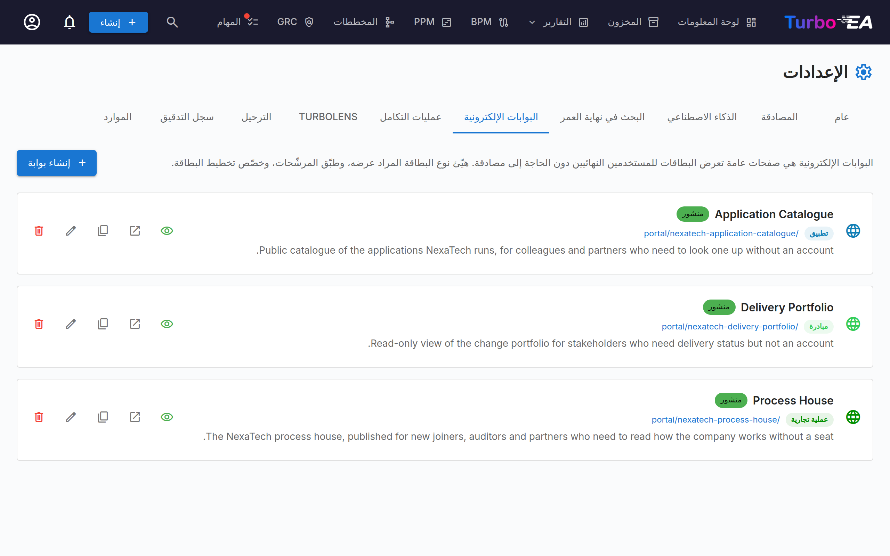

# البوابات الإلكترونية

تتيح لك ميزة **البوابات الإلكترونية** (**Admin > Settings > Web Portals**) إنشاء **عروض عامة للقراءة فقط** لبيانات بطاقات محدّدة — يمكن الوصول إليها دون مصادقة عبر عنوان URL فريد.



## حالة الاستخدام

تكون البوابات الإلكترونية مفيدة لمشاركة معلومات هندسة المؤسسة مع أصحاب المصلحة الذين لا يملكون حسابًا في Turbo EA:

- **كتالوج تقني** — شارك مشهد التطبيقات مع مستخدمي الأعمال
- **دليل الخدمات** — انشر خدمات تقنية المعلومات ومالكيها
- **خريطة القدرات** — وفّر عرضًا عامًا لقدرات الأعمال

## نوع البوابة

تنشر كل بوابة واحدة من ثلاثة عروض، يُختار عبر **نوع البوابة**:

| النوع | ما يراه الزائرون |
|-------|------------------|
| **قائمة البطاقات** | شبكة بطاقات قابلة للبحث والتصفية — البوابة التقليدية، تُضبط بالخصائص أدناه. |
| **لوحة محفظة إدارة المشاريع** | [لوحة محفظة إدارة المشاريع](../guide/ppm.md) للقراءة فقط — الجدول الزمني ومؤشرات الحالة والميزانية مقابل الفعلي لكل مبادرة نشطة. |
| **مستكشف العمليات** | [بيت العمليات](../guide/bpm.md) للقراءة فقط — التسلسل الهرمي لعمليات الأعمال ومخطط BPMN المنشور لكل عملية. |

### بوابات محفظة إدارة المشاريع

اختيار **لوحة محفظة إدارة المشاريع** يحوّل البوابة إلى عرض تنفيذي لمحفظة مشاريعك،
متاح عبر رابط عام **بلا حساب ولا ترخيص ولا تسجيل دخول**. صُمّم للحالة الشائعة التي
تريد فيها الإدارة رؤية شاملة للمحفظة دون الالتزام بمجموعة بيانات اعتماد إضافية.

تقتصر اللوحة دائماً على بطاقات **مبادرة**، لذا يكون محدِّد نوع البطاقة مقفلاً. ويظل
مرشِّحا **الأنواع الفرعية** و**الوسوم** فاعلين — وبهما تنشر برنامجاً واحداً بدلاً من
المحفظة بأكملها.

يرى الزائرون اللوحة نفسها التي يستخدمها فريقك داخل Turbo EA: الجدول الزمني الربعي،
ومؤشرات الجدولة والتكلفة والنطاق، وأشرطة النفقات الرأسمالية والتشغيلية، والتجميع حسب
أي نوع بطاقة مرتبط، ونظرة تقرير الحالة العامة التي تظهر عند تمرير المؤشر فوق تاريخ
**آخر تقرير**. والنقر على مبادرة يقود إلى Turbo EA خلف تسجيل الدخول المعتاد — وبعد
تسجيل الدخول تصل مباشرةً إلى المبادرة التي نقرت عليها.

تتحكم ثلاثة مفاتيح فيما تكشفه اللوحة المنشورة:

| المفتاح | الافتراضي | ينشر |
|---------|-----------|------|
| **إظهار الميزانية والإنفاق الفعلي** | مفعّل | أشرطة النفقات الرأسمالية والتشغيلية وإجمالي الميزانية |
| **إظهار تعليقات تقارير الحالة** | مفعّل | الملخص والإنجازات والخطوات التالية في النظرة العامة عند مرور المؤشر. ويظل تاريخ التقرير ومؤشرات الحالة ظاهرين دائماً |
| **إظهار أسماء مديري المشاريع** | **معطّل** | أسماء مديري المشاريع ومُعِدّي التقارير. معطّل افتراضياً لأن الأسماء بيانات شخصية |

تُفتح اللوحة كذلك بتجميع ونوع فرعي من اختيارك:

| الإعداد | الافتراضي | الأثر |
|---------|-----------|-------|
| **تُفتح مجمّعة حسب** | المؤسسة | التجميع الذي تعرضه اللوحة أولاً |
| **تُفتح بعرض النوع الفرعي** | الكل | النوع الفرعي المحدَّد أولاً |

وكلاهما نقطة بداية فحسب: يمكن للزائر تغيير أي من عنصري التحكم، ولا يُحفظ شيء، فإعادة
فتح البوابة تعود إلى ما ضبطته هنا. وهذا يختلف عن **مرشِّح الأنواع الفرعية** أعلاه،
الذي يقرر أي المبادرات تُنشر أصلاً.

!!! note
    ثمة أمور لا تُنشر أبداً مهما كان اختيارك: حقول التكلفة المخزّنة على بطاقة المبادرة
    نفسها، وعناوين البريد الإلكتروني للمستخدمين، وكل ما في صفحة تفاصيل المبادرة — حزم
    العمل والمعالم والمخاطر والمهام وسجل التقارير تبقى جميعها خلف تسجيل الدخول.

يمكن حماية بوابة المحفظة بتسجيل الدخول الموحّد مثل أي بوابة أخرى. وإيقاف وحدة إدارة
المشاريع من **الإدارة > الإعدادات** يجعل كل بوابات المحفظة غير متاحة فوراً، دون الحاجة
إلى إلغاء نشرها واحدة تلو الأخرى.

### بوابات مستكشف العمليات

يحوّل اختيار **مستكشف العمليات** البوابة إلى عرض للقراءة فقط من **بيت العمليات** لديك،
متاح عبر رابط عام **بلا حساب ولا ترخيص ولا تسجيل دخول**. وُجد لمن هم في أمسّ الحاجة إلى
فهم كيفية عمل المؤسسة وأقلّهم حظاً في الحصول على مقعد: الموظفون الجدد والمدققون وفرق
الخطوط الأمامية والشركاء الخارجيون.

تقتصر البوابة دائماً على بطاقات **عملية الأعمال**، لذا يكون منتقي نوع البطاقة مقفلاً. ولا
تزال عوامل تصفية **الأنواع الفرعية** و**الوسوم** سارية — وبها تنشر فرعاً واحداً من البيت
بدلاً من البيت كله.

يحصل الزوار على البيت نفسه الذي يستخدمه فريقك داخل Turbo EA: التسلسل الهرمي مُجمّعاً في
صفوف حسب نوع العملية، ومنزلق المستوى، والتكبير ومسار التنقل، والبحث، والتلوينات، ومرشّح
المؤسسات، وعدد الأعمدة. وعند فتح عملية تظهر نظرتها العامة وخطواتها و**مخطط BPMN المنشور**
لها — بملء الشاشة، مع التحريك والتكبير، تماماً كما يراه فريقك.

يتحكم في البيت المنشور إعدادان وحالتا فتح:

| الإعداد | الافتراضي | الأثر |
|---------|-----------|-------|
| **إظهار الأنظمة المرتبطة بكل خطوة** | **مُعطَّل** | أسماء التطبيقات وكائنات البيانات ومكوّنات تقنية المعلومات والمؤسسات المرتبطة بكل خطوة. مُعطَّل افتراضياً لأنه يكشف الأنظمة التي تشغّل عملياتك |
| **يفتح عند المستوى** | 2 | عمق التسلسل الهرمي المعروض أولاً |
| **يفتح ملوناً حسب** | نوع العملية | السمة التي تلوّن المربعات أولاً |

الأخيران نقطة بداية فحسب — يمكن للزائر تغيير أيٍّ من عنصري التحكم، ولا يُحفظ شيء، لذا تعود
إعادة فتح البوابة إلى ما أعددته هنا.

!!! note
    ثمة أمور لا تُنشر أبداً مهما اخترت: التطبيقات وكائنات البيانات والتكاليف خلف العملية،
    ومصفوفة «العملية × التطبيق» وعرض التبعيات، وأي مخطط BPMN غير **منشور** — تبقى المسودات
    والمراجعات المعلّقة والمؤرشفة والمسحوبة خلف تسجيل الدخول.

وخلافاً لبوابة المحفظة التي تقود صفوفها إلى Turbo EA بعد تسجيل الدخول المعتاد، فإن بوابة
مستكشف العمليات **لا تقود إلى أي مكان**. وهذا مقصود: بيت يُنشر لقرّاء بلا حسابات ينبغي أن
يجيب عن «كيف نفعل هذا» دون أن يعرض باباً لا يستطيعون فتحه.

يمكن حماية بوابة مستكشف العمليات بتسجيل الدخول الموحّد كأي بوابة أخرى. وإيقاف وحدة BPM من
**الإدارة > الإعدادات** يُطفئ فوراً كل بوابات العمليات؛ ولا حاجة لإلغاء نشرها واحدة واحدة.

## حماية الوصول

لكل بوابة **وضع وصول** يتحكم في من يمكنه فتحها:

| الوضع | السلوك |
|------|--------|
| **أي شخص لديه الرابط** | تصبح البوابة قابلة للقراءة للجميع بمجرد نشرها — يمكن لأي شخص يعرف الرابط عرضها. هذا هو الوضع الافتراضي والسلوك السابق. |
| **تسجيل الدخول عبر SSO** | يجب على الزوار المصادقة عبر موفّر الهوية الخاص بمؤسستك قبل عرض أي بيانات. |

يعيد **وضع SSO** استخدام الدخول الموحّد الذي سبق أن هيّأته ضمن **الإدارة > الإعدادات > المصادقة**، ويحمي البوابات **دون** إدارة مستخدمين إضافيين:

- يسجّل الزوار الدخول عبر موفّر الهوية، لكن **لا يتم إنشاؤهم أبدًا كمستخدمي Turbo EA** — لا حساب ولا دور ولا ترخيص.
- يحصل الزائر على جلسة قصيرة الأمد خاصة بالبوابة. لا يُعرض أي شيء حتى يكتمل تسجيل الدخول.
- اختياريًا، حدّد قائمة **نطاقات البريد الإلكتروني المسموح بها** لقصر الوصول على نطاقات محددة (مثل `company.com`). اتركها فارغة للسماح لأي مستخدم يوثّقه موفّر الهوية.

!!! note
    لا يمكن اختيار **تسجيل الدخول عبر SSO** إلا بعد تهيئة الدخول الموحّد. يعيد استخدام نفس عنوان URI لإعادة التوجيه لدى موفّر الهوية المستخدم لتسجيل الدخول العادي (`/auth/callback`)، لذا **لا حاجة إلى أي تكوين إضافي** — إذا كان تسجيل الدخول يعمل، فإن الدخول الموحّد للبوابة يعمل. يتم تسجيل دخول الزوار الذين لديهم جلسة نشطة لدى موفّر الهوية تلقائيًا دون نقر. يؤدي إلغاء نشر البوابة إلى إبطال الوصول فورًا في جميع الأوضاع.

## إنشاء بوابة

1. انتقل إلى **Admin > Settings > Web Portals**
2. انقر **+ New Portal**
3. هيّئ البوابة:

| الحقل | الوصف |
|-------|-------------|
| **Name** | الاسم المعروض للبوابة |
| **Slug** | معرّف ملائم لعنوان URL (يُنشأ تلقائيًا من الاسم، قابل للتحرير). ستكون البوابة متاحة على `/portal/{slug}` |
| **Card Type** | نوع البطاقة المراد عرضه |
| **Subtypes** | تقييد اختياري إلى أنواع فرعية محدّدة |
| **Show Logo** | ما إذا كان سيُعرض شعار المنصة على البوابة |

## تهيئة الظهور

لكل بوابة، تتحكّم بدقّة في المعلومات المرئية. يوجد سياقان:

### خصائص عرض القائمة

ما الأعمدة/الخصائص التي تظهر في قائمة البطاقات:

- **الخصائص المُضمَّنة**: الوصف، دورة الحياة، الوسوم، جودة البيانات، حالة الموافقة
- **الحقول المخصّصة**: يمكن تبديل كل حقل من مخطّط نوع البطاقة بشكل فردي

### خصائص عرض التفاصيل

ما المعلومات التي تظهر عندما ينقر زائر على بطاقة:

- نفس عناصر التبديل الموجودة في عرض القائمة، لكن للوحة التفاصيل الموسّعة

## الوصول إلى البوابة

يجري الوصول إلى البوابات على:

```
https://your-turbo-ea-domain/portal/{slug}
```

لا يلزم تسجيل الدخول. يمكن للزوّار تصفّح قائمة البطاقات والبحث وعرض تفاصيل البطاقات — لكن تظهر فقط الخصائص التي مكّنتها.

!!! note
    البوابات للقراءة فقط. لا يمكن للزوّار التحرير أو التعليق أو التفاعل مع البطاقات. لا تُكشَف البيانات الحسّاسة (أصحاب المصلحة، التعليقات، السجلّ) أبدًا على البوابات.
