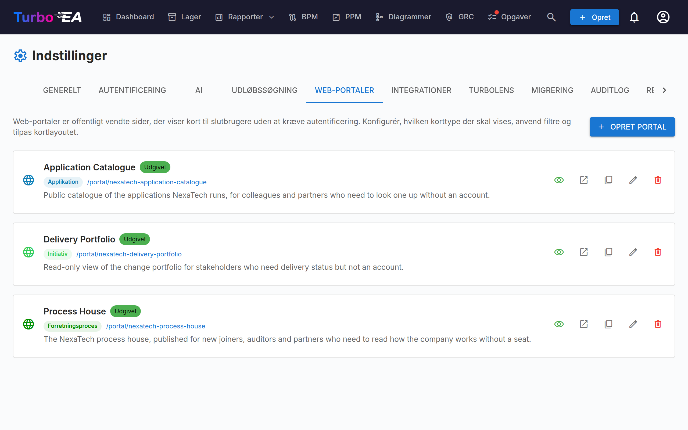

# Webportaler

Funktionen **Webportaler** (**Admin > Indstillinger > Webportaler**) lader dig oprette **offentlige, skrivebeskyttede visninger** af udvalgte kortdata — tilgængelige uden autentificering via en unik URL.



## Anvendelsesscenarie

Webportaler er nyttige til at dele arkitekturinformation med interessenter, der ikke har en Turbo EA-konto:

- **Teknologikatalog** — Del applikationslandskabet med forretningsbrugere
- **Servicekatalog** — Publicér IT-tjenester og deres ejere
- **Capability-kort** — Tilbyd en offentlig visning af forretningskompetencer

## Portaltype

Hver portal offentliggør én af to visninger, valgt med **Portaltype**:

| Type | Hvad besøgende ser |
|------|--------------------|
| **Kortliste** | Et gitter af kort, der kan søges og filtreres — den klassiske portal, konfigureret med egenskaberne nedenfor. |
| **PPM-porteføljetavle** | Den skrivebeskyttede [PPM-porteføljetavle](../guide/ppm.md) — tidslinje, statusindikatorer og budget over for faktisk forbrug for hvert aktivt initiativ. |

### PPM-porteføljeportaler

Vælger du **PPM-porteføljetavle**, bliver portalen til en ledelsesvisning af din
projektportefølje, tilgængelig via et offentligt link **uden konto, uden licens og uden
login**. Lavet til det almindelige tilfælde, hvor ledelsen ønsker indblik i porteføljen,
men ikke vil vedligeholde endnu et sæt loginoplysninger.

Tavlen omfatter altid **Initiativ**-kort, så korttypevælgeren er låst. Filtrene for
**undertyper** og **tags** gælder fortsat — det er sådan, du offentliggør ét program i
stedet for hele porteføljen.

Besøgende ser den samme tavle, som dit team bruger inde i Turbo EA: den kvartalsvise
tidslinje, indikatorerne for tid/omkostning/omfang, CapEx- og OpEx-bjælkerne, gruppering
efter enhver relateret korttype og statusrapportoversigten, der vises, når du holder
musen over datoen **Seneste rapport**. Et klik på et initiativ fører ind i Turbo EA bag
det normale login — efter login lander du på det initiativ, du klikkede på.

Tre kontakter styrer, hvad den offentliggjorte tavle viser:

| Kontakt | Standard | Offentliggør |
|---------|----------|--------------|
| **Vis budget og faktisk forbrug** | Til | CapEx- og OpEx-bjælkerne samt det samlede budget |
| **Vis kommentarer fra statusrapporter** | Til | Resumé, resultater og næste skridt i oversigten ved museover. Rapportdato og statusindikatorer vises altid |
| **Vis projektledernes navne** | **Fra** | Navnene på projektledere og rapportforfattere. Slået fra som standard, fordi navne er personoplysninger |

!!! note
    Noget offentliggøres aldrig, uanset hvad du vælger: omkostningsfelter gemt på selve
    Initiativ-kortet, brugernes e-mailadresser og alt på et initiativs detaljeside —
    arbejdspakker, milepæle, risici, opgaver og rapporthistorik forbliver bag login.

En porteføljeportal kan SSO-beskyttes som enhver anden portal. Slår du PPM-modulet fra
under **Admin > Indstillinger**, bliver alle porteføljeportaler utilgængelige med det
samme; du behøver ikke afpublicere dem én ad gangen.

## Adgangsbeskyttelse

Hver portal har en **adgangstilstand**, der styrer, hvem der kan åbne den:

| Tilstand | Adfærd |
|----------|--------|
| **Alle med linket** | Når portalen er udgivet, er den offentligt læsbar — alle, der kender URL'en, kan se den. Dette er standard og den hidtidige adfærd. |
| **Log ind med SSO** | Besøgende skal godkendes hos din organisations identitetsudbyder, før nogen portaldata vises. |

**SSO-tilstand** genbruger det single sign-on, du allerede har konfigureret under **Admin > Indstillinger > Godkendelse**, og beskytter portaler **uden** at administrere ekstra brugere:

- Besøgende logger ind via din identitetsudbyder, men **oprettes aldrig som Turbo EA-brugere** — ingen konto, ingen rolle, ingen licens.
- Den besøgende får en kortvarig, portalspecifik session. Intet vises, før login er gennemført.
- Du kan eventuelt angive en liste over **tilladte e-maildomæner** for at begrænse adgangen til bestemte domæner (f.eks. `virksomhed.com`). Lad feltet stå tomt for at tillade enhver bruger, som din identitetsudbyder godkender.

!!! note
    **Log ind med SSO** kan først vælges, når single sign-on er konfigureret. Den genbruger den samme redirect-URI hos din identitetsudbyder som normalt login (`/auth/callback`), så **der kræves ingen ekstra konfiguration** — hvis login virker, virker portal-SSO. Besøgende med en aktiv session hos identitetsudbyderen logges ind automatisk uden klik. Afpublicering af en portal tilbagekalder øjeblikkeligt adgangen i alle tilstande.

## Oprettelse af en portal

1. Naviger til **Admin > Indstillinger > Webportaler**
2. Klik på **+ Ny portal**
3. Konfigurer portalen:

| Felt | Beskrivelse |
|-------|-------------|
| **Navn** | Visningsnavn for portalen |
| **Slug** | URL-venlig identifikator (auto-genereret fra navn, redigerbar). Portalen vil være tilgængelig på `/portal/{slug}` |
| **Korttype** | Hvilken korttype der skal vises |
| **Undertyper** | Begræns eventuelt til specifikke undertyper |
| **Vis logo** | Hvorvidt platformlogoet skal vises på portalen |

## Konfiguration af synlighed

For hver portal styrer du præcis, hvilken information der er synlig. Der er to kontekster:

### Listevisnings-egenskaber

Hvilke kolonner/egenskaber der vises i kortlisten:

- **Indbyggede egenskaber**: beskrivelse, livscyklus, tags, datakvalitet, godkendelsesstatus
- **Brugerdefinerede felter**: Hvert felt fra korttypens skema kan slås individuelt til/fra

### Detaljevisnings-egenskaber

Hvilken information der vises, når en besøgende klikker på et kort:

- Samme omskifterkontroller som listevisning, men for det udvidede detaljepanel

## Portal-adgang

Portaler tilgås på:

```
https://your-turbo-ea-domain/portal/{slug}
```

Intet login er påkrævet. Besøgende kan browse kortlisten, søge og se kortdetaljer — men kun de egenskaber, du har aktiveret, vises.

!!! note
    Portaler er skrivebeskyttede. Besøgende kan ikke redigere, kommentere eller interagere med kort. Følsomme data (interessenter, kommentarer, historik) eksponeres aldrig på portaler.
