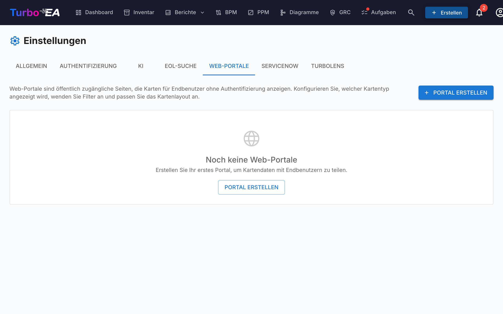

# Web-Portale

Die **Web-Portale**-Funktion (**Admin > Einstellungen > Web-Portale**) ermöglicht es Ihnen, **öffentliche, schreibgeschützte Ansichten** ausgewählter Kartendaten zu erstellen — zugänglich ohne Authentifizierung über eine eindeutige URL.



## Anwendungsfall

Web-Portale sind nützlich, um Architekturinformationen mit Stakeholdern zu teilen, die kein Turbo EA-Konto haben:

- **Technologiekatalog** — Die Anwendungslandschaft mit Geschäftsanwendern teilen
- **Serviceverzeichnis** — IT-Services und ihre Eigentümer veröffentlichen
- **Fähigkeitskarte** — Eine öffentliche Ansicht der Geschäftsfähigkeiten bereitstellen

## Zugriffsschutz

Jedes Portal hat einen **Zugriffsmodus**, der steuert, wer es öffnen darf:

| Modus | Verhalten |
|-------|-----------|
| **Jeder mit dem Link** | Das Portal ist nach der Veröffentlichung öffentlich lesbar — jeder, der die URL kennt, kann es ansehen. Dies ist der Standard und das bisherige Verhalten. |
| **Mit SSO anmelden** | Besucher müssen sich mit dem Identitätsanbieter Ihrer Organisation anmelden, bevor Portaldaten angezeigt werden. |

Der **SSO-Modus** nutzt das bereits unter **Admin > Einstellungen > Authentifizierung** konfigurierte Single Sign-On und schützt Portale, **ohne** zusätzliche Benutzer zu verwalten:

- Besucher melden sich über Ihren Identitätsanbieter an, werden aber **nie als Turbo-EA-Benutzer angelegt** — kein Konto, keine Rolle, keine Lizenz.
- Der Besucher erhält eine kurzlebige, portalspezifische Sitzung. Vor der Anmeldung wird nichts angezeigt.
- Optional können Sie mit **Erlaubte E-Mail-Domänen** den Zugriff auf bestimmte Domänen beschränken (z. B. `firma.com`). Leer lassen, um jeden vom Identitätsanbieter authentifizierten Benutzer zuzulassen.

!!! note
    **Mit SSO anmelden** ist erst wählbar, wenn Single Sign-On konfiguriert ist. Es verwendet dieselbe Redirect-URI beim Identitätsanbieter wie die normale Anmeldung (`/auth/callback`), sodass **keine zusätzliche Konfiguration beim Anbieter nötig ist** — wenn die Anmeldung funktioniert, funktioniert auch Portal-SSO. Besucher mit einer aktiven Sitzung beim Identitätsanbieter werden ohne Klick automatisch angemeldet. Das Aufheben der Veröffentlichung entzieht den Zugriff in jedem Modus sofort.

## Ein Portal erstellen

1. Navigieren Sie zu **Admin > Einstellungen > Web-Portale**
2. Klicken Sie auf **+ Neues Portal**
3. Konfigurieren Sie das Portal:

| Feld | Beschreibung |
|------|-------------|
| **Name** | Anzeigename für das Portal |
| **Slug** | URL-freundlicher Bezeichner (automatisch aus dem Namen generiert, bearbeitbar). Das Portal ist unter `/portal/{slug}` erreichbar |
| **Kartentyp** | Welcher Kartentyp angezeigt werden soll |
| **Subtypen** | Optional auf bestimmte Subtypen beschränken |
| **Logo anzeigen** | Ob das Plattform-Logo im Portal angezeigt werden soll |

## Sichtbarkeit konfigurieren

Für jedes Portal steuern Sie genau, welche Informationen sichtbar sind. Es gibt zwei Kontexte:

### Listenansicht-Eigenschaften

Welche Spalten/Eigenschaften in der Kartenliste erscheinen:

- **Eingebaute Eigenschaften**: Beschreibung, Lebenszyklus, Tags, Datenqualität, Genehmigungsstatus
- **Benutzerdefinierte Felder**: Jedes Feld aus dem Kartentypschema kann einzeln umgeschaltet werden

### Detailansicht-Eigenschaften

Welche Informationen angezeigt werden, wenn ein Besucher auf eine Karte klickt:

- Dieselben Umschaltsteuerungen wie bei der Listenansicht, aber für das erweiterte Detailpanel

## Portalzugriff

Portale sind erreichbar unter:

```
https://ihre-turbo-ea-domain/portal/{slug}
```

Keine Anmeldung erforderlich. Besucher können die Kartenliste durchsuchen, suchen und Kartendetails ansehen — aber nur die von Ihnen aktivierten Eigenschaften werden angezeigt.

!!! note
    Portale sind schreibgeschützt. Besucher können keine Karten bearbeiten, kommentieren oder mit ihnen interagieren. Sensible Daten (Stakeholder, Kommentare, Verlauf) werden in Portalen nie offengelegt.
