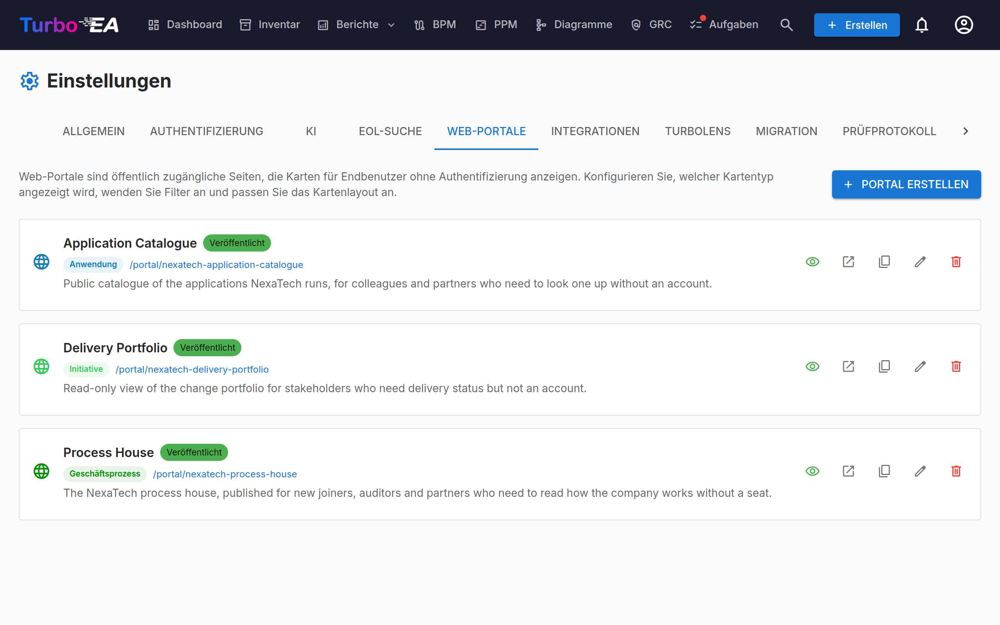

# Web-Portale

Die **Web-Portale**-Funktion (**Admin > Einstellungen > Web-Portale**) ermöglicht es Ihnen, **öffentliche, schreibgeschützte Ansichten** ausgewählter Kartendaten zu erstellen — zugänglich ohne Authentifizierung über eine eindeutige URL.



## Anwendungsfall

Web-Portale sind nützlich, um Architekturinformationen mit Stakeholdern zu teilen, die kein Turbo EA-Konto haben:

- **Technologiekatalog** — Die Anwendungslandschaft mit Geschäftsanwendern teilen
- **Serviceverzeichnis** — IT-Services und ihre Eigentümer veröffentlichen
- **Fähigkeitskarte** — Eine öffentliche Ansicht der Geschäftsfähigkeiten bereitstellen

## Portaltyp

Jedes Portal veröffentlicht eine von zwei Ansichten, ausgewählt über **Portaltyp**:

| Typ | Was Besucher sehen |
|-----|--------------------|
| **Kartenliste** | Ein durchsuch- und filterbares Raster von Karten — das klassische Portal, konfiguriert über die unten stehenden Eigenschaften. |
| **PPM-Portfolio-Board** | Das schreibgeschützte [PPM-Portfolio-Board](../guide/ppm.md) — Zeitachse, Statusampeln und Budget-gegen-Ist für jede aktive Initiative. |

### PPM-Portfolio-Portale

Mit **PPM-Portfolio-Board** wird das Portal zu einer Führungsansicht Ihres
Projektportfolios, erreichbar über einen öffentlichen Link — **ohne Konto, ohne
Lizenz und ohne Anmeldung**. Gedacht für den häufigen Fall, dass die Geschäftsleitung
Einblick in das Portfolio möchte, aber keine weiteren Zugangsdaten pflegen will.

Das Board bezieht sich immer auf **Initiative**-Karten, daher ist die Kartentyp-Auswahl
gesperrt. Die Filter für **Subtypen** und **Tags** greifen weiterhin — so veröffentlichen
Sie ein einzelnes Programm statt des gesamten Portfolios.

Besucher sehen dasselbe Board wie Ihr Team in Turbo EA: die Quartals-Zeitachse, die
Ampeln für Termin/Kosten/Umfang, die CapEx- und OpEx-Balken, die Gruppierung nach
beliebigen verknüpften Kartentypen und die Statusbericht-Übersicht, die beim Überfahren
des Datums **Letzter Bericht** erscheint. Ein Klick auf eine Initiative führt hinter die
normale Anmeldung in Turbo EA — nach dem Anmelden landen Sie auf der angeklickten Initiative.

Drei Schalter steuern, was das veröffentlichte Board preisgibt:

| Schalter | Standard | Veröffentlicht |
|----------|----------|----------------|
| **Budget und Ist-Kosten anzeigen** | Ein | Die CapEx- und OpEx-Balken sowie das Gesamtbudget |
| **Kommentare aus Statusberichten anzeigen** | Ein | Zusammenfassung, Erreichtes und nächste Schritte in der Hover-Übersicht. Berichtsdatum und Statusampeln werden immer angezeigt |
| **Namen der Projektleitung anzeigen** | **Aus** | Die Namen von Projektleitungen und Berichtsverfassern. Standardmäßig aus, da Namen personenbezogene Daten sind |

Das Board öffnet außerdem mit einer Gruppierung und einem Subtyp Ihrer Wahl:

| Einstellung | Standard | Wirkung |
|-------------|----------|---------|
| **Öffnet gruppiert nach** | Organisation | Welche Gruppierung das Board zuerst zeigt |
| **Öffnet mit Subtyp** | Alle | Welcher Subtyp zuerst ausgewählt ist |

Beides ist nur ein Ausgangspunkt — Besucher können beide Bedienelemente ändern,
und nichts wird gespeichert; ein erneuter Aufruf kehrt zu Ihrer Konfiguration
zurück. Das ist etwas anderes als der **Subtyp-Filter** oben, der bestimmt,
welche Initiativen überhaupt veröffentlicht werden.

!!! note
    Manches wird niemals veröffentlicht, unabhängig von Ihrer Auswahl: Kosten-Felder
    auf der Initiative-Karte selbst, E-Mail-Adressen von Benutzern und alles auf der
    Detailseite einer Initiative — Arbeitspakete, Meilensteine, Risiken, Aufgaben und
    die Berichtshistorie bleiben hinter der Anmeldung.

Ein Portfolio-Portal kann wie jedes andere Portal per SSO geschützt werden. Wird das
PPM-Modul unter **Admin > Einstellungen** deaktiviert, sind alle Portfolio-Portale
sofort nicht mehr erreichbar; Sie müssen sie nicht einzeln zurückziehen.

## Zugriffsschutz

Jedes Portal hat einen **Zugriffsmodus**, der steuert, wer es öffnen darf:

| Modus | Verhalten |
|-------|-----------|
| **Jeder mit dem Link** | Das Portal ist nach der Veröffentlichung öffentlich lesbar — jeder, der die URL kennt, kann es ansehen. Dies ist der Standard und das bisherige Verhalten. |
| **Mit SSO anmelden** | Besucher müssen sich mit dem Identitätsanbieter Ihrer Organisation anmelden, bevor Portaldaten angezeigt werden. |

Der **SSO-Modus** nutzt das bereits unter **Admin > Einstellungen > Authentifizierung** konfigurierte Single Sign-On und schützt Portale, **ohne** zusätzliche Benutzer zu verwalten:

- Besucher melden sich über Ihren Identitätsanbieter an, werden aber **nie als Turbo-EA-Benutzer angelegt** — kein Konto, keine Rolle, keine Lizenz.
- Der Besucher erhält eine kurzlebige, portalspezifische Sitzung. Vor der Anmeldung wird nichts angezeigt.
- Optional können Sie mit **Erlaubte E-Mail-Domänen** den Zugriff auf bestimmte Domänen beschränken (z. B. `firma.com`). Leer lassen, um jeden vom Identitätsanbieter authentifizierten Benutzer zuzulassen.

!!! note
    **Mit SSO anmelden** ist erst wählbar, wenn Single Sign-On konfiguriert ist. Es verwendet dieselbe Redirect-URI beim Identitätsanbieter wie die normale Anmeldung (`/auth/callback`), sodass **keine zusätzliche Konfiguration beim Anbieter nötig ist** — wenn die Anmeldung funktioniert, funktioniert auch Portal-SSO. Besucher mit einer aktiven Sitzung beim Identitätsanbieter werden ohne Klick automatisch angemeldet. Das Aufheben der Veröffentlichung entzieht den Zugriff in jedem Modus sofort.

## Ein Portal erstellen

1. Navigieren Sie zu **Admin > Einstellungen > Web-Portale**
2. Klicken Sie auf **+ Neues Portal**
3. Konfigurieren Sie das Portal:

| Feld | Beschreibung |
|------|-------------|
| **Name** | Anzeigename für das Portal |
| **Slug** | URL-freundlicher Bezeichner (automatisch aus dem Namen generiert, bearbeitbar). Das Portal ist unter `/portal/{slug}` erreichbar |
| **Kartentyp** | Welcher Kartentyp angezeigt werden soll |
| **Subtypen** | Optional auf bestimmte Subtypen beschränken |
| **Logo anzeigen** | Ob das Plattform-Logo im Portal angezeigt werden soll |

## Sichtbarkeit konfigurieren

Für jedes Portal steuern Sie genau, welche Informationen sichtbar sind. Es gibt zwei Kontexte:

### Listenansicht-Eigenschaften

Welche Spalten/Eigenschaften in der Kartenliste erscheinen:

- **Eingebaute Eigenschaften**: Beschreibung, Lebenszyklus, Tags, Datenqualität, Genehmigungsstatus
- **Benutzerdefinierte Felder**: Jedes Feld aus dem Kartentypschema kann einzeln umgeschaltet werden

### Detailansicht-Eigenschaften

Welche Informationen angezeigt werden, wenn ein Besucher auf eine Karte klickt:

- Dieselben Umschaltsteuerungen wie bei der Listenansicht, aber für das erweiterte Detailpanel

## Portalzugriff

Portale sind erreichbar unter:

```
https://ihre-turbo-ea-domain/portal/{slug}
```

Keine Anmeldung erforderlich. Besucher können die Kartenliste durchsuchen, suchen und Kartendetails ansehen — aber nur die von Ihnen aktivierten Eigenschaften werden angezeigt.

!!! note
    Portale sind schreibgeschützt. Besucher können keine Karten bearbeiten, kommentieren oder mit ihnen interagieren. Sensible Daten (Stakeholder, Kommentare, Verlauf) werden in Portalen nie offengelegt.
