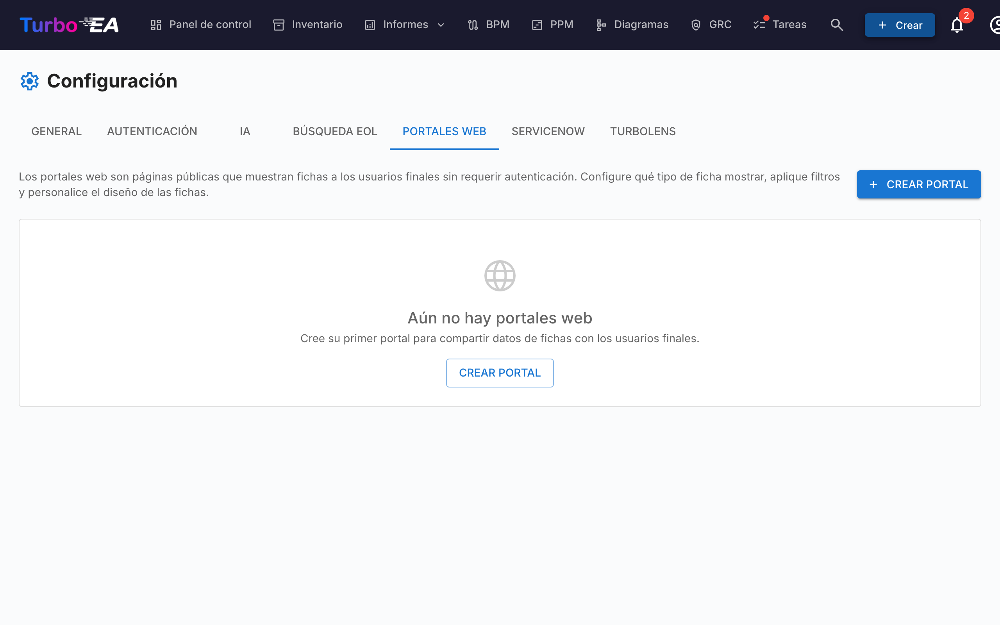

# Portales Web

La función de **Portales Web** (**Administrador > Configuración > Portales Web**) le permite crear **vistas públicas de solo lectura** de datos de fichas seleccionados, accesibles sin autenticación a través de una URL única.



## Caso de Uso

Los portales web son útiles para compartir información de arquitectura con partes interesadas que no tienen una cuenta de Turbo EA:

- **Catálogo tecnológico** — Comparta el panorama de aplicaciones con usuarios de negocio
- **Directorio de servicios** — Publique los servicios de TI y sus responsables
- **Mapa de capacidades** — Proporcione una vista pública de las capacidades de negocio

## Protección de acceso

Cada portal tiene un **modo de acceso** que controla quién puede abrirlo:

| Modo | Comportamiento |
|------|----------------|
| **Cualquiera con el enlace** | Una vez publicado, el portal es de lectura pública: cualquiera que conozca la URL puede verlo. Es el modo predeterminado y el comportamiento histórico. |
| **Iniciar sesión con SSO** | Los visitantes deben autenticarse con el proveedor de identidad de tu organización antes de mostrar cualquier dato. |

El **modo SSO** reutiliza el inicio de sesión único ya configurado en **Admin > Configuración > Autenticación** y protege los portales **sin** gestionar usuarios adicionales:

- Los visitantes inician sesión con tu proveedor de identidad, pero **nunca se crean como usuarios de Turbo EA**: sin cuenta, sin rol y sin licencia.
- El visitante obtiene una sesión efímera, propia del portal. No se muestra nada hasta completar el inicio de sesión.
- Opcionalmente, define una lista de **dominios de correo permitidos** para restringir el acceso a dominios concretos (p. ej. `empresa.com`). Déjala vacía para permitir cualquier usuario que autentique tu proveedor de identidad.

!!! note
    **Iniciar sesión con SSO** solo se puede elegir cuando el inicio de sesión único está configurado. Reutiliza la misma URI de redirección que el inicio de sesión normal (`/auth/callback`) en tu proveedor de identidad, por lo que **no se necesita configuración adicional** — si funciona el inicio de sesión, funciona el SSO del portal. Los visitantes con una sesión activa en el proveedor de identidad inician sesión automáticamente, sin hacer clic. Despublicar un portal revoca el acceso de inmediato en todos los modos.

## Creación de un Portal

1. Navegue a **Administrador > Configuración > Portales Web**
2. Haga clic en **+ Nuevo Portal**
3. Configure el portal:

| Campo | Descripción |
|-------|-------------|
| **Nombre** | Nombre visible del portal |
| **Slug** | Identificador compatible con URL (generado automáticamente a partir del nombre, editable). El portal será accesible en `/portal/{slug}` |
| **Tipo de Ficha** | Qué tipo de ficha mostrar |
| **Subtipos** | Opcionalmente, restringir a subtipos específicos |
| **Mostrar Logotipo** | Si se muestra el logotipo de la plataforma en el portal |

## Configuración de Visibilidad

Para cada portal, usted controla exactamente qué información es visible. Hay dos contextos:

### Propiedades de la Vista de Lista

Qué columnas/propiedades aparecen en la lista de fichas:

- **Propiedades incorporadas**: descripción, ciclo de vida, etiquetas, calidad de datos, estado de aprobación
- **Campos personalizados**: Cada campo del esquema del tipo de ficha puede activarse o desactivarse individualmente

### Propiedades de la Vista de Detalle

Qué información aparece cuando un visitante hace clic en una ficha:

- Los mismos controles de activación que la vista de lista, pero para el panel de detalle expandido

## Acceso al Portal

Los portales son accesibles en:

```
https://su-dominio-turbo-ea/portal/{slug}
```

No se requiere inicio de sesión. Los visitantes pueden explorar la lista de fichas, buscar y ver los detalles de las fichas, pero solo se muestran las propiedades que usted ha habilitado.

!!! note
    Los portales son de solo lectura. Los visitantes no pueden editar, comentar ni interactuar con las fichas. Los datos sensibles (partes interesadas, comentarios, historial) nunca se exponen en los portales.
