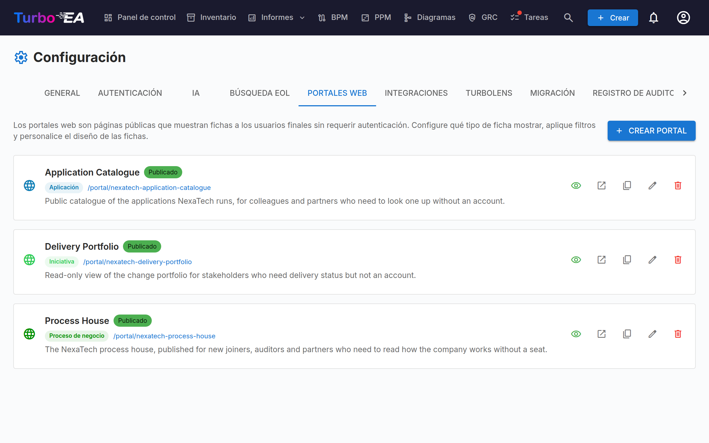

# Portales Web

La función de **Portales Web** (**Administrador > Configuración > Portales Web**) le permite crear **vistas públicas de solo lectura** de datos de fichas seleccionados, accesibles sin autenticación a través de una URL única.



## Caso de Uso

Los portales web son útiles para compartir información de arquitectura con partes interesadas que no tienen una cuenta de Turbo EA:

- **Catálogo tecnológico** — Comparta el panorama de aplicaciones con usuarios de negocio
- **Directorio de servicios** — Publique los servicios de TI y sus responsables
- **Mapa de capacidades** — Proporcione una vista pública de las capacidades de negocio

## Tipo de portal

Cada portal publica una de dos vistas, elegida con **Tipo de portal**:

| Tipo | Lo que ven los visitantes |
|------|---------------------------|
| **Lista de tarjetas** | Una cuadrícula de tarjetas con búsqueda y filtros: el portal clásico, configurado con las propiedades de más abajo. |
| **Tablero de cartera PPM** | El [tablero de cartera PPM](../guide/ppm.md) de solo lectura: cronograma, indicadores de estado y presupuesto frente a real de cada iniciativa activa. |

### Portales de cartera PPM

Elegir **Tablero de cartera PPM** convierte el portal en una vista directiva de su
cartera de proyectos, accesible mediante un enlace público **sin cuenta, sin licencia
y sin inicio de sesión**. Pensado para el caso habitual en el que la dirección quiere
visibilidad de la cartera pero no va a mantener otras credenciales.

El tablero siempre se refiere a tarjetas de **Iniciativa**, por lo que el selector de
tipo de tarjeta queda bloqueado. Los filtros de **subtipos** y **etiquetas** siguen
aplicándose, que es como se publica un único programa en lugar de toda la cartera.

Los visitantes ven el mismo tablero que su equipo dentro de Turbo EA: el cronograma
trimestral, los indicadores de plazo/coste/alcance, las barras de CapEx y OpEx, la
agrupación por cualquier tipo de tarjeta relacionado y la vista emergente del informe
de estado al pasar el ratón sobre la fecha de **Último informe**. Al hacer clic en una
iniciativa se entra en Turbo EA tras el inicio de sesión habitual; una vez dentro,
aterriza en la iniciativa que pulsó.

Tres interruptores controlan lo que revela el tablero publicado:

| Interruptor | Por defecto | Publica |
|-------------|-------------|---------|
| **Mostrar presupuesto y gasto real** | Activado | Las barras de CapEx y OpEx y la cifra de presupuesto total |
| **Mostrar comentarios de los informes de estado** | Activado | Resumen, logros y próximos pasos en la vista emergente. La fecha del informe y los indicadores de estado siempre se muestran |
| **Mostrar nombres de los jefes de proyecto** | **Desactivado** | Los nombres de jefes de proyecto y autores de informes. Desactivado por defecto porque los nombres son datos personales |

El tablero también se abre con una agrupación y un subtipo que usted elige:

| Ajuste | Por defecto | Efecto |
|--------|-------------|--------|
| **Se abre agrupado por** | Organización | Qué agrupación muestra el tablero primero |
| **Se abre mostrando el subtipo** | Todos | Qué subtipo se selecciona primero |

Ambos son solo un punto de partida: el visitante puede cambiar cualquiera de los
dos y nada se recuerda, así que volver a abrir el portal regresa a lo que usted
configuró. Es distinto del **filtro por subtipos** de más arriba, que decide qué
iniciativas se publican.

!!! note
    Hay cosas que nunca se publican, elija lo que elija: los campos de coste guardados
    en la propia tarjeta de Iniciativa, las direcciones de correo de los usuarios y todo
    lo que hay en la página de detalle de una iniciativa: paquetes de trabajo, hitos,
    riesgos, tareas e historial de informes quedan detrás del inicio de sesión.

Un portal de cartera puede protegerse con SSO como cualquier otro portal. Desactivar el
módulo PPM en **Admin > Configuración** deja inaccesibles de inmediato todos los portales
de cartera, sin necesidad de despublicarlos uno a uno.

## Protección de acceso

Cada portal tiene un **modo de acceso** que controla quién puede abrirlo:

| Modo | Comportamiento |
|------|----------------|
| **Cualquiera con el enlace** | Una vez publicado, el portal es de lectura pública: cualquiera que conozca la URL puede verlo. Es el modo predeterminado y el comportamiento histórico. |
| **Iniciar sesión con SSO** | Los visitantes deben autenticarse con el proveedor de identidad de tu organización antes de mostrar cualquier dato. |

El **modo SSO** reutiliza el inicio de sesión único ya configurado en **Admin > Configuración > Autenticación** y protege los portales **sin** gestionar usuarios adicionales:

- Los visitantes inician sesión con tu proveedor de identidad, pero **nunca se crean como usuarios de Turbo EA**: sin cuenta, sin rol y sin licencia.
- El visitante obtiene una sesión efímera, propia del portal. No se muestra nada hasta completar el inicio de sesión.
- Opcionalmente, define una lista de **dominios de correo permitidos** para restringir el acceso a dominios concretos (p. ej. `empresa.com`). Déjala vacía para permitir cualquier usuario que autentique tu proveedor de identidad.

!!! note
    **Iniciar sesión con SSO** solo se puede elegir cuando el inicio de sesión único está configurado. Reutiliza la misma URI de redirección que el inicio de sesión normal (`/auth/callback`) en tu proveedor de identidad, por lo que **no se necesita configuración adicional** — si funciona el inicio de sesión, funciona el SSO del portal. Los visitantes con una sesión activa en el proveedor de identidad inician sesión automáticamente, sin hacer clic. Despublicar un portal revoca el acceso de inmediato en todos los modos.

## Creación de un Portal

1. Navegue a **Administrador > Configuración > Portales Web**
2. Haga clic en **+ Nuevo Portal**
3. Configure el portal:

| Campo | Descripción |
|-------|-------------|
| **Nombre** | Nombre visible del portal |
| **Slug** | Identificador compatible con URL (generado automáticamente a partir del nombre, editable). El portal será accesible en `/portal/{slug}` |
| **Tipo de Ficha** | Qué tipo de ficha mostrar |
| **Subtipos** | Opcionalmente, restringir a subtipos específicos |
| **Mostrar Logotipo** | Si se muestra el logotipo de la plataforma en el portal |

## Configuración de Visibilidad

Para cada portal, usted controla exactamente qué información es visible. Hay dos contextos:

### Propiedades de la Vista de Lista

Qué columnas/propiedades aparecen en la lista de fichas:

- **Propiedades incorporadas**: descripción, ciclo de vida, etiquetas, calidad de datos, estado de aprobación
- **Campos personalizados**: Cada campo del esquema del tipo de ficha puede activarse o desactivarse individualmente

### Propiedades de la Vista de Detalle

Qué información aparece cuando un visitante hace clic en una ficha:

- Los mismos controles de activación que la vista de lista, pero para el panel de detalle expandido

## Acceso al Portal

Los portales son accesibles en:

```
https://su-dominio-turbo-ea/portal/{slug}
```

No se requiere inicio de sesión. Los visitantes pueden explorar la lista de fichas, buscar y ver los detalles de las fichas, pero solo se muestran las propiedades que usted ha habilitado.

!!! note
    Los portales son de solo lectura. Los visitantes no pueden editar, comentar ni interactuar con las fichas. Los datos sensibles (partes interesadas, comentarios, historial) nunca se exponen en los portales.
