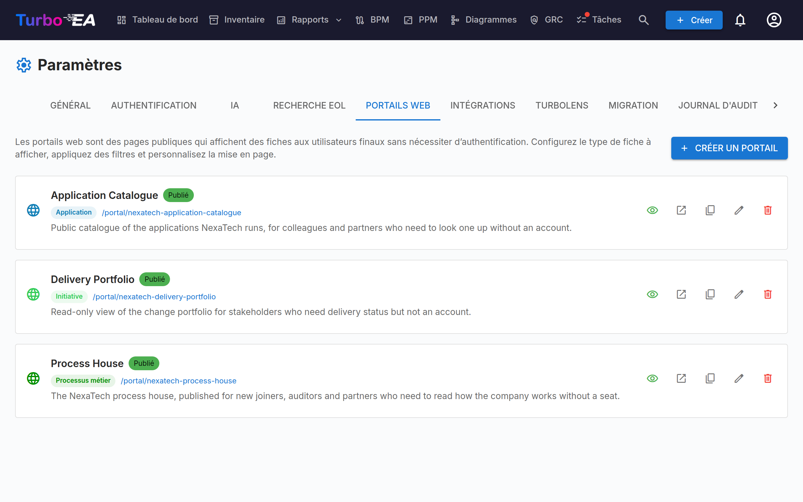

# Portails web

La fonctionnalité **Portails web** (**Admin > Paramètres > Portails web**) vous permet de créer des **vues publiques en lecture seule** de données de fiches sélectionnées -- accessibles sans authentification via une URL unique.



## Cas d'utilisation

Les portails web sont utiles pour partager des informations d'architecture avec des parties prenantes qui n'ont pas de compte Turbo EA :

- **Catalogue technologique** -- Partager le paysage applicatif avec les utilisateurs métier
- **Annuaire de services** -- Publier les services IT et leurs responsables
- **Carte de capacités** -- Fournir une vue publique des capacités métier

## Type de portail

Chaque portail publie l'une de deux vues, choisie via **Type de portail** :

| Type | Ce que voient les visiteurs |
|------|-----------------------------|
| **Liste de cartes** | Une grille de cartes consultable et filtrable — le portail classique, configuré avec les propriétés ci-dessous. |
| **Tableau de portefeuille PPM** | Le [tableau de portefeuille PPM](../guide/ppm.md) en lecture seule — échéancier, indicateurs de santé et budget contre réalisé pour chaque initiative active. |

### Portails de portefeuille PPM

Choisir **Tableau de portefeuille PPM** transforme le portail en vue de direction de
votre portefeuille de projets, accessible par un lien public **sans compte, sans licence
et sans connexion**. Conçu pour le cas fréquent où la direction souhaite de la visibilité
sur le portefeuille sans gérer d'identifiants supplémentaires.

Le tableau porte toujours sur les cartes **Initiative** ; le sélecteur de type de carte
est donc verrouillé. Les filtres par **sous-types** et par **étiquettes** restent actifs,
ce qui permet de publier un seul programme plutôt que tout le portefeuille.

Les visiteurs voient le même tableau que votre équipe dans Turbo EA : l'échéancier
trimestriel, les indicateurs délai/coût/périmètre, les barres CapEx et OpEx, le
regroupement par n'importe quel type de carte lié, et l'aperçu du rapport d'avancement
au survol de la date **Dernier rapport**. Cliquer sur une initiative mène dans Turbo EA
derrière la connexion habituelle — une fois connecté, vous arrivez sur l'initiative cliquée.

Trois interrupteurs contrôlent ce que le tableau publié révèle :

| Interrupteur | Par défaut | Publie |
|--------------|------------|--------|
| **Afficher le budget et les dépenses réelles** | Activé | Les barres CapEx et OpEx et le budget total |
| **Afficher les commentaires des rapports d'avancement** | Activé | Résumé, réalisations et prochaines étapes dans l'aperçu au survol. La date du rapport et les indicateurs de santé sont toujours affichés |
| **Afficher les noms des chefs de projet** | **Désactivé** | Les noms des chefs de projet et des auteurs de rapports. Désactivé par défaut car les noms sont des données personnelles |

Le tableau s'ouvre également sur un regroupement et un sous-type de votre choix :

| Paramètre | Par défaut | Effet |
|-----------|------------|-------|
| **S'ouvre groupé par** | Organisation | Le regroupement affiché en premier |
| **S'ouvre sur le sous-type** | Tous | Le sous-type sélectionné en premier |

Ce ne sont que des points de départ : un visiteur peut changer l'un ou l'autre, et
rien n'est mémorisé — rouvrir le portail revient à votre configuration. À ne pas
confondre avec le **filtre par sous-types** ci-dessus, qui décide quelles
initiatives sont publiées.

!!! note
    Certaines choses ne sont jamais publiées, quel que soit votre choix : les champs de
    coût stockés sur la carte Initiative elle-même, les adresses e-mail des utilisateurs,
    et tout ce qui figure sur la page de détail d'une initiative — lots de travaux, jalons,
    risques, tâches et historique des rapports restent derrière la connexion.

Un portail de portefeuille peut être protégé par SSO comme n'importe quel autre portail.
Désactiver le module PPM dans **Admin > Paramètres** rend immédiatement inaccessibles
tous les portails de portefeuille, sans avoir à les dépublier un par un.

## Protection de l'accès

Chaque portail possède un **mode d'accès** qui détermine qui peut l'ouvrir :

| Mode | Comportement |
|------|--------------|
| **Toute personne disposant du lien** | Une fois publié, le portail est lisible par tous — toute personne connaissant l'URL peut le consulter. C'est le mode par défaut et le comportement historique. |
| **Se connecter via SSO** | Les visiteurs doivent s'authentifier auprès du fournisseur d'identité de votre organisation avant qu'aucune donnée ne s'affiche. |

Le **mode SSO** réutilise l'authentification unique déjà configurée sous **Admin > Paramètres > Authentification** et protège les portails **sans** gérer d'utilisateurs supplémentaires :

- Les visiteurs se connectent via votre fournisseur d'identité, mais ne sont **jamais créés comme utilisateurs Turbo EA** — aucun compte, aucun rôle, aucune licence.
- Le visiteur obtient une session éphémère, propre au portail. Rien n'est affiché avant la connexion.
- Vous pouvez éventuellement définir une liste de **domaines de messagerie autorisés** pour restreindre l'accès à certains domaines (par ex. `entreprise.com`). Laissez vide pour autoriser tout utilisateur authentifié par votre fournisseur d'identité.

!!! note
    **Se connecter via SSO** n'est disponible qu'une fois l'authentification unique configurée. Il réutilise la même URI de redirection que la connexion normale (`/auth/callback`) auprès de votre fournisseur d'identité, donc **aucune configuration supplémentaire n'est nécessaire** — si la connexion fonctionne, le SSO du portail fonctionne. Les visiteurs disposant d'une session active auprès du fournisseur d'identité sont connectés automatiquement, sans clic. Dépublier un portail révoque immédiatement l'accès dans tous les modes.

## Création d'un portail

1. Naviguez vers **Admin > Paramètres > Portails web**
2. Cliquez sur **+ Nouveau portail**
3. Configurez le portail :

| Champ | Description |
|-------|-------------|
| **Nom** | Nom d'affichage du portail |
| **Slug** | Identifiant compatible URL (généré automatiquement à partir du nom, modifiable). Le portail sera accessible à `/portal/{slug}` |
| **Type de fiche** | Quel type de fiche afficher |
| **Sous-types** | Optionnellement restreindre à des sous-types spécifiques |
| **Afficher le logo** | Si le logo de la plateforme doit être affiché sur le portail |

## Configuration de la visibilité

Pour chaque portail, vous contrôlez exactement quelles informations sont visibles. Il y a deux contextes :

### Propriétés de la vue liste

Quelles colonnes/propriétés apparaissent dans la liste des fiches :

- **Propriétés intégrées** : description, cycle de vie, tags, qualité des données, statut d'approbation
- **Champs personnalisés** : Chaque champ du schema du type de fiche peut être activé/désactivé individuellement

### Propriétés de la vue détail

Quelles informations apparaissent lorsqu'un visiteur clique sur une fiche :

- Mêmes contrôles de bascule que la vue liste, mais pour le panneau de détail développé

## Accès au portail

Les portails sont accessibles à :

```
https://votre-domaine-turbo-ea/portal/{slug}
```

Aucune connexion n'est requise. Les visiteurs peuvent parcourir la liste des fiches, rechercher et consulter les détails des fiches -- mais seules les propriétés que vous avez activées sont affichées.

!!! note
    Les portails sont en lecture seule. Les visiteurs ne peuvent pas modifier, commenter ou interagir avec les fiches. Les données sensibles (parties prenantes, commentaires, historique) ne sont jamais exposées sur les portails.
