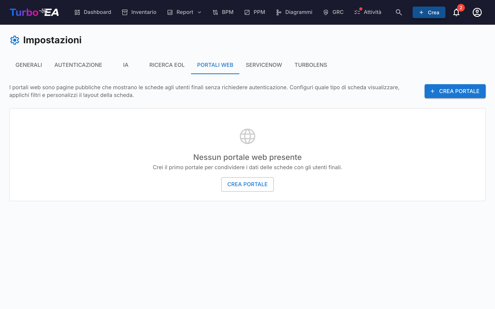

# Portali web

La funzionalità **Portali web** (**Admin > Impostazioni > Portali web**) consente di creare **viste pubbliche di sola lettura** di dati selezionati delle card — accessibili senza autenticazione tramite un URL univoco.



## Caso d'uso

I portali web sono utili per condividere informazioni architetturali con stakeholder che non hanno un account Turbo EA:

- **Catalogo tecnologico** — Condividete il panorama applicativo con gli utenti business
- **Directory dei servizi** — Pubblicate i servizi IT e i loro responsabili
- **Mappa delle capability** — Fornite una vista pubblica delle business capability

## Protezione dell'accesso

Ogni portale ha una **modalità di accesso** che controlla chi può aprirlo:

| Modalità | Comportamento |
|----------|---------------|
| **Chiunque abbia il link** | Una volta pubblicato, il portale è leggibile da tutti: chiunque conosca l'URL può visualizzarlo. È la modalità predefinita e il comportamento storico. |
| **Accedi con SSO** | I visitatori devono autenticarsi con il provider di identità della tua organizzazione prima che vengano mostrati i dati. |

La **modalità SSO** riutilizza il Single Sign-On già configurato in **Admin > Impostazioni > Autenticazione** e protegge i portali **senza** gestire utenti aggiuntivi:

- I visitatori accedono tramite il tuo provider di identità, ma **non vengono mai creati come utenti Turbo EA**: nessun account, nessun ruolo, nessuna licenza.
- Il visitatore ottiene una sessione temporanea, specifica del portale. Nulla viene mostrato prima dell'accesso.
- Facoltativamente, imposta un elenco di **domini email consentiti** per limitare l'accesso a domini specifici (es. `azienda.com`). Lascia vuoto per consentire qualsiasi utente autenticato dal tuo provider di identità.

!!! note
    **Accedi con SSO** è selezionabile solo quando il Single Sign-On è configurato. Riutilizza lo stesso URI di reindirizzamento dell'accesso normale (`/auth/callback`) presso il tuo provider di identità, quindi **non è necessaria alcuna configurazione aggiuntiva** — se l'accesso funziona, funziona anche il SSO del portale. I visitatori con una sessione attiva presso il provider di identità accedono automaticamente, senza clic. Annullare la pubblicazione di un portale revoca immediatamente l'accesso in ogni modalità.

## Creazione di un portale

1. Navigate su **Admin > Impostazioni > Portali web**
2. Cliccate su **+ Nuovo portale**
3. Configurate il portale:

| Campo | Descrizione |
|-------|-------------|
| **Nome** | Nome visualizzato per il portale |
| **Slug** | Identificatore URL-friendly (generato automaticamente dal nome, modificabile). Il portale sarà accessibile su `/portal/{slug}` |
| **Tipo di card** | Quale tipo di card visualizzare |
| **Sottotipi** | Opzionalmente limitate a sottotipi specifici |
| **Mostra logo** | Se visualizzare il logo della piattaforma sul portale |

## Configurazione della visibilità

Per ogni portale, controllate esattamente quali informazioni sono visibili. Ci sono due contesti:

### Proprietà della vista elenco

Quali colonne/proprietà appaiono nell'elenco delle card:

- **Proprietà predefinite**: descrizione, ciclo di vita, tag, qualità dei dati, stato di approvazione
- **Campi personalizzati**: Ogni campo dallo schema del tipo di card può essere attivato/disattivato individualmente

### Proprietà della vista dettaglio

Quali informazioni appaiono quando un visitatore clicca su una card:

- Stessi controlli toggle della vista elenco, ma per il pannello di dettaglio espanso

## Accesso al portale

I portali sono accessibili su:

```
https://your-turbo-ea-domain/portal/{slug}
```

Non è richiesto alcun login. I visitatori possono sfogliare l'elenco delle card, cercare e visualizzare i dettagli delle card — ma solo le proprietà che avete abilitato vengono mostrate.

!!! note
    I portali sono di sola lettura. I visitatori non possono modificare, commentare o interagire con le card. I dati sensibili (stakeholder, commenti, cronologia) non vengono mai esposti sui portali.
