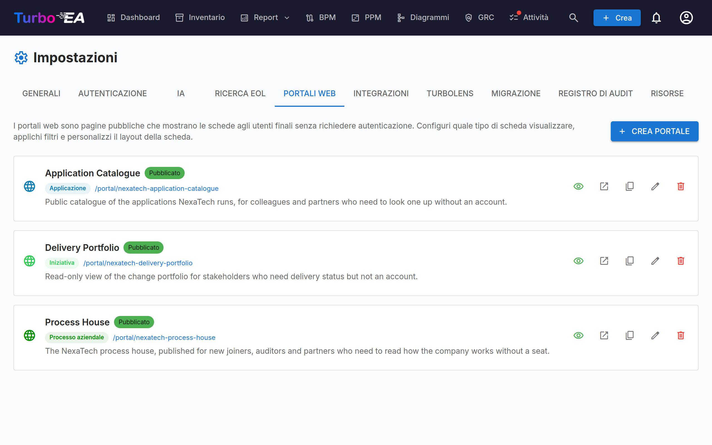

# Portali web

La funzionalità **Portali web** (**Admin > Impostazioni > Portali web**) consente di creare **viste pubbliche di sola lettura** di dati selezionati delle card — accessibili senza autenticazione tramite un URL univoco.



## Caso d'uso

I portali web sono utili per condividere informazioni architetturali con stakeholder che non hanno un account Turbo EA:

- **Catalogo tecnologico** — Condividete il panorama applicativo con gli utenti business
- **Directory dei servizi** — Pubblicate i servizi IT e i loro responsabili
- **Mappa delle capability** — Fornite una vista pubblica delle business capability

## Tipo di portale

Ogni portale pubblica una di tre viste, scelta tramite **Tipo di portale**:

| Tipo | Cosa vedono i visitatori |
|------|--------------------------|
| **Elenco di schede** | Una griglia di schede con ricerca e filtri: il portale classico, configurato con le proprietà indicate sotto. |
| **Bacheca del portfolio PPM** | La [bacheca del portfolio PPM](../guide/ppm.md) in sola lettura: cronologia, indicatori di stato e budget rispetto all'effettivo per ogni iniziativa attiva. |
| **Navigatore di processi** | La [Casa dei Processi](../guide/bpm.md) in sola lettura: la gerarchia dei processi aziendali e il flusso BPMN pubblicato di ogni processo. |

### Portali di portfolio PPM

Scegliendo **Bacheca del portfolio PPM** il portale diventa una vista direzionale del
portfolio progetti, raggiungibile tramite un collegamento pubblico **senza account,
senza licenza e senza accesso**. Pensata per il caso frequente in cui la direzione vuole
visibilità sul portfolio ma non intende gestire altre credenziali.

La bacheca riguarda sempre le schede **Iniziativa**, quindi il selettore del tipo di
scheda è bloccato. I filtri per **sottotipi** e **tag** restano attivi: è così che si
pubblica un singolo programma invece dell'intero portfolio.

I visitatori vedono la stessa bacheca che il vostro team usa dentro Turbo EA: la
cronologia trimestrale, gli indicatori di tempi/costi/ambito, le barre CapEx e OpEx, il
raggruppamento per qualsiasi tipo di scheda collegato e l'anteprima del rapporto di stato
al passaggio del mouse sulla data **Ultimo rapporto**. Facendo clic su un'iniziativa si
entra in Turbo EA dietro il consueto accesso: una volta effettuato, si arriva
sull'iniziativa selezionata.

Tre interruttori controllano cosa rivela la bacheca pubblicata:

| Interruttore | Predefinito | Pubblica |
|--------------|-------------|----------|
| **Mostrare budget e spesa effettiva** | Attivo | Le barre CapEx e OpEx e il budget totale |
| **Mostrare i commenti dei rapporti di stato** | Attivo | Sintesi, risultati raggiunti e prossimi passi nell'anteprima. La data del rapporto e gli indicatori di stato sono sempre visibili |
| **Mostrare i nomi dei project manager** | **Disattivo** | I nomi dei project manager e degli autori dei rapporti. Disattivo per impostazione predefinita perché i nomi sono dati personali |

La bacheca si apre inoltre con un raggruppamento e un sottotipo a vostra scelta:

| Impostazione | Predefinito | Effetto |
|--------------|-------------|---------|
| **Si apre raggruppato per** | Organizzazione | Quale raggruppamento mostra per primo |
| **Si apre mostrando il sottotipo** | Tutti | Quale sottotipo è selezionato per primo |

Sono solo un punto di partenza: il visitatore può cambiare entrambi i controlli e
nulla viene memorizzato, quindi riaprendo il portale si torna a quanto configurato
qui. È cosa diversa dal **filtro per sottotipi** sopra, che decide quali iniziative
vengono pubblicate.

!!! note
    Alcune informazioni non vengono mai pubblicate, qualunque sia la scelta: i campi di
    costo memorizzati sulla scheda Iniziativa, gli indirizzi e-mail degli utenti e tutto
    ciò che si trova nella pagina di dettaglio di un'iniziativa — pacchetti di lavoro,
    milestone, rischi, attività e cronologia dei rapporti restano dietro l'accesso.

Un portale di portfolio può essere protetto con SSO come qualsiasi altro portale.
Disattivando il modulo PPM in **Admin > Impostazioni** tutti i portali di portfolio
diventano immediatamente inaccessibili, senza doverli ritirare uno a uno.

### Portali navigatore di processi

Selezionando **Navigatore di processi** il portale diventa una vista in sola lettura
della vostra **Casa dei Processi**, disponibile su un link pubblico **senza account,
senza licenza e senza accesso**. Esiste per chi ha più bisogno di capire come lavora
l'organizzazione e meno probabilità di avere un'utenza: nuovi assunti, revisori,
personale operativo e partner esterni.

Il portale è sempre limitato alle schede **Processo aziendale**, quindi il selettore
del tipo di scheda è bloccato. I filtri **sottotipi** e **tag** restano validi: è così
che si pubblica un ramo della casa anziché l'intera casa.

I visitatori vedono la stessa casa che il vostro team usa in Turbo EA: la gerarchia
raggruppata in righe per tipo di processo, il cursore dei livelli, zoom e briciole di
pane, la ricerca, le colorazioni, il filtro per organizzazione e il numero di colonne.
Aprendo un processo si vedono panoramica, passi e il **flusso BPMN pubblicato** — a
schermo intero, con spostamento e zoom, esattamente come lo vede il vostro team.

Due impostazioni e due stati di apertura governano la casa pubblicata:

| Impostazione | Predefinito | Effetto |
|--------------|-------------|---------|
| **Mostra i sistemi collegati a ogni passo** | **Disattivato** | I nomi di applicazioni, oggetti dati, componenti IT e organizzazioni collegati a ogni passo. Disattivato per impostazione predefinita perché rivela quali sistemi eseguono i vostri processi |
| **Si apre al livello** | 2 | Quanto in profondità viene mostrata la gerarchia all'inizio |
| **Si apre colorato per** | Tipo di processo | Quale attributo colora i riquadri all'inizio |

Gli ultimi due sono solo un punto di partenza: il visitatore può cambiare entrambi i
controlli e nulla viene ricordato, quindi riaprire il portale riporta a quanto
configurato qui.

!!! note
    Alcune cose non vengono mai pubblicate, qualunque sia la scelta: le applicazioni,
    gli oggetti dati e i costi dietro un processo, la matrice Processo × Applicazione
    e la vista delle dipendenze, e ogni BPMN non **pubblicato** — bozze, revisioni in
    attesa, archiviate e ritirate restano dietro l'accesso.

A differenza di un portale portafoglio, le cui righe conducono in Turbo EA dopo il
normale accesso, un portale navigatore di processi **non porta da nessuna parte**. È
voluto: una casa pubblicata per lettori senza account deve rispondere a «come lo
facciamo» senza mostrare una porta che non possono aprire.

Un portale navigatore di processi può essere protetto con SSO come qualsiasi altro
portale. Disattivando il modulo BPM in **Admin > Impostazioni** tutti i portali di
processo si spengono subito; non è necessario ritirarli uno a uno.

## Protezione dell'accesso

Ogni portale ha una **modalità di accesso** che controlla chi può aprirlo:

| Modalità | Comportamento |
|----------|---------------|
| **Chiunque abbia il link** | Una volta pubblicato, il portale è leggibile da tutti: chiunque conosca l'URL può visualizzarlo. È la modalità predefinita e il comportamento storico. |
| **Accedi con SSO** | I visitatori devono autenticarsi con il provider di identità della tua organizzazione prima che vengano mostrati i dati. |

La **modalità SSO** riutilizza il Single Sign-On già configurato in **Admin > Impostazioni > Autenticazione** e protegge i portali **senza** gestire utenti aggiuntivi:

- I visitatori accedono tramite il tuo provider di identità, ma **non vengono mai creati come utenti Turbo EA**: nessun account, nessun ruolo, nessuna licenza.
- Il visitatore ottiene una sessione temporanea, specifica del portale. Nulla viene mostrato prima dell'accesso.
- Facoltativamente, imposta un elenco di **domini email consentiti** per limitare l'accesso a domini specifici (es. `azienda.com`). Lascia vuoto per consentire qualsiasi utente autenticato dal tuo provider di identità.

!!! note
    **Accedi con SSO** è selezionabile solo quando il Single Sign-On è configurato. Riutilizza lo stesso URI di reindirizzamento dell'accesso normale (`/auth/callback`) presso il tuo provider di identità, quindi **non è necessaria alcuna configurazione aggiuntiva** — se l'accesso funziona, funziona anche il SSO del portale. I visitatori con una sessione attiva presso il provider di identità accedono automaticamente, senza clic. Annullare la pubblicazione di un portale revoca immediatamente l'accesso in ogni modalità.

## Creazione di un portale

1. Navigate su **Admin > Impostazioni > Portali web**
2. Cliccate su **+ Nuovo portale**
3. Configurate il portale:

| Campo | Descrizione |
|-------|-------------|
| **Nome** | Nome visualizzato per il portale |
| **Slug** | Identificatore URL-friendly (generato automaticamente dal nome, modificabile). Il portale sarà accessibile su `/portal/{slug}` |
| **Tipo di card** | Quale tipo di card visualizzare |
| **Sottotipi** | Opzionalmente limitate a sottotipi specifici |
| **Mostra logo** | Se visualizzare il logo della piattaforma sul portale |

## Configurazione della visibilità

Per ogni portale, controllate esattamente quali informazioni sono visibili. Ci sono due contesti:

### Proprietà della vista elenco

Quali colonne/proprietà appaiono nell'elenco delle card:

- **Proprietà predefinite**: descrizione, ciclo di vita, tag, qualità dei dati, stato di approvazione
- **Campi personalizzati**: Ogni campo dallo schema del tipo di card può essere attivato/disattivato individualmente

### Proprietà della vista dettaglio

Quali informazioni appaiono quando un visitatore clicca su una card:

- Stessi controlli toggle della vista elenco, ma per il pannello di dettaglio espanso

## Accesso al portale

I portali sono accessibili su:

```
https://your-turbo-ea-domain/portal/{slug}
```

Non è richiesto alcun login. I visitatori possono sfogliare l'elenco delle card, cercare e visualizzare i dettagli delle card — ma solo le proprietà che avete abilitato vengono mostrate.

!!! note
    I portali sono di sola lettura. I visitatori non possono modificare, commentare o interagire con le card. I dati sensibili (stakeholder, commenti, cronologia) non vengono mai esposti sui portali.
