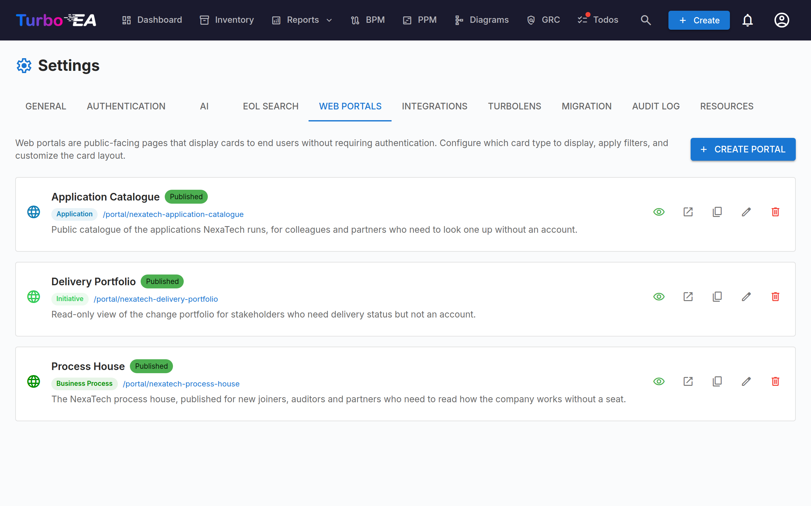

# Web Portals

The **Web Portals** feature (**Admin > Settings > Web Portals**) lets you create **public, read-only views** of selected card data — accessible without authentication via a unique URL.



## Use Case

Web portals are useful for sharing architecture information with stakeholders who don't have a Turbo EA account:

- **Technology catalog** — Share the application landscape with business users
- **Service directory** — Publish IT services and their owners
- **Capability map** — Provide a public view of business capabilities

## Portal Type

Each portal publishes one of two things, chosen with **Portal type**:

| Type | What visitors see |
|------|-------------------|
| **Card list** | A searchable, filterable grid of cards — the classic portal, configured with the properties below. |
| **PPM portfolio board** | The read-only [PPM portfolio board](../guide/ppm.md) — timeline, health indicators and budget-versus-actual for every active initiative. |

### PPM portfolio portals

Selecting **PPM portfolio board** turns the portal into an executive view of your
project portfolio, available on a public link with **no account, no licence and no
login**. It exists for the common case where leadership wants portfolio visibility
but will not maintain another set of credentials.

The board is always scoped to **Initiative** cards, so the card-type picker is
locked. The **subtypes** and **tags** filters still apply, which is how you publish
a single programme rather than the whole portfolio.

Visitors get the same board your team uses inside Turbo EA: the quarterly
timeline, the schedule/cost/scope indicators, the CapEx and OpEx bars, grouping by
any related card type, and the status-report overview that appears when you hover
the **Last Report** date. Clicking an initiative leads into Turbo EA behind the
normal sign-in — after signing in you land on the initiative you clicked.

Three switches control what the published board reveals:

| Switch | Default | Publishes |
|--------|---------|-----------|
| **Show budget and actual spend** | On | The CapEx and OpEx bars and the total-budget figure |
| **Show status report commentary** | On | Summary, accomplishments and next steps in the hover overview. The report date and health indicators are always shown |
| **Show project manager names** | **Off** | The names of project managers and report authors. Off by default because names are personal data |

!!! note
    Some things are never published, whatever you choose: cost fields stored on the
    Initiative card itself, user email addresses, and everything on the initiative
    detail page — work packages, milestones, risks, tasks and report history all
    stay behind the login.

A portfolio portal can be SSO-gated like any other portal. Turning the PPM module
off in **Admin > Settings** takes every portfolio portal dark immediately; you do
not have to unpublish them one by one.

## Creating a Portal

1. Navigate to **Admin > Settings > Web Portals**
2. Click **+ New Portal**
3. Configure the portal:

| Field | Description |
|-------|-------------|
| **Name** | Display name for the portal |
| **Slug** | URL-friendly identifier (auto-generated from name, editable). The portal will be accessible at `/portal/{slug}` |
| **Portal Type** | Card list, or the read-only PPM portfolio board (see [Portal Type](#portal-type)) |
| **Card Type** | Which card type to display (locked to Initiative for a portfolio portal) |
| **Subtypes** | Optionally restrict to specific subtypes |
| **Who can view this portal** | Access mode — **Anyone with the link** or **Sign in with SSO** (see [Access Protection](#access-protection)) |
| **Show Logo** | Whether to display the platform logo on the portal |

## Configuring Visibility

For each portal, you control exactly which information is visible. There are two contexts:

### List View Properties

What columns/properties appear in the card list:

- **Built-in properties**: description, lifecycle, tags, data quality, approval status
- **Custom fields**: Each field from the card type's schema can be individually toggled

### Detail View Properties

What information appears when a visitor clicks on a card:

- Same toggle controls as the list view, but for the expanded detail panel

## Access Protection

Each portal has an **access mode** that controls who can open it:

| Mode | Behaviour |
|------|-----------|
| **Anyone with the link** | The portal is world-readable once published — anyone who knows the URL can view it. This is the default and the historical behaviour. |
| **Sign in with SSO** | Visitors must authenticate with your organization's identity provider before any portal data is shown. |

**SSO mode** reuses the single sign-on you've already configured under **Admin > Settings > Authentication**. It is designed for protecting portals **without** managing extra users:

- Visitors sign in through your identity provider, but are **never provisioned as Turbo EA users** — no account is created, no role is assigned, and no license is consumed.
- **Transparent sign-in.** A visitor who already has an active session with your identity provider is signed in **automatically, with no prompt** — they just see the portal. Only when interaction is required (no active session yet) do they get a one-click **Sign in** button.
- The visitor gets a short-lived, per-portal session. Nothing is shown until sign-in completes.
- Optionally set an **Allowed email domains** list to restrict access to specific domains (e.g. `company.com`). Leave it empty to allow any user your identity provider authenticates.

!!! note
    **Sign in with SSO** is only selectable once single sign-on is configured. It reuses the **same identity-provider redirect URI as normal login** (`/auth/callback`), so **no extra provider configuration is needed** — if login works, portal SSO works.

Unpublishing a portal immediately revokes access in every mode.

## Portal Access

Portals are accessed at:

```
https://your-turbo-ea-domain/portal/{slug}
```

For a **public** portal no login is required. For an **SSO-gated** portal, visitors are prompted to sign in first. In both cases visitors can browse the card list, search, and view card details — but only the properties you've enabled are shown.

!!! note
    Portals are read-only. Visitors cannot edit, comment, or interact with cards. Sensitive data (stakeholders, comments, history) is never exposed on portals.
