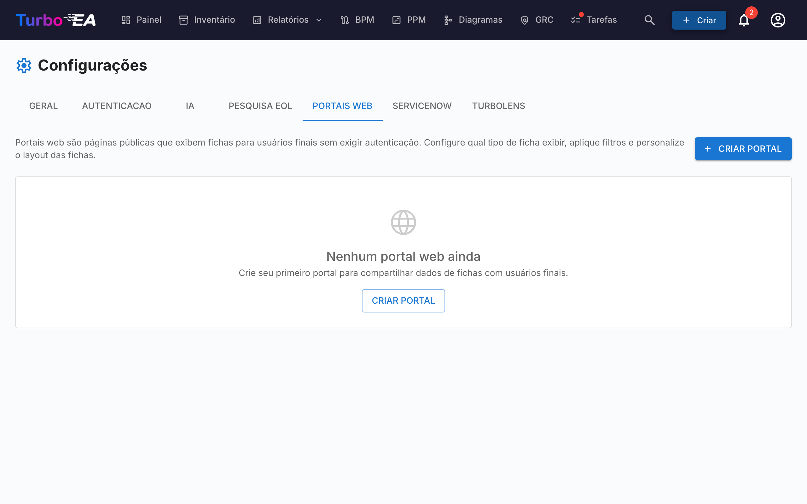

# Portais Web

O recurso de **Portais Web** (**Admin > Configurações > Portais Web**) permite criar **visualizações públicas e somente leitura** de dados selecionados de cards — acessíveis sem autenticação através de uma URL única.



## Caso de Uso

Portais web são úteis para compartilhar informações de arquitetura com partes interessadas que não possuem uma conta no Turbo EA:

- **Catálogo de tecnologia** — Compartilhe o cenário de aplicações com usuários de negócio
- **Diretório de serviços** — Publique serviços de TI e seus proprietários
- **Mapa de capacidades** — Forneça uma visualização pública das capacidades de negócio

## Proteção de acesso

Cada portal tem um **modo de acesso** que controla quem pode abri-lo:

| Modo | Comportamento |
|------|---------------|
| **Qualquer pessoa com o link** | Depois de publicado, o portal fica legível publicamente — qualquer pessoa que conheça a URL pode vê-lo. É o padrão e o comportamento histórico. |
| **Entrar com SSO** | Os visitantes precisam se autenticar com o provedor de identidade da sua organização antes de qualquer dado ser exibido. |

O **modo SSO** reutiliza o logon único já configurado em **Admin > Configurações > Autenticação** e protege os portais **sem** gerenciar usuários adicionais:

- Os visitantes entram com o seu provedor de identidade, mas **nunca são criados como usuários do Turbo EA** — sem conta, sem função e sem licença.
- O visitante recebe uma sessão de curta duração, específica do portal. Nada é exibido até o login ser concluído.
- Opcionalmente, defina uma lista de **domínios de e-mail permitidos** para restringir o acesso a domínios específicos (ex.: `empresa.com`). Deixe vazio para permitir qualquer usuário autenticado pelo seu provedor de identidade.

!!! note
    **Entrar com SSO** só pode ser selecionado quando o logon único está configurado. Reutiliza a mesma URI de redirecionamento do login normal (`/auth/callback`) no seu provedor de identidade, portanto **nenhuma configuração adicional é necessária** — se o login funciona, o SSO do portal funciona. Visitantes com uma sessão ativa no provedor de identidade entram automaticamente, sem clique. Cancelar a publicação de um portal revoga o acesso imediatamente em todos os modos.

## Criando um Portal

1. Navegue até **Admin > Configurações > Portais Web**
2. Clique em **+ Novo Portal**
3. Configure o portal:

| Campo | Descrição |
|-------|-----------|
| **Nome** | Nome de exibição para o portal |
| **Slug** | Identificador amigável para URL (gerado automaticamente a partir do nome, editável). O portal será acessível em `/portal/{slug}` |
| **Tipo de Card** | Qual tipo de card exibir |
| **Subtipos** | Opcionalmente restringir a subtipos específicos |
| **Mostrar Logo** | Se deve exibir o logotipo da plataforma no portal |

## Configurando Visibilidade

Para cada portal, você controla exatamente quais informações são visíveis. Há dois contextos:

### Propriedades da Visualização em Lista

Quais colunas/propriedades aparecem na lista de cards:

- **Propriedades incorporadas**: descrição, ciclo de vida, tags, qualidade dos dados, status de aprovação
- **Campos personalizados**: Cada campo do esquema do tipo de card pode ser alternado individualmente

### Propriedades da Visualização de Detalhe

Quais informações aparecem quando um visitante clica em um card:

- Mesmos controles de alternância que a visualização em lista, mas para o painel de detalhe expandido

## Acesso ao Portal

Portais são acessados em:

```
https://your-turbo-ea-domain/portal/{slug}
```

Nenhum login é necessário. Visitantes podem navegar pela lista de cards, pesquisar e ver detalhes dos cards — mas apenas as propriedades que você habilitou são mostradas.

!!! note
    Portais são somente leitura. Visitantes não podem editar, comentar ou interagir com cards. Dados sensíveis (partes interessadas, comentários, histórico) nunca são expostos nos portais.
