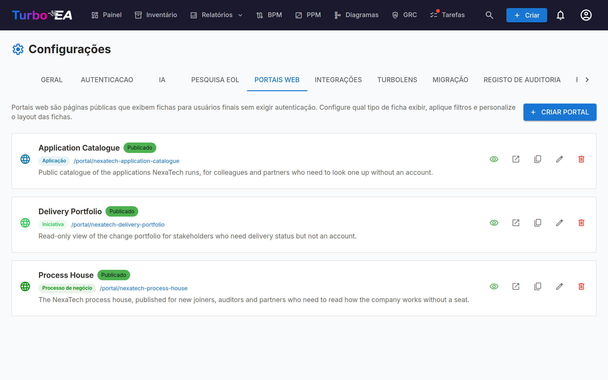

# Portais Web

O recurso de **Portais Web** (**Admin > Configurações > Portais Web**) permite criar **visualizações públicas e somente leitura** de dados selecionados de cards — acessíveis sem autenticação através de uma URL única.



## Caso de Uso

Portais web são úteis para compartilhar informações de arquitetura com partes interessadas que não possuem uma conta no Turbo EA:

- **Catálogo de tecnologia** — Compartilhe o cenário de aplicações com usuários de negócio
- **Diretório de serviços** — Publique serviços de TI e seus proprietários
- **Mapa de capacidades** — Forneça uma visualização pública das capacidades de negócio

## Tipo de portal

Cada portal publica uma de três vistas, escolhida em **Tipo de portal**:

| Tipo | O que os visitantes veem |
|------|--------------------------|
| **Lista de cartões** | Uma grelha de cartões com pesquisa e filtros — o portal clássico, configurado com as propriedades abaixo. |
| **Painel de portfólio PPM** | O [painel de portfólio PPM](../guide/ppm.md) só de leitura — cronograma, indicadores de estado e orçamento face ao real de cada iniciativa ativa. |
| **Navegador de processos** | A [Casa de Processos](../guide/bpm.md) só de leitura — a sua hierarquia de processos de negócio e o fluxo BPMN publicado de cada processo. |

### Portais de portfólio PPM

Escolher **Painel de portfólio PPM** transforma o portal numa vista executiva do seu
portfólio de projetos, acessível através de uma ligação pública **sem conta, sem licença
e sem autenticação**. Pensado para o caso comum em que a direção quer visibilidade sobre
o portfólio mas não vai manter mais credenciais.

O painel refere-se sempre a cartões de **Iniciativa**, pelo que o seletor de tipo de
cartão fica bloqueado. Os filtros por **subtipos** e **etiquetas** continuam a aplicar-se,
que é como se publica um único programa em vez de todo o portfólio.

Os visitantes veem o mesmo painel que a sua equipa usa dentro do Turbo EA: o cronograma
trimestral, os indicadores de prazo/custo/âmbito, as barras de CapEx e OpEx, o agrupamento
por qualquer tipo de cartão relacionado e a vista do relatório de estado que surge ao
passar o rato sobre a data do **Último relatório**. Clicar numa iniciativa leva ao Turbo EA
por trás da autenticação habitual — depois de entrar, aterra na iniciativa que clicou.

Três interruptores controlam o que o painel publicado revela:

| Interruptor | Predefinição | Publica |
|-------------|--------------|---------|
| **Mostrar orçamento e gasto real** | Ligado | As barras de CapEx e OpEx e o valor do orçamento total |
| **Mostrar comentários dos relatórios de estado** | Ligado | Resumo, realizações e próximos passos na vista sobreposta. A data do relatório e os indicadores de estado são sempre apresentados |
| **Mostrar nomes dos gestores de projeto** | **Desligado** | Os nomes dos gestores de projeto e dos autores dos relatórios. Desligado por predefinição porque os nomes são dados pessoais |

O painel abre também com um agrupamento e um subtipo à sua escolha:

| Definição | Predefinição | Efeito |
|-----------|--------------|--------|
| **Abre agrupado por** | Organização | Que agrupamento o painel mostra primeiro |
| **Abre a mostrar o subtipo** | Todos | Que subtipo fica selecionado primeiro |

Ambos são apenas um ponto de partida: o visitante pode alterar qualquer um dos
controlos e nada é memorizado, pelo que reabrir o portal regressa ao que aqui
configurou. É diferente do **filtro por subtipos** acima, que decide que
iniciativas são publicadas.

!!! note
    Há coisas que nunca são publicadas, seja qual for a sua escolha: os campos de custo
    guardados no próprio cartão de Iniciativa, os endereços de e-mail dos utilizadores e
    tudo o que está na página de detalhe de uma iniciativa — pacotes de trabalho, marcos,
    riscos, tarefas e histórico de relatórios ficam por trás da autenticação.

Um portal de portfólio pode ser protegido por SSO como qualquer outro portal. Desativar
o módulo PPM em **Admin > Definições** torna todos os portais de portfólio imediatamente
inacessíveis, sem ter de os despublicar um a um.

### Portais de navegador de processos

Selecionar **Navegador de processos** transforma o portal numa vista só de leitura da
sua **Casa de Processos**, disponível num link público **sem conta, sem licença e sem
início de sessão**. Existe para quem mais precisa de perceber como a organização
funciona e menos probabilidade tem de ter acesso: novos colaboradores, auditores,
equipas operacionais e parceiros externos.

O portal está sempre limitado a cartões de **Processo de Negócio**, pelo que o seletor
de tipo de cartão fica bloqueado. Os filtros de **subtipos** e **etiquetas** continuam
a aplicar-se — é assim que publica um ramo da casa em vez de toda ela.

Os visitantes obtêm a mesma casa que a sua equipa usa dentro do Turbo EA: a hierarquia
agrupada em linhas por tipo de processo, o controlo de nível, o zoom e a navegação
estruturada, a pesquisa, as colorações, o filtro por organização e o número de colunas.
Ao abrir um processo veem-se a visão geral, os passos e o **fluxo BPMN publicado** — em
ecrã inteiro, com deslocação e zoom, tal como a sua equipa o vê.

Duas definições e dois estados de abertura controlam a casa publicada:

| Definição | Predefinição | Efeito |
|-----------|--------------|--------|
| **Mostrar sistemas ligados em cada passo** | **Desativado** | Os nomes das aplicações, objetos de dados, componentes de TI e organizações ligados a cada passo. Desativado por predefinição porque revela que sistemas executam os seus processos |
| **Abre no nível** | 2 | Que profundidade da hierarquia é mostrada primeiro |
| **Abre colorido por** | Tipo de processo | Que atributo colore as caixas primeiro |

Os dois últimos são apenas um ponto de partida — o visitante pode alterar qualquer um
dos controlos e nada é memorizado, pelo que reabrir o portal regressa ao que configurou
aqui.

!!! note
    Algumas coisas nunca são publicadas, seja qual for a sua escolha: as aplicações,
    objetos de dados e custos por trás de um processo, a matriz Processo × Aplicação e
    a vista de dependências, e qualquer BPMN que não esteja **publicado** — rascunhos,
    versões pendentes, arquivadas e retiradas ficam atrás do início de sessão.

Ao contrário de um portal de carteira, cujas linhas levam ao Turbo EA após o início de
sessão normal, um portal de navegador de processos **não liga a lado nenhum**. É
deliberado: uma casa publicada para leitores sem conta deve responder a «como fazemos
isto» sem apresentar uma porta que não conseguem abrir.

Um portal de navegador de processos pode ser protegido por SSO como qualquer outro
portal. Desativar o módulo BPM em **Admin > Definições** apaga imediatamente todos os
portais de processos; não tem de os despublicar um a um.

## Proteção de acesso

Cada portal tem um **modo de acesso** que controla quem pode abri-lo:

| Modo | Comportamento |
|------|---------------|
| **Qualquer pessoa com o link** | Depois de publicado, o portal fica legível publicamente — qualquer pessoa que conheça a URL pode vê-lo. É o padrão e o comportamento histórico. |
| **Entrar com SSO** | Os visitantes precisam se autenticar com o provedor de identidade da sua organização antes de qualquer dado ser exibido. |

O **modo SSO** reutiliza o logon único já configurado em **Admin > Configurações > Autenticação** e protege os portais **sem** gerenciar usuários adicionais:

- Os visitantes entram com o seu provedor de identidade, mas **nunca são criados como usuários do Turbo EA** — sem conta, sem função e sem licença.
- O visitante recebe uma sessão de curta duração, específica do portal. Nada é exibido até o login ser concluído.
- Opcionalmente, defina uma lista de **domínios de e-mail permitidos** para restringir o acesso a domínios específicos (ex.: `empresa.com`). Deixe vazio para permitir qualquer usuário autenticado pelo seu provedor de identidade.

!!! note
    **Entrar com SSO** só pode ser selecionado quando o logon único está configurado. Reutiliza a mesma URI de redirecionamento do login normal (`/auth/callback`) no seu provedor de identidade, portanto **nenhuma configuração adicional é necessária** — se o login funciona, o SSO do portal funciona. Visitantes com uma sessão ativa no provedor de identidade entram automaticamente, sem clique. Cancelar a publicação de um portal revoga o acesso imediatamente em todos os modos.

## Criando um Portal

1. Navegue até **Admin > Configurações > Portais Web**
2. Clique em **+ Novo Portal**
3. Configure o portal:

| Campo | Descrição |
|-------|-----------|
| **Nome** | Nome de exibição para o portal |
| **Slug** | Identificador amigável para URL (gerado automaticamente a partir do nome, editável). O portal será acessível em `/portal/{slug}` |
| **Tipo de Card** | Qual tipo de card exibir |
| **Subtipos** | Opcionalmente restringir a subtipos específicos |
| **Mostrar Logo** | Se deve exibir o logotipo da plataforma no portal |

## Configurando Visibilidade

Para cada portal, você controla exatamente quais informações são visíveis. Há dois contextos:

### Propriedades da Visualização em Lista

Quais colunas/propriedades aparecem na lista de cards:

- **Propriedades incorporadas**: descrição, ciclo de vida, tags, qualidade dos dados, status de aprovação
- **Campos personalizados**: Cada campo do esquema do tipo de card pode ser alternado individualmente

### Propriedades da Visualização de Detalhe

Quais informações aparecem quando um visitante clica em um card:

- Mesmos controles de alternância que a visualização em lista, mas para o painel de detalhe expandido

## Acesso ao Portal

Portais são acessados em:

```
https://your-turbo-ea-domain/portal/{slug}
```

Nenhum login é necessário. Visitantes podem navegar pela lista de cards, pesquisar e ver detalhes dos cards — mas apenas as propriedades que você habilitou são mostradas.

!!! note
    Portais são somente leitura. Visitantes não podem editar, comentar ou interagir com cards. Dados sensíveis (partes interessadas, comentários, histórico) nunca são expostos nos portais.
