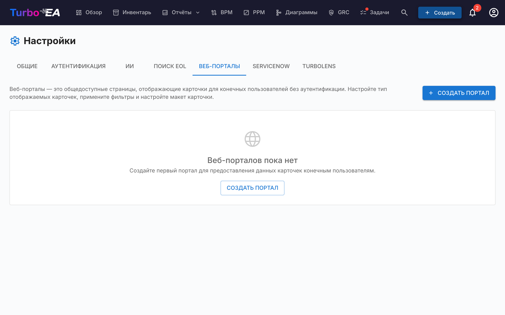

# Веб-порталы

Функция **Веб-порталы** (**Администрирование > Настройки > Веб-порталы**) позволяет создавать **публичные представления только для чтения** выбранных данных карточек — доступные без аутентификации по уникальному URL.



## Сценарии использования

Веб-порталы полезны для обмена архитектурной информацией с заинтересованными сторонами, не имеющими учётной записи Turbo EA:

- **Каталог технологий** — поделитесь ландшафтом приложений с бизнес-пользователями
- **Каталог сервисов** — опубликуйте ИТ-сервисы и их владельцев
- **Карта способностей** — предоставьте публичное представление бизнес-способностей

## Защита доступа

У каждого портала есть **режим доступа**, определяющий, кто может его открыть:

| Режим | Поведение |
|-------|-----------|
| **Любой, у кого есть ссылка** | После публикации портал доступен для чтения всем — любой, кто знает URL, может его просматривать. Это режим по умолчанию и прежнее поведение. |
| **Войти через SSO** | Посетители должны пройти аутентификацию у поставщика удостоверений вашей организации, прежде чем отобразятся какие-либо данные. |

**Режим SSO** повторно использует единый вход, уже настроенный в разделе **Администрирование > Настройки > Аутентификация**, и защищает порталы **без** управления дополнительными пользователями:

- Посетители входят через ваш поставщик удостоверений, но **никогда не создаются как пользователи Turbo EA** — без учётной записи, без роли, без лицензии.
- Посетитель получает недолгую сессию для конкретного портала. До завершения входа ничего не отображается.
- При желании задайте список **разрешённых почтовых доменов**, чтобы ограничить доступ определёнными доменами (например, `company.com`). Оставьте пустым, чтобы разрешить любого пользователя, прошедшего аутентификацию у поставщика удостоверений.

!!! note
    **Войти через SSO** можно выбрать только после настройки единого входа. Он повторно использует тот же URI перенаправления у поставщика удостоверений, что и обычный вход (`/auth/callback`), поэтому **дополнительная настройка не требуется** — если вход работает, работает и SSO портала. Посетители с активной сессией у поставщика удостоверений входят автоматически, без нажатия. Отмена публикации портала мгновенно отзывает доступ во всех режимах.

## Создание портала

1. Перейдите в **Администрирование > Настройки > Веб-порталы**
2. Нажмите **+ Новый портал**
3. Настройте портал:

| Поле | Описание |
|------|----------|
| **Название** | Отображаемое название портала |
| **Слаг** | URL-совместимый идентификатор (автоматически генерируется из названия, редактируемый). Портал будет доступен по адресу `/portal/{slug}` |
| **Тип карточки** | Какой тип карточки отображать |
| **Подтипы** | При необходимости ограничьте конкретными подтипами |
| **Показать логотип** | Отображать ли логотип платформы на портале |

## Настройка видимости

Для каждого портала вы контролируете, какая именно информация видна. Существуют два контекста:

### Свойства представления списка

Какие столбцы/свойства отображаются в списке карточек:

- **Встроенные свойства**: описание, жизненный цикл, теги, качество данных, статус утверждения
- **Пользовательские поля**: каждое поле из схемы типа карточки может быть индивидуально включено или отключено

### Свойства детального представления

Какая информация отображается, когда посетитель нажимает на карточку:

- Те же элементы управления переключением, что и для представления списка, но для развёрнутой панели деталей

## Доступ к порталу

Порталы доступны по адресу:

```
https://your-turbo-ea-domain/portal/{slug}
```

Вход не требуется. Посетители могут просматривать список карточек, искать и просматривать детали карточек — но отображаются только те свойства, которые вы включили.

!!! note
    Порталы доступны только для чтения. Посетители не могут редактировать, комментировать или взаимодействовать с карточками. Конфиденциальные данные (заинтересованные стороны, комментарии, история) никогда не отображаются на порталах.
