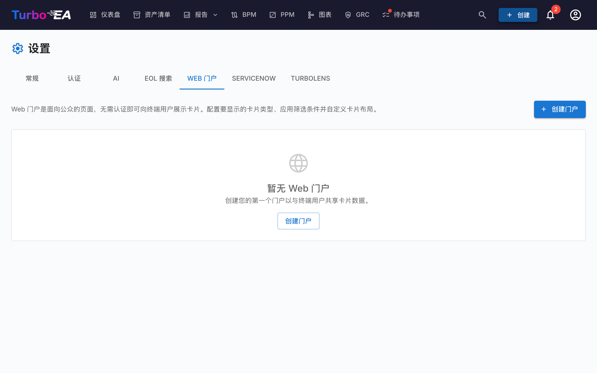

# 门户网站

**门户网站**功能（**管理 > 设置 > 门户网站**）允许您创建选定卡片数据的**公开只读视图** —— 通过唯一 URL 无需身份验证即可访问。



## 使用场景

门户网站适用于与没有 Turbo EA 账户的干系人共享架构信息：

- **技术目录** —— 与业务用户共享应用程序架构
- **服务目录** —— 发布 IT 服务及其负责人
- **能力地图** —— 提供业务能力的公开视图

## 访问保护

每个门户都有一个**访问模式**，用于控制谁可以打开它：

| 模式 | 行为 |
|------|------|
| **任何拥有链接的人** | 门户发布后即可被所有人读取——任何知道该网址的人都可以查看。这是默认模式，也是以往的行为。 |
| **使用 SSO 登录** | 访问者必须先通过贵组织的身份提供商进行身份验证，才能看到任何门户数据。 |

**SSO 模式**会复用您在 **管理 > 设置 > 身份验证** 中已配置的单点登录，可在**无需**管理额外用户的情况下保护门户：

- 访问者通过您的身份提供商登录，但**绝不会被创建为 Turbo EA 用户**——不创建账户、不分配角色、不占用许可证。
- 访问者获得一个短期的、按门户划分的会话。在登录完成之前不会显示任何内容。
- 您可以选择设置**允许的电子邮件域**列表，将访问限制为特定域（例如 `company.com`）。留空则允许身份提供商认证的任何用户。

!!! note
    只有在配置了单点登录后，才能选择**使用 SSO 登录**。它复用与普通登录相同的身份提供商重定向 URI（`/auth/callback`），因此**无需额外配置**——只要登录可用，门户 SSO 就可用。已在身份提供商处拥有有效会话的访问者会自动登录，无需点击。取消发布门户会立即撤销所有模式下的访问权限。

## 创建门户

1. 导航到**管理 > 设置 > 门户网站**
2. 点击 **+ 新建门户**
3. 配置门户：

| 字段 | 描述 |
|------|------|
| **名称** | 门户的显示名称 |
| **别名** | URL 友好的标识符（从名称自动生成，可编辑）。门户将可通过 `/portal/{slug}` 访问 |
| **卡片类型** | 显示哪种卡片类型 |
| **子类型** | 可选限制为特定子类型 |
| **显示 Logo** | 是否在门户上显示平台 logo |

## 配置可见性

对于每个门户，您精确控制哪些信息可见。有两个上下文：

### 列表视图属性

卡片列表中显示哪些列/属性：

- **内置属性**：描述、生命周期、标签、数据质量、审批状态
- **自定义字段**：卡片类型架构中的每个字段可以单独切换

### 详情视图属性

访问者点击卡片时显示哪些信息：

- 与列表视图相同的切换控件，但用于展开的详情面板

## 门户访问

门户通过以下方式访问：

```
https://your-turbo-ea-domain/portal/{slug}
```

无需登录。访问者可以浏览卡片列表、搜索和查看卡片详情 —— 但只显示您启用的属性。

!!! note
    门户是只读的。访问者不能编辑、评论或与卡片交互。敏感数据（干系人、评论、历史记录）永远不会在门户上暴露。
