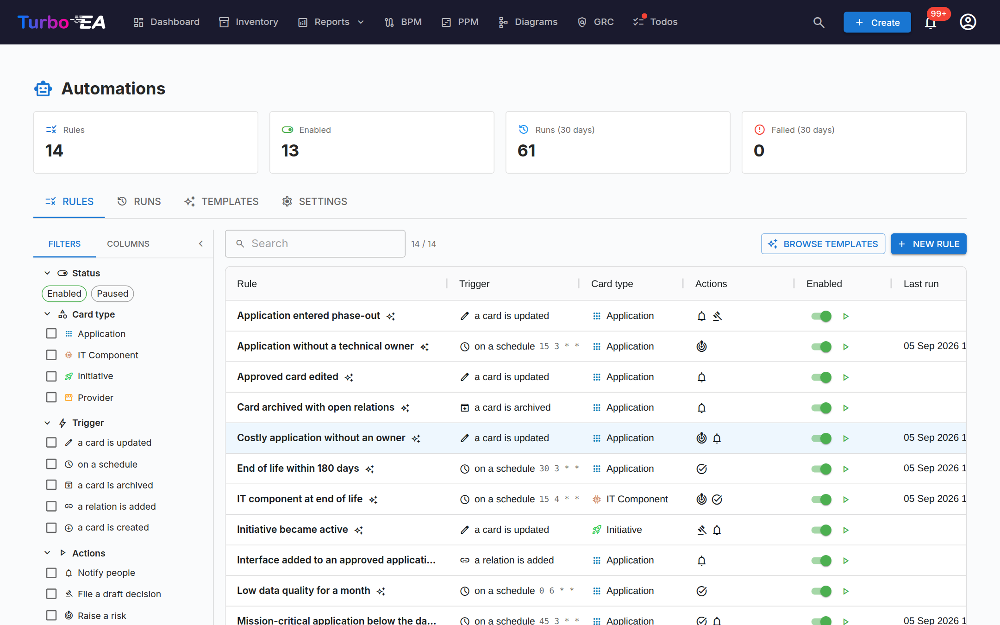
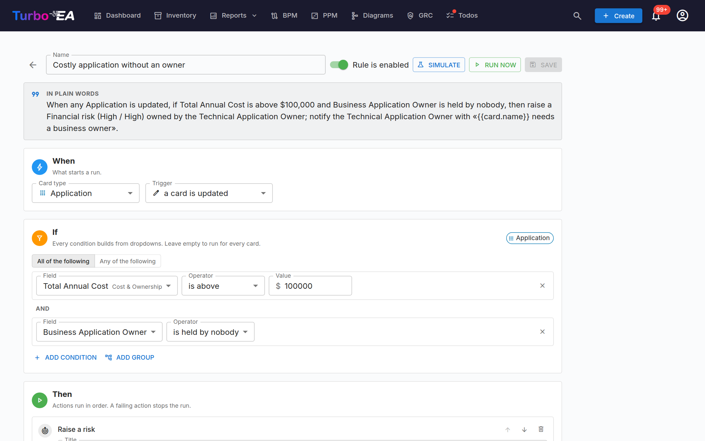
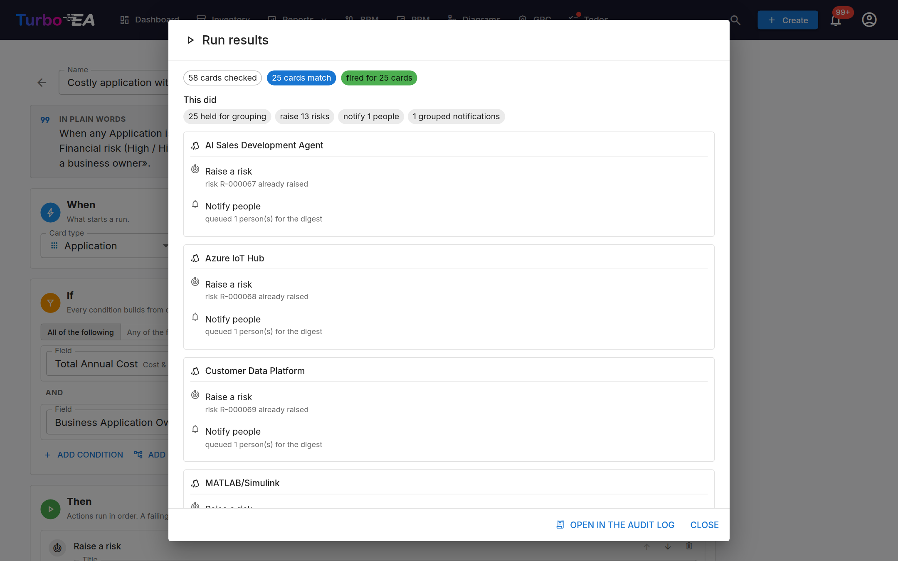
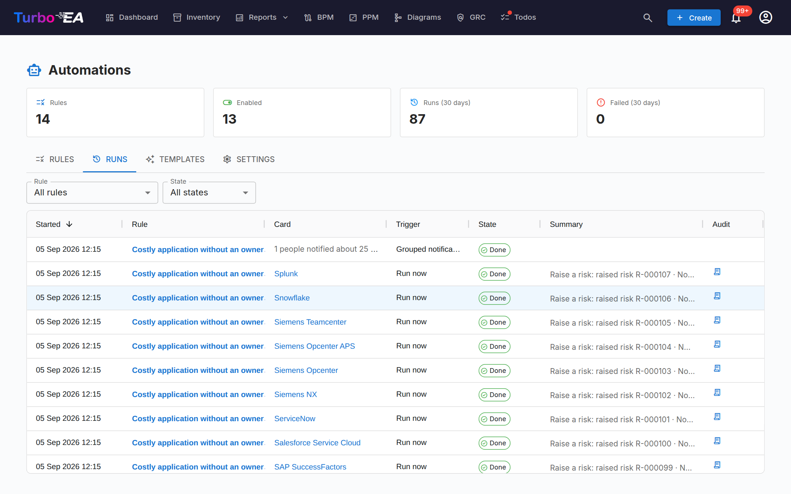
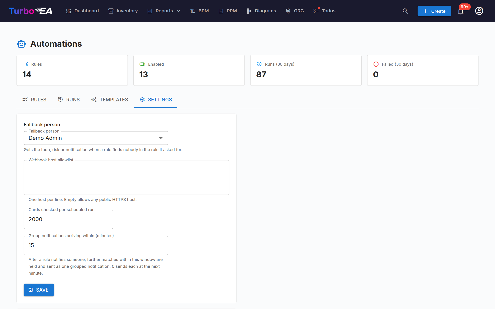

# Automations

Gran parte della governance EA è un elenco di cose che qualcuno ha promesso di
fare a mano: aprire un rischio quando un'applicazione supera una soglia di costo
senza avere un proprietario, sollecitare il responsabile tecnico quando un
componente raggiunge il fine vita, avvertire il responsabile di business quando
una scheda approvata viene modificata. L'elenco è giusto; è il farlo che
sfugge, perché ogni voce è un promemoria nella testa di qualcuno invece di una
regola che la piattaforma fa rispettare.

**Automations** trasforma quelle promesse in regole che Turbo EA esegue per
voi. Una regola si costruisce interamente da menu a tendina — *quando* accade
qualcosa nel panorama, *se* le condizioni valgono, *allora* esegui le azioni —
e ogni esecuzione viene registrata come batch di modifiche nel Registro di
audit, così una regola che ha sbagliato si annulla con un clic.

## In breve

| | |
|---|---|
| **Licenza** | Commerciale: serve un'abilitazione firmata |
| **Versione minima di Turbo EA** | 2.128.0 |
| **Permessi** | `ext.automations.view`, `ext.automations.manage` |
| **Concessioni di accesso ai dati** | Schede (lettura + scrittura), eventi di scheda e di todo, todo (lettura + scrittura), la rubrica utenti, rischi (lettura + scrittura), verbali di decisione, notifiche, ruoli di stakeholder |
| **Riavvio del backend necessario** | Sì: l'estensione porta codice backend |
| **Dove appare** | **Automations** nella sezione **Admin** del menu utente · un chip con il numero di esecuzioni sul dettaglio di una scheda |

## Una regola: quando, se, allora

La scheda **Regole** elenca ogni regola con il suo attivatore, il tipo di
scheda, le azioni, un interruttore di abilitazione, l'ultima esecuzione e un
pulsante di avvio. Apritene una per vedere l'editor.

In alto l'editor vi rilegge la regola in parole semplici, poi ne percorre le
tre parti:

**Quando** — ciò che avvia un'esecuzione. Una regola osserva un solo tipo di
scheda e scatta in uno di questi casi:

| Attivatore | Scatta quando |
|---|---|
| una scheda viene creata / aggiornata / archiviata / ripristinata | quella scheda cambia |
| una relazione viene aggiunta / rimossa | una relazione, facoltativamente di un tipo dato, tocca la scheda |
| un todo viene completato | un todo collegato alla scheda viene chiuso |
| secondo una pianificazione | arriva il momento indicato da un'espressione cron a cinque campi (UTC); la regola controlla allora ogni scheda del tipo |

**Se** — le condizioni, come gruppi annidati **tutte le seguenti** / **una
qualsiasi delle seguenti**. Ogni riga è un campo, un operatore e un valore
scelti da menu a tendina: i campi propri della scheda e le fasi del ciclo di
vita, i suoi tag, i suoi ruoli di stakeholder (*non è ricoperto da nessuno*,
*è ricoperto da*…), le sue relazioni, il suo stato di fine vita su Applicazioni
e Componenti IT e — su *una scheda viene aggiornata* — che cosa è **cambiato**,
così una regola può scattare solo quando un valore è passato da uno stato a un
altro. Lasciate il gruppo vuoto per eseguirla su ogni scheda.

**Allora** — le azioni, eseguite in ordine. Un'azione che fallisce interrompe
l'esecuzione e la riga dell'esecuzione indica quale passo ha fallito.

| Azione | Cosa fa | Richiede |
|---|---|---|
| Imposta / svuota un campo, imposta una data del ciclo di vita, imposta il sottotipo, il genitore, il nome o la descrizione | Modifica la scheda | scrittura sull'inventario |
| Imposta i tag | Sostituisce, aggiunge o rimuove tag, rispettando i gruppi a scelta singola | scrittura sull'inventario |
| Crea una scheda correlata, collega una relazione | Aggiunge una scheda di un altro tipo e la collega, oppure collega due schede esistenti | scrittura sull'inventario |
| Archivia la scheda | La archivia (recuperabile per 30 giorni) | scrittura sull'inventario |
| Assegna / rimuovi un ruolo di stakeholder | Assegna un ruolo a una persona, a chi ricopre un ruolo, a chi ricopre il ruolo sul genitore o alla persona che ha attivato la regola | ruoli di stakeholder |
| Crea un todo | Un todo sulla scheda per un assegnatario, con una scadenza | todo |
| Notifica delle persone | Una notifica in-app / via e-mail secondo le preferenze dei destinatari stessi | notifiche |
| Apri un rischio, aggiorna un rischio | Deposita un rischio nel Registro dei rischi con categoria, probabilità e impatto, collegato alla scheda e con un proprietario; un'esecuzione successiva può aggiornarne titolo, proprietario o data obiettivo | rischi |
| Deposita una bozza di decisione | Un Architecture Decision Record in bozza collegato alla scheda — mai firmato da una regola | verbali di decisione |
| Chiama un webhook | Una richiesta HTTPS firmata verso un sistema esterno con la scheda, ciò che è cambiato e la regola | — |
| Stop | Termina l'elenco delle azioni | — |

Titoli, descrizioni e messaggi sono modelli: `{{card.name}}`,
`{{card.attributes.costTotalAnnual}}`, `{{actor.name}}`, `{{change.old}}` e
simili vengono compilati per ogni scheda, e l'editor propone le variabili da un
menu.

Sotto le azioni ci sono due opzioni. **Scatta una volta per scheda** (attiva
per impostazione predefinita) ricorda per che cosa una regola è scattata, così
una regola notturna non apre lo stesso rischio ogni notte; scatta di nuovo
quando cambiano i valori che legge. **Recupero notturno** ricontrolla ogni
scheda alle 03:00 UTC, così un evento perso si sana da solo.

## Simula ed Esegui ora

**Simula** esegue la regola su ogni scheda del suo tipo in modalità anteprima —
non viene scritto nulla — e mostra quante schede corrispondono e, per ciascuna
scheda, esattamente che cosa farebbe ogni azione. Abilitare una regola mai
simulata vi chiede di simularla prima; potete comunque abilitarla senza farlo.

**Esegui ora** fa lo stesso per davvero: scatta subito per ogni scheda
corrispondente, rispettando *scatta una volta per scheda* a meno che non
spuntiate *scatta di nuovo per le schede già gestite*. La finestra del risultato
mostra che cosa è stato fatto, scheda per scheda, e rimanda al batch di audit.

## Esecuzioni e Registro di audit

Ogni esecuzione è una riga nella scheda **Esecuzioni**: quale regola, su quale
scheda, come è iniziata (un evento, la pianificazione, il recupero notturno,
Esegui ora), come è finita e ogni riga di azione. Filtrate per regola o per
esito; il numero di esecuzioni di una scheda compare come chip nella sua pagina
di dettaglio.

Ogni scrittura fatta da un'esecuzione finisce in **Admin → Impostazioni →
Registro di audit** come batch di estensione con le differenze per evento. Una
**scansione** — una pianificazione, il recupero notturno o Esegui ora — è **un
solo batch per tutte le schede su cui è scattata**, così una regola che ha
sbagliato è un solo **Rollback**, non uno per scheda. Il Rollback annulla le
scritture su schede e relazioni e, da Turbo EA 2.127.0, i rischi che
l'esecuzione ha aperto o modificato, i ruoli che ha assegnato, i tag che ha
impostato e le bozze di decisione che ha depositato. Todo e notifiche restano
deliberatamente al loro posto — una richiesta a una persona e un messaggio già
recapitato non si annullano cancellandoli — e l'anteprima del rollback lo dice
prima che venga applicato qualcosa.

## Le notifiche sono raggruppate

Una regola non invia mai una notifica per scheda. Una scansione raccoglie ciò
che spetta a ciascuna persona e invia alla fine **una sola** notifica per
persona e per regola: una singola scheda arriva come messaggio a sé, più schede
come un riepilogo che le elenca per nome, il cui titolo lo impostate voi
nell'azione (*Titolo del riepilogo*). Le modifiche che arrivano una alla volta
— un'importazione che tocca trecento schede — inviano subito la prima notifica
e trattengono le altre per la **finestra di raggruppamento** delle
Impostazioni; il minuto successivo invia come unico riepilogo quanto si è
accumulato. Le preferenze di notifica di ciascuna persona continuano a decidere
tra campanella, e-mail o un canale di estensione.

Un clic su una notifica raggruppata nella campanella apre i suoi **dettagli** sul posto — il riepilogo completo e un chip per scheda che porta a quella scheda —, perché la scheda Esecuzioni dietro di essa è una pagina di amministrazione; solo chi ha `ext.automations.view` riceve anche un pulsante **Apri** verso di essa. Una notifica su una sola scheda porta ancora direttamente alla scheda. Ogni notifica delle automazioni usa la propria riga **Notifiche delle automazioni** nelle preferenze di notifica (in-app attivo, e-mail disattivata per impostazione predefinita), separata dall'avviso estensione generico.

## Modelli

La scheda **Modelli** è una galleria di regole pronte all'uso: un'applicazione
costosa senza proprietario, fine vita entro 180 giorni, una nuova applicazione
senza Business Capability, una scheda approvata che è stata modificata, qualità
dei dati bassa da un mese, un'applicazione che entra in dismissione, una scheda
archiviata con relazioni aperte, un'iniziativa che diventa attiva,
un'applicazione critica senza responsabile tecnico, un nuovo fornitore
registrato, un componente IT a fine vita. Ciascuna si apre nell'editor,
disabilitata, perché la adattiate e la simuliate.

## Impostazioni

| Impostazione | Cosa fa |
|---|---|
| **Persona di riserva** | Riceve il todo, il rischio o la notifica quando una regola non trova nessuno nel ruolo richiesto |
| **Host consentiti per i webhook** | Gli host che l'azione *Chiama un webhook* può raggiungere, uno per riga; vuoto consente qualsiasi host HTTPS pubblico. Gli indirizzi privati e interni sono sempre rifiutati |
| **Schede controllate per esecuzione pianificata** | Quante schede esamina una scansione pianificata prima di fermarsi e lasciare il resto alla successiva |
| **Raggruppa le notifiche che arrivano entro** | La finestra di raggruppamento, in minuti; 0 invia ciascuna al minuto successivo |

## Dati dimostrativi

**Carica dati dimostrativi** nelle Impostazioni installa i modelli e tre regole
dimostrative sul panorama di esempio, ne abilita la maggior parte e ne esegue
alcune una volta, così le schede Regole, Esecuzioni e Registro di audit hanno
qualcosa da mostrare. **Rimuovi** toglie esattamente questo: regole,
esecuzioni, i todo e i rischi che hanno creato.

## Permessi

| Permesso | Consente |
|---|---|
| `ext.automations.view` | Vedere le regole, le loro esecuzioni e la galleria dei modelli, e il chip con il numero di esecuzioni sulle schede |
| `ext.automations.manage` | Creare, modificare, abilitare, simulare, eseguire ed eliminare regole; cambiare le impostazioni; caricare i dati dimostrativi |

## Se la licenza scade o l'estensione è disattivata

La pagina scompare dal menu, le pianificazioni si fermano e gli eventi non
vengono più inoltrati. Non viene eliminato nulla: le regole, le loro esecuzioni
e tutto ciò che hanno scritto — schede, rischi, todo, decisioni — restano
esattamente come sono. Rinnovare la licenza o riattivare l'estensione riporta le
regole, ancora abilitate.

## Note e limiti

- Turbo EA concede a un'estensione 60 batch tracciati al minuto. Una scansione
  su un inventario molto grande si ferma a quel limite e prosegue al ciclo
  successivo; Esegui ora lo dice nel suo risultato e la scansione successiva
  riprende le schede rimanenti.
- Una regola che osserva *una scheda viene aggiornata* vede solo le modifiche
  fatte dopo la sua abilitazione; per il panorama esistente usate Esegui ora o
  attendete il recupero notturno. Le condizioni su **che cosa è cambiato**
  corrispondono solo agli aggiornamenti in tempo reale.
- I webhook sono solo HTTPS, firmati con un segreto per istanza, non seguono
  mai i reindirizzamenti e scadono dopo 10 secondi; la risposta viene registrata
  sull'esecuzione.
- Una regola può aggiornare solo i rischi che ha aperto lei stessa, e non può
  mai firmare una decisione, far cambiare stato a un rischio o completare un
  todo: quelli restano atti umani.
