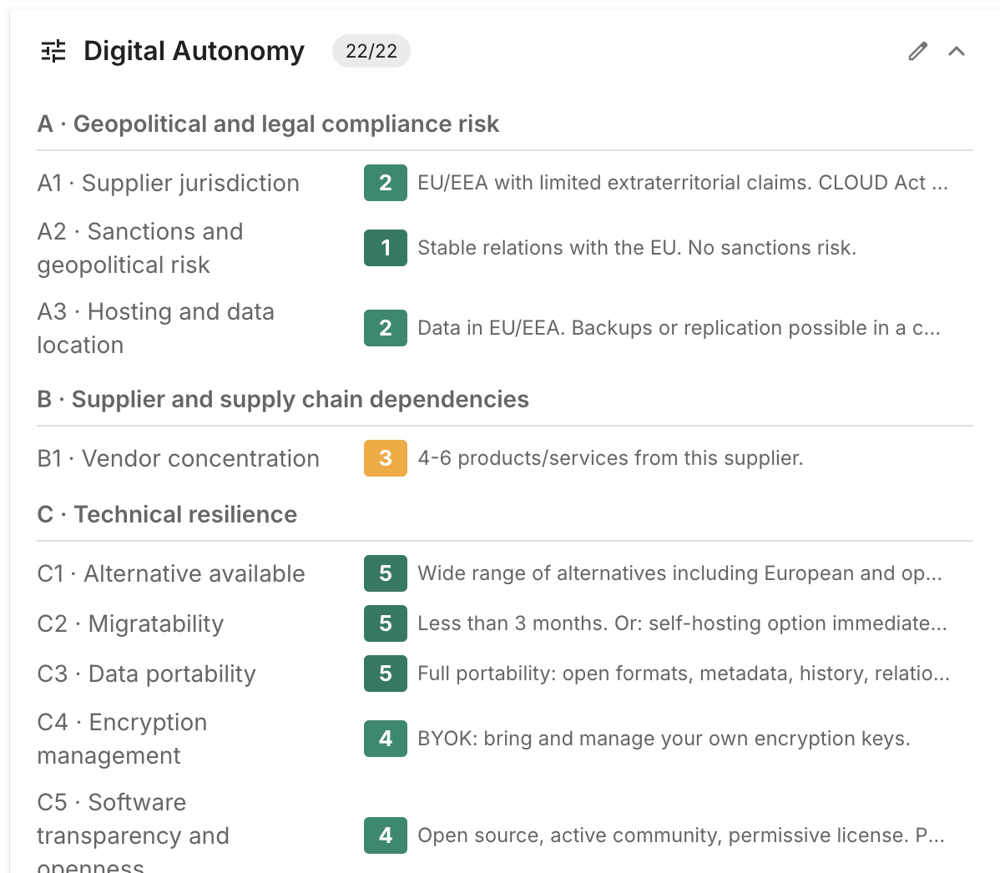
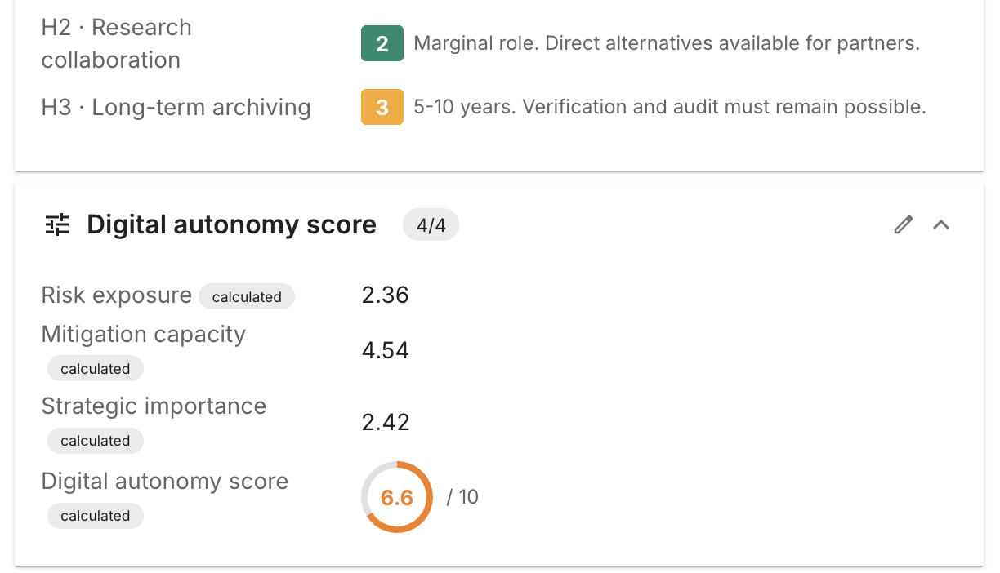
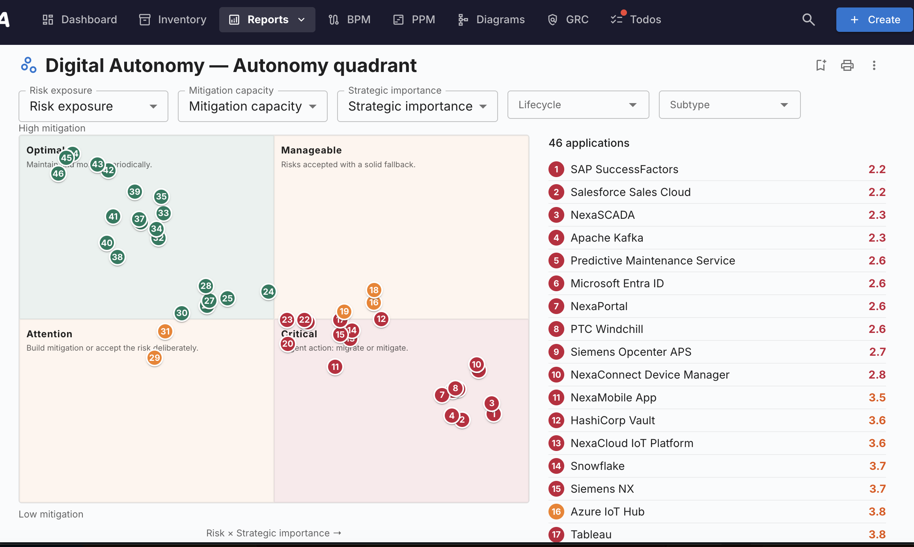

# Digital Autonomy Assessment

**Digital Autonomy Assessment** переносит в Turbo EA методику **Digital Autonomy
Assessment Framework (DAAF)** Утрехтского университета — на уровне приложений. К
каждой карточке Приложения добавляется раздел **Digital Autonomy**: 22
взвешенных показателя по трём направлениям — подверженность риску, способность к
смягчению и стратегическая значимость, — каждый оценивается по шкале 1–5 по
исходной рубрике DAAF со встроенными пояснениями. Балл автономии от 1 до 10
рассчитывается автоматически, а весь портфель отображается на **квадранте
автономии**.

Расширение отвечает на вопрос, который большинство ландшафтов обходит стороной:
*если этот поставщик завтра станет недоступен, неподъёмен по цене или юридически
неприменим, насколько мы уязвимы и что мы реально можем сделать?*

!!! note "Язык интерфейса"
    Содержимое методики доступно на английском, немецком, французском,
    испанском, итальянском и датском языках. В русской версии раздел и
    показатели отображаются **на английском**, поэтому приведённые ниже
    наименования соответствуют тому, что вы увидите на экране.

## Кратко

| | |
|---|---|
| **Лицензия** | **Бесплатное** — работает без лицензионного права |
| **Минимальная версия Turbo EA** | 2.17.0 |
| **Право доступа** | `ext.digital-autonomy.view` |
| **Разрешения доступа к данным** | нет |
| **Нужна перезагрузка серверной части** | нет |
| **Где появляется** | Разделы **Digital Autonomy** и **Digital autonomy score** на карточках Приложения · **Отчёты → Digital Autonomy** · **Создать из шаблона** на странице опросов |

## С чего начать

1. Установите расширение в разделе **Админ → Расширения**. Лицензию применять не
   нужно, перезагрузка тоже не требуется — поля появляются сразу.
2. Выдайте `ext.digital-autonomy.view` в разделе **Админ → Пользователи и роли**
   тем ролям, которые должны видеть отчёт. У администраторов оно уже есть.
3. Решите, нужна ли **быстрая** или **полная** оценка — см.
   [Быстрая или полная оценка](#быстрая-или-полная-оценка). По умолчанию включён
   полный вариант из 22 показателей.
4. Оцените приложения — карточка за карточкой или
   [с помощью опроса](#сбор-оценок-через-опрос).

## Показатели

Раздел **Digital Autonomy** появляется на каждой карточке Приложения и сгруппирован
по восьми направлениям (A–H). Каждый показатель оценивается от **1 до 5** по
собственной рубрике.

Щёлкните по цифре, чтобы выставить оценку; повторный щелчок по выбранной цифре
сбрасывает её. При наведении на цифру показывается текст рубрики для этого уровня,
а у каждого показателя есть разворачиваемая **справка** с пояснением DAAF и
определениями используемых терминов (*решение об адекватности*, *CLOUD Act*,
*FISA 702* и другие).

Показатели, отмеченные как **Быстрые**, составляют быструю оценку.

| Направление | Показатель | Вес | Быстрая |
|---|---|---|---|
| **A · Геополитический и правовой риск соответствия** | A1 · Supplier jurisdiction | 3 | ✔ |
| | A2 · Sanctions and geopolitical risk | 2 | |
| | A3 · Hosting and data location | 2 | ✔ |
| **B · Зависимость от поставщика и цепочки поставок** | B1 · Vendor concentration | 3 | ✔ |
| **C · Техническая устойчивость** | C1 · Alternative available | 3 | ✔ |
| | C2 · Migratability | 3 | |
| | C3 · Data portability | 3 | |
| | C4 · Encryption management | 2 | |
| | C5 · Software transparency and openness | 3 | |
| **D · Организационная устойчивость** | D1 · Internal expertise and knowledge continuity | 3 | ✔ |
| | D2 · Exit plan in place | 3 | |
| | D3 · Backup strategy | 2 | |
| **E · Договорная устойчивость** | E1 · Exit clauses and transition arrangement | 3 | ✔ |
| | E2 · Contractual flexibility | 2 | |
| **F · Организационная значимость** | F1 · Impact on outage | 3 | ✔ |
| | F2 · Integration dependencies | 2 | |
| **G · Чувствительность данных, управление доступом и политика** | G1 · Personal data | 3 | ✔ |
| | G2 · Research data and knowledge security | 3 | |
| | G3 · Intellectual property | 2 | |
| **H · Академическое влияние** | H1 · Academic freedom | 3 | ✔ |
| | H2 · Research collaboration | 2 | |
| | H3 · Long-term archiving | 2 | |

!!! note "Какое направление считается хорошим?"
    Рубрики устроены по-разному, и элемент управления окрашивает их
    соответственно. Для показателей **риска** (A, B, F, G, H) **лучшее значение —
    1**: например, уровень 1 у A1 — «EU/EEA jurisdiction. No extraterritorial
    claims. Full EU protection.», а уровень 5 — «No adequacy decision, no
    safeguards. Direct access by foreign governments.» Для показателей
    **способностей** (C, D, E) **лучшее значение — 5**. Запоминать это не нужно:
    кнопки окрашены по градиенту и подписаны **Low** и **High**.

## Балл

Раздел **Digital autonomy score** доступен только для чтения, расположен под
показателями и пересчитывается автоматически при каждом сохранении.

| Поле | Значение |
|---|---|
| **Risk exposure** | Взвешенное среднее направлений A (геополитика) и B (концентрация поставщиков) |
| **Mitigation capacity** | Взвешенное среднее технической (C), организационной (D) и договорной (E) устойчивости |
| **Strategic importance** | Взвешенное среднее F (организационная значимость), G (чувствительность данных) и H (академическое влияние) |
| **Digital autonomy score** | Единый показатель от 1 до 10, отображаемый в виде шкалы |

**Чем выше, тем лучше** — 10 означает оптимум, 1 — срочность.

!!! warning "Неполная оценка не даёт балла вообще"
    Все формулы защищены: если не хватает хотя бы одного нужного показателя, балл
    остаётся пустым, а не показывает вводящее в заблуждение число. Приложение
    попадает в отчёт-квадрант только после полного заполнения оценки.

Поскольку баллы хранятся на карточке как обычные поля, они доступны везде: в
реестре, в фильтрах, в выгрузках и в ваших собственных отчётах.

## Быстрая или полная оценка

Расширение содержит **два варианта одних и тех же четырёх расчётов**: один читает
все 22 показателя, другой — только девять быстрых. Какая пара **активна**, то и
определяет как содержание расчёта, *так и* число показателей на карточке.

Переключение выполняется в разделе **Админ → Метамодель → Расчёты**:

- **Полная оценка (по умолчанию)** — четыре строки *Digital Autonomy — … (full)*
  активны, строки *(quick)* отключены. Карточки показывают все 22 показателя.
- **Быстрая оценка** — включите четыре строки *Digital Autonomy — … (quick)* и
  отключите четыре строки *(full)*. Карточки показывают только девять быстрых
  показателей, и балл рассчитывается по ним.

!!! tip "Отдельного переключателя отображения нет"
    Этот единственный выбор в расчётах и есть весь переключатель. Как только
    активен быстрый набор, карточка автоматически скрывает 13 показателей,
    относящихся только к полной оценке, и отчёт следует той же настройке. Никогда
    не включайте оба варианта одновременно — они пишут в одни и те же поля.

## Сбор оценок через опрос

Вместо того чтобы заполнять 22 показателя для каждого приложения самостоятельно,
спросите тех, кто знает. В разделе **Админ → Опросы** воспользуйтесь кнопкой
**Создать из шаблона**:

- **New DAAF survey — Quick (9)** создаёт черновик *DAAF Quick Scan*.
- **New DAAF survey — Full (22)** создаёт черновик *DAAF Full Assessment*.

Оба шаблона нацелены на карточки Приложения и открываются как **черновик** в
конструкторе опросов, поэтому до вашей проверки ничего не рассылается. Выберите
роль заинтересованной стороны, которая должна получить опрос (и при необходимости
фильтры — стадию жизненного цикла, подтип), и отправьте. Респонденты увидят тот же
элемент оценки 1–5 и ту же встроенную справку, что и на карточке; при применении
ответов баллы записываются обратно в карточки.

Создавать новый опрос из шаблона можно сколько угодно раз — ежегодная переоценка
занимает один щелчок.

## Отчёт-квадрант

**Отчёты → Digital Autonomy** отображает каждое полностью оценённое приложение.

По горизонтали отложено **риск × стратегическая значимость**, по вертикали —
**способность к смягчению** (высокая сверху); получаются четыре квадранта:

| Квадрант | Что означает | Что делать |
|---|---|---|
| **Optimal** | Низкая подверженность, сильное смягчение | Поддерживать и периодически контролировать. |
| **Manageable** | Высокая подверженность, но есть надёжный запасной вариант | Риски приняты при наличии надёжного запасного варианта. |
| **Attention** | Низкая подверженность, слабое смягчение | Выстроить смягчение или осознанно принять риск. |
| **Critical** | Высокая подверженность, слабое смягчение | Срочные действия: миграция или смягчение. |

Каждая точка пронумерована и соответствует строке в списке рядом с диаграммой,
**отсортированном по возрастанию балла — самые срочные сверху**. Щелчок по точке
или строке открывает приложение в боковой панели, не покидая отчёт.

**Фильтры и оси**

- Селекторы **Risk exposure**, **Mitigation capacity** и **Strategic importance**
  позволяют вывести на каждую ось другие числовые поля — удобно, если вы ведёте
  собственные аналоги. Ваш выбор запоминается в браузере.
- **Жизненный цикл** и **Подтип** сужают выборку.

Отчёт можно сохранять, публиковать, печатать и выгружать как обычно. Сохранённое
представление появляется в разделе **Отчёты → Сохранённые**.

## Права доступа

| Право | Позволяет |
|---|---|
| `ext.digital-autonomy.view` | Просматривать отчёт **Отчёты → Digital Autonomy** |

Для выставления оценок используются ваши обычные права на **редактирование**
карточек Приложения: кто может редактировать приложение, тот может его и оценить.
Переключение между быстрой и полной оценкой, а также создание опросов из шаблонов
требуют обычных прав администратора на **Расчёты** и **Опросы**.

## Если расширение отключено или удалено

При отключении или удалении оба раздела убираются из типа карточки, но
**значения, сохранённые на ваших карточках, не затрагиваются никогда**. Включите
расширение снова — и каждая оценка вернётся в точности как была. Поля добавляются
по принципу дополнения, поэтому сохраняются и те поля, которые ваши администраторы
добавили в эти разделы сами.

## Языки

Наименования показателей, вопросы, рубрики и справка доступны на **английском,
немецком, французском, испанском, итальянском и датском** языках. В
португальской, китайской, русской и арабской версиях содержимое методики
отображается на английском — исходная методика этих языков не предоставляет.

## Указание авторства и лицензия

Это расширение воспроизводит **Digital Autonomy Assessment Framework (DAAF)**,
созданную в **Утрехтском университете** сотрудником **Tim van Neerbos** (ведущий
корпоративный архитектор) в рамках проекта Digital Autonomy.

- Источник: <https://github.com/utrechtuniversity/digital-autonomy-assessment-tool>
- Исходный инструмент: <https://utrechtuniversity.github.io/digital-autonomy-assessment-tool/>
- Лицензия: **Creative Commons «Attribution-NonCommercial-ShareAlike 4.0
  International» (CC BY-NC-SA 4.0)** —
  <https://creativecommons.org/licenses/by-nc-sa/4.0/>
- © 2026 Universiteit Utrecht — Tim van Neerbos

**В методику внесены изменения.** Показатели, веса, рубрики, пояснения и шкала
1–10 были адаптированы для нативной работы внутри Turbo EA на уровне карточки
Приложения: отдельный тип поля с оценкой 1–5, расчёты уровней и итогового балла,
шаблоны опросов и отчёт-квадрант.

Многоязычные переводы рубрик и справки происходят из проекта DAAF (выполнены при
участии **Thomas Steenbergen, SIVON**; согласно источнику, немецкий, французский,
испанский, итальянский и датский переводы сделаны по мере возможности и ещё не
вычитаны носителями языка).

В соответствии с условием **NonCommercial** это расширение распространяется
**бесплатно**, а в соответствии с условием **ShareAlike** входящее в него
адаптированное содержимое DAAF остаётся под лицензией CC BY-NC-SA 4.0.
