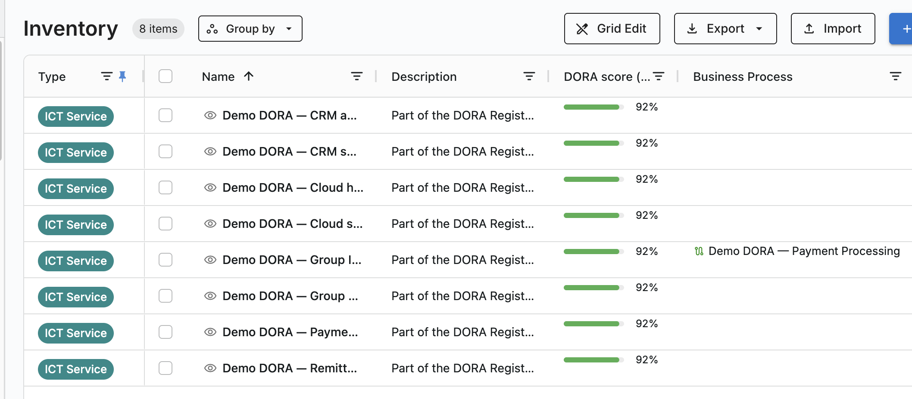
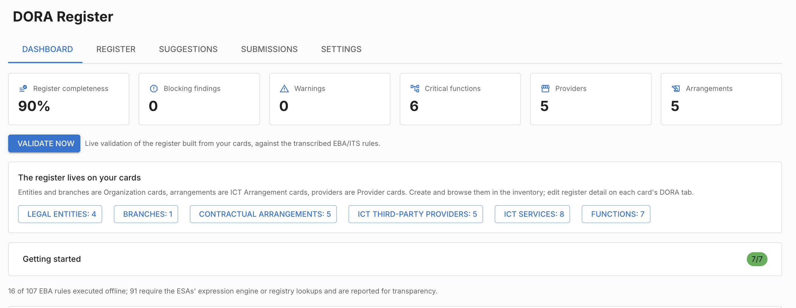
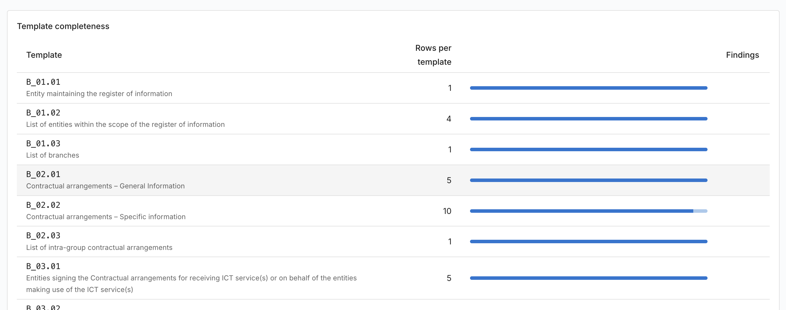

# DORA Register of Information

Каждая финансовая организация ЕС обязана вести **реестр информации** обо всех
своих соглашениях со сторонними поставщиками ИКТ и ежегодно подавать его через
свой надзорный орган — 15 взаимосвязанных форм, представляемых в виде
машиночитаемого пакета xBRL-CSV по отчётной структуре EBA. На пробном прогоне ESAs
93,5 % поданных комплектов содержали хотя бы одну ошибку в данных, и 86 % из них —
это отсутствующие обязательные сведения.

Данные, которые нужны реестру, — это ровно то, что уже хранится в вашем
репозитории корпоративной архитектуры. **DORA Register of Information**
превращает Turbo EA в ваш реестр.

!!! note "Язык интерфейса"
    Интерфейс расширения доступен на английском, немецком, французском,
    испанском, итальянском и датском языках. В русской версии он отображается
    **на английском**, поэтому приведённые ниже наименования соответствуют тому,
    что вы увидите на экране.

## Реестр живёт на ваших карточках

Расширение **не ведёт собственных таблиц** для содержимого реестра. Каждый объект
реестра — это карточка или связь:

| Объект реестра | В Turbo EA |
|---|---|
| Юридические лица в периметре | Карточки **Организация** с включённым *In DORA register scope* |
| Филиалы | Карточки **Организация** с подтипом **Branch**, дочерние к своей головной организации |
| Сторонние поставщики ИКТ | Карточки **Provider** |
| Договорные соглашения | Карточки **ICT Arrangement** (новый тип карточки) |
| Услуги ИКТ | Карточки **ICT Service** (новый тип карточки) |
| Критические или важные функции | Карточки **Бизнес-способность** / **Бизнес-процесс**, отмеченные как функции реестра |
| Подписывающие, использующие и предоставляющие стороны, цепочки субподряда | **Связи** между этими карточками |

В этом весь замысел: каждое поле редактируется в обычном представлении карточки
Turbo EA — с отметками обязательности, проверками, подсказками и оценкой качества
данных, — а сам реестр собирается из карточек «на лету» при каждой проверке или
выгрузке.

!!! note "Отдельной вкладки DORA на карточке намеренно нет"
    Добавленные поля отображаются как обычные разделы атрибутов на карточке, а
    каждая связь реестра — это обычная связь. В ведении реестра нет ни одного
    особого режима.

## Кратко

| | |
|---|---|
| **Лицензия** | Коммерческое — требуется подписанное лицензионное право |
| **Минимальная версия Turbo EA** | 2.94.0 |
| **Права доступа** | `ext.dora-roi.view`, `ext.dora-roi.manage`, `ext.dora-roi.submit`, `ext.dora-roi.admin` |
| **Разрешения доступа к данным** | `core.cards.read`, `core.cards.write`, `metamodel.custom_field_types` |
| **Нужна перезагрузка серверной части** | да — содержит серверный код |
| **Где появляется** | **DORA Register** в главном меню · **Отчёты → DORA Register** · разделы **DORA Register** и **DORA Function** на карточках · шесть шаблонов опросов |

## Что добавляется в метамодель

**Два новых типа карточек**

- **ICT Arrangement** — договорное соглашение об использовании услуг ИКТ. Оно
  **иерархично**: рамочные соглашения выступают родительскими, а последующие или
  связанные — дочерними. Содержит годовые расходы и валюту.
- **ICT Service** — по одной на каждую услугу, оказываемую в рамках соглашения;
  содержит и строку услуги (тип, даты, сроки уведомления, применимое право,
  местонахождение данных, степень зависимости), и её **оценку** (заменяемость,
  план выхода, возврат в собственное управление, последствия прекращения,
  альтернативные поставщики).

**Один новый подтип** — **Branch** у Организации.

**Новые разделы на существующих типах карточек**

| Тип карточки | Раздел | Содержание |
|---|---|---|
| **Организация** | DORA Register | В периметре реестра DORA, LEI, страна, тип организации, положение в группе, компетентный орган, суммарные активы, валюта отчётности, код филиала |
| **Provider** | DORA Register | LEI, тип идентификатора, EUID, тип лица, страна головного офиса, внутригрупповой поставщик, годовые расходы, конечная материнская компания |
| **Бизнес-способность** / **Бизнес-процесс** | DORA Function | Функция реестра DORA, идентификатор функции, лицензируемая деятельность, оценка критичности, обоснование критичности, RTO, RPO, последствия прекращения |

В каждом разделе также есть **оценка DORA (%)** только для чтения — полоса
полноты, показывающая, сколько данных реестра эта карточка ещё должна.

**Девять типов связей**, два из которых несут атрибуты, задаваемые для каждой
связи отдельно:

- **Организация → ICT Arrangement** (*является стороной*) несёт атрибут **роли
  DORA**: **подписывающая организация**, **использование услуг ИКТ**,
  **предоставляющая организация (внутри группы)**.
- **ICT Service → Provider** (*предоставляется*) несёт **ранг в цепочке
  поставок**: **ранг 1** — прямой поставщик, более глубокие ранги —
  субподрядчики.

Расширение также добавляет регулирование **DORA** в
[сканер соответствия](../guide/compliance.md) ядра.

## С чего начать

Рабочее пространство открывается на вкладке **Dashboard**, где список **Getting
started** отслеживает эти семь шагов и показывает прогресс.

1. **Выберите отчитывающуюся организацию в Settings** — ту, чей это реестр.
2. **Отметьте свои юридические лица.** На каждой карточке Организации заполните
   раздел **DORA Register**: включите *In DORA register scope* и укажите LEI,
   страну, тип организации и положение в группе. Филиалы — это карточки
   Организации с подтипом **Branch**, дочерние к своей головной организации.
3. **Создайте по карточке ICT Arrangement на каждое договорное соглашение.**
   Сделайте последующие договоры *дочерними* к рамочному — именно отсюда выводятся
   тип соглашения и ссылка на рамочное соглашение.
4. **Свяжите каждое соглашение** с его карточкой Provider и с организациями,
   которые подписывают, используют или предоставляют, задав на каждой связи
   атрибут **роли DORA**.
5. **Создайте по карточке ICT Service на каждую услугу**, затем свяжите её с
   договором, с использующими организациями, с поддерживаемыми функциями и с её
   поставщиками **с указанием ранга**.
6. **Отметьте функции.** Включите *DORA register function* на тех карточках
   Бизнес-способности или Бизнес-процесса, которые являются критическими или
   важными функциями, и заполните их раздел **DORA Function** — либо примите
   предложения из раздела [Suggestions](#suggestions).
7. **Проверьте реестр и устраните замечания.**

!!! tip "Собирайте данные у тех, кто ими владеет"
    Шесть шаблонов опросов в разделе **Админ → Опросы → Создать из шаблона**
    собирают обязательные сведения у ответственных за карточки: **DORA entity
    data**, **DORA provider data**, **DORA arrangement data**, **DORA ICT service
    data**, а также **DORA function data** для способностей и для процессов.
    Каждый открывается как черновик.

### Что никогда не придётся вводить вручную

Реестр выводит следующее, вместо того чтобы спрашивать: LEI материнской компании
(из иерархии карточек), даты включения и прекращения (из жизненного цикла
карточки), тип соглашения и ссылку на рамочное соглашение (из иерархии
соглашений), характер филиала (из подтипа Branch), получателя субподрядной услуги
(из ранжирования поставщиков) и дату последнего обновления. **Периметр
поставщиков** тоже выводится: в реестр попадают только те карточки Provider, на
которые действительно ссылается соглашение или цепочка поставок, поэтому
непричастные поставщики автоматически остаются за его пределами. Соглашения о
заполнении по ITS (`9999-12-31` для бессрочных дат, *not applicable* для
непоследующих соглашений) применяются за вас.

## Рабочее пространство

Пункт **DORA Register** в главном меню содержит пять вкладок. Та же панель
доступна и как сохраняемый отчёт в разделе **Отчёты → DORA Register**.

### Dashboard

Шесть плиток — **Register completeness**, **Blocking findings**, **Warnings**,
**Critical functions**, **Providers**, **Arrangements** — над кнопкой **Validate
now**. Ниже строка счётчиков ведёт прямо в реестр карточек по каждому объекту, а
таблица **Template completeness** показывает строки и замечания по каждой форме.

Щелчок по числу замечаний открывает панель **Validation findings**,
сгруппированную по строкам реестра; каждое замечание отнесено к категории
**Missing**, **Invalid value**, **Duplicate row**, **Broken reference**, **Unknown
column** или **EBA rule** и помечено как **Blocking** либо **Warning**. У каждого
замечания есть кнопка **Open card**, ведущая точно к тому полю, которое нужно
исправить.

### Register

Шесть представлений — **Legal entities**, **Branches**, **Contractual
arrangements**, **ICT third-party providers**, **ICT services** и **Functions** —
каждое в виде таблицы карточек, составляющих эту часть реестра, с полем поиска,
кнопкой **New …**, создающей карточку нужного типа с уже проставленными
признаками, и ссылкой **Open in inventory**. Щелчок по строке открывает карточку в
боковой панели.

### Suggestions

**Find suggestions** обходит ваши связи «поставщик → приложение →
способность/процесс» и предлагает изменения реестра — неотмеченные функции и
повышение критичности, — каждое с обоснованием. Ничего не записывается, пока вы не
нажмёте **Accept** в строке; **Dismiss** убирает её из списка.

### Submissions

**New snapshot** фиксирует реестр на **отчётную дату**. Далее каждый снимок
проходит три состояния:

1. **Draft** — нажмите **Validate** для проверки. Замечания перечисляются с
   уровнем существенности, формой, строкой, столбцом и сообщением.
2. **Validated** — нажмите **Finalize**. Действие отклоняется, пока остаётся хотя
   бы одно **блокирующее** замечание или не задана отчитывающаяся организация с
   LEI.
3. **Final** — снимок неизменяем, хеш его пакета зафиксирован для аудита, и он
   больше не может быть удалён или проверен заново.

Две выгрузки доступны в любой момент:

- **xBRL-CSV package** — официальный пакет модуля DORA структуры EBA 4.0 в виде
  `.zip`, содержащий метаданные отчёта, индикаторы подачи, параметры и по одному
  CSV на каждую форму. Он воспроизводится побайтово, а повторная выгрузка
  финального снимка сверяется с зафиксированным хешем.
- **Excel workbook** — рабочая книга для проверки с титульным листом, отдельным
  листом на каждую форму с официальными наименованиями и кодами столбцов и листом
  справочников, чтобы пустить реестр по внутреннему кругу перед подачей.

### Settings

**Filing** — **Filing scope** (**Consolidated (.CON)** или **Individual
(.IND)**), **Reporting currency**, **Taxonomy version** и **Reporting entity**,
чьи LEI и страна определяют пакет подачи.

**Definitions (B_99.01)** — необязательные текстовые определения для терминов из
закрытых списков, используемых вашим реестром; подаются как форма B_99.01.

**Demo data** — **Load demo data** загружает полный демонстрационный реестр
(организации группы и филиал, поставщики, рамочные и внутригрупповые соглашения,
трёхуровневая цепочка поставок, критические функции, предложения и черновой
снимок), чтобы вы могли изучить все возможности, не трогая реальные данные. Все
демонстрационные карточки называются *Demo DORA — …* и помечены тегом
**Demo Dora**; **Remove demo data** удаляет их.

## 15 форм

| Форма | Содержание |
|---|---|
| B_01.01 | Организация, ведущая реестр информации |
| B_01.02 | Перечень организаций в периметре |
| B_01.03 | Перечень филиалов |
| B_02.01 | Договорные соглашения — общие сведения |
| B_02.02 | Договорные соглашения — специальные сведения |
| B_02.03 | Перечень внутригрупповых договорных соглашений |
| B_03.01 / B_03.02 / B_03.03 | Подписывающие стороны |
| B_04.01 | Организации, использующие услуги ИКТ |
| B_05.01 | Сторонние поставщики услуг ИКТ |
| B_05.02 | Цепочки поставок услуг ИКТ |
| B_06.01 | Идентификация функций |
| B_07.01 | Оценка услуг ИКТ |
| B_99.01 | Определения |

## Проверка

Проверка выполняется в четыре слоя: **структура** (типы данных, контрольные суммы
LEI, даты, числа, а также признаки обязательности как блокирующие), **справочники**
(значения закрытых списков против официальных доменов), **ключи** (полнота и
уникальность первичных ключей, а также перекрёстные ссылки между формами) и
**перечень правил EBA** с опубликованными уровнями существенности.

!!! warning "Охват неполный — и об этом сообщается честно"
    Turbo EA выполняет те правила, которые поддаются вычислению без обращения
    наружу. Правила, требующие собственного механизма выражений ESAs или живых
    запросов к реестрам GLEIF/BRIS, на вашем экземпляре выполнить невозможно.
    Вместо того чтобы молча их пропустить, панель сообщает, сколько правил EBA
    было выполнено, а сколько нет. Считайте чистую проверку надёжной
    предварительной сверкой, а не гарантией приёма надзорным органом.

## Права доступа

| Право | Позволяет |
|---|---|
| `ext.dora-roi.view` | Просматривать реестр, панели и результаты проверки |
| `ext.dora-roi.manage` | Изменять данные реестра и принимать решения по предложениям |
| `ext.dora-roi.submit` | Фиксировать снимки на отчётную дату и выгружать пакеты подачи |
| `ext.dora-roi.admin` | Настраивать параметры подачи, загружать и удалять демонстрационные данные |

Для изменения самих данных реестра дополнительно нужны ваши обычные права на
редактирование карточек, поскольку каждое поле реестра находится на карточке.

## Если лицензия истекла или расширение отключено

Рабочее пространство и его отчёты исчезают, мост к данным карточек
останавливается, но **ничего не удаляется**. Ваш реестр живёт на обычных карточках
и связях, поэтому каждое значение остаётся ровно там, где было, — видимым и
доступным для правки в реестре карточек. Снимки и настройки сохраняются.
Обновлённая лицензия немедленно восстанавливает рабочее пространство.

Сообщение *The card-data bridge is unavailable* означает, что расширение
установлено, но не лицензировано, либо серверная часть не перезапускалась после
установки.

## Замечания и ограничения

- **Версия 2.0.0 внесла несовместимое изменение.** Реестры, построенные на более
  ранних версиях, хранили услуги и функции в собственных таблицах расширения; эти
  строки не переносятся. Введите их заново как карточки ICT Service и функций
  (либо перезагрузите демонстрационные данные) и снова запустите **Find
  suggestions**.
- Содержимое таксономии генерируется из опубликованной структуры EBA, поэтому
  переход на новую версию — это обновление данных плюс смена **Taxonomy version**.
- **Оценка DORA** на карточке — сигнал для сортировки, а не вердикт о
  соответствии. Достоверным перечнем пробелов служат замечания на панели.
- Варианты Excel под конкретный надзорный орган не формируются; артефактом подачи
  является пакет xBRL-CSV.
